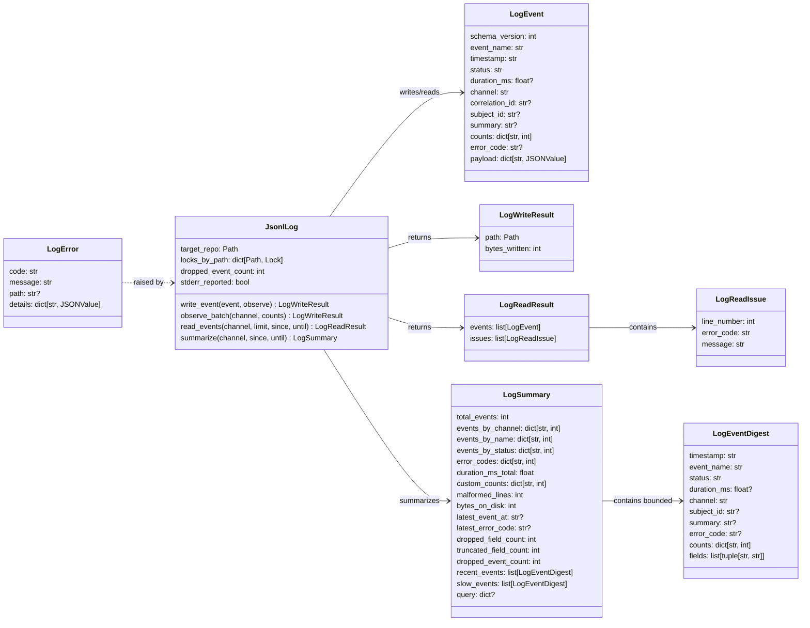
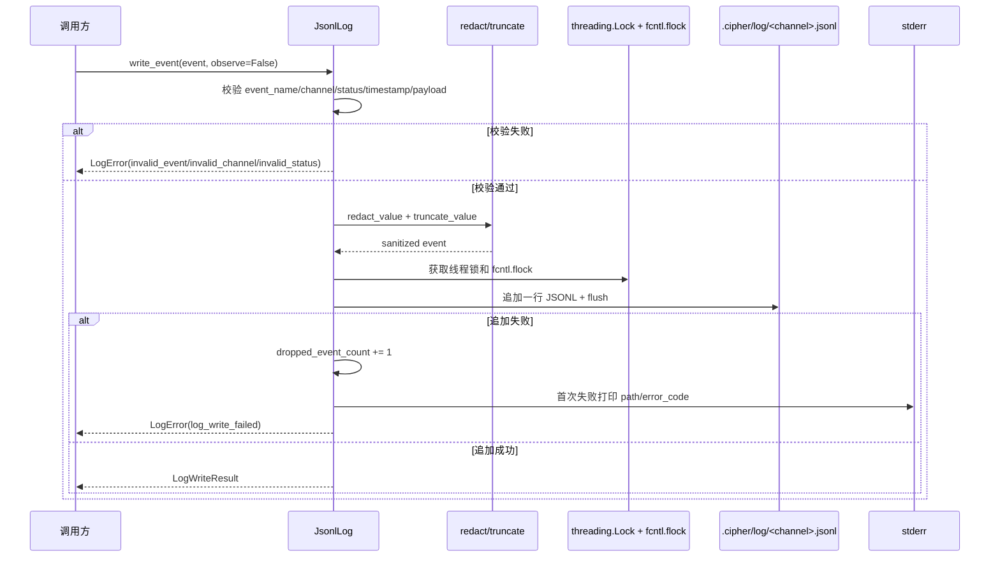
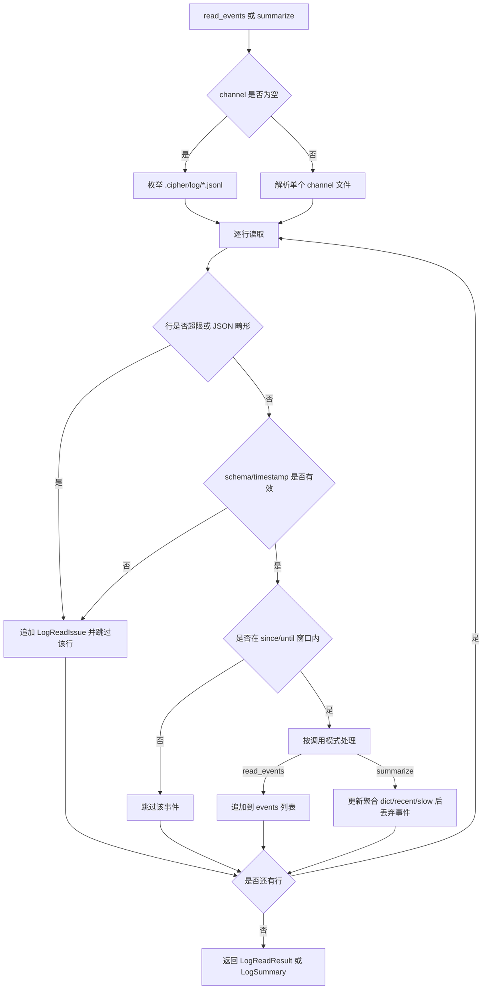
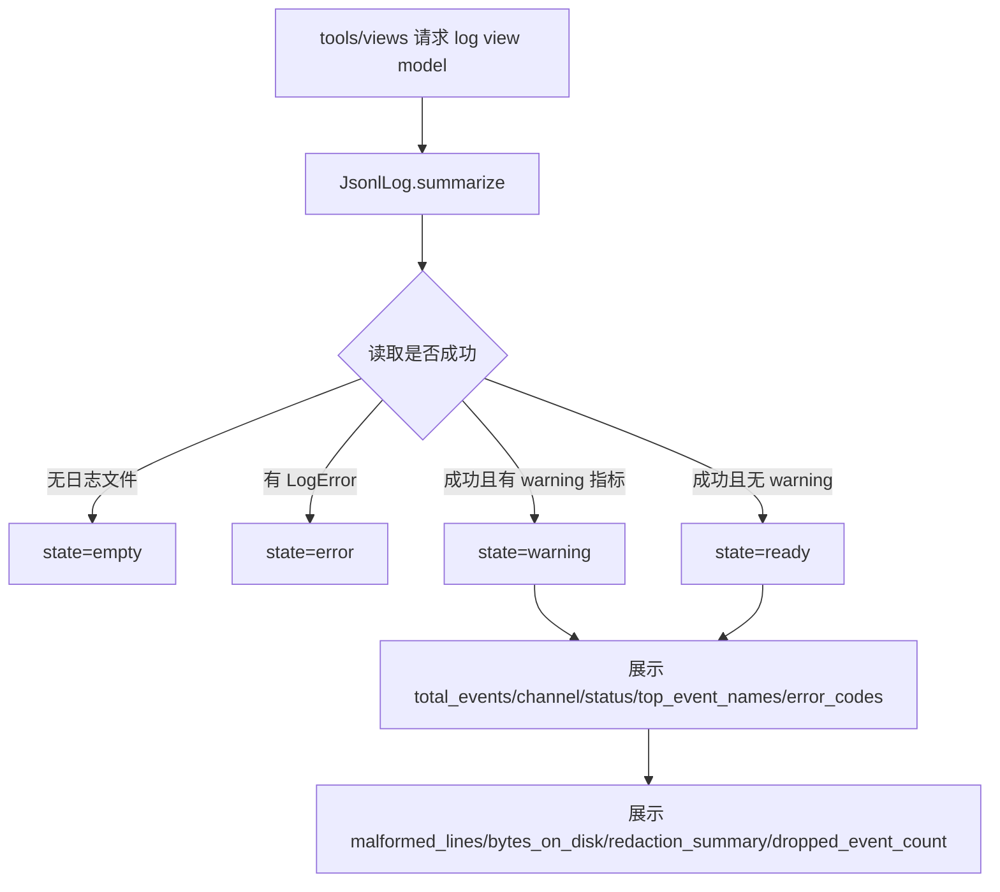

# tools/log 工具设计草稿

## 状态

- 日期：2026-05-25
- 修订日期：2026-05-26
- 状态：草稿，已回写第三轮评审意见，等待设计 PR 合入
- 范围：实现 `src/cipher2/tools/log/` 第一版日志与可观测事件能力，并为 `tools/views` 提供核心统计输入

实现顺序固定为：先 `tools/log`，再 `storage`，最后 `tools/views`。`tools/log` 不依赖 storage；storage TDD 期间可以 import `cipher2.tools.log` 公共 API。

## 模块定位

本功能属于 `src/cipher2/tools/log/`，是 cipher 工具模块的一部分。它服务于核心 FACT 流程，但不承担 initializer、storage 或 MCP 协议边界。

`tools/log` 为目标仓库 `.cipher/log/` 提供追加式 JSONL 事件写入、读取、恢复、redaction、truncation 和 streaming 统计摘要。JSONL 是机器事件源，不是用户阅读界面；用户查看日志和运行状态的唯一人类可读入口是 `tools/views`。`tools/log` 不是事实来源，不写 FACT store，不创建 Graph 或 relation runtime 对象。

配套影响模块：

- `src/cipher2/tools/views/`：log view model 的权威定义在 `docs/design-drafts/20260526-tools-views.md`。
- `tests/`：新增 log 工具、log 可观测、views 展示和性能/小型化看护用例。

## 规格约束

来自当前文档的约束：

- 所有目标仓库产物必须写入 `<target-repo>/.cipher/`，log 文件位于 `<target-repo>/.cipher/log/`。
- `tools/log` 不实现 MCP business logic，不读取完整源码 dump，不把生成日志写入 `cipher-2` 源码树。
- log 服务于 `tools/views` 和调试，不能变成仓库源码或巨大 MCP 响应的无界副本。
- raw JSONL 不作为用户界面，不要求用户直接阅读，也不提供独立 formatter 或 pretty-printer 入口。
- `tools/views` 是日志和运行状态的唯一人类可读入口；`tools/log` 只提供机器事件源和 streaming 聚合接口。
- 新增 log 字段必须说明它服务于 `LogSummary` 聚合、`tools/views` 展示、测试契约或内部降级；无法说明用途的字段不得加入 schema。
- 所有文档必须使用中文。
- 新功能必须提供 `tools/log` 可观测手段、`tools/views` 核心统计呈现和专门用例看护。

用户可配配置项：

- 不新增用户可配配置项。
- `channel`、`limit`、`since`、`until`、`observe` 和 truncation 默认值是 Python API 参数，不写入 `.cipher/config.yml`，不属于用户持久配置。

本功能的 v1 非目标：

- 不实现外部日志服务、HTTP endpoint 或 daemon。
- 不实现二进制日志格式。
- 不实现跨主机分布式日志。
- 不实现 log rotation；单 channel 文件无上限增长，由 `tools/views` 暴露 `bytes_on_disk` 让用户感知。
- 不实现给用户直接看的 log formatter、pretty printer 或 raw JSONL 浏览命令。
- 不引入第三方依赖。

## 数据结构

`JSONValue` 在本仓公共类型中统一定义：

```python
JSONValue = None | bool | int | float | str | list["JSONValue"] | dict[str, "JSONValue"]
```

本轮选择评审 R-L16 的方案 A：保留 `LogEvent` 顶层结构化字段。原因是 `summarize` 必须 streaming 聚合，不能把聚合字段藏进不透明 payload 后再由 views 逐条解析。



### `JsonlLog` 成员表

| 成员名称 | type | 作用 | 并发粒度 |
|---|---|---|---|
| `target_repo` | `Path` | 目标仓库根目录，只用于派生 `.cipher/log/` | 只读共享 |
| `locks_by_path` | `dict[Path, threading.Lock]` | 单进程内按文件保护追加写；跨进程另用 `fcntl.flock` | 文件级、线程级 |
| `dropped_event_count` | `int` | 当前进程内因写入失败累计丢弃事件数，作为 best-effort 兜底计数，summary 与 stderr 提示从此读取 | 进程级 |
| `stderr_reported` | `bool` | 是否已经向 stderr 报告过首次写入失败；用于 once-per-process 提示，避免刷屏 | 进程级 |

`log_dir` 不作为成员保存，始终由 `target_repo / ".cipher" / "log"` 计算，避免第二个 source of truth。`default_channel` 删除，所有写入都由 `LogEvent.channel` 显式决定。

### `LogEvent` 成员表

| 成员名称 | type | 作用 | 并发粒度 |
|---|---|---|---|
| `schema_version` | `int` | JSONL 行 schema 版本号；当前固定为 `1`，reader 在未来 v2 升级时按此区分；每行写入是为了不依赖文件 header，冗余成本由性能档守护 | 事件级、只读共享 |
| `event_name` | `str` | 标识事件类型，格式为 `<module>.<operation>`，用于 summary 热点和 schema 稳定性 | 事件级 |
| `timestamp` | `str` | UTC 微秒时间，格式 `%Y-%m-%dT%H:%M:%S.%fZ` | 事件级 |
| `status` | `Literal["ok", "error", "warning"]` | 事件状态三态分类 | 事件级 |
| `duration_ms` | `float | None` | 操作耗时；顶层保留是为了 streaming summary 能聚合耗时，不解析不透明 payload | 事件级 |
| `channel` | `str` | 写入文件名前缀；v1 与模块名一一对应，例如 `storage` 写入 `storage.jsonl` | 文件级 |
| `correlation_id` | `str | None` | 串联同一次用户请求或批处理内的多条事件，便于未来 MCP 请求排障 | 请求级 |
| `subject_id` | `str | None` | fact id、snapshot id、query hash 等被观测对象 id，views 可用它反查热点对象 | 事件级 |
| `summary` | `str | None` | 给 `tools/views` 和 stderr 兜底使用的一行短摘要；不是 raw JSONL 的人工阅读承诺 | 事件级 |
| `counts` | `dict[str, int]` | 调用方自定义计数键；`summarize` 对同名 key 求和到 `custom_counts`，让 views 不预设所有维度 | 事件级 |
| `error_code` | `str | None` | 具体错误码，例如 `lock_busy`、`payload_too_large`；`status="error"` 时必填，与 `status` 互补 | 事件级 |
| `payload` | `dict[str, JSONValue]` | 不透明扩展字段，写入前 redaction 和 truncation；summary 不读取 payload | 事件级 |

### `LogWriteResult` 成员表

| 成员名称 | type | 作用 | 并发粒度 |
|---|---|---|---|
| `path` | `Path` | 实际写入文件路径 | 文件级 |
| `bytes_written` | `int` | 本次追加字节数 | 事件级 |

### `LogReadResult` 成员表

| 成员名称 | type | 作用 | 并发粒度 |
|---|---|---|---|
| `events` | `list[LogEvent]` | 成功解析的事件；该结构只服务测试和内部诊断，不作为用户入口或 views 聚合路径 | 读取调用级 |
| `issues` | `list[LogReadIssue]` | 可恢复读取问题 | 读取调用级 |

### `LogReadIssue` 成员表

| 成员名称 | type | 作用 | 并发粒度 |
|---|---|---|---|
| `line_number` | `int` | 问题行号 | 行级 |
| `error_code` | `str` | `malformed_json`、`invalid_schema`、`oversized_line` 等契约错误码 | 行级 |
| `message` | `str` | 面向调试的短错误说明，非契约稳定字段，测试不得断言文案 | 行级 |

### `LogEventDigest` 成员表

| 成员名称 | type | 作用 | 并发粒度 |
|---|---|---|---|
| `timestamp` | `str` | 事件时间，用于 views 最近事件排序 | 读取快照级 |
| `event_name` | `str` | 事件名，用于 views 单行展示 | 读取快照级 |
| `status` | `str` | ok/error/warning 状态 | 读取快照级 |
| `duration_ms` | `float | None` | 操作耗时，用于 slow events 排序 | 读取快照级 |
| `channel` | `str` | 来源 channel | 读取快照级 |
| `subject_id` | `str | None` | 被观测对象 id，用于 views 展示和跳转上下文 | 读取快照级 |
| `summary` | `str | None` | 给 views 的短摘要，不承诺 raw JSONL 可读性 | 读取快照级 |
| `error_code` | `str | None` | 具体错误码 | 读取快照级 |
| `counts` | `dict[str, int]` | 经过截断的核心计数，最多 8 个 key | 读取快照级 |
| `fields` | `list[tuple[str, str]]` | 可展开详情字段，最多 16 项；由顶层字段、counts 和 allowlist payload 标量派生，不包含 raw payload；顺序是 schema 契约 | 读取快照级 |

### `LogSummary` 成员表

| 成员名称 | type | 作用 | 并发粒度 |
|---|---|---|---|
| `total_events` | `int` | 总事件量 | 读取快照级 |
| `events_by_channel` | `dict[str, int]` | channel 分布 | 读取快照级 |
| `events_by_name` | `dict[str, int]` | event_name 分布，用于 views 热点事件 | 读取快照级 |
| `events_by_status` | `dict[str, int]` | ok/error/warning 分布 | 读取快照级 |
| `error_codes` | `dict[str, int]` | 错误码分布 | 读取快照级 |
| `duration_ms_total` | `float` | 所有非空 `duration_ms` 求和，用于 views 展示耗时趋势入口 | 读取快照级 |
| `custom_counts` | `dict[str, int]` | 所有事件 `counts` 同名 key 求和结果 | 读取快照级 |
| `malformed_lines` | `int` | 畸形行数量 | 读取快照级 |
| `bytes_on_disk` | `int` | JSONL 文件总大小 | 文件集合级 |
| `latest_event_at` | `str | None` | 最近事件时间 | 读取快照级 |
| `latest_error_code` | `str | None` | 最近错误码 | 读取快照级 |
| `dropped_field_count` | `int` | redaction 丢弃字段总数，用于 views redaction summary | 读取快照级 |
| `truncated_field_count` | `int` | truncation 字段总数，用于 views redaction summary | 读取快照级 |
| `dropped_event_count` | `int` | 当前进程内写入失败累计数 | 进程级 |
| `recent_events` | `list[LogEventDigest]` | streaming 过程中保留的最近 20 条事件摘要，供 views 展示最近事件 | 读取快照级 |
| `slow_events` | `list[LogEventDigest]` | streaming 过程中保留的最慢 20 条有 duration 事件摘要，供 views 展示慢操作 | 读取快照级 |
| `query` | `dict | None` | summary 查询条件回显，例如 `channel`、`since`、`until`；不参与健康统计 | 读取调用级 |

### `LogError` 成员表

`LogError` 是 `tools/log` raise 的结构化异常类型，不是普通返回值。

| 成员名称 | type | 作用 | 并发粒度 |
|---|---|---|---|
| `code` | `str` | 结构化错误码 | 异常实例级 |
| `message` | `str` | 面向用户或调用方的短说明 | 异常实例级 |
| `path` | `str | None` | 相关路径，必须位于 `.cipher/log/` 内 | 文件级 |
| `details` | `dict[str, JSONValue]` | 补充上下文，不包含源码 dump | 异常实例级 |

## 物理文件布局

所有 log 产物位于目标仓库：

```text
<target-repo>/.cipher/
  log/
    default.jsonl
    storage.jsonl
    mcp.jsonl
    log.jsonl
    views.jsonl
```

`channel` 决定文件名。v1 默认 channel 与模块名一一对应：`storage` 模块写 `storage.jsonl`，`mcp` 模块写 `mcp.jsonl`，`views` 模块写 `views.jsonl`。v1 允许的 channel 名必须匹配：

```python
SAFE_CHANNEL_NAME = re.compile(r"^[a-z][a-z0-9_-]{0,62}$")
```

空字符串、纯空白、`\x00`、路径分隔符、`..` 和大写字符都返回 `LogError(code="invalid_channel")` 或 `path_escape`。macOS 默认 case-insensitive 文件系统下也拒绝大写形式。`default`、`log`、`storage`、`mcp`、`views` 是 v1 预期 channel；其他符合正则的名字允许，但总 channel 数超过 32 时返回 `LogError(code="too_many_channels")`。

`views.jsonl` 写 tools/views 自身可观测事件（`views.build`、`views.section_error`），由 tools/views 调用 `JsonlLog` 写入；它不是 views 聚合结果文件。

为避免无限递归：

- `write_event(..., observe=False)` 是默认行为，不为每条业务事件自动写 `log.write`。
- 批处理调用方可显式调用 `observe_batch()` 写一条聚合事件。
- 批处理摘要事件和 `log.error` 事件本身不再触发新的自观测写入。
- 写入失败时不得递归重试。

## 对外接口流程

### 写入流程



### 读取和摘要流程



有效事件必须满足：`schema_version == 1`，`event_name` 匹配 `^[a-z][a-z0-9_-]*\.[a-z][a-z0-9_-]*$`，`timestamp` 严格匹配 `%Y-%m-%dT%H:%M:%S.%fZ`，`status` 属于 `ok/error/warning`，`channel` 通过 `SAFE_CHANNEL_NAME`。任一失败都生成 `LogReadIssue(code="invalid_schema")` 并跳过该行。

### views 呈现流程



### Python API

计划导出：

```python
open_log(target_repo: Path) -> JsonlLog
```

`JsonlLog` 方法：

- `write_event(event: LogEvent, *, observe: bool = False) -> LogWriteResult`
- `observe_batch(channel: str, counts: dict[str, int]) -> LogWriteResult`
- `read_events(*, channel: str | None = None, limit: int | None = None, since: str | None = None, until: str | None = None) -> LogReadResult`
- `summarize(*, channel: str | None = None, since: str | None = None, until: str | None = None) -> LogSummary`

`observe_batch(channel, counts)` 等价于 `write_event(LogEvent(event_name="<channel>.batch_summary", channel=channel, counts=counts), observe=False)`。调用方在批处理结束时最多调用一次；它不是必需路径。batch summary 与业务事件写入同一个 channel，因此 `summarize(channel="storage")` 会包含 `storage.batch_summary`。

`read_events` 主要服务测试和内部诊断，按 `limit`、`since`、`until` 返回详细事件列表；它不是用户入口。生产路径只应使用 `write_event` 和 streaming `summarize`，人类阅读路径只走 `tools/views`。`read_events` 内存与返回事件数线性，不得被 `tools/views` 调用来做聚合。

`summarize` 是 `tools/views` 的唯一 log 数据入口。它必须在 streaming 聚合时保留有界摘要：最近 20 条 `recent_events` 和最慢 20 条 `slow_events`，不得为了 views 展示而全量保留 events。digest 的 `fields` 只保留适合展开查看的短字段，禁止携带完整 payload。

digest 选择与排序规则：

- `recent_events` 只保留 time window 内的最近 20 条；同 timestamp 按文件读取顺序保留；事件少于 20 条时不填 placeholder。
- `slow_events` 排除 `duration_ms is None` 的事件，按 `duration_ms` 降序，tie-break 使用 `timestamp` 降序，再按文件读取顺序。
- `LogEvent.summary is None` 时，`LogEventDigest.summary` 也保持 `None`；views 派生 `LogEventRow` 时负责 fallback。
- `LogEventDigest.counts` 超过 8 个 key 时，按 key 字典序保留前 8 个。
- `LogEventDigest.fields` 超过 16 项时，按固定优先级保留：`correlation_id`、`subject_id`、`error_code`、`duration_ms`、counts key 字典序、allowlist payload 标量键序列 `operation`、`outcome`、`snapshot_id`、`query_kind`、`query_preview`、`matched_count`、`limit`、`fact_count`、`bytes_written`、`latest_log_error_code`。

辅助函数：

- `redact_value(value, rules=DEFAULT_REDACTION_RULES)`。
- `truncate_value(value, max_string=512, max_collection=50, max_depth=5)`。
- `safe_channel_name(channel: str) -> str`。

### 文件格式

每行一条 UTF-8 JSON object。写入时使用紧凑 JSON，按 key 排序，行尾 `\n`。读取时允许末尾空行。

`timestamp` 使用：

```python
datetime.now(timezone.utc).strftime("%Y-%m-%dT%H:%M:%S.%fZ")
```

单行最大默认 64KB。超过上限的事件写入前截断；读取时遇到超过上限的既有行，记录 `LogReadIssue(code="oversized_line")` 并跳过该行。

## redaction 与 truncation

默认 redaction 规则：

- 任意 key 名递归匹配以下正则之一时，整字段值替换为 `"[REDACTED]"`：
  - `(?i)password`
  - `(?i)secret`
  - `(?i)token`
  - `(?i)api[_-]?key`
  - `(?i)authorization`
  - `(?i)cookie`
- redaction 递归遍历所有 dict/list 字段，只跳过顶层结构化字段（如 `event_name`、`channel`、`status`）。
- top-level `query_preview` 在 80 字符截断后保留，不参与 redaction。
- redaction 命中数计入 `LogSummary.dropped_field_count`。

默认 truncation：

- `max_string=512`：足够装 `summary`、`error_code` 与典型 `query_preview`；超过 512 的多半是源码片段，不应进 log。
- `max_collection=50`：counts、affected_ids 等聚合字段足够；批量 fact 列表不应进 payload。
- `max_depth=5`：覆盖 `payload.error.context.cause.detail.value` 这类深嵌；超过即视为格式异常并截断。
- truncation 命中数计入 `LogSummary.truncated_field_count`。

## 并发控制

写入：

- 每次写入使用 append mode，并在写入后 flush。
- 单进程内使用 `threading.Lock` 保护同一 log 文件。
- POSIX 平台每次 append 前使用 `fcntl.flock(fileno, LOCK_EX)`，写完释放，避免多进程同 channel 写入交错。
- 非 POSIX 平台不承诺跨进程写入安全；实现阶段若无法提供 `fcntl`，必须返回或记录 `LogError(code="unsupported_platform_lock")`，不能悄悄降级。
- v1 channel 集合有界，`locks_by_path` 不实现回收；超过 32 个 channel 返回 `LogError(code="too_many_channels")`。

读取：

- reader 打开文件时锁定当前 EOF；之后 writer 追加的内容不会出现在本次调用结果里，需要再次调用 `read_events` 或 `summarize` 才能看到。
- `summarize` 必须 streaming 读取：按行解析、按行更新聚合 dict、按行丢弃 `LogEvent` 实例，不得在内存中保持 `list[LogEvent]`。
- 畸形行、截断行或 schema 错误只进入 `issues`，不得让整个 summary 失败。

路径安全：

- 所有 channel 路径必须从 `<target-repo>/.cipher/log/` 派生。
- channel 名必须通过 `SAFE_CHANNEL_NAME`。
- 任何路径逃逸返回 `LogError(code="path_escape")`。

幂等：

- 写入事件不是幂等操作。
- 读取和 summary 在同一文件快照上是幂等操作。

## 文档递归更新

设计 PR 合入后，需要搬迁到以下文档：

1. `src/cipher2/tools/log/README.md`
   - 写入 `LogEvent` schema、文件格式、Python API、redaction、truncation、读取恢复、并发控制、channel 规则和错误语义。
2. `src/cipher2/tools/README.md`
   - 更新工具模块中 `log/` 的职责说明。
3. `src/cipher2/tools/views/README.md`
   - 按 `20260526-tools-views.md` 写入 log view model 的核心统计、空状态和异常状态。
4. `tests/README.md`
   - 写入 log 测试矩阵、可观测用例看护、三档性能/小型化看护和全量命令。
5. `src/cipher2/common/README.md`
   - 若目录不存在则新建，用于记录 `JSONValue` 等跨模块类型。
6. `src/cipher2/README.md`
   - 更新主包中 `tools/log` 与 storage、MCP、`tools/views` 的关系。
7. `docs/README.md`
   - 增加 log 工具运行时文档索引。
8. `CONTRIBUTING.md`
   - 已将测试命令预期同步为 `unittest`；搬迁时保持一致。

暂不需要修改顶层 `README.md` 的产品范围；其现有 log 工具描述已覆盖该方向。

## 可观测性与呈现

### tools/log 自身可观测

`tools/log` 必须记录自身关键操作：

- `<channel>.batch_summary`：调用方显式写入的批处理聚合事件，写回原 channel；当 channel 为 `log` 时事件名为 `log.batch_summary`。
- `log.read`：读取 channel 后的摘要事件。
- `log.summary`：生成 summary 后的摘要事件。
- `log.error`：校验、写入或读取失败的可观测事件；该事件不递归生成新的 log 事件。

公共统计字段：

- `channel`
- `event_count`
- `bytes_written`
- `malformed_lines`
- `dropped_field_count`
- `truncated_field_count`
- `dropped_event_count`
- `error_code`
- `duration_ms`

写入失败的兜底降级：

- `JsonlLog.dropped_event_count` 进程内递增。
- 首次失败向 stderr 打印一次 path 与 error_code，之后静默累计避免刷屏。
- `LogSummary.dropped_event_count` 暴露该值，供 `tools/views` 展示。

### tools/views 核心统计

log view model 由 `20260526-tools-views.md` 权威定义，至少展示 empty、ready、warning、error 四种状态，以及 total_events、channel/status 分布、top_event_names、recent_events、slow_events、error_codes、duration_ms_total、malformed_lines、bytes_on_disk、latest_event_at、latest_error_code、redaction_summary 和 dropped_event_count。

人类阅读职责全部落在 `tools/views`：最近事件、错误列表、慢操作、模块统计、日志降级、畸形行和日志体积都必须由 views 呈现。`tools/log` 不提供第二套人工阅读入口。

## 可观测用例看护

专门测试必须覆盖：

- 正常业务事件写入后生成业务事件；默认不生成逐条 `log.write`。
- `observe_batch` 生成 `<channel>.batch_summary`，写回原 channel，且不递归生成新的自观测事件。
- payload redaction 后敏感字段不落盘。
- 长字符串、深层对象和大集合被 truncation，且 summary 记录截断计数。
- 畸形 JSONL 行不会破坏读取，进入 `LogReadIssue` 和 summary。
- 超长 raw 行进入 `LogReadIssue(code="oversized_line")`。
- `LogSummary` 正确提供 `tools/views` 展示 empty、ready、warning、error 所需的统计输入。
- `LogSummary.recent_events` 和 `slow_events` 是有界摘要，最多各 20 条，且不依赖 `read_events`。
- `LogEventDigest.counts` 最多 8 项，`fields` 最多 16 项，必须按固定策略截断并保持稳定顺序，且不得包含 raw payload 或源码片段。
- raw JSONL 不作为用户界面：测试必须验证 views 能呈现最近事件、错误、慢操作、模块统计和日志降级，而不是要求用户阅读 JSONL。
- `events_by_channel`、`events_by_status`、`error_codes`、`custom_counts` 聚合准确。
- schema 字段缺失或重命名会导致测试失败。
- 写入失败时 `dropped_event_count` 增加，stderr 只输出一次。

## 测试与门禁计划

### TDD 首批失败测试

文档搬迁 PR 合入后，先写以下失败测试：

- `tests/test_log_event.py`
  - `LogEvent` 校验。
  - timestamp 微秒格式。
  - JSON round trip。
  - invalid channel/status/event name。
- `tests/test_log_writer.py`
  - append JSONL。
  - `fcntl.flock` 写入保护。
  - redaction。
  - truncation。
  - `observe_batch`。
  - 防递归。
  - 写入失败降级。
- `tests/test_log_reader.py`
  - read one/all channels。
  - malformed line recovery。
  - oversized line issue。
  - since/until。
  - limit。
- `tests/test_log_summary.py`
  - channel/status/event/error 聚合。
  - duration_ms_total 聚合。
  - custom_counts 聚合。
  - dropped/truncated field count。
  - recent_events 与 slow_events 有界摘要。
  - recent/slow tie-break。
  - counts 8 项上限、fields 16 项上限与稳定顺序。
  - bytes_on_disk。
  - latest_event_at。
  - dropped_event_count。
- `tests/test_log_path_safety.py`
  - channel regex。
  - 大写和路径逃逸拒绝。
  - channel 数上限。
  - 只写临时目标仓库 `.cipher/log/`。
- `tests/test_log_summary_for_views.py`
  - `LogSummary` 为 views 提供 bounded digest、redaction summary、错误统计和耗时统计输入。
- `tests/test_log_performance.py`
  - 512MB、4G、8G 三档预算和 log 1% 内存门禁。
- `tests/test_log_coverage_matrix.py`
  - 功能点、异常分支、场景组合、可观测用例矩阵。

### 功能点覆盖率 100%

功能点清单：

- `LogEvent` 校验。
- timestamp 格式。
- JSONL append。
- JSONL read。
- 多 channel。
- channel 安全。
- redaction。
- truncation。
- malformed recovery。
- oversized recovery。
- streaming summary。
- bounded recent/slow event digest。
- digest counts/fields 上限。
- `observe_batch` 自观测。
- `log.error` 防递归。
- 写入失败降级。
- Log view model 输入。

每个功能点必须映射到至少一个测试方法。

### 异常分支覆盖率 90%+

异常分支清单：

- invalid event。
- invalid channel。
- invalid status。
- invalid timestamp。
- payload not JSON。
- path escape。
- too many channels。
- line too large。
- malformed JSON。
- invalid schema。
- unsupported platform lock。
- log write failure。
- log read failure。

本次目标覆盖 100%，最低不得低于 90%。

### 场景用例覆盖率 100%

场景组合：

- 空 log 目录。
- 单 channel 单事件。
- 多 channel 多事件。
- ok/error/warning 状态混合。
- 有 correlation_id 与无 correlation_id。
- 敏感 payload。
- 大 payload。
- 畸形行混入正常行。
- 畸形行和超长行同时混入正常行。
- 读取单 channel。
- 读取全部 channel。
- since/until 时间窗口。
- view empty/ready/warning/error。
- batch_summary 与业务 channel 共置。

### 三档性能与小型化看护

使用 `tracemalloc`、临时目录文件大小和固定超时断言。每个场景下能够分给 log 模块的内存最多为总预算的 1%，这是硬门禁，不是 warning。

- 小：1,000 events，总预算 512MB，log 峰值内存上限 5MB，覆盖空 log、单 channel、低 limit。
- 中：100,000 events，总预算 4G，log 峰值内存上限 40MB，覆盖多 channel、streaming summary、views 聚合输入。
- 大：1,000,000 events，总预算 8G，log 峰值内存上限 80MB，覆盖连续 append、streaming summary 和错误恢复。

这些是自动化守护测试，不做长时间压测。若 streaming summary 仍超过 1% 上限，必须回到设计阶段；不允许把该门禁降级为 warning。若 CI 时间不足，大档可标记为显式性能门禁脚本，但上仓前必须运行并记录结果。

### 全量用例命令

当前无 `pyproject.toml` 和 Makefile。第一版全量命令设为：

```bash
PYTHONPATH=src python3 -m unittest discover -s tests
```

v1 选定 `unittest` 的理由：仅依赖标准库，无 `pyproject.toml` 时也可运行。`CONTRIBUTING.md` 已同步为 `unittest` 表述。

## 开发后上仓门禁

实现完成后必须通过：

- `git diff --check`
- `PYTHONPATH=src python3 -m unittest discover -s tests`
- log 覆盖矩阵测试。
- log 可观测用例看护。
- tools/views 核心统计呈现测试。
- 三档性能/小型化守护。

任何门禁失败、跳过或无法运行，都不得上仓。

## 评审处理记录

- L1-L15：已回写第一轮意见，包括移除 `log_dir`、加 `fcntl.flock`、固定 channel 正则、固定 timestamp 精度、定义 redaction、移除 rotation API、默认不逐条自观测、写入失败兜底和 oversized 场景。
- R-L16：选择方案 A，保留顶层结构化事件字段，并在成员表中写明每个字段不下沉到 payload 的用途。
- R-L17：已削薄 `LogWriteResult`、`LogReadResult` 和 `LogSummary`；保留 `LogError` 作为 raise 的结构化异常类型。
- R-L18-R-L22：已删除 `default_channel`，收敛 channel 规则，声明 `views.jsonl` 责任，固定 redaction 范围，并把 log 1% 内存预算设为硬门禁。
- 跨草稿项：views 只允许调用 `summarize` 聚合，不得用 `read_events` 全量加载；raw JSONL 和 `read_events` 都不是用户入口，唯一人类可读入口是 `tools/views`；`LogViewModel` 字段与本草稿的 `LogSummary` 字段保持一致，并通过 bounded digest 展示最近事件和慢操作。
- T-L1-T-L8：已回写第三轮意见。`LogEventDigest.fields` 改为 `list[tuple[str, str]]` 并作为顺序契约；`recent_events`、`slow_events`、空 summary、counts/fields 截断和 `observe_batch` 原 channel 路由均写入 API 规则；log 侧测试文件名收敛为 `tests/test_log_summary_for_views.py`；views synthetic 错误码不进入 `LogError.code`；展开字段统一使用 `correlation_id`。
