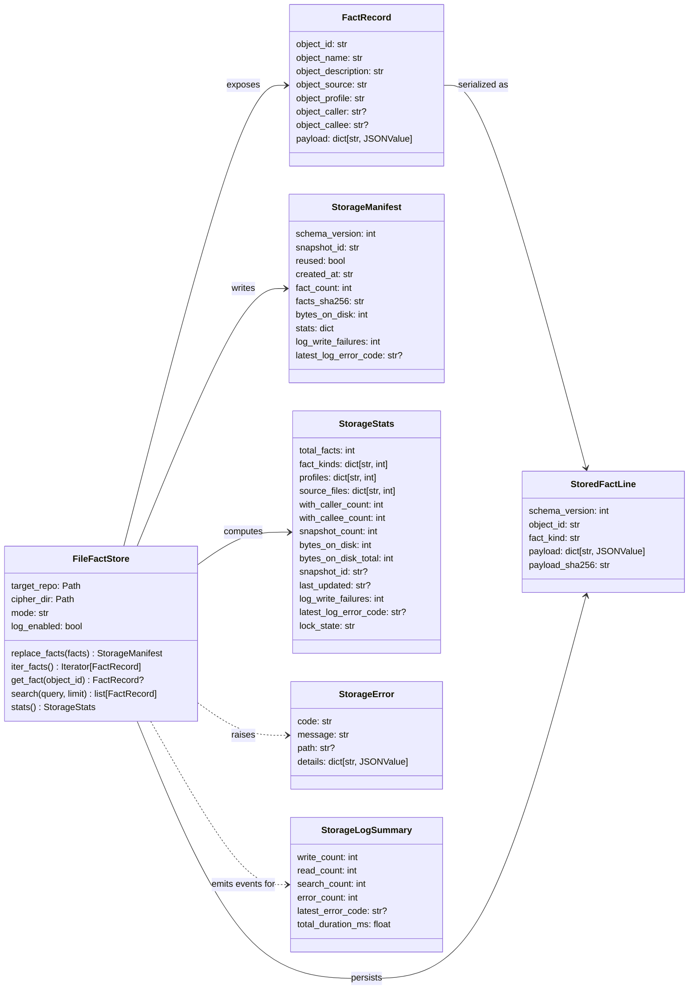
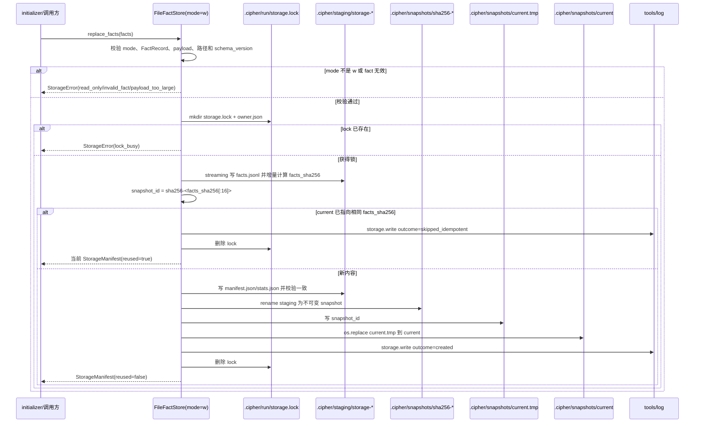
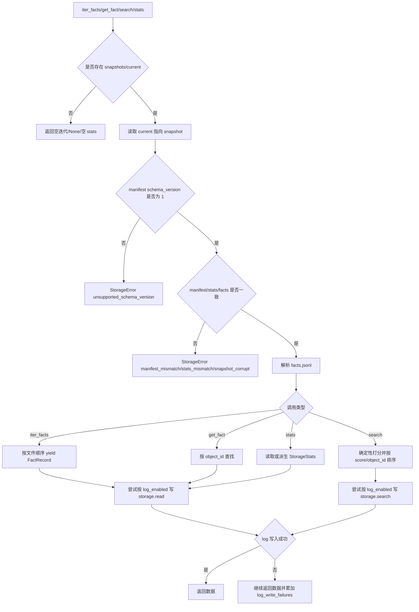
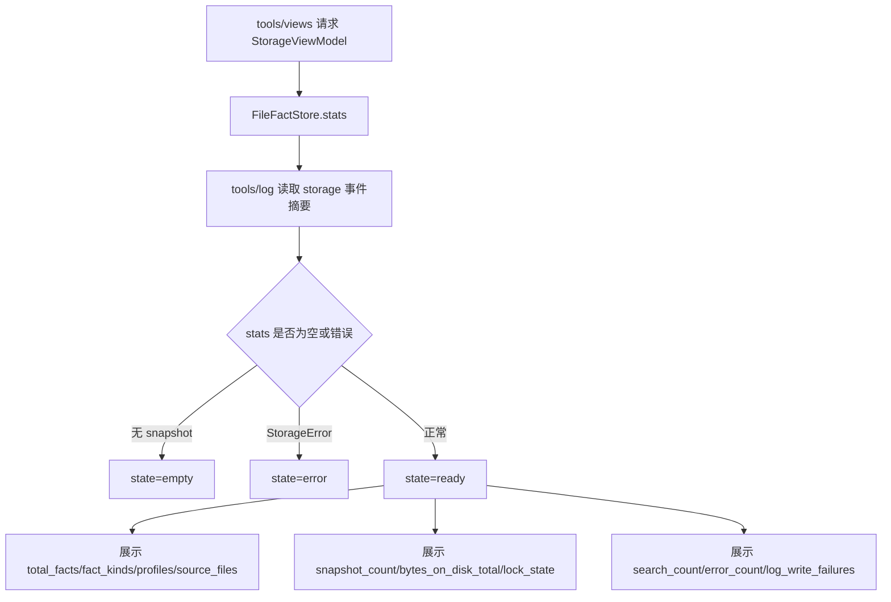

# storage FACT store 设计草稿

## 状态

- 日期：2026-05-25
- 修订日期：2026-05-26
- 状态：草稿，已回写第三轮评审意见，等待设计 PR 合入
- 范围：`storage` 第一版运行时功能，以及配套 `tools/log` 可观测手段、`tools/views` 核心统计呈现和测试门禁

实现顺序固定为：先 `tools/log`，再 `storage`，最后 `tools/views`。`storage` TDD 阶段允许 import `cipher2.tools.log` 公共 API。

## 模块定位

本功能属于 `src/cipher2/storage/`。目标是实现 v1 FACT-only file store，为未来 initializer 写入 facts、MCP `search/detail` 读取 facts、`tools/views` 展示 FACT 状态提供基础能力。

本次只引入文件型 snapshot store，使用 Python 标准库，不绑定 Kuzu、Neo4j、Memgraph 或其他图数据库。Graph projection、Graph containers、`FACT_RELATIVE`、`GRAPH_RELATIVE`、`GRAPH_DERIVED_FROM`、HTTP MCP、Concept/Git 抽取都不进入运行时。

配套影响模块：

- `src/cipher2/tools/log/`：storage 操作写入结构化 log event。
- `src/cipher2/tools/views/`：storage view model 的权威定义在 `docs/design-drafts/20260526-tools-views.md`。
- `tests/`：新增 storage、tools/log、tools/views 和测试矩阵用例。

## 规格约束

来自当前文档的约束：

- 所有被分析仓库产物必须位于 `<target-repo>/.cipher/`。
- storage 不实现 extractor、MCP 格式化、TUI 渲染或 `storage/schema/` 外的 schema 文件。
- `TheFact` 是 v1 唯一运行时容器。
- 必需逻辑字段：`object_id`、`object_name`、`object_description`、`object_source`、`object_profile`。
- 可选逻辑字段：`object_caller`、`object_callee`。
- `fact_kind` 保留为 storage 内部实现字段，不提升为 `TheFact` 逻辑契约；initializer 不需要感知该字段。
- storage API 不能把逻辑 schema 绑定到单一图数据库。
- read-only open mode 必须可供 MCP 读取，不应修改 snapshot、staging 或 run 状态。
- 新功能必须提供 `tools/log` 可观测手段、`tools/views` 核心统计呈现和专门用例看护。

用户可配配置项：

- 不新增用户可配配置项。
- `mode`、`log_enabled`、`limit` 是 Python API 调用参数，不写入 `.cipher/config.yml`，不属于用户持久配置。

本功能的 v1 非目标：

- 不实现 CLI。
- 不实现 MCP server 或 MCP 响应格式。
- 不实现 TUI rendering，只提供 `tools/views` 可消费的数据。
- 不实现 BM25、embedding 或 Graph search。
- 不实现 snapshot 自动清理和 fsync 持久性增强。
- 不引入第三方依赖。

## 数据结构

`JSONValue` 在本仓公共类型中统一定义：

```python
JSONValue = None | bool | int | float | str | list["JSONValue"] | dict[str, "JSONValue"]
```



### `FactRecord` 成员表

| 成员名称 | type | 作用 | 并发粒度 |
|---|---|---|---|
| `object_id` | `str` | FACT 唯一标识，snapshot 内唯一 | fact 级、只读共享 |
| `object_name` | `str` | FACT 展示名和搜索字段 | fact 级、只读共享 |
| `object_description` | `str` | FACT 摘要和搜索字段 | fact 级、只读共享 |
| `object_source` | `str` | 来源位置或 provenance | fact 级、只读共享 |
| `object_profile` | `str` | 构建或 profile 作用域 | fact 级、只读共享 |
| `object_caller` | `str | None` | 可选直接上游对象 | fact 级、只读共享 |
| `object_callee` | `str | None` | 可选直接下游对象 | fact 级、只读共享 |
| `payload` | `dict[str, JSONValue]` | 扩展 payload，只校验 JSON 可序列化和大小 | fact 级、只读共享 |

### `StoredFactLine` 成员表

| 成员名称 | type | 作用 | 并发粒度 |
|---|---|---|---|
| `schema_version` | `int` | 固定为 `1`，用于读取兼容校验 | 行级、只读共享 |
| `object_id` | `str` | 与 `FactRecord.object_id` 一致 | 行级、只读共享 |
| `fact_kind` | `str` | storage 内部统计字段，从 `payload["fact_kind"]` 的字符串值推导，否则为 `fact` | 行级、只读共享 |
| `payload` | `dict[str, JSONValue]` | 原始扩展 payload | 行级、只读共享 |
| `payload_sha256` | `str` | 单条 payload 摘要，用于调试和损坏定位 | 行级、只读共享 |

### `FileFactStore` 成员表

| 成员名称 | type | 作用 | 并发粒度 |
|---|---|---|---|
| `target_repo` | `Path` | 目标仓库根目录 | 只读共享 |
| `cipher_dir` | `Path` | `<target-repo>/.cipher/` 根目录，由 `target_repo` 派生 | 目录级 |
| `mode` | `Literal["r", "w"]` | 限制读写能力 | 对象级 |
| `log_enabled` | `bool` | 控制是否向 `tools/log` 写事件 | 对象级 |

### `StorageManifest` 成员表

| 成员名称 | type | 作用 | 并发粒度 |
|---|---|---|---|
| `schema_version` | `int` | 固定为 `1`，未知或缺失时报 `unsupported_schema_version` | snapshot 级、只读共享 |
| `snapshot_id` | `str` | `sha256-` + `facts_sha256[:16]`，内容寻址且可复现 | snapshot 级 |
| `reused` | `bool` | 同内容写入是否复用当前 snapshot | snapshot 级 |
| `created_at` | `str` | UTC ISO-8601 创建时间，复用时保留原值 | snapshot 级 |
| `fact_count` | `int` | FACT 数量 | snapshot 级 |
| `facts_sha256` | `str` | canonical `facts.jsonl` 内容摘要 | snapshot 级 |
| `bytes_on_disk` | `int` | 当前 snapshot 文件体积，仅含该 snapshot 的 `facts.jsonl`、`manifest.json`、`stats.json` 三个文件之和，不含 staging、run、log | snapshot 级 |
| `stats` | `dict` | `StorageStats` JSON 形态，必须与 `stats.json` 一致 | snapshot 级 |
| `log_write_failures` | `int` | 本次或当前 snapshot 累计 log 写入失败数 | snapshot 级 |
| `latest_log_error_code` | `str | None` | 最近 log 降级错误码 | snapshot 级 |

### `StorageStats` 成员表

| 成员名称 | type | 作用 | 并发粒度 |
|---|---|---|---|
| `total_facts` | `int` | FACT 总数 | snapshot 级、只读共享 |
| `fact_kinds` | `dict[str, int]` | storage 推导的 fact_kind 分布 | snapshot 级、只读共享 |
| `profiles` | `dict[str, int]` | profile 分布 | snapshot 级、只读共享 |
| `source_files` | `dict[str, int]` | source 首段或 scheme 聚合 | snapshot 级、只读共享 |
| `with_caller_count` | `int` | caller 覆盖数 | snapshot 级、只读共享 |
| `with_callee_count` | `int` | callee 覆盖数 | snapshot 级、只读共享 |
| `snapshot_count` | `int` | `snapshots/` 下不可变 snapshot 数量 | snapshot 集合级 |
| `bytes_on_disk` | `int` | 当前 snapshot 文件体积，必须等于当前 manifest 的 `bytes_on_disk`；两者不一致返回 `StorageError(code="stats_mismatch")` | snapshot 级、只读共享 |
| `bytes_on_disk_total` | `int` | 所有 snapshot 文件体积总和 | snapshot 集合级 |
| `snapshot_id` | `str | None` | 当前 snapshot id | snapshot 级、只读共享 |
| `last_updated` | `str | None` | 当前 snapshot 创建时间 | snapshot 级、只读共享 |
| `log_write_failures` | `int` | storage 相关 log 降级次数 | log 读取快照级 |
| `latest_log_error_code` | `str | None` | 最近 log 降级错误码 | log 读取快照级 |
| `lock_state` | `Literal["free", "held", "stale_likely"]` | 当前 storage lock 状态 | run 目录级 |

### `StorageError` 成员表

| 成员名称 | type | 作用 | 并发粒度 |
|---|---|---|---|
| `code` | `str` | 结构化错误码 | 异常实例级 |
| `message` | `str` | 面向用户或调用方的短说明 | 异常实例级 |
| `path` | `str | None` | 相关路径，必须位于 `.cipher/` 内 | 文件级 |
| `details` | `dict[str, JSONValue]` | 错误上下文，不包含源码 dump；可附带非主因 log 失败 | 异常实例级 |

### `StorageLogSummary` 成员表

`StorageLogSummary` 是 `LogSummary(channel="storage")` 的 storage 专用摘要，由 storage 测试 helper 自己计算，目的是让 storage 单元测试不强制 import log 模块。运行时代码仍可以按实现顺序使用 `cipher2.tools.log` 公共 API。`observe_batch("storage", counts)` 写回 `storage` channel，因此 `StorageLogSummary` 包含 `storage.batch_summary`。

| 成员名称 | type | 作用 | 并发粒度 |
|---|---|---|---|
| `write_count` | `int` | storage 写入事件数 | log 读取快照级 |
| `read_count` | `int` | storage 读取事件数 | log 读取快照级 |
| `search_count` | `int` | storage search 事件数 | log 读取快照级 |
| `error_count` | `int` | storage 错误事件数 | log 读取快照级 |
| `latest_error_code` | `str | None` | 最近 storage 错误码 | log 读取快照级 |
| `total_duration_ms` | `float` | storage 事件总耗时 | log 读取快照级 |

## 物理文件布局

所有文件都位于目标仓库 `.cipher/` 下：

```text
<target-repo>/.cipher/
  snapshots/
    current
    current.tmp
    sha256-<facts_sha256_prefix>/
      facts.jsonl
      manifest.json
      stats.json
  staging/
    storage-<pid>-<nonce>/
  run/
    storage.lock/
      owner.json
  log/
    storage.jsonl
```

`run/` 是 v1 跨模块运行时目录，子目录按模块命名（`run/storage.lock/`、未来 `run/mcp/`），互不干涉；任何模块只能写入与自身同名的子目录。

`snapshots/current` 是文本指针，只包含当前 `snapshot_id`。`stats.json` 是 views 读取优化，必须等于 `manifest.json.stats`；读取时二者不一致返回 `StorageError(code="stats_mismatch")`。

`snapshot_id = "sha256-" + facts_sha256[:16]`。同一 canonical facts 内容得到同一 snapshot id。写入时若 `snapshots/<snapshot_id>/manifest.json` 已存在且其中 `facts_sha256` 与当前完整 hash 不一致，返回 `StorageError(code="snapshot_id_collision")`，要求显式升级到完整 64 字符前缀；v1 不自动扩展前缀长度。旧 snapshot 本版不自动清理；`snapshot_count` 与 `bytes_on_disk_total` 让 `tools/views` 呈现长期增长风险，阈值告警推迟到 v2。

## 对外接口流程

### 写入 snapshot 流程



### 读取和查询流程



### views 呈现流程



### Python API

计划导出：

```python
open_fact_store(target_repo: Path, mode: Literal["r", "w"] = "r", *, log_enabled: bool = True) -> FileFactStore
```

`FileFactStore` 方法：

- `replace_facts(facts: Iterable[FactRecord]) -> StorageManifest`
- `iter_facts() -> Iterator[FactRecord]`
- `get_fact(object_id: str) -> FactRecord | None`
- `search(query: str, limit: int = 20) -> list[FactRecord]`
- `stats() -> StorageStats`

内部恢复 helper：

- `cipher2.storage.recovery.force_unlock(target_repo: Path) -> bool`：非用户 API，不在 `storage.__all__` 中，不由 initializer 调用；只供未来 CLI 或 views 的显式恢复入口复用，v1 不暴露 CLI。

### search 规则

- `query` 为空字符串时返回前 `limit` 条，按 `object_id` 升序，log 写 `query_kind="empty"`。
- 非空 query 使用大小写不敏感子串匹配，不做 stemming、BM25、embedding 或 Graph search。
- 字段权重：`object_name=3`、`object_description=2`、`object_caller=2`、`object_callee=2`、`object_source=1`。
- 同分 tie-break：`object_id` 升序。
- `payload` 不参与 search 排序。
- `limit < 1` 返回 `StorageError(code="invalid_limit")`。

### `tools/log` 集成

- storage 默认写入 `<target-repo>/.cipher/log/storage.jsonl`。
- `log_enabled=False` 只禁用 log 副作用，不改变 storage 语义。
- log 写入失败不抛 `StorageError`；snapshot 已成功则 storage 调用成功。
- log 降级信息写入 `StorageManifest.log_write_failures`、`latest_log_error_code`，并进入 `StorageStats` 和 `tools/views`。
- read/search/stats 路径上的 log 写入失败同样不影响业务返回，只累加 `StorageStats.log_write_failures` 并更新 `latest_log_error_code`。
- 若 storage 自身失败且 log 也失败，抛主 storage 错误，log 失败只放入 `StorageError.details`。

## 并发控制

写入互斥：

- `replace_facts` 通过创建目录 `<target-repo>/.cipher/run/storage.lock` 获得锁。
- 锁目录内写 `owner.json`，记录 `pid`、`host`、`created_at`、`operation`。
- 锁已存在时返回 `StorageError(code="lock_busy")`，本版不自动抢占。
- `lock_state="stale_likely"` 仅在 owner pid 属于本机且进程不存在时呈现；自动删除仍推迟到显式 `cipher2.storage.recovery.force_unlock(target_repo)`。
- 写入结束或异常时尽力删除锁目录。

原子可见性：

- `replace_facts` 是 streaming 实现，边读 iterator 边写 staging，并增量计算 `facts_sha256`；峰值内存与单条 fact 大小成正比，不与总数成正比。
- facts、manifest、stats 先写入 staging。
- staging 校验通过后移动为 `snapshots/<snapshot_id>/`。
- `current.tmp` 必须写在 `snapshots/` 同目录，再用 `os.replace` 替换 `snapshots/current`。
- v1 不调用 fsync。宿主机断电可能丢失最近 snapshot，但 `current` 指针只在 staging rename 完成后切换，不应出现 half snapshot。
- 读者只读取 `current` 指向的不可变目录。

读写关系：

- 并发读允许。
- 并发写拒绝。
- 写入过程中读者看不到 staging。
- `mode="r"` 不创建或修改 `snapshots/`、`staging/`、`run/`。
- log 写入属于 `tools/log` 副作用；read-only storage 仍可按 `log_enabled=True` 写入 `log/storage.jsonl`。

路径安全：

- 所有内部路径必须通过 target repo 的 `.cipher/` 派生。
- storage 内部路径在写入前做 `Path.resolve()` 并校验 `is_relative_to(cipher_dir.resolve())`。
- 任何解析后逃逸 `.cipher/` 的路径返回 `StorageError(code="path_escape")`，包括 symlink 逃逸。
- 测试不得在本仓源码树生成 `.cipher/`；必须使用临时目标仓库。

## 文档递归更新

设计 PR 合入后，需要搬迁到以下文档：

1. `src/cipher2/storage/README.md`
   - 写入物理 layout、Python API、读写语义、错误语义、并发控制、search 排序、stats 语义和 no-config 决策。
2. `src/cipher2/storage/schema/README.md`
   - 写入 v1 文件 schema、`facts.jsonl`、`manifest.json`、`stats.json`、schema version 行为和禁止 Graph/relation tables 的测试要求。
3. `src/cipher2/tools/log/README.md`
   - 写入 storage log event schema、log 降级行为、字段截断和错误恢复。
4. `src/cipher2/tools/views/README.md`
   - 按 `20260526-tools-views.md` 写入 storage view model、核心统计、空状态和异常状态。
5. `tests/README.md`
   - 写入 `unittest` 全量命令、storage 测试矩阵、可观测用例看护和三档性能/小型化看护。
6. `src/cipher2/common/README.md`
   - 若目录不存在则新建，用于记录 `JSONValue` 等跨模块类型。
7. `src/cipher2/README.md`
   - 更新数据流方向，明确 storage 写 log、MCP 读 storage、views 读 storage/log。
8. `docs/README.md`
   - 增加 storage 第一版运行时文档索引。
9. `CONTRIBUTING.md`
   - 已将测试命令预期同步为 `unittest`；搬迁时保持一致。

暂不需要修改 `README.md` 的顶层产品范围；该范围已覆盖 FACT store、log 工具和 TUI 展示。

## 可观测性与呈现

storage 操作写入 `storage.jsonl`，每行一个 JSON event。

公共字段：

- `schema_version: 1`
- `event_name: "storage.write" | "storage.read" | "storage.search" | "storage.error"`
- `timestamp`
- `operation`
- `status: "ok" | "error" | "warning"`
- `outcome: "created" | "skipped_idempotent" | "read" | "searched" | "failed"`
- `duration_ms`
- `snapshot_id`
- `fact_count`
- `matched_count`
- `limit`
- `bytes_written`
- `error_code`
- `query_kind: "empty" | "substring"`
- `query_preview`
- `query_sha256`
- `log_write_failures`
- `latest_log_error_code`

约束：

- 不写完整 payload。
- `query_preview` 最多 80 字符。
- source code 内容不得写入 log。
- payload 由 initializer/extractor 维护语义，storage 只校验 JSON 可序列化和单 fact payload JSON 长度不超过 4KB。
- payload 内容不影响 search 排序和 stats 聚合。

`tools/views` 展示字段由 `20260526-tools-views.md` 权威定义，至少包括：

- 当前 snapshot id 和 last_updated。
- FACT 总数。
- fact_kind 分布。
- profile 分布。
- source_files Top N。
- caller/callee 覆盖数量。
- snapshot_count 与 bytes_on_disk_total。
- lock_state。
- storage search 次数、成功/失败次数、最近错误代码。
- log_write_failures 与 latest_log_error_code。
- 空 store 状态：`state="empty"`，显示 0 facts 和无 snapshot。
- 异常状态：`state="error"`，显示 `error_code` 和可恢复提示，不展示 raw traceback。

## 可观测用例看护

专门测试必须覆盖：

- 正常 `replace_facts` 写入 `storage.write outcome="created"`。
- 重复 `replace_facts` 写入 `storage.write outcome="skipped_idempotent"`，且不改 `current`。
- 正常 `search` 写入 `storage.search`，断言 query preview 截断、query hash、matched_count、limit 和 query_kind。
- 失败 `search` 写入 `storage.error`，断言 `invalid_limit` 或 `invalid_query`。
- log 写入失败不破坏 snapshot，且 view model 呈现 log 降级。
- 空 store view model，断言 state、0 facts、空分布。
- 多 facts view model，断言 fact_kind/profile/source 聚合准确。
- 损坏 snapshot view model，断言异常状态可见且不泄漏 traceback。
- log schema 字段变更会导致测试失败。

## 测试与门禁计划

### TDD 首批失败测试

文档搬迁 PR 合入后，先写以下失败测试：

- `tests/test_storage_fact_record.py`
  - 必需字段校验。
  - JSON round trip。
  - payload JSON 序列化和 4KB 上限。
  - `fact_kind` 从 payload 推导，未提供时为 `fact`。
- `tests/test_storage_file_store.py`
  - 空 store。
  - replace + iter + get。
  - duplicate object_id。
  - 内容寻址 snapshot_id。
  - 同内容幂等复用。
  - search 确定性排序和 limit。
  - stats 聚合。
- `tests/test_storage_path_safety.py`
  - 只写临时目标仓库 `.cipher/`。
  - symlink path escape。
  - read-only mode 不创建 snapshot/staging/run。
  - lock_busy、stale_likely、`recovery.force_unlock`。
- `tests/test_storage_corruption.py`
  - malformed JSONL。
  - manifest mismatch。
  - `manifest.json.stats` 与 `stats.json` 内容不一致。
  - `manifest.bytes_on_disk` 与 `stats.bytes_on_disk` 数值不一致。
  - 实际磁盘文件体积与 `manifest.bytes_on_disk` 不一致。
  - missing current pointer。
  - unsupported schema version。
- `tests/test_storage_observability.py`
  - log write/search/error。
  - log 降级不影响 snapshot。
  - log truncation。
  - log read malformed recovery。
- `tests/test_storage_view_model.py`
  - empty/normal/error/log-degraded/lock-held view model。
- `tests/test_storage_performance.py`
  - 512MB、4G、8G 三档预算下的自动化守护。
- `tests/test_storage_coverage_matrix.py`
  - meta-test：用 `unittest.TestLoader` 枚举 `tests/test_storage_*.py` 的方法名，并对照功能点、异常分支、场景组合和可观测用例清单断言每条至少有一条测试方法覆盖；它不做行为断言，只阻止用例清单与设计漂移。

### 功能点覆盖率 100%

功能点清单：

- FactRecord 校验。
- StoredFactLine 推导。
- JSONL 序列化/反序列化。
- snapshot replace。
- 内容寻址 snapshot_id。
- current pointer 原子切换。
- read-only open。
- iter_facts。
- get_fact。
- search。
- stats。
- log write/read/summary。
- log 降级呈现。
- storage view model。

每个功能点必须在 `test_storage_coverage_matrix.py` 映射到至少一个测试方法。

### 异常分支覆盖率 90%+

异常分支清单：

- invalid mode。
- invalid limit。
- invalid query。
- invalid fact。
- invalid fact id。
- duplicate fact id。
- read-only replace。
- payload not JSON。
- payload too large。
- path escape。
- lock busy。
- stale lock。
- missing snapshot。
- corrupt JSONL。
- manifest mismatch。
- stats mismatch。
- unsupported schema version。
- malformed log event。
- log write failure。

本次目标覆盖 100%，最低不得低于 90%。

### 场景用例覆盖率 100%

场景组合：

- 空 store + stats/search/get。
- 单 fact + get/search/stats。
- 多 fact_kind。
- 多 profile。
- caller/callee 存在与缺失。
- source provenance 为路径与非路径 scheme。
- replace 首次写。
- replace 同内容幂等。
- replace 新内容切换 snapshot。
- read-only + log enabled。
- read-only + log disabled。
- malformed snapshot + tools/views error state。
- log degraded + tools/views warning state。

### 三档性能与小型化看护

使用 `tracemalloc`、临时目录文件大小和固定超时断言：

- 小：1,000 facts，预算 512MB，覆盖空 store、低 limit、单 snapshot。
- 中：100,000 facts，预算 4G，覆盖 streaming replace、search、stats。
- 大：1,000,000 facts，预算 8G，覆盖 streaming write、增量 hash 和 search 不全量额外复制。

这些测试是守护测试，不做长时间压测。若 CI 时间不足，大档可标记为显式性能门禁脚本，但上仓前必须运行并记录结果。

### 全量用例命令

当前无 `pyproject.toml` 和 Makefile。第一版全量命令设为：

```bash
PYTHONPATH=src python3 -m unittest discover -s tests
```

v1 选定 `unittest` 的理由：仅依赖标准库，无 `pyproject.toml` 时也可运行。`CONTRIBUTING.md` 已同步为 `unittest` 表述。

## 开发后上仓门禁

实现完成后必须通过：

- `git diff --check`
- `PYTHONPATH=src python3 -m unittest discover -s tests`
- storage 覆盖矩阵测试。
- storage 可观测用例看护。
- 三档性能/小型化守护。

任何门禁失败、跳过或无法运行，都不得上仓。

## 评审处理记录

- S1-S6：已回写 snapshot_id、current.tmp、幂等、log 降级、search 排序、fact_kind 内部化。
- S7-S17：已回写 symlink 安全、stats source-of-truth、snapshot 可见性、性能负载、fsync 声明、schema version、payload 约束、stale lock、JSONValue、coverage meta-test、streaming write。
- X1：新增 `docs/design-drafts/20260526-tools-views.md`，由该草稿权威定义 views 聚合层。
- X2-X5：已回写实现顺序、unittest 决策、数据流迁移要求和 `run/` 跨模块约定。
- X6：中文文档要求保持通过；类型名、字段名和命令允许保留原文。
- S18-S22：已回写 bytes_on_disk 同义约束、StorageLogSummary 摘要关系、恢复接口边界、read/search log 降级分支和 snapshot id collision 兜底。
- 第二轮跨草稿项：log 草稿选择 R-L16 方案 A；`StorageLogSummary` 仍作为 storage 专用摘要，storage 不消费削薄后的 `LogWriteResult`。
- T-S1-T-S3：已回写第三轮意见。`stats_mismatch` 测试拆成 manifest/stats 内容不一致、manifest/stats bytes_on_disk 不一致和实际磁盘体积外部篡改三条路径；`StorageLogSummary` 明确包含写回原 channel 的 `storage.batch_summary`；强制解锁移出 `FileFactStore`，改为 `cipher2.storage.recovery.force_unlock(target_repo)` 的非用户 API。
- 第三轮跨草稿项：views 的 `code="log_unreadable"` 等 synthetic 错误码不进入 storage 错误码集；`StorageError.code` 不与之冲突。
