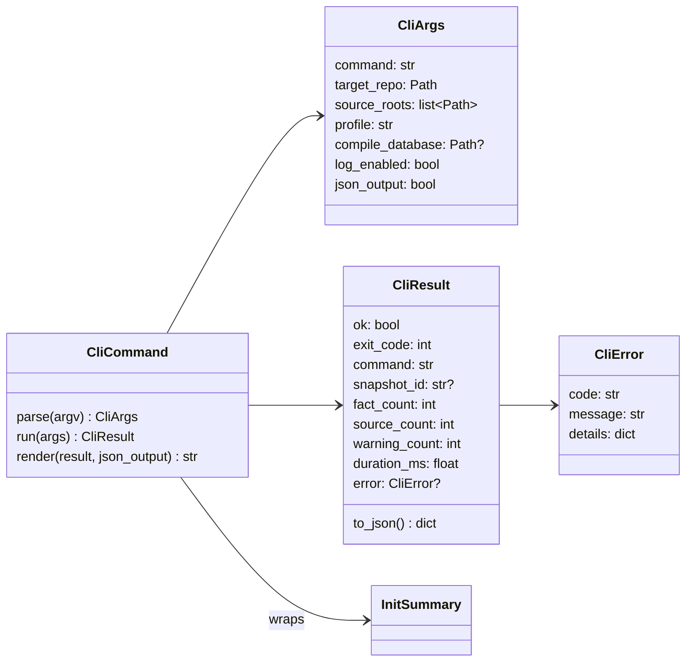
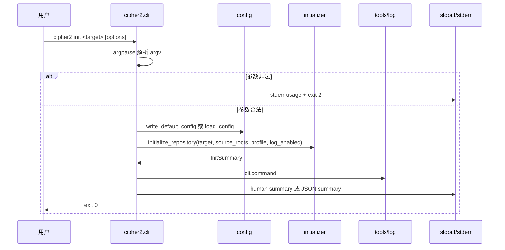
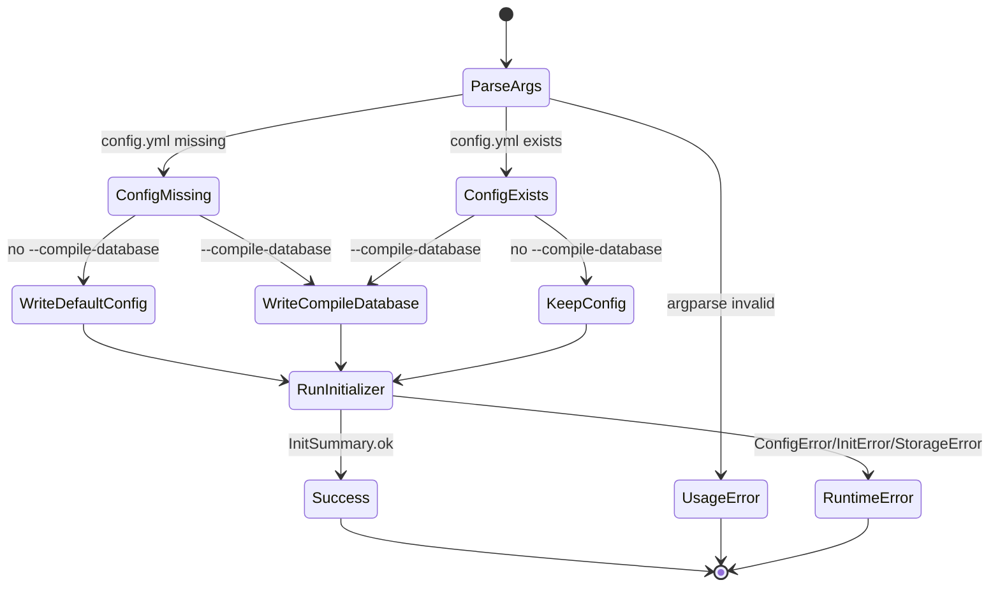
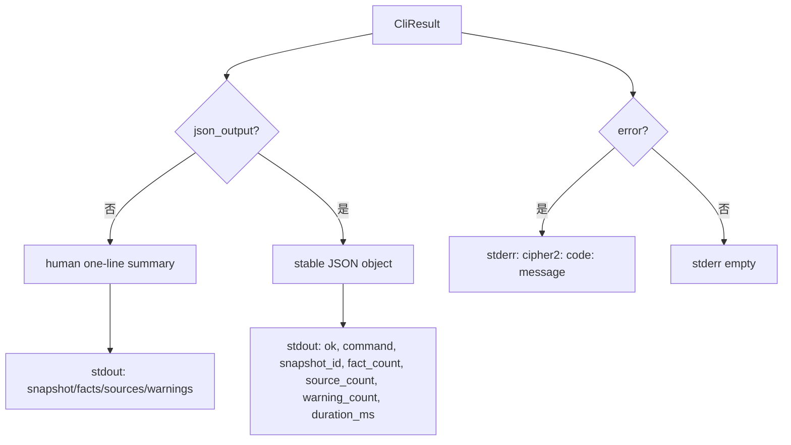

# cli-init runtime 设计草稿

## 模块定位

本功能属于 `src/cipher2/cli.py`、`src/cipher2/__main__.py`、`pyproject.toml`、`tests/`、`scripts/`、`tools/log` 和 `tools/views` 的交叉边界。目标是把已有 Python API `initialize_repository()` 暴露为 v1 可执行入口：

```text
cipher2 init <target>
  -> 写入或读取 .cipher/config.yml
  -> initializer/code 收集 FACT
  -> storage 写入 FACT snapshot
  -> tools/log 记录 CLI/initializer/storage/config 事件
  -> tools/views 通过 log view 呈现 CLI 核心统计
```

本功能不改变 FACT-only 运行时边界，不新增 Graph、relation、Concept/Git 抽取、HTTP MCP 或 TUI renderer。MCP runtime 已提供本地 stdio `search/detail`，CLI 仍只负责初始化，不发起 MCP 请求。

## 规格约束

- `README.md`：v1 路径中存在 `cipher2 init`；所有目标仓库输出必须位于 `<repo>/.cipher/`。
- `CONTRIBUTING.md`：当前尚无 `pyproject.toml`、`Makefile` 或可运行入口；增加入口时必须同步权威命令、smoke test 和中文文档。
- `docs/schema.md`：v1 查询入口仍围绕 FACT 的 `search` / `detail` 语义；CLI init 只负责建立 FACT 输入数据，不创建 `TheGraph` 或 relation runtime。
- `src/README.md`：添加任何 CLI 入口前，必须用 smoke test 覆盖包导入。
- `src/cipher2/initializer/README.md`：CLI 入口由后续 `cli-init` 设计 PR 处理；initializer 仍是 Python API 和运行时核心。
- `src/cipher2/config/README.md`：config 只持久化 `paths.compile_database`；显式初始化时可以写默认配置；compile database 可以在仓库外，但不能位于目标仓库 `.cipher/` 内。
- `src/cipher2/tools/log/README.md`：raw JSONL 不是用户入口；新增 channel 必须符合 channel regex，不写源码正文、绝对 target path、secret、traceback。
- `src/cipher2/tools/views/README.md`：新增 CLI 可观测信息必须通过 log section 呈现，不新增独立 CLI section。

本功能不新增用户可配持久配置项。它只复用 config 已有的 `paths.compile_database`。新增 CLI 参数如下，均不写入 `.cipher/config.yml`，除 `--compile-database` 会通过现有 `paths.compile_database` 持久化外。

| 参数/配置 | type | 取值范围 | 默认值 | 作用 | 生效时机 | 非法值处理 |
|---|---|---|---|---|---|---|
| `paths.compile_database` | `str | null` | 继承 config README | `null` | CLI `--compile-database` 的持久化落点 | `init` 执行前写入或读取 | 透传 `ConfigError` |
| `target` | `str | Path` | 存在且可读目录 | `.` | 目标仓库根目录 | CLI 参数解析后 | exit code `1`，`CliError(code="invalid_target")` |
| `--source-root` | `str | Path`，可重复 | 目标仓库内目录或文件 | 不传表示扫描目标仓库 | 限定抽取输入范围 | 调用 initializer 前 | exit code `1`，透传 `InitError` |
| `--profile` | `str` | 非空字符串 | `default` | 写入 `object_profile` | 单次初始化 | exit code `1`，`invalid_profile` |
| `--compile-database` | `str | Path` | 可读普通文件；不能在 `.cipher/` 内 | 不传则保留已有配置或写默认 `null` | 写入现有 `paths.compile_database` | 初始化前 | exit code `1`，透传 `ConfigError` |
| `--no-log` | `bool` flag | true/false | false | 禁止 config/initializer/storage/CLI log 写入 | 单次命令 | argparse usage error |
| `--json` | `bool` flag | true/false | false | stdout 输出稳定 JSON 摘要 | 命令完成时 | argparse usage error |
| `--version` | `bool` flag | true/false | false | 输出包版本 | 参数解析时 | argparse usage error |

## 数据结构



### `CliArgs` 成员表

| 成员名称 | type | 作用 | 并发粒度 |
|---|---|---|---|
| `command` | `str` | 当前子命令，v1 仅 `init` | 请求级 |
| `target_repo` | `Path` | 目标仓库根目录 | 只读共享 |
| `source_roots` | `list[Path]` | 传给 initializer 的源码范围 | 请求级 |
| `profile` | `str` | 传给 initializer 的 profile | 请求级 |
| `compile_database` | `Path | None` | 写入 config 的 compile database | 请求级 |
| `log_enabled` | `bool` | 是否写 CLI/config/initializer/storage log | 请求级 |
| `json_output` | `bool` | stdout 是否输出 JSON 摘要 | 请求级 |

### `CliResult` 成员表

| 成员名称 | type | 作用 | 并发粒度 |
|---|---|---|---|
| `ok` | `bool` | 命令是否成功 | 响应实例级 |
| `exit_code` | `int` | 进程退出码 | 响应实例级 |
| `command` | `str` | 子命令名 | 响应实例级 |
| `snapshot_id` | `str | None` | 写入的 snapshot id | 响应实例级 |
| `fact_count` | `int` | FACT 总数 | 响应实例级 |
| `source_count` | `int` | 源文件数量 | 响应实例级 |
| `warning_count` | `int` | 可恢复警告数 | 响应实例级 |
| `duration_ms` | `float` | CLI 包装层耗时 | 响应实例级 |
| `error` | `CliError | None` | 失败时的结构化错误 | 响应实例级 |

### `CliError` 成员表

| 成员名称 | type | 作用 | 并发粒度 |
|---|---|---|---|
| `code` | `str` | 稳定错误码 | 错误实例级 |
| `message` | `str` | 不含 traceback 的短说明 | 错误实例级 |
| `details` | `dict[str, JSONValue]` | 补充字段；不得包含源码正文、绝对 target path、secret | 错误实例级 |

### `CliCommand` 成员表

| 成员名称 | type | 作用 | 并发粒度 |
|---|---|---|---|
| `parse` | `Callable[[list[str]], CliArgs]` | 解析 argv 并返回结构化参数 | 调用级、无共享状态 |
| `run` | `Callable[[CliArgs], CliResult]` | 调用 config 和 initializer 完成 init | 调用级、无共享状态 |
| `render` | `Callable[[CliResult, bool], str]` | 生成 human 或 JSON stdout 文本 | 调用级、无共享状态 |

## 对外接口流程

### 命令入口



### init 配置状态



### 输出格式



默认 human 输出示例：

```text
initialized snapshot=sha256-0123456789abcdef facts=42 sources=3 warnings=0
```

`--json` 输出示例：

```json
{"command":"init","duration_ms":12.3,"fact_count":42,"ok":true,"snapshot_id":"sha256-0123456789abcdef","source_count":3,"warning_count":0}
```

## 并发控制

- CLI 单进程单命令串行执行，不启动后台线程或 daemon。
- 多个 `cipher2 init` 并发运行时，storage 的 `run/storage.lock/` 是唯一写入互斥来源；CLI 不新增全局锁。
- CLI 可在初始化前写 `.cipher/config.yml`，写入仍由 config 的同目录 `os.replace` 提供原子替换。
- CLI 自身只在 `tools/log` 写 `cli.jsonl`；log 模块负责文件级锁和跨进程 `fcntl.flock`。
- `--no-log` 传入时，CLI 不写 `cli.command`/`cli.error`，并向 config/initializer/storage 传递 `log_enabled=False` 或 `observe=False`。
- CLI 不缓存 FACT、events、source 文件或 initializer summary。
- stdout/stderr 是进程级输出；JSON 模式只向 stdout 写一个 JSON object 和换行，错误仍写 stderr。

## 文档递归更新

设计 PR 合入后，README 搬迁 PR 需要递归更新：

1. `src/cipher2/initializer/README.md`：把“CLI 入口另走后续设计 PR”改为已由 CLI 包装 initializer API，保留 initializer 不解析 argv 的边界。
2. `src/cipher2/tools/log/README.md`：新增 `cli` channel、`cli.command`、`cli.error`、payload 字段和安全约束。
3. `src/cipher2/tools/views/README.md`：说明 CLI 事件通过 log section 呈现，不新增 CLI section。
4. `src/cipher2/README.md`：补充 `cli.py`、`__main__.py` 和 `cipher2 init` 数据流。
5. `src/README.md`：列出 CLI 入口和 smoke test。
6. `README.md`：把 `cipher2 init` 从设计路径更新为可执行入口。
7. `tests/README.md`：新增 CLI 测试矩阵、权威命令和性能门禁。
8. `CONTRIBUTING.md`：更新“尚无可运行入口”的描述，记录 `cipher2 init` smoke test。

## 可观测性与呈现

CLI 新增 `cli` channel，写入 `<target-repo>/.cipher/log/cli.jsonl`：

- `cli.command`：命令成功，`counts` 写 `fact_count`、`source_count`、`warning_count`，payload 写 `operation="init"`、`outcome="completed"`、`command_name="init"`、`exit_code=0`、`json_output`、`profile`。
- `cli.error`：命令失败，`status="error"`，顶层 `error_code` 为稳定错误码，payload 写 `operation="init"`、`outcome="failed"`、`command_name="init"`、`exit_code`、`error_code`。

事件不得包含源码正文、绝对 target path、compile database 绝对路径、完整 argv、环境变量、traceback 或 secret。`--source-root` 只允许在 payload 中出现 `source_root_count`，不记录路径列表。

`tools/views` 不新增 CLI section。CLI 信息通过 log view 展示：

- `events_by_channel["cli"]`
- `top_event_names` 中的 `cli.command` / `cli.error`
- `error_codes`
- `recent_events` / `slow_events`
- `LogEventRow.fields` 中的 `count.fact_count`、`count.source_count`、`count.warning_count`、`command_name`、`exit_code`、`json_output`

空状态：目标仓库没有任何 CLI 事件时，views log section 只显示现有其他 channel 或整体 `state="empty"`；不得合成伪 CLI 成功。异常状态：`cli.error` 进入 `events_by_status["error"]`、`error_codes` 和 recent events，overview 依照现有 log state 规则进入 `error`。

## 可观测用例看护

必须新增专门测试覆盖：

- 成功 `init` 写 `cli.command`，并通过 views log section 看到 `events_by_channel["cli"]`。
- 失败 `init` 写 `cli.error`，错误码稳定，views `error_codes` 可见。
- `--no-log` 不写 `cli`、`config`、`initializer` 或 `storage` 事件。
- `--json` stdout 是稳定 JSON，不要求用户阅读 raw JSONL。
- 事件和 views 不泄漏源码正文、绝对 target path、compile database 绝对路径、完整 argv、traceback、secret。
- 空仓库、无 FACT、warning、storage lock busy、config invalid 等状态都能转成清晰 exit code 和 view 可见错误。

## 测试与门禁计划

TDD 首批失败测试：

- `tests/test_cli_parser.py`
- `tests/test_cli_init_command.py`
- `tests/test_cli_output.py`
- `tests/test_cli_observability.py`
- `tests/test_cli_path_safety.py`
- `tests/test_cli_package_entry.py`
- `tests/test_cli_performance.py`
- `tests/test_cli_coverage_matrix.py`

功能点覆盖率目标 100%：

- `python -m cipher2 --help`
- `python -m cipher2 --version`
- `python -m cipher2 init <target>`
- console script `cipher2 init <target>`，由 `pyproject.toml [project.scripts]` 暴露
- `--source-root` 单个和多个
- `--profile`
- `--compile-database` 写入现有 config 字段
- `--no-log`
- `--json`
- human 输出
- stderr 错误输出

异常分支覆盖率目标 100%，最低 90%：

- unknown command
- usage error
- invalid target
- invalid source root
- profile 空字符串
- compile database unreadable
- config path escape
- initializer error
- storage lock busy
- log write failure
- JSON 输出路径下的失败返回

场景用例覆盖率目标 100%：

- config 缺失且无 compile database
- config 缺失且传入 compile database
- config 存在且不覆盖
- config 存在且通过 `--compile-database` 覆盖
- 空仓库
- 单文件 C 仓库
- 多 source roots
- log enabled/disabled
- human/json 输出
- package import smoke test

三档性能与小型化看护：

- 小：1,000 LOC / 10 files，通过 CLI 初始化，峰值内存 < 80MB，wall-clock < 8s。
- 中：100,000 LOC / 1,000 files，通过 CLI 初始化，峰值内存 < 640MB，wall-clock < 150s。
- 大：1,000,000 LOC / 10,000 files，通过 CLI 初始化，峰值内存 < 2.5GB，wall-clock < 1,000s。

实现 PR 前必须运行：

```bash
git diff --check
PYTHONPATH=src python3 -m unittest discover -s tests
PYTHONPATH=src python3 scripts/cli_performance_gate.py
PYTHONPATH=src python3 scripts/initializer_performance_gate.py
PYTHONPATH=src python3 scripts/log_performance_gate.py
PYTHONPATH=src python3 scripts/storage_performance_gate.py
PYTHONPATH=src python3 scripts/views_performance_gate.py
```

最终全量门禁还必须继续包含 MCP 性能门禁：

```bash
PYTHONPATH=src python3 scripts/mcp_performance_gate.py
```

设计 PR 合入前不得修改 `src/`、`tests/`、`scripts/`、`pyproject.toml` 或 README 搬迁文件。
