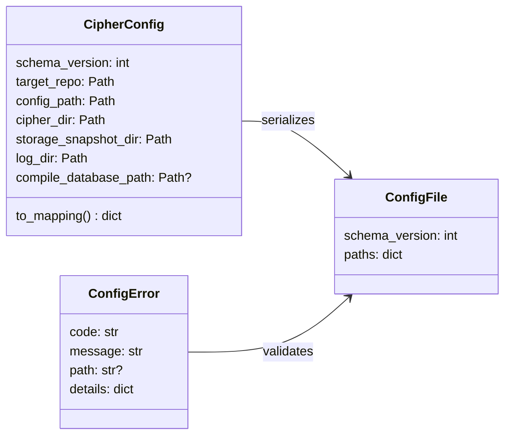
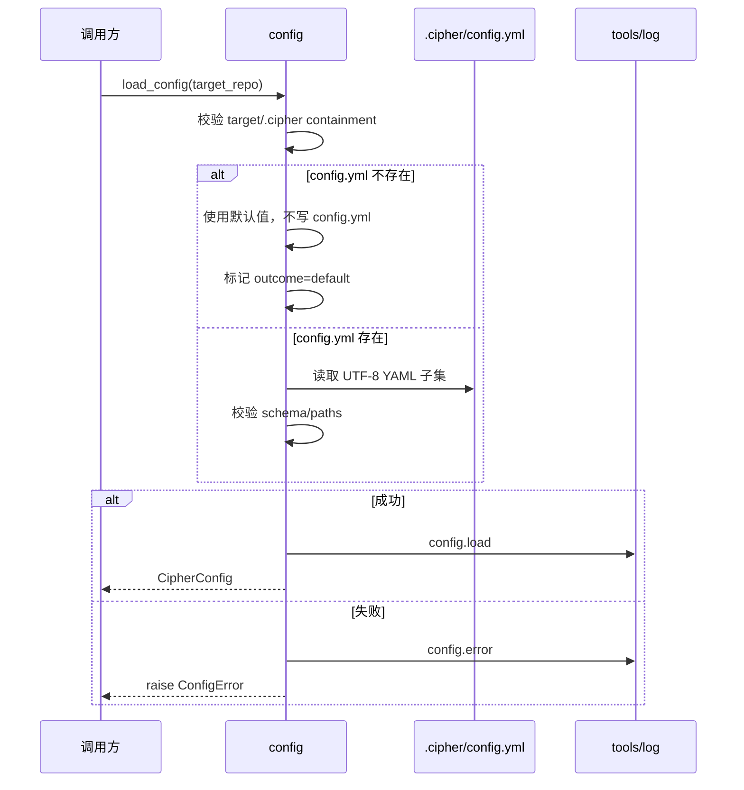
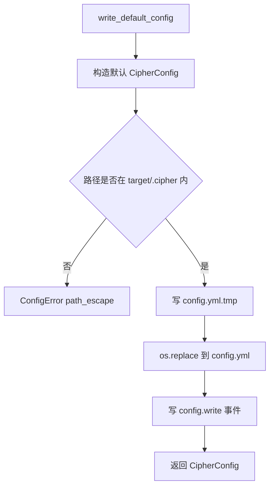
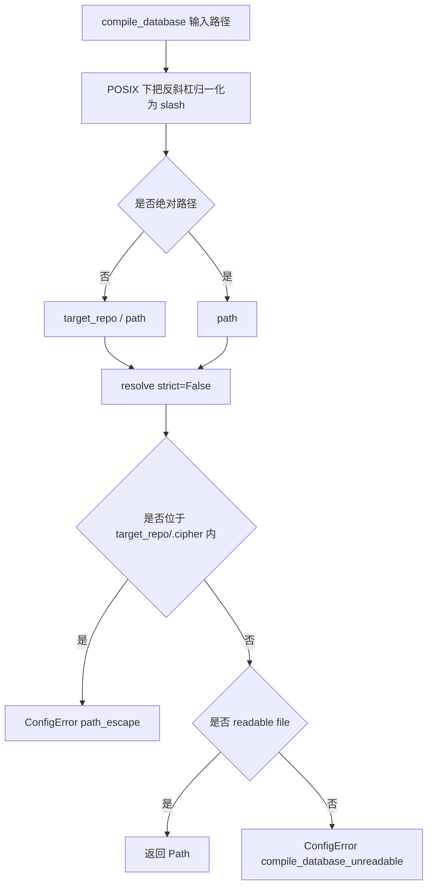
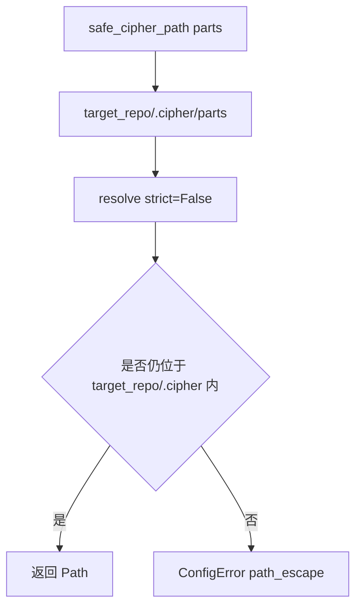

# config 运行时设计草稿

## 状态

- 日期：2026-05-26
- 状态：草稿，等待设计 PR 合入
- 范围：`config` 第一版运行时功能，以及配套 `tools/log` 可观测手段、`tools/views` log view 呈现和测试门禁

## 模块定位

本功能属于 `src/cipher2/config/`。目标是提供仓库本地 `.cipher/config.yml` schema、配置文件读写、配置校验和路径归一化能力，让 initializer/extractor 能读取显式 compile database 路径，并让其他模块复用 `.cipher/` 安全路径 helper。

本模块不执行 initializer，不写 snapshot，不写 FACT，不提供 CLI，不修改用户 shell 或宿主机全局配置。所有生成产物路径约束都服务于 v1 FACT-only：生成产物只能落在目标仓库 `.cipher/` 内；compile database 是只读输入，可以位于仓库外，但必须是可读文件且不能指向目标仓库 `.cipher/` 内部产物。

## 规格约束

来自当前文档的约束：

- 配置文件只允许位于 `<target-repo>/.cipher/config.yml`。
- config API 必须让其他模块难以把生成文件写到 `.cipher/` 之外。
- 配置测试必须覆盖默认值、非法路径、仓库迁移、显式 compile database 路径和路径归一化。
- v1 只支持本地 stdio MCP、FACT-only storage 和 `tools/views` view model，不引入 HTTP MCP、Graph runtime、Concept/Git 抽取或第三方依赖。
- 所有项目文档使用中文；实现 PR 前必须同步测试命令和性能门禁。
- 已合入模块 README 明确把 `log_enabled`、`top_n`、`limit`、`budget` 和 profile 类行为作为 Python API 参数处理，不写入 `.cipher/config.yml`；本草稿不得提升这些字段为持久配置。

### 用户可配配置项

本功能新增 1 个用户可配持久配置项，位于 `.cipher/config.yml`。`schema_version` 是兼容字段，不是用户可调行为配置。

| 配置项 | type | 取值范围 | 默认值 | 作用 | 生效时机 | 非法值处理 |
|---|---|---|---|---|---|---|
| `paths.compile_database` | `str | null` | `null` 或解析后为可读普通文件的路径；相对路径按目标仓库解析，绝对路径允许位于仓库外；目标仓库 `.cipher/` 内路径不允许；v1 主要承诺 POSIX 行为，Windows 由 `pathlib` best-effort 处理 | `null` | 给代码抽取器定位 compile database 只读输入 | `load_config` 后由 initializer/extractor 读取 | `ConfigError(code="path_escape")`、`compile_database_unreadable` 或 `invalid_config` |

`defaults.*` 不进入本阶段 config 设计。若后续要把其他模块 API 参数提升为持久默认值，必须先通过独立设计 PR 修订对应模块 README。

## 数据结构



### `CipherConfig` 成员表

| 成员名称 | type | 作用 | 并发粒度 |
|---|---|---|---|
| `schema_version` | `int` | 当前固定为 `1` | 配置快照级、只读共享 |
| `target_repo` | `Path` | 目标仓库根目录 | 只读共享 |
| `config_path` | `Path` | `<target-repo>/.cipher/config.yml` | 文件级 |
| `cipher_dir` | `Path` | `<target-repo>/.cipher/` | 目录级 |
| `storage_snapshot_dir` | `Path` | storage snapshot 根目录 | 目录级 |
| `log_dir` | `Path` | tools/log 根目录 | 目录级 |
| `compile_database_path` | `Path | None` | 归一化后的 compile database 只读输入路径 | 配置快照级 |

### `ConfigError` 成员表

| 成员名称 | type | 作用 | 并发粒度 |
|---|---|---|---|
| `code` | `str` | 结构化错误码 | 异常实例级 |
| `message` | `str` | 短错误说明，不包含 traceback | 异常实例级 |
| `path` | `str | None` | 相关路径；生成产物路径必须位于 `.cipher/`，compile database 可为仓库外只读输入 | 文件级 |
| `details` | `dict[str, JSONValue]` | 补充上下文，不包含源码 dump 或 secret | 异常实例级 |

### 文件 schema

```yaml
schema_version: 1
paths:
  compile_database: build/compile_commands.json
```

配置文件优先保存仓库相对路径；绝对 compile database 路径允许用于仓库外 build 目录。仓库迁移后，`load_config(new_target_repo)` 必须按新的 target root 重新解析相对路径；绝对路径保持不变并重新执行可读性校验。

## 对外接口流程

计划导出：

```python
load_config(target_repo: Path, *, overrides: dict | None = None, observe: bool = True) -> CipherConfig
write_default_config(target_repo: Path, *, compile_database: str | Path | None = None, observe: bool = True) -> CipherConfig
normalize_compile_database_path(target_repo: Path, value: str | Path) -> Path
safe_cipher_path(target_repo: Path, *parts: str) -> Path
```

### 加载流程



### 写入流程



### compile database 路径归一化



### 生成产物安全路径



## 并发控制

- `load_config` 不写 `config.yml`，不持有跨调用可变状态；`observe=True` 时可通过 `tools/log` 写 `config.load`，缺省配置路径使用 `outcome="default"`。
- `write_default_config` 写入 `.cipher/config.yml.tmp` 后用 `os.replace` 原子替换同目录 `config.yml`；tmp 与目标文件位于同一 `.cipher/` 目录，不跨文件系统。
- 不引入文件锁；并发写入时最后一次 `os.replace` 生效。v1 initializer 应只在显式初始化时写默认配置。
- log 写入失败不得影响配置加载或写入成功路径。
- `.cipher` 本身若是逃逸 symlink，`safe_cipher_path` 必须返回 `ConfigError(code="path_escape")`。

## 文档递归更新

设计通过后，README 搬迁路径：

1. `src/cipher2/config/README.md`：搬迁 schema、API、路径安全、错误码、可观测性和测试门禁。
2. `tests/README.md`：增加 config 测试矩阵和性能门禁命令。
3. `scripts/README.md`：记录 config 性能脚本。
4. `CONTRIBUTING.md`：记录 config 实现 PR 需要运行的显式性能门禁。
5. `src/cipher2/README.md`、`src/README.md`、`README.md`：如运行时边界或命令变化需要，递归补充 config 作为默认配置来源。

## 可观测性与呈现

config 写入 `config.jsonl`：

- `config.load`：成功加载或默认化配置；缺少 `config.yml` 时仍写事件，`outcome="default"`。
- `config.write`：成功写入默认配置。
- `config.error`：schema、路径或取值校验失败。

公共统计字段：

- `operation`
- `outcome`
- `has_compile_database`
- `compile_database_scope`
- `config_exists`
- `error_code`

`tools/views` 不新增 config section，也不新增 config view model；config 事件复用 log view 呈现，至少能在 channel 分布、top_event_names、recent_events 和 error_codes 中看到 config 状态。任何事件都不得写入绝对 target path、compile database 绝对路径、源码内容、环境变量或 secret。

## 可观测用例看护

专门测试必须覆盖：

- `write_default_config` 写入 `config.write`，且事件不包含绝对仓库路径。
- `load_config` 写入 `config.load`，并暴露 `has_compile_database`、`compile_database_scope` 和 `outcome`。
- 缺失 `config.yml` 时写 `config.load outcome=default`。
- 非法配置写入 `config.error`，错误码稳定。
- config 事件能通过 `tools/views` 的 log view 呈现。
- log 写入失败不影响 config 主流程。
- path escape 不泄漏 traceback。

## 测试与门禁计划

TDD 首批失败测试：

- `tests/test_config_defaults.py`
- `tests/test_config_file.py`
- `tests/test_config_path_safety.py`
- `tests/test_config_observability.py`
- `tests/test_config_performance.py`
- `tests/test_config_coverage_matrix.py`

必须覆盖：

- 默认值、`observe=False` 时不创建 `.cipher/`、config path 派生。
- `.cipher/config.yml` schema、读写、schema version、非法 scalar。
- 显式 compile database、仓库迁移、POSIX `\` 路径归一化、仓库外 build 目录 compile database。
- 生成产物 parent path escape、symlink escape、`.cipher` symlink escape、compile database 指向 `.cipher/`、compile database 不可读。
- `config.load`、`config.write`、`config.error` 可观测事件和 log view 可见性。

异常分支覆盖率目标 100%，最低不得低于 90%。异常分支包括 unsupported schema、invalid config scalar、path escape、`.cipher` symlink escape、非字符串路径、空路径、compile database unreadable、compile database under `.cipher/`、malformed YAML 子集和 log write failure。

场景用例覆盖率必须达到 100%，覆盖 config 缺失、config 存在、overrides、显式 compile database、仓库外 compile database、迁移后重新解析、observe true/false、成功 load/write、失败 load/write。

三档性能与小型化看护：

- 小：1,000 次配置加载，峰值内存上限 5MB，wall-clock < 2s。
- 中：100,000 次配置加载，峰值内存上限 40MB，wall-clock < 30s。
- 大：1,000,000 次配置加载，峰值内存上限 80MB，wall-clock < 300s。

当前第一版全量命令：

```bash
PYTHONPATH=src python3 -m unittest discover -s tests
PYTHONPATH=src python3 scripts/config_performance_gate.py
```
