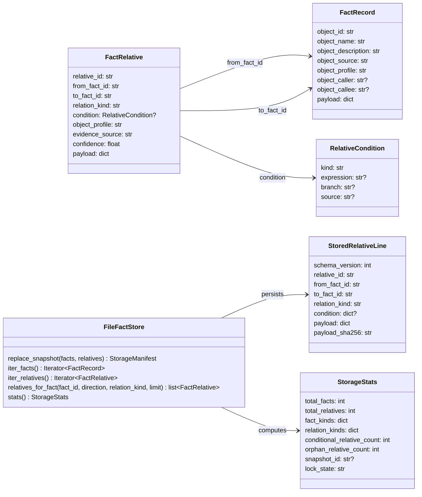
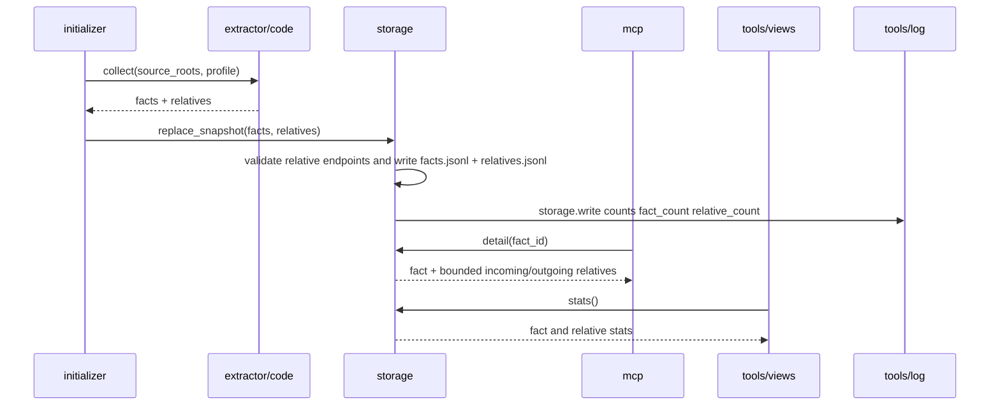
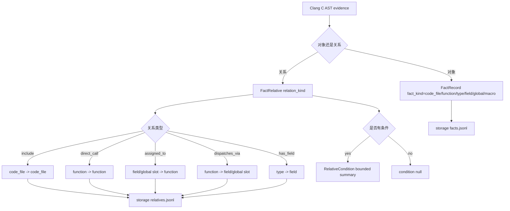
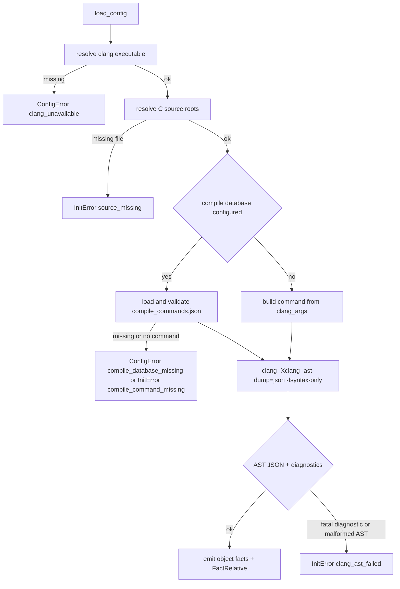
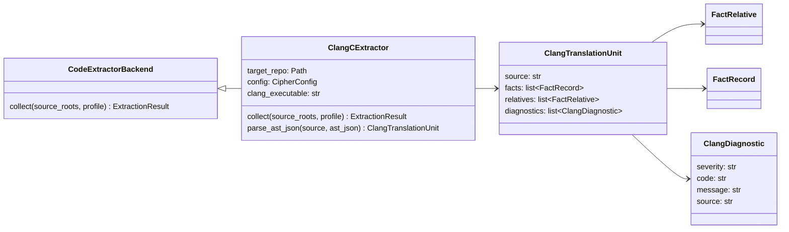

# FACT_RELATIVE 运行时关系层设计草稿

## 模块定位

本功能把当前运行时从单纯 FACT snapshot 扩展为 `TheFact + FactRelative` snapshot，并为 C 语言目标仓库新增 Clang AST-backed code extractor。目标是把 include、direct call、函数指针赋值、间接 dispatch、类型包含等关系从对象事实中拆出来，作为 fact 之间的有向关系边持久化和查询，同时用 Clang AST 提升 C 代码事实和关系的准确性。

影响模块：

- `src/cipher2/storage/`：新增 relative 物理文件、数据结构、读写 API、stats 和损坏检测。
- `src/cipher2/storage/schema/`：新增 `relatives.jsonl` 和 schema version 兼容说明。
- `src/cipher2/initializer/` 与 `initializer/extractor/code/`：C 代码抽取固定使用 Clang AST backend，同时产出对象 facts 与 relatives。
- `src/cipher2/mcp/`：新增或扩展关系查询表面，detail 展示 bounded relation preview。
- `src/cipher2/tools/log/`：为 relation 写入、读取、查询增加可观测字段。
- `src/cipher2/tools/views/`：展示 relation 总量、relation_kind 分布、异常和热点查询统计。
- `README.md`、`docs/README.md`、`docs/user-guide.md`、`docs/maintenance-guide.md`、`tests/README.md`：递归更新运行时边界、用户入口和门禁。

## 规格与约束

本功能新增用户可配持久配置项，位于 `.cipher/config.yml`。新增配置只影响 Clang invocation，不影响 storage、MCP、tools/log 或 tools/views 的持久默认值。C 场景不提供 backend 选择项，也不允许启用 lightweight parser。

| 参数/配置 | type | 取值范围 | 默认值 | 作用 | 生效时机 | 非法值处理 |
|---|---|---|---|---|---|---|
| `paths.compile_database` | `str or null` | 继承 config README；非空时文件必须存在且可读 | `null` | Clang compile database 只读输入 | initializer 加载配置时 | `ConfigError(compile_database_missing/invalid_config)` |
| `extractor.code.clang_executable` | `str or null` | `null` 或可执行文件路径/命令名；不得位于目标仓库 `.cipher/` 内 | `null` | 指定 Clang 可执行文件；`null` 表示从 `PATH` 查找 `clang` | Clang backend 初始化时 | `ConfigError(clang_unavailable)` |
| `extractor.code.clang_args` | `list[str]` | JSON list，元素为不含 NUL 的字符串；不得包含输出重定向语义 | `[]` | 附加只读 Clang 参数，例如 `-DNAME=1`、`-Iinclude` | Clang invocation 构建时 | `ConfigError(invalid_config)` |
| `source_roots` | `list[str or Path] or None` | 目标仓库内文件或目录 | `None` | 限定 facts 与 relatives 的抽取范围 | initializer 调用时 | `InitError(path_escape/invalid_source_root)` |
| `profile` | `str or None` | 非空字符串 | `"default"` | 写入 facts 和 relatives 的 profile | initializer 调用时 | `InitError(invalid_profile)` |

运行时范围调整：

- 允许创建 `FactRelative` 运行时对象和 `.cipher/snapshots/<id>/relatives.jsonl`。
- 仍不创建 `TheGraph`、`GRAPH_RELATIVE`、`GRAPH_DERIVED_FROM`、Graph container、Graph traversal、impact 或 HTTP MCP。
- C 代码抽取只允许使用 Clang AST；lightweight parser 不得在 C 场景作为 fallback、兼容模式或隐式降级路径启用。
- Clang 不存在、配置的 compile database 缺失、source root 缺失、compile command 引用文件缺失或 Clang fatal diagnostic 都必须显式失败，不得静默跳过或降级。
- `fact_kind` 只表达对象事实类型，例如 `code_file`、`function`、`type`、`field`、`global`、`macro`、`diagnostic`。
- `relation_kind` 表达边语义，例如 `include`、`defines`、`declares`、`has_field`、`direct_call`、`assigned_to`、`dispatches_via`。
- include 不是 `fact_kind`；它是 `code_file -> code_file` 的 `FactRelative(relation_kind="include")`。
- 函数指针赋值不是 `fact_kind`；它是 `field/global/function_pointer_slot -> function` 的 `FactRelative(relation_kind="assigned_to")`。
- direct call 不是 `fact_kind`；它是 `function -> function` 的 `FactRelative(relation_kind="direct_call")`。
- dispatch 不是 `fact_kind`；它是 `function -> field/global/function_pointer_slot` 的 `FactRelative(relation_kind="dispatches_via")`。
- 条件赋值、条件调用和 switch/case 分支不得创建 `if`、`case` 或 assignment 对象 fact；条件必须写入 `FactRelative.condition`，表达该关系成立的静态条件摘要。
- `FactRelative` 的 `from_fact_id` 和 `to_fact_id` 必须引用同一 snapshot 内存在的 `FactRecord.object_id`。
- `FactRelative.condition` 为 `null` 时表示无条件关系或 extractor 无法给出稳定条件；非 `null` 时只表达 bounded static guard，不承诺路径可达性、SAT 求解或跨函数条件传播。
- `evidence_source` 必须使用 `<rel_path>:<line_number>` 或稳定非路径 provenance；不得写绝对路径、源码正文、traceback、secret 或 provider internals。
- 单条 condition canonical JSON 上限为 1KB；`expression` 只能保存短表达式摘要，不得保存完整源码块。
- 单条 relative payload canonical JSON 上限为 2KB；大型 AST、宏展开、token dump 必须拆分或摘要化。
- 新写 snapshot 使用 schema version `2`；reader 必须继续支持 schema version `1` facts-only snapshot，并把 relative_count 视为 `0`。

## 数据结构



### `FactRelative` 成员表

| 成员名称 | type | 作用 | 并发粒度 |
|---|---|---|---|
| `relative_id` | `str` | snapshot 内唯一关系 ID，内容寻址或稳定构造 | relative 级、只读共享 |
| `from_fact_id` | `str` | 有向边起点 fact id | relative 级、只读共享 |
| `to_fact_id` | `str` | 有向边终点 fact id | relative 级、只读共享 |
| `relation_kind` | `str` | 关系语义，例如 `include`、`direct_call`、`assigned_to` | relative 级、只读共享 |
| `condition` | `RelativeCondition or None` | 关系成立的条件摘要；无条件或未知时为 `None` | relative 级、只读共享 |
| `object_profile` | `str` | 生效 profile，必须与相关 fact profile 兼容 | relative 级、只读共享 |
| `evidence_source` | `str` | 关系证据来源位置或 provenance | relative 级、只读共享 |
| `confidence` | `float` | `0.0..1.0`，确定性 AST/direct relation 为 `1.0` | relative 级、只读共享 |
| `payload` | `dict[str, JSONValue]` | 扩展字段，必须小于 2KB，不含源码正文 | relative 级、只读共享 |

### `RelativeCondition` 成员表

| 成员名称 | type | 作用 | 并发粒度 |
|---|---|---|---|
| `kind` | `str` | 条件类型，允许 `branch`、`case`、`loop_guard`、`compile_guard`、`unknown` | condition 级、只读共享 |
| `expression` | `str or None` | 短条件摘要，例如 `a`、`mode == READ`、`CONFIG_X` | condition 级、只读共享 |
| `branch` | `str or None` | 分支标签，例如 `then`、`else`、`case 1`、`default` | condition 级、只读共享 |
| `source` | `str or None` | 条件本身的仓库相对位置或稳定 provenance | condition 级、只读共享 |

### `StoredRelativeLine` 成员表

| 成员名称 | type | 作用 | 并发粒度 |
|---|---|---|---|
| `schema_version` | `int` | 固定为 `2`；reader 只对 relatives 接受 v2 | 行级、只读共享 |
| `relative_id` | `str` | 与 `FactRelative.relative_id` 一致 | 行级、只读共享 |
| `from_fact_id` | `str` | 起点 fact id，必须存在 | 行级、只读共享 |
| `to_fact_id` | `str` | 终点 fact id，必须存在 | 行级、只读共享 |
| `relation_kind` | `str` | relation_kind 统计字段 | 行级、只读共享 |
| `condition` | `dict or None` | `FactRelative.condition` 的 canonical JSON 表示 | 行级、只读共享 |
| `payload` | `dict[str, JSONValue]` | `FactRelative` 完整 JSON 表示 | 行级、只读共享 |
| `payload_sha256` | `str` | 单条 relative payload 摘要 | 行级、只读共享 |

### `StorageStats` 新增成员表

| 成员名称 | type | 作用 | 并发粒度 |
|---|---|---|---|
| `total_relatives` | `int` | 当前 snapshot 关系边数量 | snapshot 级、只读共享 |
| `relation_kinds` | `dict[str, int]` | relation_kind 分布 | snapshot 级、只读共享 |
| `conditional_relative_count` | `int` | `condition` 非空的关系边数量 | snapshot 级、只读共享 |
| `orphan_relative_count` | `int` | 损坏检测时发现的悬空边数量；正常为 `0` | snapshot 级、只读共享 |

## 对外接口流程





MCP 表面调整：

- `search` 仍搜索 facts，不直接返回 raw relatives。
- `detail` 增加 bounded `relative_preview`，包含 incoming/outgoing relation_kind 计数和最多 `budget` 限定的 `RelativeSummary`。
- `relations` 不作为 MCP public tool 暴露；完整 incoming/outgoing/both 查询保留为 storage 内部审计接口。
- `structuredContent.relative_preview` 包含稳定字段，`RelativeSummary.condition` 直接来自 `FactRelative.condition`。

条件关系示例：

```c
if (a) {
    ops.read = my_read_a;
} else {
    ops.read = my_read_b;
}
```

抽取结果必须是同一槽位到两个候选函数的两条关系边：

```text
from: fact(function_pointer_slot: ops.read)
to: fact(function: my_read_a)
relation_kind: assigned_to
condition: {kind: "branch", expression: "a", branch: "then", source: "src/file.c:1"}

from: fact(function_pointer_slot: ops.read)
to: fact(function: my_read_b)
relation_kind: assigned_to
condition: {kind: "branch", expression: "a", branch: "else", source: "src/file.c:1"}
```

## 物理布局

```text
<target-repo>/.cipher/
  snapshots/
    current
    sha256-<content-prefix>/
      facts.jsonl
      relatives.jsonl
      manifest.json
      stats.json
```

schema 兼容：

- v1 snapshot：没有 `relatives.jsonl`，manifest schema version 为 `1`，读取时返回空 relatives。
- v2 snapshot：必须有 `relatives.jsonl`，manifest schema version 为 `2`，`stats.total_relatives` 与 `stats.relation_kinds` 必须存在。
- v2 snapshot 的 `snapshot_id` 由 canonical `facts.jsonl + relatives.jsonl` 共同计算。
- `replace_facts(facts)` 作为兼容 API 保留，等价于 `replace_snapshot(facts, [])`。

## Clang AST backend

Clang backend 是 C 语言目标仓库的唯一代码抽取路径。C 文件、C header 和从 compile database 进入的 translation unit 不允许使用 lightweight parser；Clang 不可用、输入缺失或 AST 生成失败时必须 fail closed。C++ 文件不进入本阶段高保真抽取范围，遇到 C++ source root 返回 `InitError(code="unsupported_language_for_clang_backend")`。





### `ClangCExtractor` 成员表

| 成员名称 | type | 作用 | 并发粒度 |
|---|---|---|---|
| `target_repo` | `Path` | 被分析仓库根目录 | 只读共享 |
| `config` | `CipherConfig` | 配置快照，含 clang executable、clang args、compile database | 配置快照级 |
| `clang_executable` | `str` | 实际调用的 clang 命令或路径 | extractor 实例级 |

### `ClangTranslationUnit` 成员表

| 成员名称 | type | 作用 | 并发粒度 |
|---|---|---|---|
| `source` | `str` | 仓库相对源文件路径 | translation unit 级 |
| `facts` | `list[FactRecord]` | 本 TU 产出的对象 facts | translation unit 级 |
| `relatives` | `list[FactRelative]` | 本 TU 产出的关系边 | translation unit 级 |
| `diagnostics` | `list[ClangDiagnostic]` | 本 TU 诊断摘要，不含源码正文 | translation unit 级 |

### `ClangDiagnostic` 成员表

| 成员名称 | type | 作用 | 并发粒度 |
|---|---|---|---|
| `severity` | `str` | Clang 诊断级别摘要，例如 `warning`、`error`、`fatal` | diagnostic 级 |
| `code` | `str` | 稳定错误码，例如 `clang_ast_failed` | diagnostic 级 |
| `message` | `str` | 去路径化、去源码正文后的短消息 | diagnostic 级 |
| `source` | `str` | 仓库相对源文件路径或稳定 provenance | diagnostic 级 |

Clang invocation 规则：

- 优先使用 `compile_commands.json` 中匹配 source 的 command/arguments，并追加 `-Xclang -ast-dump=json -fsyntax-only`。
- 没有配置 compile database 时，使用 `clang_executable + clang_args + source + -Xclang -ast-dump=json -fsyntax-only`；这仍然是 Clang 路径，不是 lightweight fallback。
- 配置了 compile database 但文件不存在、不可读、JSON 非法、source 没有匹配 command，必须失败。
- source root、translation unit、compile command 中的主源文件必须存在；Clang 报告 header 缺失或输入文件缺失时必须失败。
- invocation 不允许写目标仓库 `.cipher/` 外的产物；禁止 `-o` 产生输出文件。
- stdout 只读取 AST JSON；stderr 只摘要为 diagnostics，不写入 raw stderr。
- AST JSON 只在内存中流转，不持久化 raw AST。

Clang 产物映射：

| Clang 来源 | FactRecord | FactRelative |
|---|---|---|
| source file | `fact_kind=code_file` | 无 |
| include directive / preprocessor include trace | `code_file` for included file if in repo | `from code_file -> to code_file, relation_kind=include` |
| `FunctionDecl` definition | `fact_kind=function` | `code_file -> function, relation_kind=defines` |
| `FunctionDecl` declaration | `fact_kind=function` with `payload.declaration_role=declaration` | `code_file -> function, relation_kind=declares` |
| `VarDecl` file-scope | `fact_kind=global` | `code_file -> global, relation_kind=defines` |
| `RecordDecl` / `EnumDecl` / `TypedefDecl` | `fact_kind=type` | `code_file -> type, relation_kind=defines` |
| struct/union field | `fact_kind=field` | `type -> field, relation_kind=has_field` |
| `CallExpr` with resolved callee | no call object fact | `function -> function, relation_kind=direct_call` |
| designated initializer assigning function pointer field | no assignment object fact | `field/global slot -> function, relation_kind=assigned_to`，必要时带 `condition` |
| conditional assignment to function pointer field/slot | no assignment object fact | 每个候选目标各一条 `assigned_to`，`condition.kind=branch/case` |
| indirect call through function pointer field/slot | no dispatch object fact | `function -> field/global slot, relation_kind=dispatches_via`，必要时带 `condition` |
| fatal or non-fatal diagnostic | `fact_kind=diagnostic` if useful | no relation unless source fact exists |

Clang condition 映射：

- `IfStmt` 的 then/else 分支写 `condition.kind=branch`，`branch=then|else`。
- `SwitchStmt` 的 case/default 分支写 `condition.kind=case`，`branch=case <value>|default`。
- 循环条件下直接发生的关系写 `condition.kind=loop_guard`。
- 预处理条件只允许写 `condition.kind=compile_guard` 的摘要；不保存宏展开正文。
- extractor 无法稳定归因时写 `condition=null`，不能编造条件。

Clang payload 预算：

- `clang_usr`
- `ast_kind`
- `spelling`
- `display_name`
- `type_spelling`
- `canonical_type`
- `declaration_role`
- `storage_class`
- `linkage`
- `source_range`
- `diagnostic_severity`

字段均为摘要，不存 raw AST subtree。

## 并发控制

- facts 与 relatives 仍由 storage 单写锁 `.cipher/run/storage.lock/` 保护。
- 写入 staging 时同时生成 `facts.jsonl`、`relatives.jsonl`、`manifest.json`、`stats.json`；current pointer 只在全部校验完成后 `os.replace`。
- reader 每次打开当前 snapshot，facts 与 relatives 来自同一个 snapshot id，不跨 snapshot 混读。
- `relatives_for_fact` 只读当前 snapshot，不获取写锁。
- read index cache 需要同时区分 snapshot id 与 relatives index；不得把 v1 空 relatives 缓存误用于 v2 snapshot。
- log 写失败不影响 storage 写入或 MCP 查询；只增加可观测错误计数。

## 可观测性与 views 呈现

新增或扩展事件：

- `initializer.run`：counts 增加 `relative_count`。
- `extractor.code.file`：counts 增加 `relative_count`、`conditional_relative_count`；payload 增加 `backend=clang`、`relation_kind_count`、`condition_kind_count` 的有界摘要。
- `extractor.code.clang`：记录 `outcome=selected|unavailable|failed`；不得出现 `fallback` outcome。
- `extractor.code.diagnostic`：记录 Clang 诊断摘要；不得包含源码正文、raw stderr 或绝对路径。
- `storage.write`：counts 增加 `relative_count`、`conditional_relative_count`、`relation_kind_count`。
- `storage.read`：payload 增加 `snapshot_schema_version`。
- `storage.error`：新增 `orphan_relative`、`relative_payload_too_large`、`relative_condition_too_large`、`duplicate_relative_id`、`relative_endpoint_missing`。
`tools/views` 展示：

- storage section 增加 `total_relatives`、`relation_kinds`、`conditional_relative_count`、`orphan_relative_count`。
- log section 通过已有 `recent_events` / `top_event_names` 展示 `mcp.detail`、`storage.relations`、`storage.write` 中的 `count.relative_count`。
- relation drilldown 展示 `condition` 摘要；同一槽位的多候选 `assigned_to` 必须能看出 then/else 或 case/default 差异。
- overview 状态规则：`orphan_relative_count > 0` 为 `error`；旧 v1 snapshot 且无 relatives 为 `ready`，不是 warning。

可观测用例看护：

- 正常写入 facts + relatives 后，views 展示 `total_relatives` 与 `relation_kinds`。
- 条件函数指针赋值写入后，views 展示 `conditional_relative_count`，并能区分 then/else 两条 `assigned_to`。
- v1 旧 snapshot 读取时 `total_relatives=0`，views `ready`。
- endpoint missing、duplicate relative id、payload too large 写 `storage.error` 且不泄漏绝对路径或源码。
- condition too large 写 `storage.error(relative_condition_too_large)`，不泄漏完整源码块。
- `relations` 作为 MCP tool 调用时返回 `unknown_tool`；完整关系查询只通过 storage 内部审计接口写 `storage.relations`。
- log 写失败不破坏 snapshot 或 MCP response。
- Clang 不可用时，views 能看到 `clang_unavailable` 错误，且不会出现 lightweight fallback 事件。
- compile database、source root 或 include 文件缺失时，views 能看到对应错误码，且不会出现部分成功的静默抽取结果。
- Clang 失败时，views 能看到 `clang_ast_failed` 错误。

## 测试与门禁

设计合入后，README 搬迁 PR 必须更新：

- `README.md`
- `docs/README.md`
- `docs/user-guide.md`
- `docs/maintenance-guide.md`
- `src/README.md`
- `src/cipher2/README.md`
- `src/cipher2/storage/README.md`
- `src/cipher2/storage/schema/README.md`
- `src/cipher2/initializer/README.md`
- `src/cipher2/initializer/extractor/README.md`
- `src/cipher2/initializer/extractor/code/README.md`
- `src/cipher2/mcp/README.md`
- `src/cipher2/tools/log/README.md`
- `src/cipher2/tools/views/README.md`
- `tests/README.md`
- `scripts/README.md`

实现 PR 的 TDD 测试文件：

- `tests/test_storage_relative_record.py`
- `tests/test_storage_relative_store.py`
- `tests/test_storage_relative_compat.py`
- `tests/test_initializer_relatives.py`
- `tests/test_initializer_clang_backend.py`
- `tests/test_initializer_clang_fail_closed.py`
- `tests/test_initializer_clang_conditions.py`
- `tests/test_mcp_relations.py`
- `tests/test_views_relatives.py`
- `tests/test_fact_relative_coverage_matrix.py`

覆盖要求：

- 功能点 100%：relative 校验、写入、读取、endpoint 校验、condition 校验、v1 兼容、stats、MCP relations 非公开约束、detail preview、views 展示、Clang AST 映射、condition 映射、fail-closed 错误语义。
- 异常分支 90%+，目标 100%：invalid relative id、invalid endpoint、missing endpoint、duplicate relative id、invalid relation kind、invalid condition kind、condition not JSON、condition too large、payload not JSON、payload too large、snapshot schema mismatch、missing relatives file、malformed relatives line、clang unavailable、clang AST malformed、clang diagnostic fatal、compile database missing、compile command missing、source missing、header missing、compile command unsafe、log write failure。
- 场景 100%：empty relatives、include、direct_call、assigned_to、conditional assigned_to then/else、switch/case assigned_to、dispatches_via、conditional dispatches_via、has_field、多 profile、旧 v1 snapshot、新 v2 snapshot、Clang available/unavailable、compile database present/missing、source present/missing、header present/missing、log enabled/disabled、MCP relations unknown_tool、storage direction incoming/outgoing/both。

性能与小型化：

- 小：1,000 facts / 2,000 relatives，峰值内存 < 16MB，wall-clock < 5s。
- 中：100,000 facts / 200,000 relatives，峰值内存 < 160MB，wall-clock < 180s。
- 大：1,000,000 facts / 2,000,000 relatives，峰值内存 < 768MB，wall-clock < 1,200s。

权威脚本新增或扩展：

```bash
PYTHONPATH=src python3 scripts/storage_relative_performance_gate.py
PYTHONPATH=src python3 scripts/mcp_relative_performance_gate.py
PYTHONPATH=src python3 scripts/clang_extractor_performance_gate.py
PYTHONPATH=src python3 -m unittest discover -s tests
```

## 非目标

- 不实现 `TheGraph`。
- 不实现 `GRAPH_RELATIVE`。
- 不实现 `GRAPH_DERIVED_FROM`。
- 不实现 `impact`。
- 不引入 Kuzu、Neo4j、Memgraph、embedding 或 HTTP MCP。
- 不承诺 C++ Clang AST 高保真抽取；本阶段 Clang backend 只面向 C 语言。
- 不在 C 场景启用 lightweight parser；Clang 失败时不得降级。
- 不持久化 raw AST、raw stderr、完整宏展开正文或源码正文。
