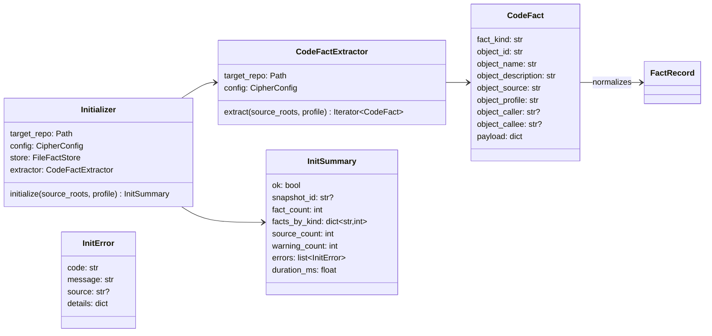
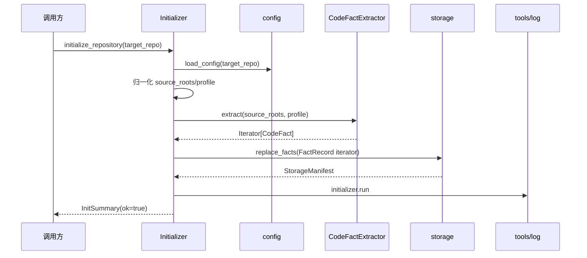
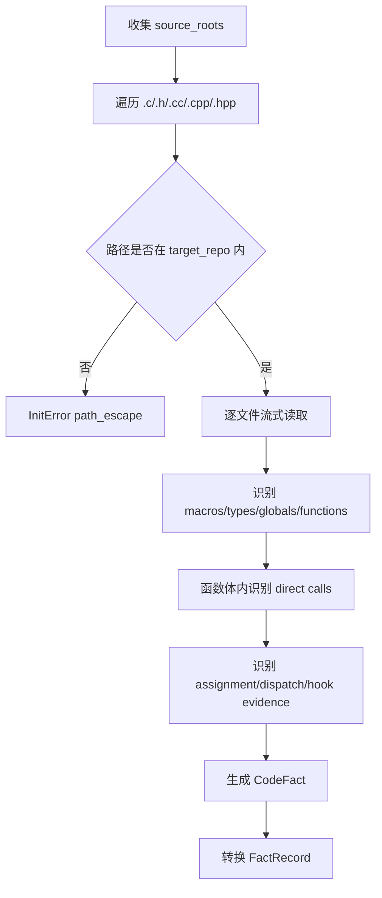

# initializer/code 运行时设计草稿

## 状态

- 日期：2026-05-26
- 状态：草稿，准备提交设计 PR
- 范围：initializer 编排、v1 代码事实抽取器、FACT 写入、配套 `tools/log` 可观测和 `tools/views` 呈现

## 模块定位

本功能属于 `src/cipher2/initializer/` 与 `src/cipher2/initializer/extractor/code/`。目标是实现 `cipher2 init` 的运行时核心：读取 config 中的 compile database 路径，运行 v1 code facts extractor，把 `FactRecord` 写入 storage，并返回初始化摘要。

v1 只抽取代码 facts，不抽取文档、Concept 或 git，不创建 Graph object，不创建 `FACT_RELATIVE`、`GRAPH_RELATIVE`、`GRAPH_DERIVED_FROM`，不执行 MCP 请求，不渲染 TUI。Clang 可作为未来实现细节；本阶段运行时先实现标准库可执行的轻量 C 事实抽取能力，覆盖函数、globals、types、macros、direct call、assignment/dispatch 和 hook evidence 的稳定 FACT 形态，确保端到端 FACT-only 流程可跑通。CLI 入口另由后续 `cli-init` 设计 PR 处理，本阶段只实现 Python API 和运行时核心。

## 规格约束

来自当前文档的约束：

- `README.md`：v1 是 FACT-only 代码分析；目标仓库输出必须位于 `<repo>/.cipher/`；v1 不实现 Concept、文档或 git 事实抽取，不实现 Graph object、`FACT_RELATIVE`、`GRAPH_RELATIVE` 或 `GRAPH_DERIVED_FROM` 运行时行为。
- `CONTRIBUTING.md`：所有项目文档使用中文；功能开发必须从被改动模块开始递归更新相关文档；实现 PR 前必须记录权威测试命令并通过适用性能门禁。
- `src/cipher2/initializer/README.md`：initializer 负责仓库初始化、事实抽取器调用、阶段状态和面向用户的初始化摘要；initializer 只能把输出写入目标仓库 `.cipher/`；所有抽取器都产出 FACT 记录，v1 中每条收集记录都是 fact。
- `src/cipher2/initializer/extractor/code/README.md`：code extractor 产出函数定义、globals、types、macros、直接调用、assignments、dispatches 和 hook evidence 等 facts；Clang 只是实现细节，不形成顶层架构层。
- `docs/schema.md`：`TheFact` 是统一事实收集目标，必需字段为 `object_id`、`object_name`、`object_description`、`object_source`、`object_profile`，可选字段为 `object_caller`、`object_callee`；`TheGraph`、`GRAPH_RELATIVE`、`GRAPH_DERIVED_FROM` 和 `FACT_RELATIVE` 是未来图投影语义，本阶段不得作为运行时产物创建。
- `CONTRIBUTING.md`：新功能必须增加 `tools/log` 可观测手段，并在 `tools/views` 中呈现核心统计信息；TDD 前必须先完成设计 PR 与 README 搬迁 PR。

### 用户可配配置项

本功能不新增新的用户可配持久配置项。

initializer 消费 config 已有配置：

- `paths.compile_database`：可选 compile database 路径。

初始化运行参数 `source_roots`、`profile`、`log_enabled` 是 Python API 参数，不写入 `.cipher/config.yml`，不属于新增持久配置。`profile` 缺省值由 initializer 模块常量提供，固定为 `"default"`；`log_enabled` 缺省为 `True`。

| 参数/配置 | type | 取值范围 | 默认值 | 作用 | 生效时机 | 非法值处理 |
|---|---|---|---|---|---|---|
| `paths.compile_database` | `str | null` | 继承 config README：`null` 或可读普通文件；不得位于目标仓库 `.cipher/` | `null` | 为代码抽取器提供只读 compile database 输入 | `initialize_repository` 调用 `load_config` 时 | 透传 `ConfigError` 并写 `initializer.error` |
| `source_roots` | `list[str | Path] | None` | `None` 或解析后位于目标仓库内的源码目录/文件 | `None` 表示扫描目标仓库 | 限定抽取输入范围 | `InitError(code="path_escape")` 或 `invalid_source_root` |
| `profile` | `str | None` | 非空字符串；建议 `default`、`debug`、`release` | `"default"` | 写入 `object_profile` | 单次初始化调用 | `InitError(code="invalid_profile")` |
| `log_enabled` | `bool | None` | `True`、`False` 或 `None` | `True` | 控制 initializer/extractor 是否写 `tools/log` 事件 | 单次初始化调用 | 非 bool 返回 `InitError(code="invalid_log_enabled")` |

## 数据结构



### `Initializer` 成员表

| 成员名称 | type | 作用 | 并发粒度 |
|---|---|---|---|
| `target_repo` | `Path` | 目标仓库根目录 | 只读共享 |
| `config` | `CipherConfig` | 配置快照 | 配置快照级 |
| `store` | `FileFactStore` | 写入 FACT snapshot | 对象级 |
| `extractor` | `CodeFactExtractor` | v1 code facts extractor | 对象级 |

### `CodeFactExtractor` 成员表

| 成员名称 | type | 作用 | 并发粒度 |
|---|---|---|---|
| `target_repo` | `Path` | 被分析仓库根目录 | 只读共享 |
| `config` | `CipherConfig` | compile database 只读输入路径 | 配置快照级 |

### `CodeFact` 成员表

| 成员名称 | type | 作用 | 并发粒度 |
|---|---|---|---|
| `fact_kind` | `str` | `function`、`global`、`type`、`macro`、`call`、`assignment`、`dispatch`、`hook` | fact 级 |
| `object_id` | `str` | 稳定 FACT id | fact 级 |
| `object_name` | `str` | 展示名 | fact 级 |
| `object_description` | `str` | 摘要 | fact 级 |
| `object_source` | `str` | 仓库相对路径和行号 | fact 级 |
| `object_profile` | `str` | profile | fact 级 |
| `object_caller` | `str | None` | 调用方或上游对象 | fact 级 |
| `object_callee` | `str | None` | 被调用方或下游对象 | fact 级 |
| `payload` | `dict[str, JSONValue]` | 扩展字段，必须小于 storage payload 限制 | fact 级 |

### `InitSummary` 成员表

| 成员名称 | type | 作用 | 并发粒度 |
|---|---|---|---|
| `ok` | `bool` | 初始化是否成功 | 响应实例级 |
| `snapshot_id` | `str | None` | 写入的 storage snapshot | 响应实例级 |
| `fact_count` | `int` | FACT 总数 | 响应实例级 |
| `facts_by_kind` | `dict[str, int]` | kind 分布 | 响应实例级 |
| `source_count` | `int` | 输入源码文件数量 | 响应实例级 |
| `warning_count` | `int` | 可恢复警告数 | 响应实例级 |
| `errors` | `list[InitError]` | 阻断错误 | 响应实例级 |
| `duration_ms` | `float` | 初始化耗时 | 响应实例级 |

### `InitError` 成员表

| 成员名称 | type | 作用 | 并发粒度 |
|---|---|---|---|
| `code` | `str` | 结构化错误码 | 错误实例级 |
| `message` | `str` | 短说明 | 错误实例级 |
| `source` | `str | None` | 相关源码路径 | 文件级 |
| `details` | `dict[str, JSONValue]` | 补充上下文，不含源码 dump | 错误实例级 |

## 对外接口流程

计划导出：

```python
initialize_repository(target_repo: Path, *, source_roots: list[str | Path] | None = None, profile: str | None = None, log_enabled: bool | None = None) -> InitSummary
CodeFactExtractor.extract(source_roots: list[Path], profile: str) -> Iterator[CodeFact]
CodeFact.to_fact_record() -> FactRecord
```

### 初始化流程



### 抽取流程



## 并发控制

- initializer 单次调用串行运行 extractor 和 storage 写入。
- extractor 逐文件流式读取，不保存完整仓库源码。
- storage 负责 snapshot 写入锁；initializer 不额外实现全局锁。
- log 写入失败不得破坏初始化主流程；错误进入 summary 或 log degradation 统计。
- 读 source 文件期间文件可能变化；v1 接受文件级快照一致性，不做跨文件事务。

## 文档递归更新

设计通过后，README 搬迁路径：

1. `src/cipher2/initializer/extractor/code/README.md`：搬迁 code fact 类型、抽取规则、限制和测试门禁。
2. `src/cipher2/initializer/extractor/README.md`：搬迁抽取器共享 FACT contract。
3. `src/cipher2/initializer/README.md`：搬迁初始化 API、summary、log 事件和 FACT-only 边界。
4. `tests/README.md`：增加 initializer/code 测试矩阵和性能门禁命令。
5. `tools/log/README.md`：若实现阶段需要扩展 `LogEventDigest.fields` payload allowlist，必须在 README 搬迁 PR 中先声明；本设计优先把核心统计写入 `counts`，避免为 initializer/code 新增 allowlist。
6. `tools/views/README.md`：不新增 initializer section；如 README 搬迁发现需要补充通用 log row 示例，必须在实现前完成。
7. `scripts/README.md`、`CONTRIBUTING.md`：新增 `initializer_performance_gate.py` 后记录命令。
8. `docs/README.md`：补充 initializer/code 相关模块 README 索引或运行时文档入口。
9. `README.md`、`src/README.md`、`src/cipher2/README.md`：递归补充 `cipher2 init -> extractor/code -> storage` 的运行时状态。

## 可观测性与呈现

initializer/code 写入 `initializer.jsonl`：

- `initializer.run`：初始化成功，`counts` 写 `fact_count`、`source_count`、`warning_count`，payload 写 `operation="initialize_repository"`、`outcome="written"`、`snapshot_id`、`profile`。
- `initializer.error`：配置、路径、抽取或 storage 失败，`status="error"`，顶层 `error_code` 为稳定错误码，payload 只写 `operation`、`outcome="failed"` 和必要的结构化错误上下文。
- `extractor.code.file`：单文件抽取摘要，`subject_id` 使用源文件相对路径 hash，`counts` 写 `fact_count`、`warning_count`，payload 写 `source_kind` 和 `profile`。
- `extractor.code.error`：单文件不可读或解析失败，`status="error"`，不写源码正文、绝对路径或 traceback。

`tools/views` 不新增 initializer section；这些事件通过 log view 呈现。核心统计通过 `events_by_channel["initializer"]`、`top_event_names`、`error_codes`、`recent_events`、`slow_events` 和 `LogEventRow.fields` 中的 `count.fact_count`、`count.source_count`、`count.warning_count` 展示。

## 可观测用例看护

专门测试必须覆盖：

- 成功 init 写 `initializer.run` 和 `extractor.code.file`。
- extractor 文件失败写 `extractor.code.error`，summary 中 warning/error 可见。
- storage 写失败或 lock busy 写 `initializer.error`。
- 事件不包含源码正文、绝对目标仓库路径或 raw payload。
- initializer 事件能通过 `tools/views` log view 呈现 `initializer.run`、`extractor.code.file`、错误码、耗时和 `count.*` 核心统计。
- log 写入失败不影响初始化主流程；summary 中必须能反映 log 降级。

## 测试与门禁计划

TDD 首批失败测试：

- `tests/test_initializer_api.py`
- `tests/test_code_extractor_fixtures.py`
- `tests/test_initializer_path_safety.py`
- `tests/test_initializer_observability.py`
- `tests/test_initializer_performance.py`
- `tests/test_initializer_coverage_matrix.py`

必须覆盖：

- 空仓库、单 C 文件、多源文件、include/header、macro、function/global/type。
- direct call、assignment、dispatch、hook evidence。
- compile database 存在/缺失/逃逸、source_roots 显式传入、profile 覆盖。
- initializer 写 storage、同内容幂等、storage error、path escape。
- FACT-only：不得创建 Graph、relation 或 HTTP MCP 产物。

异常分支覆盖率目标 100%，最低不得低于 90%。异常分支包括 invalid source root、path escape、unreadable file、malformed compile database、extractor parse failure、storage failure 和 log write failure。

场景用例覆盖率必须达到 100%，覆盖 empty、single file、multi file、header only、compile database、profile debug/release、log enabled/disabled、storage degraded。

三档性能与小型化看护：

- 小：512MB 运行环境预算，1,000 LOC，10 files，脚本峰值内存上限 64MB，wall-clock < 5s。
- 中：4G 运行环境预算，100,000 LOC，1,000 files，脚本峰值内存上限 512MB，wall-clock < 120s。
- 大：8G 运行环境预算，1,000,000 LOC，10,000 files，脚本峰值内存上限 2GB，wall-clock < 900s。

当前第一版全量命令：

```bash
PYTHONPATH=src python3 -m unittest discover -s tests
PYTHONPATH=src python3 scripts/initializer_performance_gate.py
```
