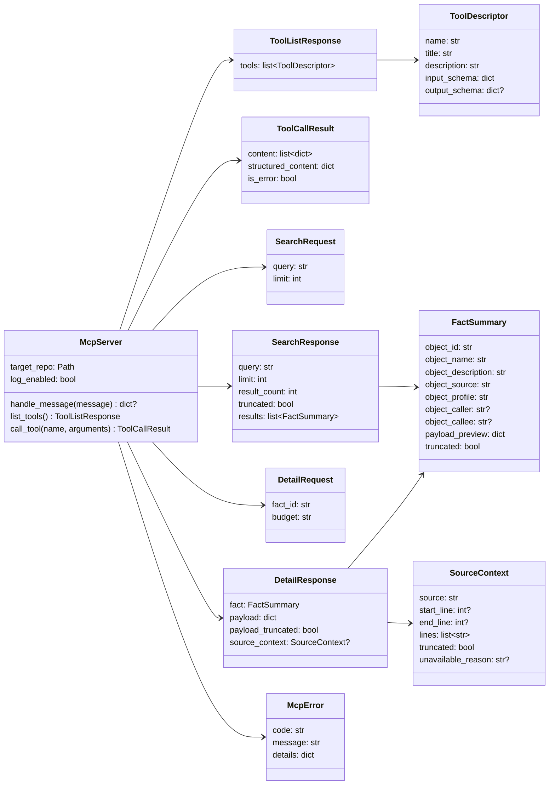
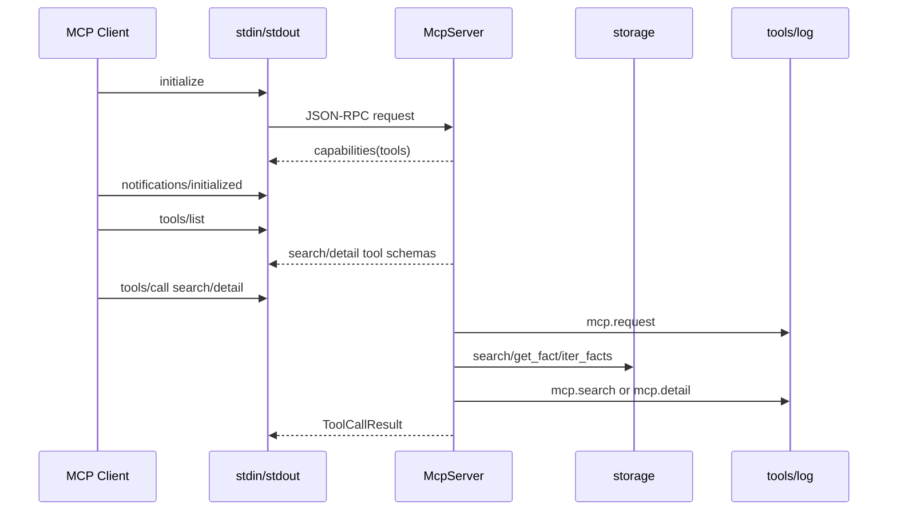
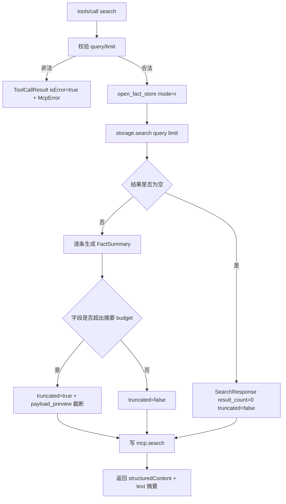
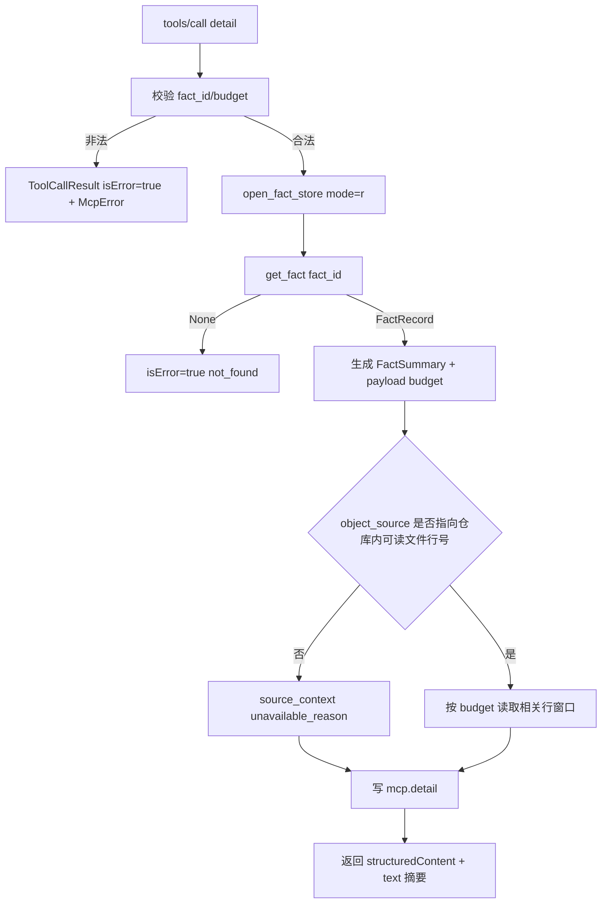
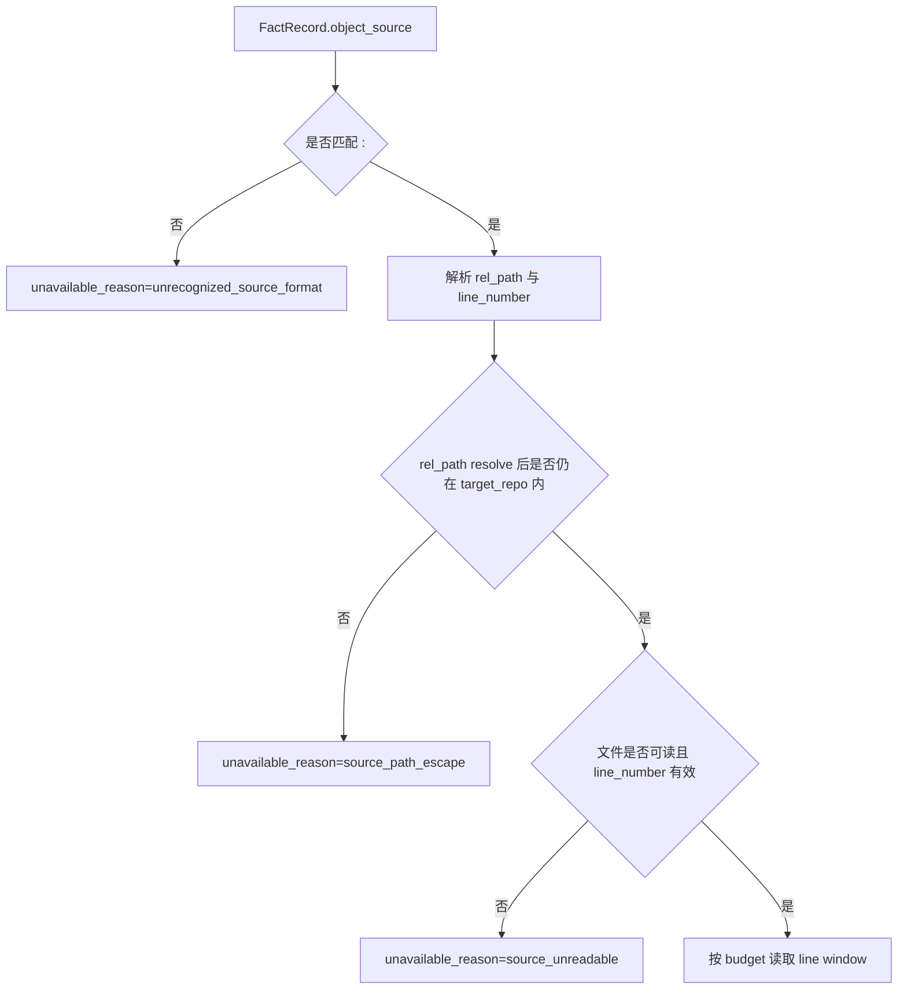

# MCP stdio 运行时设计草稿

## 模块定位

本功能属于 `src/cipher2/mcp/`，实现本地 stdio MCP server 与 FACT-only `search` / `detail` 工具。它消费 `storage` 当前 snapshot，不执行 extractor，不创建 Graph、relation、`FACT_RELATIVE`、`GRAPH_RELATIVE`、`GRAPH_DERIVED_FROM` 或 HTTP MCP。

外部协议参考 MCP 2025-06-18：server tools 通过 `tools/list` 暴露，调用通过 `tools/call`；stdio transport 使用 stdin/stdout 传输 JSON-RPC message。v1 只实现本地 stdio，不实现 Streamable HTTP。

参考链接：

- https://modelcontextprotocol.io/specification/2025-06-18/server/tools
- https://modelcontextprotocol.io/specification/2025-06-18/basic/transports

## 规格约束

来自 `README.md`、`CONTRIBUTING.md`、`src/cipher2/mcp/README.md`、`src/cipher2/storage/README.md`、`src/cipher2/tools/log/README.md`、`src/cipher2/tools/views/README.md` 与 `docs/schema.md` 的约束：

- v1 MCP 只读 FACT store，tool IDs 就是 `FactRecord.object_id`。
- `search(query, limit=20)` 返回紧凑 FACT 摘要，不返回 Graph object，不暴露 storage adapter 细节。
- `detail(fact_id, budget="normal")` 展开单条 FACT，返回 source、caller/callee、profile、payload 摘要和有界源码上下文；不得读取无关源文件弥补缺失 facts。
- HTTP MCP、`impact`、Graph traversal、`TheGraph` search result 和 relation runtime 都是非目标。
- 所有生成产物只能位于目标仓库 `.cipher/` 下；MCP 运行时自身不写 snapshot、staging 或 run lock。
- stdout 只能写 MCP JSON-RPC response/notification；诊断和 log 降级不得污染 stdout。
- raw JSONL 不是用户界面；MCP 可观测信息必须通过 `tools/views` 的 log view 呈现。

本功能不新增用户可配持久配置项，不修改 `.cipher/config.yml`。

| 参数/配置 | type | 取值范围 | 默认值 | 作用 | 生效时机 | 非法值处理 |
|---|---|---|---|---|---|---|
| `target_repo` | `str | Path` | 目标仓库路径；读取 `.cipher/snapshots/current` | 必填，无默认值 | 指定 MCP 数据源 | server 启动或 Python API 调用 | `McpError(code="invalid_target_repo")` |
| `log_enabled` | `bool` | `True` / `False` | `True` | 控制 `mcp` channel 可观测事件 | 单次 server 或 API 调用 | `McpError(code="invalid_log_enabled")` |
| `search.query` | `str` | 任意字符串；空字符串允许，表示按 storage 既有约定按 `object_id` 升序返回 | 必填，无默认值 | 搜索 FACT | `tools/call` | `McpError(code="invalid_query")` |
| `search.limit` | `int` | `1..50` | `20` | 限制返回条数 | `tools/call` | `McpError(code="invalid_limit")` |
| `detail.fact_id` | `str` | 非空 FACT id | 必填，无默认值 | 选择 detail FACT | `tools/call` | `McpError(code="invalid_fact_id")` |
| `detail.budget` | `str` | `small`、`normal`、`large` | `normal` | 控制 payload 和源码上下文大小 | `tools/call` | `McpError(code="invalid_budget")` |

`limit`、`budget` 和 `log_enabled` 是调用参数，不写入持久配置。

## 数据结构



### `McpServer` 成员表

| 成员名称 | type | 作用 | 并发粒度 |
|---|---|---|---|
| `target_repo` | `Path` | 目标仓库根目录 | 只读共享 |
| `log_enabled` | `bool` | 是否写 `mcp` channel 事件 | 对象级 |

### `ToolDescriptor` 成员表

| 成员名称 | type | 作用 | 并发粒度 |
|---|---|---|---|
| `name` | `str` | MCP tool 名称，v1 为 `search` 或 `detail` | 响应实例级、只读共享 |
| `title` | `str` | 人类可读工具标题 | 只读共享 |
| `description` | `str` | 给模型的工具说明 | 只读共享 |
| `input_schema` | `dict[str, JSONValue]` | JSON Schema 输入约束；JSON 输出字段名为 `inputSchema` | 只读共享 |
| `output_schema` | `dict[str, JSONValue] | None` | `structuredContent` 输出约束；JSON 输出字段名为 `outputSchema` | 只读共享 |

### `ToolListResponse` 成员表

| 成员名称 | type | 作用 | 并发粒度 |
|---|---|---|---|
| `tools` | `list[ToolDescriptor]` | `tools/list` 返回的工具清单 | 响应实例级 |

### `ToolCallResult` 成员表

| 成员名称 | type | 作用 | 并发粒度 |
|---|---|---|---|
| `content` | `list[dict[str, JSONValue]]` | MCP text content，供模型直接阅读 | 响应实例级 |
| `structured_content` | `dict[str, JSONValue]` | 结构化结果或结构化错误；JSON 输出字段名为 `structuredContent` | 响应实例级 |
| `is_error` | `bool` | tool 业务错误标志；协议错误不走此结构 | 响应实例级 |

### `SearchRequest` 成员表

| 成员名称 | type | 作用 | 并发粒度 |
|---|---|---|---|
| `query` | `str` | 搜索字符串 | 请求级 |
| `limit` | `int` | 返回上限，`1..50` | 请求级 |

### `FactSummary` 成员表

| 成员名称 | type | 作用 | 并发粒度 |
|---|---|---|---|
| `object_id` | `str` | FACT id，MCP tool id | fact 级、只读共享 |
| `object_name` | `str` | 展示名 | fact 级、只读共享 |
| `object_description` | `str` | 紧凑描述 | fact 级、只读共享 |
| `object_source` | `str` | 仓库相对来源或 provenance | fact 级、只读共享 |
| `object_profile` | `str` | profile | fact 级、只读共享 |
| `object_caller` | `str | None` | 可选 caller | fact 级、只读共享 |
| `object_callee` | `str | None` | 可选 callee | fact 级、只读共享 |
| `payload_preview` | `dict[str, JSONValue]` | 有界 payload 摘要 | 响应实例级 |
| `truncated` | `bool` | 摘要是否截断 | 响应实例级 |

### `SearchResponse` 成员表

| 成员名称 | type | 作用 | 并发粒度 |
|---|---|---|---|
| `query` | `str` | 回显 query | 响应实例级 |
| `limit` | `int` | 回显 limit | 响应实例级 |
| `result_count` | `int` | 返回条数 | 响应实例级 |
| `truncated` | `bool` | 是否因 limit 或 payload budget 截断 | 响应实例级 |
| `results` | `list[FactSummary]` | 结果摘要 | 响应实例级 |

### `DetailRequest` 成员表

| 成员名称 | type | 作用 | 并发粒度 |
|---|---|---|---|
| `fact_id` | `str` | 要展开的 FACT id | 请求级 |
| `budget` | `Literal["small", "normal", "large"]` | 响应预算 | 请求级 |

### `SourceContext` 成员表

| 成员名称 | type | 作用 | 并发粒度 |
|---|---|---|---|
| `source` | `str` | 仓库相对 source | 文件级 |
| `start_line` | `int | None` | 上下文起始行 | 文件级 |
| `end_line` | `int | None` | 上下文结束行 | 文件级 |
| `lines` | `list[str]` | 有界源码片段 | 响应实例级 |
| `truncated` | `bool` | 是否按 budget 截断 | 响应实例级 |
| `unavailable_reason` | `str | None` | 无法读取原因 | 响应实例级 |

### `DetailResponse` 成员表

| 成员名称 | type | 作用 | 并发粒度 |
|---|---|---|---|
| `fact` | `FactSummary` | FACT 基础字段 | 响应实例级 |
| `payload` | `dict[str, JSONValue]` | 有界 payload | 响应实例级 |
| `payload_truncated` | `bool` | payload 是否截断 | 响应实例级 |
| `source_context` | `SourceContext | None` | 有界相关源码上下文 | 文件级读取快照 |

### `McpError` 成员表

| 成员名称 | type | 作用 | 并发粒度 |
|---|---|---|---|
| `code` | `str` | 稳定错误码 | 错误实例级 |
| `message` | `str` | 面向模型/调用方的短说明 | 错误实例级 |
| `details` | `dict[str, JSONValue]` | 结构化上下文，不含源码 dump、绝对路径或 traceback | 错误实例级 |

### `McpError.code` 表

| code | 触发条件 | 归属 |
|---|---|---|
| `invalid_target_repo` | `target_repo` 不是可读取的目标仓库路径 | JSON-RPC error 或 Python API exception |
| `invalid_log_enabled` | `log_enabled` 非 bool | JSON-RPC error 或 Python API exception |
| `malformed_json` | stdin 行不是合法 JSON object | JSON-RPC error |
| `unsupported_batch` | 收到 JSON-RPC batch array | JSON-RPC error |
| `unknown_method` | method 不是 `initialize`、`notifications/initialized`、`tools/list`、`tools/call` 或 `ping` | JSON-RPC error |
| `unknown_tool` | `tools/call.name` 不是 `search` 或 `detail` | JSON-RPC error |
| `invalid_args` | `tools/call.arguments` 缺失或不是 object | tool result `isError=true` |
| `invalid_query` | `search.query` 非 str | tool result `isError=true` |
| `invalid_limit` | `search.limit` 非 int 或不在 `1..50` | tool result `isError=true` |
| `invalid_fact_id` | `detail.fact_id` 非空字符串约束失败 | tool result `isError=true` |
| `invalid_budget` | `detail.budget` 不在 `small`、`normal`、`large` | tool result `isError=true` |
| `not_found` | `detail.fact_id` 不存在于当前 FACT snapshot | tool result `isError=true` |
| `storage_error` | storage 读取、损坏或 schema 错误 | tool result `isError=true` |
| `unrecognized_source_format` | `object_source` 不匹配 `<rel_path>:<line_number>` | detail warning，`source_context.unavailable_reason` |
| `source_path_escape` | `object_source` 解析出的路径逃逸目标仓库 | detail warning，`source_context.unavailable_reason` |
| `source_unreadable` | `object_source` 对应文件不存在、不可读或行号越界 | detail warning，`source_context.unavailable_reason` |

## 对外接口流程

### stdio JSON-RPC lifecycle



stdio 只接受单条 JSON-RPC message；batch、HTTP 和非 JSON 输入返回协议错误或 `mcp.error`。stdout 不写调试文本。

### `search` 工具流程



### `detail` 工具流程



### `object_source` 解析约定



`detail` 只支持 `<rel_path>:<line_number>` 单点行号格式。`rel_path` 必须是目标仓库内的相对路径，`line_number` 必须是大于 0 的十进制整数。不匹配或不可读时不抛出业务错误；返回 `SourceContext.unavailable_reason`，并在 `mcp.detail` 或 `mcp.error` 中以 warning 方式呈现。README 搬迁必须把该格式同步固化到 `src/cipher2/initializer/extractor/code/README.md` 的 FACT contract，避免 MCP 隐式依赖未文档化实现。

## Python API 与 stdio 入口

计划导出：

```python
open_mcp_server(target_repo: Path, *, log_enabled: bool = True) -> McpServer
serve_stdio(target_repo: Path, *, log_enabled: bool = True, input, output) -> int
```

`McpServer` 方法：

- `list_tools() -> ToolListResponse`
- `call_tool(name: str, arguments: dict[str, JSONValue]) -> ToolCallResult`
- `search(query: str, limit: int = 20) -> SearchResponse`
- `detail(fact_id: str, budget: str = "normal") -> DetailResponse`

响应预算：

| budget | payload 标量上限 | 源码上下文 | 结构化响应目标上限 |
|---|---:|---:|---:|
| `small` | 16 fields / 128 chars | line ±3 | 8KB |
| `normal` | 32 fields / 256 chars | line ±10 | 32KB |
| `large` | 64 fields / 512 chars | line ±40 | 128KB |

v1 `tools/list` 为 `search` 与 `detail` 同时提供 `inputSchema` 和 `outputSchema`。`outputSchema` 只约束 `structuredContent` 的稳定字段，不约束 `content[].text` 的自然语言摘要；若未来 `FactSummary` 字段演进，必须先经设计 PR 和 README 搬迁 PR 更新 schema。

## 并发控制

- stdio server 单进程串行处理请求；不引入后台线程或并发 tool execution。
- 每个 tool call 单独打开 storage read handle；storage snapshot 读取保持 snapshot 级一致。
- `detail` 只读取 `object_source` 指向的仓库内相对文件；路径逃逸、缺失或不可读只返回 `source_context.unavailable_reason`，不读取替代文件。
- log 写入通过 `tools/log` 的文件级锁；log 写失败不破坏 MCP response，错误计入 `mcp.error` 或 log degradation。
- `mcp.error` 自身写失败时回落到 `JsonlLog.dropped_event_count` 递增和 stderr 一次性兜底报告；不重试、不递归生成新的 log 事件。
- MCP 不写 `.cipher/run/`、`staging/` 或 snapshot，不持有 storage 写锁。
- stdout 写入由 server 串行控制，避免 MCP response 交错；stderr 只允许承载 log 降级或进程诊断。

## 文档递归更新

设计 PR 合入后，README 搬迁必须从 `src/cipher2/mcp/README.md` 开始递归更新：

1. `src/cipher2/mcp/README.md`：MCP stdio lifecycle、工具 schema、响应预算、错误语义、并发与可观测。
2. `src/cipher2/initializer/extractor/code/README.md`：把 `object_source=<rel_path>:<line_number>` 单点行号格式上升为公开 FACT contract。
3. `src/cipher2/storage/README.md`：声明 MCP 只读消费 `search/get_fact/iter_facts`，不新增 storage 物理 schema。
4. `src/cipher2/tools/log/README.md`：新增 `mcp` channel 事件；同时落地 #11 非阻塞观察，要求任何 LogEvent schema implication（payload allowlist、event_name regex、channel 命名、status enum、digest priority）必须先经 README 搬迁 PR 更新。
5. `src/cipher2/tools/views/README.md`：声明 MCP 统计通过 log view 展示，不新增 MCP section。
6. `tests/README.md`：新增 MCP 测试矩阵与 `scripts/mcp_performance_gate.py` 权威门禁。
7. `scripts/README.md`：新增 MCP 性能脚本职责。
8. `src/cipher2/README.md`、`src/README.md`、`docs/README.md`、`README.md`、`CONTRIBUTING.md`：更新 v1 端到端路径和 MCP 已实现边界。

## 可观测性与呈现

MCP 事件写入 `.cipher/log/mcp.jsonl`：

- `mcp.request`：收到 JSON-RPC request 或 `tools/call`，payload 写 `operation`、`method`、`tool_name`、`request_kind`，counts 写 `request_count=1`。
- `mcp.response`：非 tool call 成功响应，例如 `initialize`、`tools/list`、`ping`，counts 写 `response_count=1`。
- `mcp.search`：search tool 成功响应，counts 写 `result_count`、`limit`、`truncated_count`，payload 写 `query_kind`、`outcome`。
- `mcp.detail`：detail tool 成功响应，counts 写 `payload_field_count`、`context_line_count`、`truncated_count`，payload 写 `budget`、`outcome`。
- `mcp.error`：协议错误、参数错误、storage 错误、not found 或 source context 读取失败需要显式展示时写入，`status="error"` 或 `"warning"`，顶层 `error_code` 使用稳定错误码。

事件不得包含源码正文、绝对目标路径、raw payload、完整 query、traceback、provider internals 或 MCP client 私有信息。`query_preview` 最多 80 字符，完整 query 只写 sha256。

v1 MCP 不调用 `observe_batch`，不写 `mcp.batch_summary`。

本功能需要在 `tools/log/README.md` 搬迁时扩展 `LogEventDigest.fields` payload 标量键 allowlist。新增键追加到现有优先级序列末尾，顺序固定为：`method` -> `tool_name` -> `request_kind` -> `budget`。`query_kind` 已在现有 allowlist 内，不重复新增。

`tools/views` 不新增 `mcp` section；核心统计通过 log view 呈现：

- `events_by_channel["mcp"]`
- `top_event_names` 中的 `mcp.search`、`mcp.detail`、`mcp.error`
- `error_codes`
- `recent_events` / `slow_events`
- `LogEventRow.fields` 中的 `count.result_count`、`count.limit`、`count.truncated_count`、`count.payload_field_count`、`count.context_line_count`

空状态：没有 MCP 事件时，log view 不显示 `mcp` channel；MCP 对空 store 的 `search` 返回 `result_count=0` 并写 `mcp.search`。异常状态：参数错误和 storage 读取错误必须在 log view 的 `error_codes` 与 recent row 中可见。

## 可观测用例看护

专门用例必须覆盖：

- 正常 `search` 写 `mcp.request` 与 `mcp.search`，views 展示 `events_by_channel["mcp"]`、`top_event_names` 和 `count.result_count`。
- 正常 `detail` 写 `mcp.detail`，views 展示 budget、payload/context 计数与截断状态。
- 空 store search 写成功事件且 `result_count=0`。
- invalid limit、invalid budget、unknown fact_id 写 `isError=true` tool result；malformed JSON-RPC、unsupported batch、unknown method、unknown tool 写协议错误；两类错误都写 `mcp.error` 且错误码稳定。
- log write failure 不破坏 MCP response。
- source context 不可读时不泄漏绝对路径或 traceback，并通过 warning/error 可见。
- query/source/payload 截断后不泄漏源码正文、raw payload、绝对路径、secret 或 provider internals。
- views 行摘要和展开字段来自 `LogEventDigest`，不要求用户读 raw JSONL。

## 测试与门禁计划

TDD 首批失败测试：

- `tests/test_mcp_tool_models.py`
- `tests/test_mcp_search_detail.py`
- `tests/test_mcp_stdio_protocol.py`
- `tests/test_mcp_response_budget.py`
- `tests/test_mcp_observability.py`
- `tests/test_mcp_path_safety.py`
- `tests/test_mcp_performance.py`
- `tests/test_mcp_coverage_matrix.py`

功能点覆盖率必须达到 100%，覆盖 tool list、JSON schema、search、detail、structuredContent/text 双输出、预算截断、源码上下文、stdio initialize/tools/list/tools/call、FACT-only 边界和 log/view 可观测。

异常分支覆盖率目标 100%，最低不得低于 90%。异常分支包括 malformed JSON、unsupported batch、unknown method、unknown tool、invalid args、invalid limit、invalid budget、empty fact_id、not found、empty store、storage corruption、source path escape、source unreadable 和 log write failure。

场景用例覆盖率必须达到 100%，覆盖 empty store、single fact、multi fact、caller/callee、payload 大小三档、budget small/normal/large、limit 1/20/50、query 空/命中/不命中、detail source present/missing/unreadable、log enabled/disabled、stdio lifecycle 顺序和 repeated calls。

三档性能与小型化看护：

- 小：512MB 预算，1,000 facts，100 mixed search/detail calls，峰值 < 16MB，wall-clock < 5s。
- 中：4G 预算，100,000 facts，200 mixed calls，峰值 < 128MB，wall-clock < 120s。
- 大：8G 预算，1,000,000 facts，20 mixed calls，峰值 < 512MB，wall-clock < 900s。

权威性能脚本为 `PYTHONPATH=src python3 scripts/mcp_performance_gate.py`。脚本必须排除 fixture 生成时间，守护 MCP 格式化、storage streaming 读取、预算截断和 log 写入降级；不得全量缓存 facts 或 events。全量命令仍为：

```bash
PYTHONPATH=src python3 -m unittest discover -s tests
```
