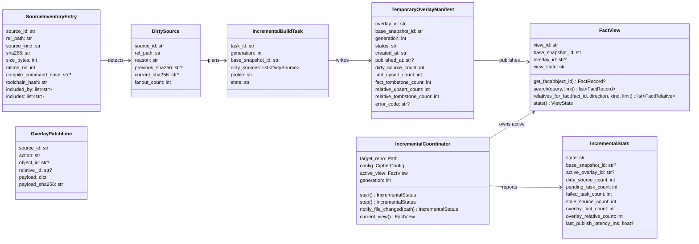
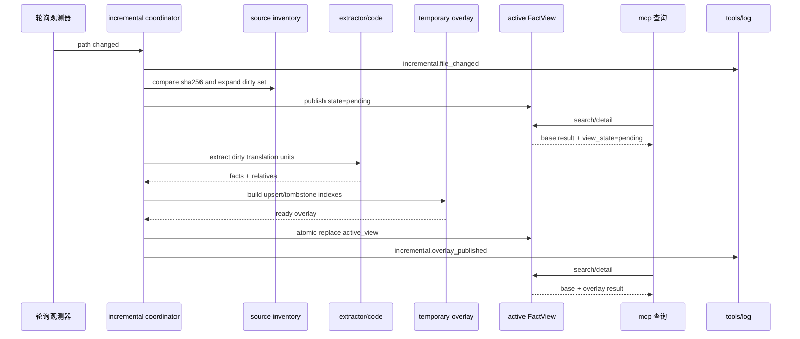
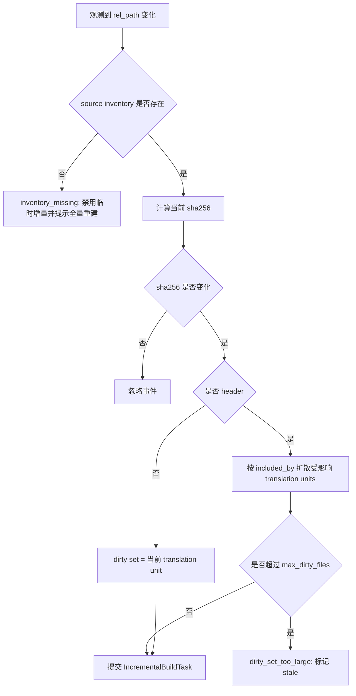
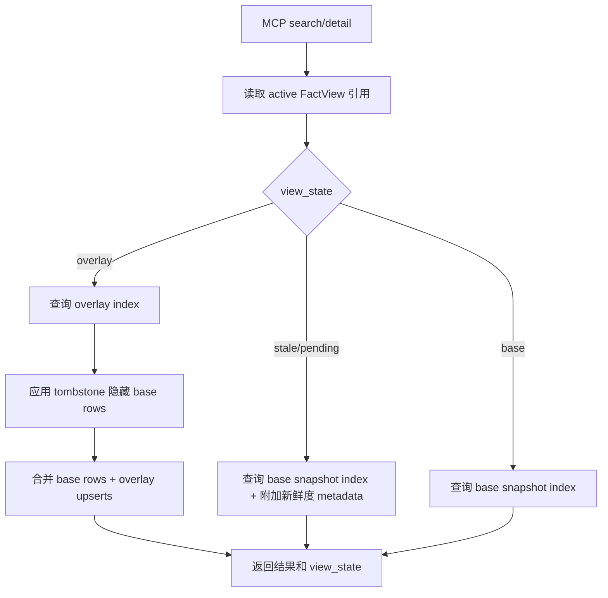
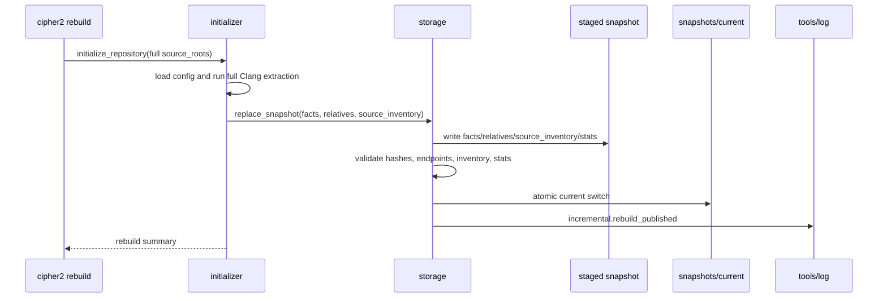
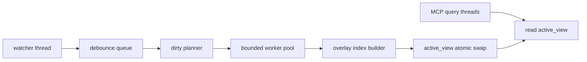

# 在线临时增量与离线全量重建设计草稿

## 状态

- 日期：2026-05-26
- 状态：草稿，等待设计 PR 检视
- 范围：在线临时增量 overlay、查询侧无感刷新、离线全量重建入口、source inventory、可观测和测试门禁

本设计只允许先实现在线临时增量。离线永久更新不实现持久 delta 合并，统一采用全量重建并原子发布新 snapshot。

## 模块定位

本功能新增 `src/cipher2/incremental/`，作为文件变更观测、dirty set 规划、临时 overlay 构建和查询视图发布的协调模块。它消费 config、initializer/extractor/code 和 storage，不直接渲染 MCP 响应或 TUI。

影响模块：

- `src/cipher2/config/`：新增临时增量持久配置项。
- `src/cipher2/storage/`：新增 source inventory、temporary overlay 和 `FactView` 读视图抽象。
- `src/cipher2/storage/schema/`：新增 `source_inventory.jsonl` 和 `.cipher/run/incremental/` 临时文件 schema。
- `src/cipher2/initializer/` 与 `initializer/extractor/code/`：全量初始化时写 source inventory；临时增量时支持按 dirty translation unit 抽取。
- `src/cipher2/incremental/`：新增在线临时增量协调器。
- `src/cipher2/mcp/`：查询通过 `FactView` 读取，并在 structured content 暴露 view state。
- `src/cipher2/tools/log/`：新增 incremental channel 事件。
- `src/cipher2/tools/views/`：新增 incremental view model。
- `src/cipher2/cli.py`：新增离线全量重建入口，复用 initializer 全量写 snapshot。
- `README.md`、`docs/README.md`、`docs/user-guide.md`、`docs/maintenance-guide.md`、`tests/README.md`：递归更新用户入口、运行时边界和测试门禁。

## 规格与约束

本功能新增用户可配持久配置项，位于 `.cipher/config.yml`。配置只控制临时增量服务的行为；离线永久更新始终是全量重建。

| 配置项 | type | 取值范围 | 默认值 | 作用 | 生效时机 | 非法值处理 |
|---|---|---|---|---|---|---|
| `incremental.temporary_enabled` | `bool` | `true` 或 `false` | `true` | 控制 MCP 或显式 watch 场景是否启动在线临时增量 | 长驻服务启动时 | `ConfigError(code="invalid_config")` |
| `incremental.poll_interval_ms` | `int` | `100..5000` | `500` | 标准库轮询 source inventory 的间隔 | watcher 启动时 | `ConfigError(code="invalid_config")` |
| `incremental.debounce_ms` | `int` | `50..1000` | `100` | 文件保存事件合并窗口 | 文件变更进入 dirty queue 前 | `ConfigError(code="invalid_config")` |
| `incremental.worker_count` | `int` | `1..8` | `1` | 后台 Clang 抽取 worker 数 | `IncrementalCoordinator.start()` | `ConfigError(code="invalid_config")` |
| `incremental.overlay_ttl_seconds` | `int` | `10..3600` | `600` | 临时 overlay 空闲保留时间 | overlay 发布与清理时 | `ConfigError(code="invalid_config")` |
| `incremental.max_dirty_files` | `int` | `1..10000` | `500` | 单轮临时增量允许的 dirty source 上限 | dirty set 规划完成后 | `IncrementalError(code="dirty_set_too_large")` |

运行时约束：

- 临时增量由文件保存后的内容 hash 变化触发，不要求用户执行 `make`、`ninja` 或真实编译。
- 首版使用 Python 标准库轮询 source inventory，不引入第三方 watcher；`notify_file_changed()` 仅作为测试和未来宿主集成入口。
- 临时增量仍必须使用当前有效的 compile database、Clang 16、GCC 10.5.0 和 extractor/code 规则；不得启用 lightweight parser 或静默降级。
- 临时 overlay 只写 `<target-repo>/.cipher/run/incremental/`，不得写入 `snapshots/`，不得移动 `snapshots/current`。
- 临时 overlay 是可丢弃状态。进程退出、TTL 到期、配置变化、toolchain 变化或 base snapshot 变化时必须失效。
- 查询线程不得等待 Clang 抽取。overlay 未完成时返回 base 结果，并暴露 `view_state="stale"` 或 `view_state="pending"`。
- overlay 发布后，查询读取 `base snapshot + overlay`；overlay upsert 优先，overlay tombstone 隐藏 base 中同一 `source_id` 的 facts 与 relatives。
- facts 与 relatives 必须能映射到 `source_id`。一个 source dirty 时，base 中属于该 source 的 facts 以及端点涉及该 source 的 relatives 都必须被 overlay tombstone 隐藏。
- C 源文件变更优先只重抽对应 translation unit。header 变更必须通过 include relation 或 source inventory 反向扩大 dirty set；无法确定影响范围时标记 stale，并提示离线全量重建。
- 新增源文件若没有 compile command，不得猜测命令行；必须报 `compile_command_missing` 并保持 base 结果可查。
- 语法错误、缺失 header、Clang fatal diagnostic 或 overlay 校验失败时，不发布半成品 overlay。
- 离线永久更新不实现 delta chain、compaction、永久 tombstone 或持久增量合并；只允许 staged full rebuild 通过校验后原子发布新 snapshot。
- 新快照必须包含 source inventory，storage snapshot schema 提升到 version `3`。缺失 source inventory 的旧 snapshot 可以继续只读查询，但 incremental 服务必须进入 `inventory_missing` 状态并要求全量重建。

时延目标：

| 阶段 | 指标 |
|---|---|
| 文件变化被轮询观测到后查询暴露 stale/pending | p95 < 100ms |
| facts/relatives 已准备好后的 overlay 发布 | p95 < 10ms |
| overlay 发布后的首次查询可见 | p95 < 20ms |
| 单个可解析 C translation unit 从观测到发布 | p95 <= 2s |
| 小范围 header fanout 从观测到分批可见 | p95 <= 5s |

大型 header 扇出、巨型 translation unit、生成头文件缺失和语法错误不承诺固定秒级，但必须持续可观测。

## 数据结构



### `SourceInventoryEntry` 成员表

| 成员名称 | type | 作用 | 并发粒度 |
|---|---|---|---|
| `source_id` | `str` | 源文件稳定 ID，基于仓库相对路径和 profile 构造 | source 级、只读共享 |
| `rel_path` | `str` | 仓库相对路径，不含绝对路径 | source 级、只读共享 |
| `source_kind` | `str` | `c_source`、`header` 或 `other` | source 级、只读共享 |
| `sha256` | `str` | snapshot 生成时的文件内容 hash | source 级、只读共享 |
| `size_bytes` | `int` | snapshot 生成时文件大小 | source 级、只读共享 |
| `mtime_ns` | `int` | snapshot 生成时 mtime，用于快速预筛 | source 级、只读共享 |
| `compile_command_hash` | `str or None` | 归一化 compile command 摘要；header 可为空 | source 级、只读共享 |
| `toolchain_hash` | `str` | Clang/GCC/config 组合摘要 | snapshot 级 |
| `included_by` | `list[str]` | 反向 include source_id 列表 | source 级、只读共享 |
| `includes` | `list[str]` | 正向 include source_id 列表 | source 级、只读共享 |

### `TemporaryOverlayManifest` 成员表

| 成员名称 | type | 作用 | 并发粒度 |
|---|---|---|---|
| `overlay_id` | `str` | 临时 overlay 唯一 ID，不进入 snapshot id | overlay 级 |
| `base_snapshot_id` | `str` | overlay 依赖的基础 snapshot | overlay 级、只读共享 |
| `generation` | `int` | 单进程递增代数，用于丢弃过期任务 | 进程级 |
| `status` | `Literal["building","ready","published","failed","dropped"]` | overlay 生命周期状态 | overlay 级 |
| `created_at` | `str` | UTC 创建时间 | overlay 级 |
| `published_at` | `str or None` | 发布到 active view 的时间 | overlay 级 |
| `dirty_source_count` | `int` | 本次覆盖的 dirty source 数 | overlay 级 |
| `fact_upsert_count` | `int` | 新增或替换 fact 数 | overlay 级 |
| `fact_tombstone_count` | `int` | 隐藏 base fact 数 | overlay 级 |
| `relative_upsert_count` | `int` | 新增或替换 relative 数 | overlay 级 |
| `relative_tombstone_count` | `int` | 隐藏 base relative 数 | overlay 级 |
| `error_code` | `str or None` | 失败原因 | overlay 级 |

### `OverlayPatchLine` 成员表

| 成员名称 | type | 作用 | 并发粒度 |
|---|---|---|---|
| `source_id` | `str` | 该 patch 所属源文件 | line 级 |
| `action` | `Literal["upsert_fact","delete_fact","upsert_relative","delete_relative"]` | patch 动作 | line 级 |
| `object_id` | `str or None` | fact upsert/delete 的对象 ID | line 级 |
| `relative_id` | `str or None` | relative upsert/delete 的关系 ID | line 级 |
| `payload` | `dict[str, JSONValue]` | upsert 的完整对象或 delete 的 tombstone 说明 | line 级、只读共享 |
| `payload_sha256` | `str` | canonical payload 摘要 | line 级 |

### `DirtySource` 成员表

| 成员名称 | type | 作用 | 并发粒度 |
|---|---|---|---|
| `source_id` | `str` | dirty 源文件 ID | source 级 |
| `rel_path` | `str` | 仓库相对路径 | source 级 |
| `reason` | `Literal["content_changed","included_header_changed","missing","compile_command_changed","toolchain_changed"]` | dirty 原因 | source 级 |
| `previous_sha256` | `str or None` | base inventory 中的 hash | source 级 |
| `current_sha256` | `str or None` | 当前文件 hash；文件缺失时为空 | source 级 |
| `fanout_count` | `int` | header 影响扩散数量 | dirty 规划级 |

### `IncrementalBuildTask` 成员表

| 成员名称 | type | 作用 | 并发粒度 |
|---|---|---|---|
| `task_id` | `str` | 后台任务 ID | task 级 |
| `generation` | `int` | 任务所属代数，低于当前代数时取消发布 | task 级 |
| `base_snapshot_id` | `str` | 构建时读取的基础 snapshot | task 级、只读共享 |
| `dirty_sources` | `list[DirtySource]` | 本任务要重抽的 sources | task 级 |
| `profile` | `str` | 传递给 extractor 的 profile | task 级、只读共享 |
| `state` | `Literal["queued","running","ready","failed","cancelled"]` | 任务状态 | task 级 |

### `FactView` 成员表

| 成员名称 | type | 作用 | 并发粒度 |
|---|---|---|---|
| `view_id` | `str` | 查询视图 ID，base-only 或 base+overlay | view 级、只读共享 |
| `base_snapshot_id` | `str` | 基础 snapshot ID | snapshot 级、只读共享 |
| `overlay_id` | `str or None` | 当前生效 overlay ID | overlay 级、只读共享 |
| `view_state` | `Literal["base","stale","pending","overlay","error"]` | 查询数据新鲜度状态 | view 级 |
| `get_fact` | `callable` | 按 object_id 获取 fact，应用 tombstone | view 级、只读共享 |
| `search` | `callable` | 搜索 merged view，不在查询时解析 JSONL | view 级、只读共享 |
| `relatives_for_fact` | `callable` | 查询 merged relation，不返回 tombstone 隐藏边 | view 级、只读共享 |
| `stats` | `callable` | 返回 merged view 统计和 incremental 状态 | view 级、只读共享 |

### `IncrementalCoordinator` 成员表

| 成员名称 | type | 作用 | 并发粒度 |
|---|---|---|---|
| `target_repo` | `Path` | 目标仓库根目录 | 只读共享 |
| `config` | `CipherConfig` | 启动时配置快照 | 配置快照级 |
| `active_view` | `FactView` | 当前查询视图，发布时原子替换引用 | 进程级、读多写少 |
| `generation` | `int` | 文件变更代数，取消过期任务 | 进程级 |
| `start` | `callable` | 启动 watcher 和 worker | coordinator 对象级 |
| `stop` | `callable` | 停止 watcher、worker 并清理 overlay | coordinator 对象级 |
| `notify_file_changed` | `callable` | 测试或 watcher 注入文件变化 | source 级 |
| `current_view` | `callable` | 返回当前 active view | 进程级、无阻塞读取 |

### `IncrementalStats` 成员表

| 成员名称 | type | 作用 | 并发粒度 |
|---|---|---|---|
| `state` | `Literal["disabled","ready","stale","pending","overlay","error"]` | incremental 总状态 | 读取快照级 |
| `base_snapshot_id` | `str or None` | 当前基础 snapshot | 读取快照级 |
| `active_overlay_id` | `str or None` | 当前生效 overlay | 读取快照级 |
| `dirty_source_count` | `int` | 已观测 dirty source 数 | 读取快照级 |
| `pending_task_count` | `int` | 等待或运行任务数 | 读取快照级 |
| `failed_task_count` | `int` | 最近失败任务数 | 读取快照级 |
| `stale_source_count` | `int` | 尚未被 overlay 覆盖的 stale source 数 | 读取快照级 |
| `overlay_fact_count` | `int` | 当前 overlay fact upsert 数 | 读取快照级 |
| `overlay_relative_count` | `int` | 当前 overlay relative upsert 数 | 读取快照级 |
| `last_publish_latency_ms` | `float or None` | 最近一次 overlay 发布耗时 | 读取快照级 |

## 对外接口流程

### 在线临时增量流程



### dirty set 规划流程



### 查询合并流程



### 离线全量重建流程



## 物理布局

```text
<target-repo>/.cipher/
  snapshots/
    current
    sha256-<content-prefix>/
      facts.jsonl
      relatives.jsonl
      source_inventory.jsonl
      manifest.json
      stats.json
  run/
    incremental/
      state.json
      overlays/
        <overlay_id>/
          manifest.json
          facts.upsert.jsonl
          facts.tombstone.jsonl
          relatives.upsert.jsonl
          relatives.tombstone.jsonl
          stats.json
  log/
    incremental.jsonl
```

`source_inventory.jsonl` 属于 durable snapshot。`run/incremental/` 属于临时运行态，任何时候都可以删除；删除后查询回退 base snapshot。

## 并发控制



- 查询只读取 `active_view` 引用，不持有 extractor 或 storage 写锁。
- `active_view` 发布采用单赋值引用替换；旧 view 等正在运行的查询自然释放。
- 同一 `source_id` 的新变更会提高 `generation`；低 generation 任务完成后不得发布。
- overlay builder 必须先完成 facts、relatives、tombstone 和 endpoint 校验，再进入 ready。
- 临时 overlay 不持有 `storage.lock`，因为它不修改 `snapshots/current`。
- 离线全量重建沿用 storage 写锁；发布前若存在 active overlay，必须让 incremental coordinator 失效旧 overlay 并重新基于新 snapshot 观测。
- log 写入失败不得阻塞增量发布；必须在 views 中呈现 log 降级。

## 可观测性与呈现

新增 `incremental` channel 事件：

| 事件名 | status | 关键 counts | 关键 payload |
|---|---|---|---|
| `incremental.poll_started` | `ok` | `worker_count` | `base_snapshot_id`、`poll_interval_ms`、`debounce_ms` |
| `incremental.file_changed` | `ok` | `changed_file_count` | `source_id`、`rel_path` |
| `incremental.dirty_planned` | `ok` / `warning` | `dirty_source_count`、`fanout_count` | `reason`、`base_snapshot_id` |
| `incremental.extract_started` | `ok` | `dirty_source_count` | `task_id`、`generation` |
| `incremental.extract_failed` | `error` | `dirty_source_count` | `error_code`、`task_id` |
| `incremental.overlay_built` | `ok` | `fact_upsert_count`、`relative_upsert_count`、`tombstone_count` | `overlay_id` |
| `incremental.overlay_published` | `ok` | `overlay_fact_count`、`overlay_relative_count` | `publish_latency_ms`、`view_id` |
| `incremental.overlay_dropped` | `ok` / `warning` | `dropped_overlay_count` | `reason` |
| `incremental.rebuild_published` | `ok` | `fact_count`、`relative_count`、`source_count` | `snapshot_id` |

`tools/views` 新增 `IncrementalViewModel`：

| 字段 | type | 展示含义 |
|---|---|---|
| `state` | `str` | disabled、ready、stale、pending、overlay 或 error |
| `base_snapshot_id` | `str or None` | 当前稳定 snapshot |
| `active_overlay_id` | `str or None` | 当前临时 overlay |
| `dirty_source_count` | `int` | dirty source 数 |
| `pending_task_count` | `int` | 待完成增量任务数 |
| `stale_source_count` | `int` | 查询仍使用 base 的 stale source 数 |
| `failed_task_count` | `int` | 最近失败任务数 |
| `overlay_fact_count` | `int` | overlay fact 数 |
| `overlay_relative_count` | `int` | overlay relative 数 |
| `last_publish_latency_ms` | `float or None` | 最近发布耗时 |
| `latest_error_code` | `str or None` | 最近错误码 |

MCP `structuredContent` 必须新增：

```json
{
  "view_state": "overlay",
  "base_snapshot_id": "sha256-...",
  "overlay_id": "overlay-...",
  "stale_source_count": 0,
  "pending_task_count": 0
}
```

`content[].text` 不展示 raw JSONL；当数据 stale 或 pending 时，用短句说明“结果来自稳定快照，增量正在构建”。

## 测试规范

TDD 顺序：

1. 先写 config schema 和 path safety 测试。
2. 写 storage source inventory、overlay tombstone 和 `FactView` 合并测试。
3. 写 incremental coordinator 的 dirty planning、generation cancel、publish 和 failure fallback 测试。
4. 写 MCP `view_state` 和 views `IncrementalViewModel` 测试。
5. 写 CLI full rebuild staged publish 测试。
6. 最后实现代码并运行全量测试和性能门禁。

覆盖要求：

- 功能点覆盖率 100%：保存触发、dirty set、C 文件重抽、header fanout、overlay publish、tombstone、query merge、TTL drop、offline full rebuild。
- 异常分支覆盖率 90%+：缺失 inventory、compile command 缺失、dirty set 过大、Clang 失败、语法错误、header 缺失、overlay endpoint orphan、path escape、log 降级、base snapshot 变化。
- 场景用例覆盖率 100%：base-only、stale、pending、overlay、error、disabled、overlay 过期、重建后 overlay 失效、并发查询与发布。
- 可观测用例：每个 incremental event 至少一个成功断言和一个失败/警告断言；views 必须覆盖核心统计字段。

新增或更新测试文件：

- `tests/test_incremental_config.py`
- `tests/test_incremental_source_inventory.py`
- `tests/test_incremental_overlay_view.py`
- `tests/test_incremental_coordinator.py`
- `tests/test_incremental_mcp_view_state.py`
- `tests/test_incremental_observability.py`
- `tests/test_incremental_performance.py`
- `tests/test_cli_rebuild_command.py`

性能和小型化门禁：

```text
PYTHONPATH=src python3 scripts/incremental_performance_gate.py
```

脚本覆盖三档：

| 档位 | 输入规模 | 机器预算 | 模块峰值内存目标 | 时延目标 |
|---|---|---|---|---|
| 小 | 1,000 base facts、1,000 relatives、1 个 dirty source | 512MB | <= 64MB | publish p95 < 10ms，first query p95 < 20ms |
| 中 | 100,000 base facts、100,000 relatives、100 dirty sources | 4GB | <= 256MB | publish p95 < 20ms，first query p95 < 50ms |
| 大 | 1,000,000 base facts、1,000,000 relatives、10,000 dirty sources | 8GB | <= 1GB | 分批发布，无全量额外复制 |

Clang 端到端探针单独记录，不作为 overlay 发布门禁：

```text
PYTHONPATH=src python3 scripts/incremental_clang_latency_probe.py
```

探针必须输出单 TU、header fanout 和失败 fallback 的耗时统计。CI 可把探针作为可选报告；正式性能门禁只断言 cipher 自身 overlay 构建、发布和查询体现。

## 递归文档更新计划

设计 PR 合入后，README 搬迁 PR 必须更新：

- `src/cipher2/config/README.md`：新增 `incremental.*` 配置。
- `src/cipher2/storage/README.md` 与 `storage/schema/README.md`：新增 source inventory、overlay 临时布局和 `FactView`。
- `src/cipher2/initializer/README.md` 与 `initializer/extractor/code/README.md`：新增 source inventory 写入和 dirty TU 抽取约束。
- `src/cipher2/mcp/README.md`：新增 view state 字段。
- `src/cipher2/tools/log/README.md`：新增 incremental channel。
- `src/cipher2/tools/views/README.md`：新增 incremental view model。
- `src/cipher2/README.md`、`src/README.md`、`docs/README.md`、`README.md`、`docs/user-guide.md`、`docs/maintenance-guide.md`、`tests/README.md`：更新顶层入口、用户说明和门禁。

README 搬迁 PR 合入后才能进入 TDD 实现 PR。
