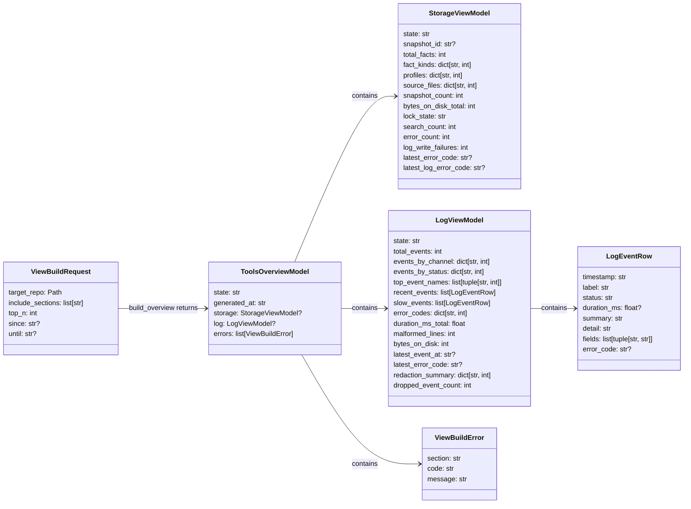
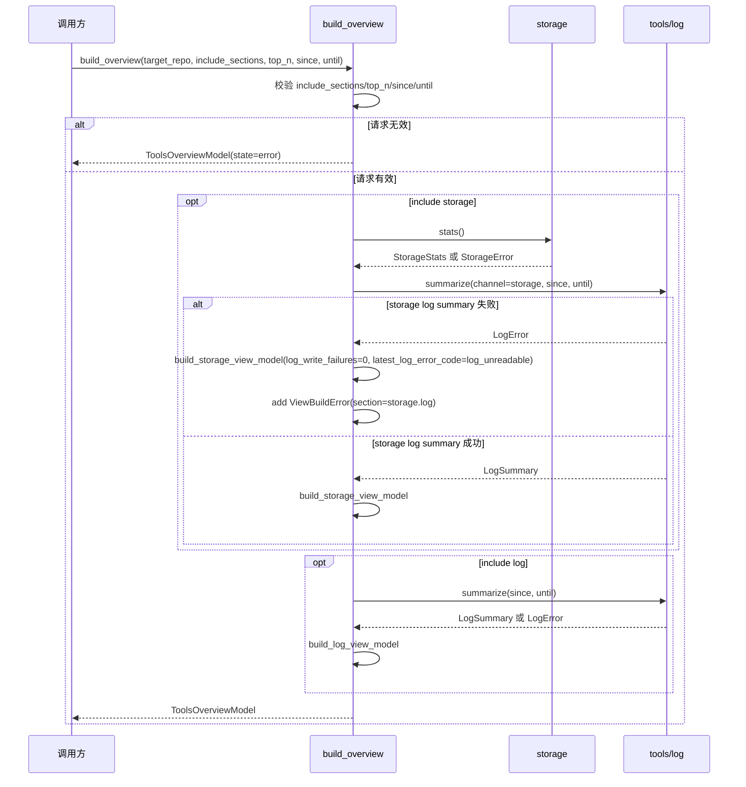
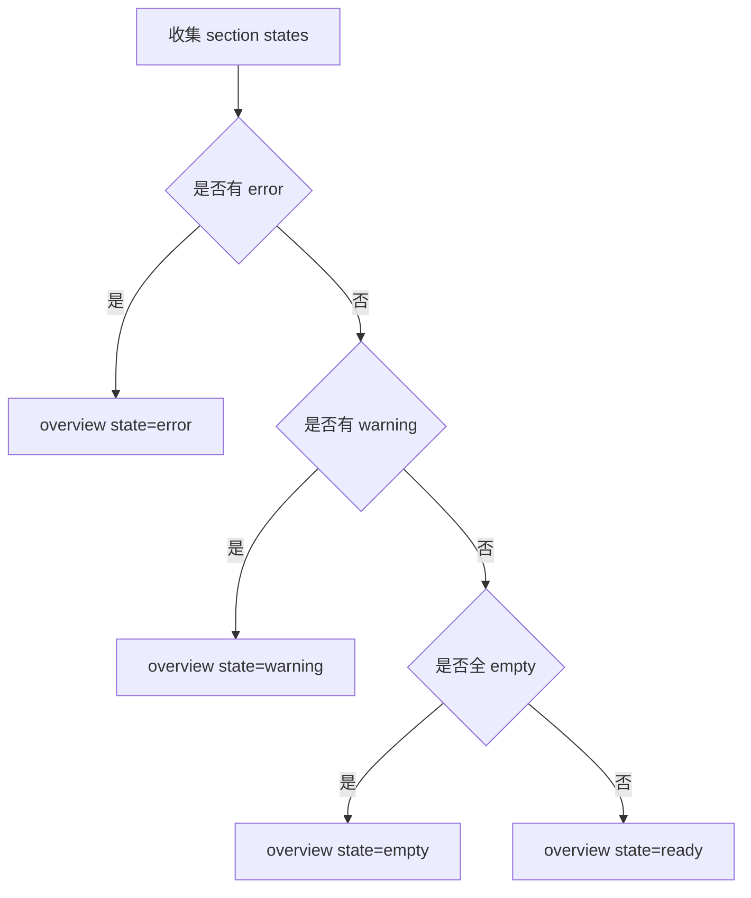

# tools/views 聚合层设计草稿

## 状态

- 日期：2026-05-26
- 状态：草稿，已回写第二轮评审意见，等待设计 PR 合入
- 范围：实现 `src/cipher2/tools/views/` 第一版 view model 聚合层，不实现终端渲染框架

实现顺序固定为：先 `tools/log`，再 `storage`，最后 `tools/views`。本草稿按 log 草稿 R-L16 方案 A 设计：`LogSummary` 保留 `events_by_name`、redaction/truncation 计数和 `dropped_event_count`。

## 模块定位

本功能属于 `src/cipher2/tools/views/`，是 cipher 工具模块的一部分。它读取 storage stats 和 log streaming summary，生成 TUI 或未来 CLI 可消费的只读 view models。`tools/views` 是日志和运行状态的唯一人类可读入口；用户不需要、也不应该直接阅读 raw JSONL。

`tools/views` 不是事实来源，不修改 FACT store，不写 Graph 或 relation runtime 对象，不负责底层事件写入。它负责把机器事件源转换成人可读的 view model，包括最近事件、错误列表、慢操作、模块统计、日志降级、畸形行和日志体积。

## 规格约束

来自当前文档的约束：

- 所有被分析仓库产物必须位于 `<target-repo>/.cipher/`。
- views 可以读取 storage 和 log，但不得写 storage。
- views 是唯一人类可读入口；raw JSONL、`read_events` 和独立 formatter 都不是用户入口。
- views 不直接实现终端渲染，但必须输出足够完整的人类可读 view model，供 TUI 或未来 CLI 直接展示。
- views 只调用 `JsonlLog.summarize`，不得调用 `read_events` 全量加载日志。
- views 必须覆盖日志可读性的核心场景：最近事件、错误、慢操作、模块统计、日志降级、畸形行和日志体积。
- 新功能必须提供 `tools/log` 可观测手段、`tools/views` 核心统计呈现和专门用例看护。

用户可配配置项：

- 不新增用户可配配置项。
- `include_sections`、`top_n`、`since`、`until` 是 Python API 调用参数，不写入 `.cipher/config.yml`，不属于用户持久配置。

本功能的 v1 非目标：

- 不引入 Textual、Rich 或 curses。
- 不实现可注册 view builder 或插件扩展点。
- 不实现交互式键盘操作。
- 不实现 snapshot 清理按钮或 lock 删除按钮。
- 不实现 HTTP 或 MCP 输出格式。
- 不引入第三方依赖。

## 数据结构



### `ViewBuildRequest` 成员表

| 成员名称 | type | 作用 | 并发粒度 |
|---|---|---|---|
| `target_repo` | `Path` | 目标仓库根目录 | 只读共享 |
| `include_sections` | `list[str]` | 要构建的 section，v1 只允许 `storage`、`log` | 请求级 |
| `top_n` | `int` | Top N 展示数量，范围 1-50，默认 10 | 请求级 |
| `since` | `str | None` | log summary 起始时间，必须匹配 log 微秒格式或为 `None` | 请求级 |
| `until` | `str | None` | log summary 结束时间，必须匹配 log 微秒格式或为 `None` | 请求级 |

`top_n` 上限 50；TUI 终端一屏通常只能容纳约 30-40 行，超过 50 没有展示价值，且序列化大 dict 会拖慢 views 性能档。

### `StorageViewModel` 成员表

| 成员名称 | type | 作用 | 并发粒度 |
|---|---|---|---|
| `state` | `Literal["empty", "ready", "warning", "error"]` | storage 展示状态 | view model 实例级 |
| `snapshot_id` | `str | None` | 当前 snapshot | view model 实例级 |
| `total_facts` | `int` | FACT 总数 | view model 实例级 |
| `fact_kinds` | `dict[str, int]` | fact_kind 分布 | view model 实例级 |
| `profiles` | `dict[str, int]` | profile 分布 | view model 实例级 |
| `source_files` | `dict[str, int]` | source Top N 聚合 | view model 实例级 |
| `snapshot_count` | `int` | snapshot 数量 | view model 实例级 |
| `bytes_on_disk_total` | `int` | snapshot 总体积 | view model 实例级 |
| `lock_state` | `Literal["free", "held", "stale_likely"]` | storage lock 状态 | view model 实例级 |
| `search_count` | `int` | storage search 次数，由 `LogSummary(channel="storage")` 派生 | view model 实例级 |
| `error_count` | `int` | storage error 次数，由 `LogSummary(channel="storage")` 派生 | view model 实例级 |
| `log_write_failures` | `int` | log 降级次数 | view model 实例级 |
| `latest_error_code` | `str | None` | 最近 storage 错误码 | view model 实例级 |
| `latest_log_error_code` | `str | None` | 最近 log 降级错误码 | view model 实例级 |

storage warning 触发条件：

- `log_write_failures > 0`。
- `lock_state == "stale_likely"`。
- `snapshot_count` 与 `bytes_on_disk_total` 只展示，不在 v1 触发 warning；阈值告警推迟到 v2。

### `LogViewModel` 成员表

| 成员名称 | type | 作用 | 并发粒度 |
|---|---|---|---|
| `state` | `Literal["empty", "ready", "warning", "error"]` | log 展示状态 | view model 实例级 |
| `total_events` | `int` | 总事件数 | view model 实例级 |
| `events_by_channel` | `dict[str, int]` | channel 分布 | view model 实例级 |
| `events_by_status` | `dict[str, int]` | 状态分布 | view model 实例级 |
| `top_event_names` | `list[tuple[str, int]]` | 从 `events_by_name` 派生，按 count 降序、event_name 升序 | view model 实例级 |
| `recent_events` | `list[LogEventRow]` | 最近 20 条事件的人类可读行，来自 `LogSummary.recent_events`，按 timestamp 降序展示，必要时反转 log streaming 顺序 | view model 实例级 |
| `slow_events` | `list[LogEventRow]` | 最慢 20 条事件的人类可读行，来自 `LogSummary.slow_events`，按 duration_ms 降序、timestamp 降序展示 | view model 实例级 |
| `error_codes` | `dict[str, int]` | 错误码分布 | view model 实例级 |
| `duration_ms_total` | `float` | 日志事件总耗时，来自 `LogSummary.duration_ms_total` | view model 实例级 |
| `malformed_lines` | `int` | 可恢复读取问题数量 | view model 实例级 |
| `bytes_on_disk` | `int` | 日志体积 | view model 实例级 |
| `latest_event_at` | `str | None` | 最近事件时间 | view model 实例级 |
| `latest_error_code` | `str | None` | 最近错误码 | view model 实例级 |
| `redaction_summary` | `dict[str, int]` | `dropped_field_count` 与 `truncated_field_count` | view model 实例级 |
| `dropped_event_count` | `int` | 写入失败丢弃事件数 | view model 实例级 |

log warning 触发条件：

- `malformed_lines > 0`。
- `dropped_event_count > 0`。
- `events_by_status["warning"] > 0`。
- redaction/truncation 计数只展示，不触发 warning。

### `ToolsOverviewModel` 成员表

| 成员名称 | type | 作用 | 并发粒度 |
|---|---|---|---|
| `state` | `Literal["empty", "ready", "warning", "error"]` | 全局状态，error 优先于 warning，warning 优先于 ready | view model 实例级 |
| `generated_at` | `str` | UTC 微秒生成时间 | view model 实例级 |
| `storage` | `StorageViewModel | None` | storage section | view model 实例级 |
| `log` | `LogViewModel | None` | log section | view model 实例级 |
| `errors` | `list[ViewBuildError]` | section 构建错误列表 | view model 实例级 |

### `ViewBuildError` 成员表

| 成员名称 | type | 作用 | 并发粒度 |
|---|---|---|---|
| `section` | `str` | 出错 section，storage 分支读取 log 失败时用 `storage.log` | 错误实例级 |
| `code` | `str` | 结构化错误码 | 错误实例级 |
| `message` | `str` | 面向用户的短说明 | 错误实例级 |

### `LogEventRow` 成员表

| 成员名称 | type | 作用 | 并发粒度 |
|---|---|---|---|
| `timestamp` | `str` | 展示事件时间 | view model 实例级 |
| `label` | `str` | 展示用事件名，例如 `storage.search` | view model 实例级 |
| `status` | `str` | 展示状态，`ok`、`warning` 或 `error` | view model 实例级 |
| `duration_ms` | `float | None` | 展示耗时 | view model 实例级 |
| `summary` | `str` | 一行摘要，必须适合直接展示；`LogEventDigest.summary is None` 时用 `event_name`，进一步缺失时用 `"(no summary)"`，禁止空字符串 | view model 实例级 |
| `detail` | `str` | 由 subject_id 和 counts 组成的短详情，不能包含 raw payload | view model 实例级 |
| `fields` | `list[tuple[str, str]]` | 展开后显示的结构化字段，严格继承 `LogEventDigest.fields` 顺序，禁止重排，最多 16 项 | view model 实例级 |
| `error_code` | `str | None` | 展示具体错误码 | view model 实例级 |

## 对外接口流程

### overview 构建流程



### 状态归并流程



状态真值表：

| section states | overview state |
|---|---|
| `error + any` | `error` |
| `warning + empty` | `warning` |
| `warning + ready` | `warning` |
| `empty + empty` | `empty` |
| `empty + ready` | `ready` |
| `ready + ready` | `ready` |

### Python API

计划导出：

```python
build_overview(target_repo: Path, *, include_sections: list[str] | None = None, top_n: int = 10, since: str | None = None, until: str | None = None) -> ToolsOverviewModel
```

规则：

- `include_sections=None` 等价于 `["storage", "log"]`。
- `include_sections=[]` 返回 `ToolsOverviewModel(state="empty", storage=None, log=None, errors=[])`，不视为错误。
- `include_sections` 只允许 `storage` 和 `log`；未知 section 或空字符串返回 `ToolsOverviewModel(state="error")`。
- `top_n` 取值范围 1-50，非法值返回 `ToolsOverviewModel(state="error")`。
- `since` / `until` 必须匹配 log timestamp 微秒格式或为 `None`；空字符串非法。
- 若 `since > until`，返回 `ToolsOverviewModel(state="error", errors=[ViewBuildError(section="*", code="invalid_time_window")])`。
- section 构建失败不阻断其他 section；失败写入 `errors`，overview 状态按 error 优先级归并。

### views 错误码

以下错误码由 views 自己合成，不属于 `LogError.code` 或 `StorageError.code`：

| code | 触发条件 |
|---|---|
| `invalid_section` | `include_sections` 包含 `storage`/`log` 以外的值或空字符串 |
| `invalid_top_n` | `top_n < 1` 或 `top_n > 50` |
| `invalid_time_window_format` | `since` 或 `until` 非法格式或空字符串 |
| `invalid_time_window` | `since > until` |
| `log_unreadable` | storage 分支调用 `summarize(channel="storage")` 抛 `LogError` |
| `storage_unreadable` | storage 分支调用 `stats()` 抛 `StorageError` |
| `log_summary_failed` | log 分支调用 `summarize()` 抛 `LogError` |

## 并发控制

- views 只读 storage 和 log，不写 snapshot、staging 或 run。
- views 自身通过 `JsonlLog` 写入 `views.jsonl`；不直接管理日志文件。
- views 不持有跨调用可变状态；`build_overview` 内部用 if/else 调用固定 section builder。
- storage/log 文件在读取期间可能变化；v1 接受读取快照级一致性，不追求跨文件事务一致。
- v1 同步串行构建 section，预期总耗时小档 < 2s、中档 < 20s、大档 < 60s；超出预算时优先优化 streaming summary 或调整性能门禁，不引入并发。

## 文档递归更新

设计 PR 合入后，需要搬迁到以下文档：

1. `src/cipher2/tools/views/README.md`
   - 写入 view model、状态归并、Python API、错误处理和 no-config 决策。
2. `src/cipher2/tools/README.md`
   - 更新 tools/views 职责。
3. `src/cipher2/storage/README.md`
   - 链接 storage view model 字段来源。
4. `src/cipher2/tools/log/README.md`
   - 链接 log view model 字段来源。
5. `tests/README.md`
   - 写入 views 测试矩阵和全量命令。
6. `src/cipher2/README.md`
   - 更新数据流方向。
7. `docs/README.md`
   - 增加 tools/views 设计索引。

## 可观测性与呈现

本模块所有 log 调用都通过 `JsonlLog` 写入 `views.jsonl`，不直接管理日志文件。

views 自身可观测事件：

- `views.build`：构建 overview，记录 section 数、state、duration_ms。
- `views.section_error`：单个 section 构建失败，记录 section 和 error_code。

展示核心统计：

- storage：FACT 总量、分布、snapshot 增长、lock 状态、storage 错误和 log 降级。
- log：最近事件、慢操作、事件量、channel/status 分布、热点事件、错误码、总耗时、畸形行、日志体积、写入失败丢弃数、redaction/truncation 计数。
- overview：全局 state、生成时间和 section 错误列表。

views 必须把日志信息呈现为单行摘要、表格或聚合统计；不得要求用户打开 `.cipher/log/*.jsonl`。示例行形态：

```text
storage.search  ok       3.76ms  matched=3 limit=20  query="parse config"
storage.write   warning  18.42ms facts=128           log_write_failures=1
log.summary     warning          malformed=2          dropped=0
```

每条 `LogEventRow` 必须支持展开详情，展开后展示 `fields` 表格，例如 `snapshot_id`、`matched_count`、`limit`、`query_kind`、`correlation_id`。展开详情仍然是 views 数据，不是 raw JSON。

## 可观测用例看护

专门测试必须覆盖：

- empty storage + empty log 生成 `state="empty"`。
- storage ready + log ready 生成 `state="ready"`。
- 任一 section warning 生成 overview warning。
- 任一 section error 生成 overview error，但其他 section 仍保留。
- storage 分支读取 log summary 失败时仍生成 storage view model，并追加 `ViewBuildError(section="storage.log")`。
- 最近事件和慢操作必须来自 `LogSummary` 的有界 digest，不得通过 `read_events` 全量加载。
- 最近事件按 timestamp 降序展示；慢操作按 duration_ms 降序、timestamp 降序展示。
- `LogEventRow.summary` fallback 不得为空；`fields` 顺序必须严格继承 `LogEventDigest.fields`。
- 日志行展开详情必须来自 `LogEventRow.fields`，不得展示 raw payload 或 JSON。
- raw JSONL 不作为用户界面：测试必须覆盖 views 行摘要和统计呈现。
- `top_n` 排序稳定。
- views synthetic 错误码逐条覆盖。
- `views.build` 与 `views.section_error` log event 字段稳定。
- malformed log summary 不泄漏 traceback。

## 测试与门禁计划

### TDD 首批失败测试

文档搬迁 PR 合入后，先写以下失败测试：

- `tests/test_views_storage_model.py`
  - empty/ready/warning/error storage view model。
- `tests/test_views_log_model.py`
  - empty/ready/warning/error log view model。
  - recent_events/slow_events 行摘要。
  - summary fallback、fields 顺序继承和展示排序。
- `tests/test_views_overview.py`
  - 状态归并、section 失败隔离、top_n 排序、time window 校验。
  - `include_sections=[]` 和 views synthetic 错误码清单。
- `tests/test_views_observability.py`
  - `views.build`、`views.section_error` 事件。
- `tests/test_views_coverage_matrix.py`
  - 功能点、异常分支、场景组合、可观测用例矩阵。

### 功能点覆盖率 100%

功能点清单：

- ViewBuildRequest 校验。
- StorageViewModel 构建。
- LogViewModel 构建。
- LogEventRow 构建。
- ToolsOverviewModel 状态归并。
- section 失败隔离。
- views log event。

### 异常分支覆盖率 90%+

异常分支清单：

- invalid include section。
- invalid top_n。
- invalid since/until。
- invalid time window。
- storage stats error。
- storage log summary error。
- log summary error。
- malformed input summary。
- missing recent/slow digest。

本次目标覆盖 100%，最低不得低于 90%。

### 场景用例覆盖率 100%

场景组合：

- storage only。
- log only。
- storage + log。
- all empty。
- mixed ready/warning/error。
- top_n 小于、等于、大于数据量。
- include_sections 为空列表、单 section 和双 section。
- since/until 为空与非空。
- storage ready + storage.log unreadable。
- log recent events + slow events。

### 三档性能与小型化看护

使用 `tracemalloc` 和固定超时断言：

- 小：1,000 events + 1,000 facts，预算 512MB，wall-clock < 2s。
- 中：100,000 events + 100,000 facts，预算 4G，wall-clock < 20s。
- 大：1,000,000 events + 1,000,000 facts，预算 8G，wall-clock < 60s。

views 聚合不得复制完整 facts、完整 events 或完整 payload；只处理 storage stats、log streaming summary、recent/slow bounded digest 和 top_n 数据。大档 wall-clock 假设 streaming throughput >= 30K events/s（modern SSD + Python stdlib JSON parse）。若实测不达，大档可设为显式性能守护脚本且 CI optional，但上仓前必须运行并记录结果；v1 不引入 ujson、orjson 或 C extension。

### 全量用例命令

当前无 `pyproject.toml` 和 Makefile。第一版全量命令设为：

```bash
PYTHONPATH=src python3 -m unittest discover -s tests
```

## 开发后上仓门禁

实现完成后必须通过：

- `git diff --check`
- `PYTHONPATH=src python3 -m unittest discover -s tests`
- views 覆盖矩阵测试。
- views 可观测用例看护。
- 三档性能/小型化守护。

任何门禁失败、跳过或无法运行，都不得上仓。

## 评审处理记录

- V1：删除 `ViewRegistry`，v1 直接由 `build_overview` 调用固定 section builder。
- V2：`lock_state` 与 storage 对齐为 Literal，并明确 storage warning 触发条件。
- V3：按 log 草稿 R-L16 方案 A 保留 `top_event_names` 和 `redaction_summary` 的数据来源。
- V4-V10：已回写状态真值表、`top_n` 上限依据、time window 校验、storage.log 失败降级、views channel 责任、同步串行策略和 memory/wall-clock 性能门禁。
- V11：`src/cipher2/tools/views/README.md` 增加草稿承接 placeholder，搬迁后由该 README 承接正式规格。
- 人类阅读入口收敛：raw JSONL 和 formatter 都不是用户入口；views 必须承接最近事件、慢操作、错误、模块统计和日志降级展示。
- T-V1-T-V7：已回写第二轮意见。`LogEventRow.fields` 严格继承 digest 顺序；summary fallback、recent/slow 展示排序、views synthetic 错误码、`include_sections=[]` 语义、`correlation_id` 命名和大档吞吐假设均进入规格与测试清单。
- 第二轮跨草稿项：log 草稿已同步 `LogEventDigest.fields` 为 `list[tuple[str, str]]`；views synthetic 错误码不进入 `LogError.code`；实现顺序仍固定为先 `tools/log`、再 `storage`、最后 `tools/views`，避免循环依赖。
