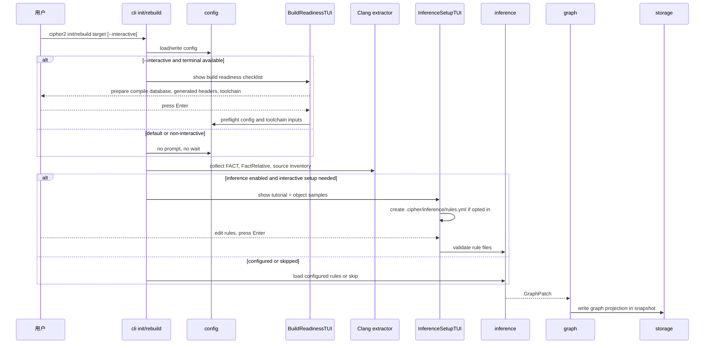
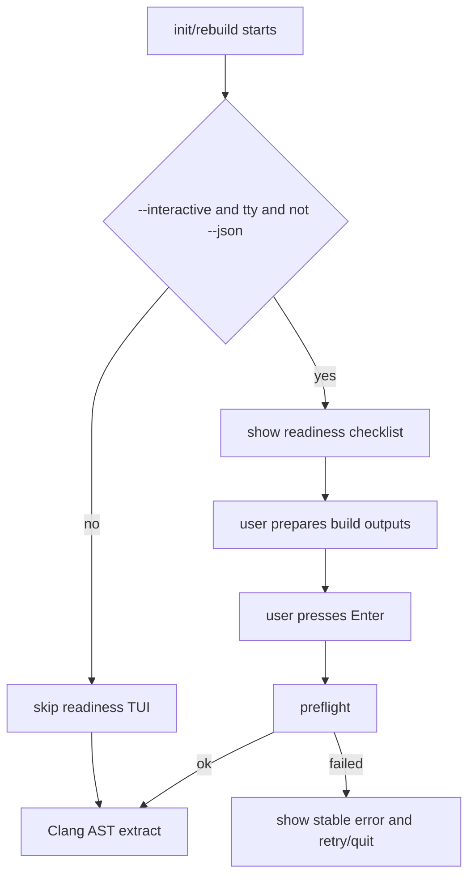
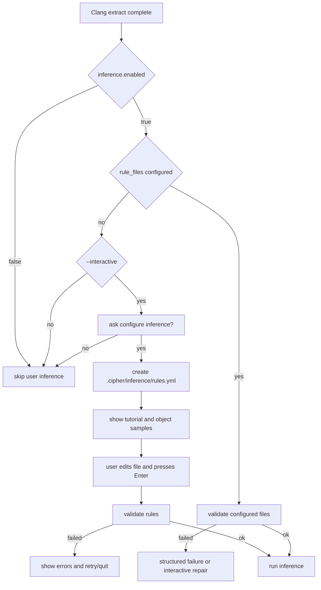
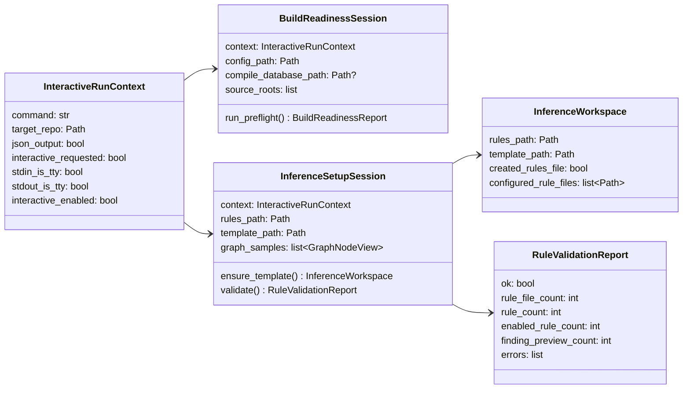
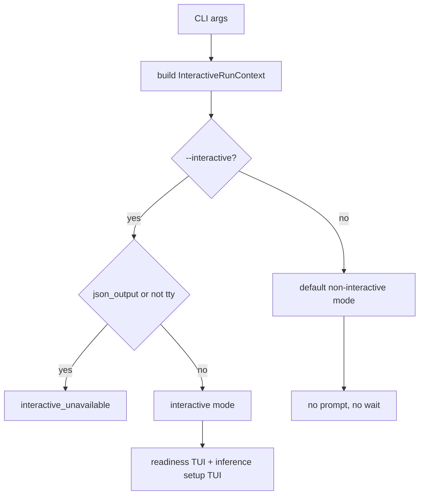
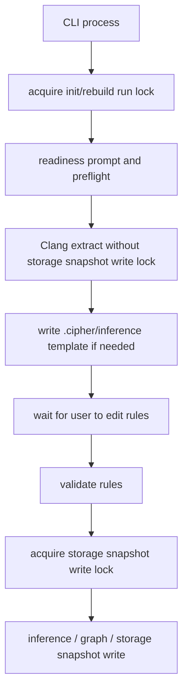

# CLI Interactive Inference Setup 设计草稿

## 状态

- 日期：2026-05-27
- 状态：设计已合入，README 搬迁中，待实现
- 范围：`cipher2 init --interactive` / `cipher2 rebuild --interactive` 的交互式工程准备提示、`.cipher/inference/` 规则工作区、规则填写教程、等待用户确认、规则校验、进入 inference 和 Graph 构建

本设计只定义 init/rebuild 的交互式入口和规则文件工作区，不改变 `tools/views` 的职责。`tools/views` 只展示运行后的状态、统计和错误码；不负责教程、不等待用户输入、不参与规则填写。

## 模块定位

- `src/cipher2/cli.py`：解析显式 `--interactive` 参数并检测交互式终端，驱动 init/rebuild 的 line-oriented TUI，负责询问、展示教程、等待用户按 Enter 和渲染错误。
- `src/cipher2/initializer/`：拆分工程准备、Clang 抽取、inference setup、Graph patch 和 snapshot 写入阶段。
- `src/cipher2/initializer/inference/`：生成规则模板、校验规则文件、返回校验报告、执行规则。
- `src/cipher2/config/`：允许 `inference.rule_files` 指向 `.cipher/inference/*.yml`；继续禁止 `.cipher/snapshots`、`.cipher/log`、`.cipher/run` 和 `.cipher/config.yml`。
- `src/cipher2/tools/log/`：记录交互式 setup、模板生成、规则校验和跳过原因。
- `src/cipher2/tools/views/`：展示 inference setup 后的核心统计，不承接 TUI 教程。

递归文档更新终点包括 `README.md`、`docs/user-guide.md`、`docs/maintenance-guide.md`、`src/README.md`、`src/cipher2/README.md`、`src/cipher2/config/README.md`、`src/cipher2/initializer/README.md`、`src/cipher2/initializer/inference/README.md`、`src/cipher2/tools/log/README.md`、`src/cipher2/tools/views/README.md` 和 `tests/README.md`。

## 规格与约束

本功能不新增持久配置项，但新增非持久 CLI 参数并修改既有配置项的取值范围。默认 `cipher2 init` 和 `cipher2 rebuild` 必须继续 fire-and-forget，不因为 stdout/stdin 是 TTY 而自动等待用户输入。

| CLI 参数 | type | 默认值 | 作用 | 生效时机 | 非法组合处理 |
|---|---|---|---|---|---|
| `--interactive` | `bool flag` | `false` | 显式启用工程准备和 inference setup TUI | init/rebuild CLI | 与 `--json` 同时使用或 stdin/stdout 非 TTY 时返回 `CliError(code="interactive_unavailable")` |

| 配置项 | type | 取值范围 | 默认值 | 作用 | 生效时机 | 非法值处理 |
|---|---|---|---|---|---|---|
| `inference.enabled` | `bool` | `true` 或 `false` | `true` | 控制是否允许 inference setup 和规则执行 | init/rebuild | `ConfigError(code="invalid_config")` |
| `inference.rule_files` | `list[str]` | 目标仓库内相对路径；允许 `.cipher/inference/*.yml`；禁止 `.cipher/snapshots/**`、`.cipher/log/**`、`.cipher/run/**`、`.cipher/config.yml`、绝对路径和 `..` | `[]` | 指定规则文件；交互式 opt-in 后写入 `.cipher/inference/rules.yml` | config 加载和交互式 setup | `ConfigError(code="invalid_inference_rule_file")` |

生成文件约束：

| 路径 | 类型 | 归属 | 规则 |
|---|---|---|---|
| `.cipher/inference/rules.yml` | 用户填写规则 | 用户维护，cipher 可创建模板 | 不随 snapshot 轮转；不得被 rebuild 自动覆盖已有内容 |
| `.cipher/inference/rules.template.yml` | 示例模板 | cipher 生成 | 可覆盖；只作为教程素材，不参与执行 |

交互约束：

- 只有用户显式传入 `--interactive`、stdout/stdin 均为 TTY 且未使用 `--json` 时，才允许进入交互式 TUI；`--no-log` 只关闭日志，不改变交互行为。
- 未传 `--interactive` 时，即使 stdout/stdin 是 TTY，也不得提示、不得等待、不得生成规则模板、不得修改 `inference.rule_files`。
- 非交互模式不得等待 Enter，不得生成规则模板，不得修改 `inference.rule_files`。
- `--json` 必须保持机器可读；所有 inference setup 状态只能进入 structured result 或 log，不进入交互式文本。
- 用户按 Enter 只表示“开始校验”，不是无条件通过。规则解析、regex、relation kind、重复 rule id、limit 配置都必须校验通过后才进入建图。
- 如果用户选择不配置 inference，系统跳过用户规则，但仍构建基础 Graph projection。
- 如果用户配置了不存在的规则文件，非交互模式必须结构化失败；交互模式可提示用户创建或修复。
- init/rebuild 不执行用户构建命令、不执行 shell、不打开任意编辑器；只提示用户在另一个终端或编辑器中准备工程和编辑规则文件。

## 规则工作区

推荐结构：

```text
.cipher/
  config.yml
  inference/
    rules.yml
    rules.template.yml
  log/
  snapshots/
  run/
```

模板初始内容必须是可解析、默认无 finding 的安全 YAML：

```yaml
rules:
  - rule_id: example.lifecycle.alloc_to_free
    enabled: false
    from_match: "^alloc_.*"
    to_match: "^free_.*"
    relation_kind: lifecycle
    payload:
      lifecycle_domain: memory
      from_role: allocate
      to_role: free
      obligation: must_release
```

`rules.yml` 已存在时不得覆盖；只在文件缺失时创建。教程必须告诉用户：把 `enabled` 改为 `true` 前，应先确认对象名样例能匹配当前工程抽取结果。

## 运行流程

### 总流程



### 工程准备阶段



工程准备 TUI 必须明确说明用户需要先完成：

- 生成或更新 `compile_commands.json`。
- 生成 `config.h`、协议文件、自动生成 header/source 等构建产物。
- 确保 include path、宏、目标 ABI 参数完整。
- 确保 LLVM/Clang 16 和 GCC 10.5.0 可用。

preflight 不替用户构建工程，只做只读校验。Clang AST 失败仍然 fail-closed，不降级到 lightweight parser。

### Inference 规则填写阶段



## 数据结构

本节“成员表”是 class 成员清单，不是数据库表。



### `InteractiveRunContext` 成员表

| 成员名称 | type | 作用 | 并发粒度 |
|---|---|---|---|
| `command` | `str` | `init` 或 `rebuild` | CLI 调用级，只读 |
| `target_repo` | `Path` | 目标仓库根目录 | CLI 调用级，只读 |
| `json_output` | `bool` | 是否启用机器可读输出 | CLI 调用级，只读 |
| `interactive_requested` | `bool` | 用户是否显式传入 `--interactive` | CLI 调用级，只读 |
| `stdin_is_tty` | `bool` | stdin 是否可交互 | CLI 调用级，只读 |
| `stdout_is_tty` | `bool` | stdout 是否可交互 | CLI 调用级，只读 |
| `interactive_enabled` | `bool` | `interactive_requested and stdin_is_tty and stdout_is_tty and not json_output` 的结果 | CLI 调用级，只读 |

### `BuildReadinessSession` 成员表

| 成员名称 | type | 作用 | 并发粒度 |
|---|---|---|---|
| `context` | `InteractiveRunContext` | 当前 CLI 交互上下文 | session 级，只读 |
| `config_path` | `Path` | `.cipher/config.yml` | 文件级 |
| `compile_database_path` | `Path or None` | 待校验 compile database | 文件级，只读 |
| `source_roots` | `list[Path]` | 本次抽取范围 | session 级，只读 |
| `run_preflight()` | `callable` | 校验工程准备状态 | session 级，串行 |

### `InferenceSetupSession` 成员表

| 成员名称 | type | 作用 | 并发粒度 |
|---|---|---|---|
| `context` | `InteractiveRunContext` | 当前 CLI 交互上下文 | session 级，只读 |
| `rules_path` | `Path` | 默认 `.cipher/inference/rules.yml` | 文件级 |
| `template_path` | `Path` | 默认 `.cipher/inference/rules.template.yml` | 文件级 |
| `graph_samples` | `list[GraphNodeView]` | 从抽取结果中选取的对象名样例 | session 级，只读 |
| `ensure_template()` | `callable` | 创建工作区和模板，必要时写 config | 文件级，受 storage/config 锁保护 |
| `validate()` | `callable` | 解析并校验规则 | session 级，串行 |

### `InferenceWorkspace` 成员表

| 成员名称 | type | 作用 | 并发粒度 |
|---|---|---|---|
| `rules_path` | `Path` | 用户编辑的规则文件 | 文件级 |
| `template_path` | `Path` | 示例模板文件 | 文件级 |
| `created_rules_file` | `bool` | 本次是否创建新 rules 文件 | session 级 |
| `configured_rule_files` | `list[Path]` | 写入或读取的规则路径 | 配置快照级 |

### `RuleValidationReport` 成员表

| 成员名称 | type | 作用 | 并发粒度 |
|---|---|---|---|
| `ok` | `bool` | 是否允许进入 inference 执行 | validation 调用级 |
| `rule_file_count` | `int` | 规则文件数量 | validation 调用级 |
| `rule_count` | `int` | 总规则数 | validation 调用级 |
| `enabled_rule_count` | `int` | 启用规则数 | validation 调用级 |
| `finding_preview_count` | `int` | 可选 preview 命中数，不写 Graph | validation 调用级 |
| `errors` | `list[InitError or InferenceError]` | 稳定错误码和短消息 | validation 调用级 |

## 对外接口

### CLI 行为

`cipher2 init <target>` 和 `cipher2 rebuild <target>` 默认保持非交互行为。只有显式加入 `--interactive` 才进入 TUI：

```bash
cipher2 init /path/to/repo --interactive
cipher2 rebuild /path/to/repo --interactive
```



### Python API

`initialize_repository()` 不应直接读 stdin/stdout。交互式能力由 CLI 层注入 controller；测试可传 fake input/output。后续 README 搬迁时应明确内部接口，例如：

```python
initialize_repository(
    target_repo,
    source_roots=None,
    profile=None,
    log_enabled=None,
    interactive_controller=None,
)
```

`interactive_controller=None` 表示非交互。该参数是运行期依赖注入，不是持久配置项。

## 并发控制



- 等待用户准备工程或编辑规则时，可以持有轻量 init/rebuild run lock 以避免多个写流程竞争，但不得持有 storage snapshot 写锁，避免阻塞只读查询。
- 写 `.cipher/inference/rules.yml` 和 `.cipher/config.yml` 必须使用原子写入。
- 同一目标仓库同一时间只能有一个 init/rebuild 进入写入阶段；冲突返回 `storage_lock_busy` 或等价稳定错误。
- 规则校验和 inference 执行在单次 snapshot 构建内使用同一配置快照。
- 在线临时增量不重跑交互式 setup；规则文件变更只在下一次 init/rebuild 生效。

## 可观测性与 Views

新增或扩展 log 事件：

| channel | event_name | 关键 counts/payload | 说明 |
|---|---|---|---|
| `cli` | `cli.interactive_prompt` | `prompt_kind`、`interactive_enabled` | 展示 readiness 或 inference setup 提示 |
| `initializer` | `initializer.build_readiness` | `source_root_count`、`has_compile_database`、`preflight_error_count` | 工程准备校验结果 |
| `inference` | `inference.workspace_prepared` | `created_rules_file`、`rule_file_count` | `.cipher/inference` 工作区状态 |
| `inference` | `inference.rule_validation` | `rule_count`、`enabled_rule_count`、`error_count` | Enter 后规则校验结果 |
| `inference` | `inference.setup_skipped` | `reason` | 用户选择跳过、非交互、禁用或空规则 |

`tools/views` 只新增运行后统计，不展示教程：

- `inference_workspace_state`：`missing`、`template_only`、`configured`、`invalid`。
- `rules_path_count`、`rule_count`、`enabled_rule_count`。
- `latest_validation_error_code`。
- `setup_skipped_reason`。
- `last_interactive_prompt_at`。

可观测用例看护：

- `--interactive` 用户选择配置并校验成功，log 中必须出现 workspace prepared 和 rule validation ok，views 显示 `configured`。
- `--interactive` 用户选择跳过，log 中必须出现 `inference.setup_skipped reason=user_declined`，views 显示 skipped reason。
- `--json` 或非 TTY 不得出现 prompt 事件，且命令不阻塞。
- 规则非法时，log/views 必须呈现稳定错误码，不包含 traceback、源码正文或绝对路径泄露。

## 测试与门禁

开发阶段必须遵守 TDD。实现 PR 首批失败测试应覆盖：

- 默认 TTY init/rebuild 不提示、不等待、不生成 `.cipher/inference/rules.yml`。
- `--interactive` init/rebuild 展示工程准备提示，并在 Enter 后才进入 Clang extract。
- 非 TTY 和 `--json` 不提示、不等待、不生成 `.cipher/inference/rules.yml`；显式 `--interactive` 与这些模式组合时返回 `interactive_unavailable`。
- 用户 opt-in 时创建 `.cipher/inference/rules.yml` 和 `rules.template.yml`，并更新 `inference.rule_files`。
- 已存在 `rules.yml` 时不得覆盖。
- `.cipher/inference/*.yml` 路径允许，`.cipher/snapshots/**`、`.cipher/log/**`、`.cipher/run/**` 禁止。
- 用户按 Enter 后规则校验失败，命令返回稳定错误并保留可修复文件。
- 用户选择跳过时仍写基础 Graph projection。
- log/views 可观测字段覆盖成功、跳过、失败三类路径。

覆盖要求：

| 覆盖项 | 要求 |
|---|---|
| 功能点覆盖率 | 100% |
| 异常分支覆盖率 | 90% 以上 |
| 场景用例覆盖率 | 默认 TTY fire-and-forget、`--interactive` opt-in、`--interactive` opt-out、`--interactive` retry、非 TTY、`--json`、缺失规则、非法规则、已存在规则、路径逃逸全部覆盖 |

建议新增测试：

- `tests/test_cli_interactive_build_readiness.py`
- `tests/test_cli_interactive_inference_setup.py`
- `tests/test_config_inference_workspace_paths.py`
- `tests/test_inference_workspace_template.py`
- `tests/test_inference_setup_observability.py`
- `tests/test_views_inference_workspace.py`

性能和小型化看护：

| 场景 | 输入规模 | 内存预算 | 必跑命令 |
|---|---|---|---|
| 小 | 1,000 GraphNodeViews、100 rules、交互 controller fake streams | 512MB | `PYTHONPATH=src python3 scripts/inference_performance_gate.py --scenario small` |
| 中 | 100,000 GraphNodeViews、100 rules、无交互等待 | 4GB | `PYTHONPATH=src python3 scripts/inference_performance_gate.py --scenario medium` |
| 大 | 1,000,000 GraphNodeViews、100 rules、无交互等待 | 8GB | `PYTHONPATH=src python3 scripts/inference_performance_gate.py --scenario large` |

实现 PR 必须运行：

```bash
git diff --check
PYTHONPATH=src python3 -m unittest discover -s tests
PYTHONPATH=src python3 scripts/inference_performance_gate.py --scenario small
PYTHONPATH=src python3 scripts/inference_performance_gate.py --scenario medium
PYTHONPATH=src python3 scripts/inference_performance_gate.py --scenario large
```

## PR 拆分

1. 设计 PR：只新增本草稿并更新设计草稿索引。
2. README 搬迁 PR：搬迁到 CLI、initializer、config、inference、log、views 和用户文档，并递归更新到顶层。
3. 实现 PR：按 TDD 实现交互 controller、规则工作区、路径校验、日志、views 和性能门禁。
