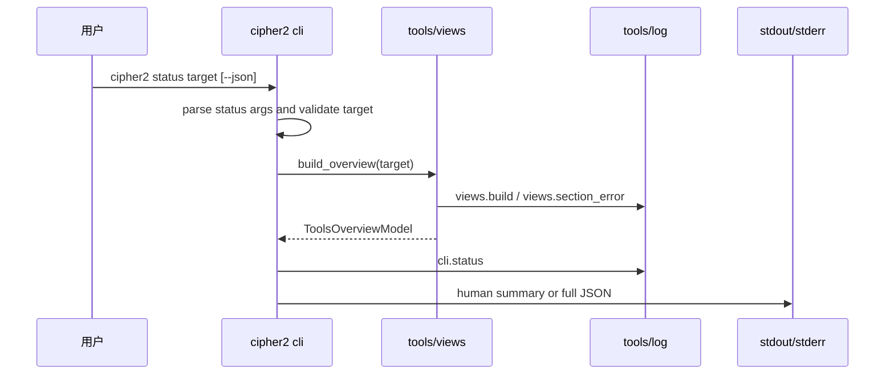
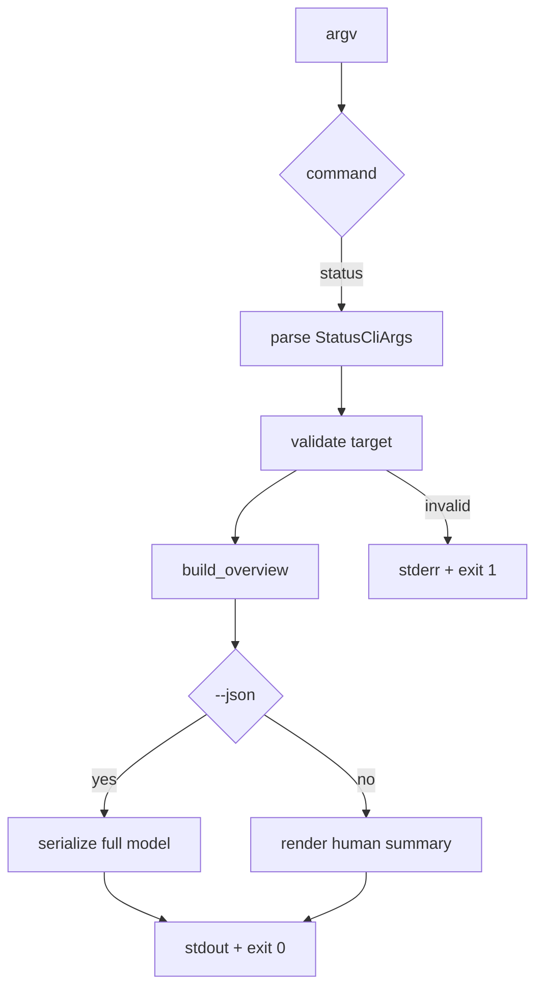
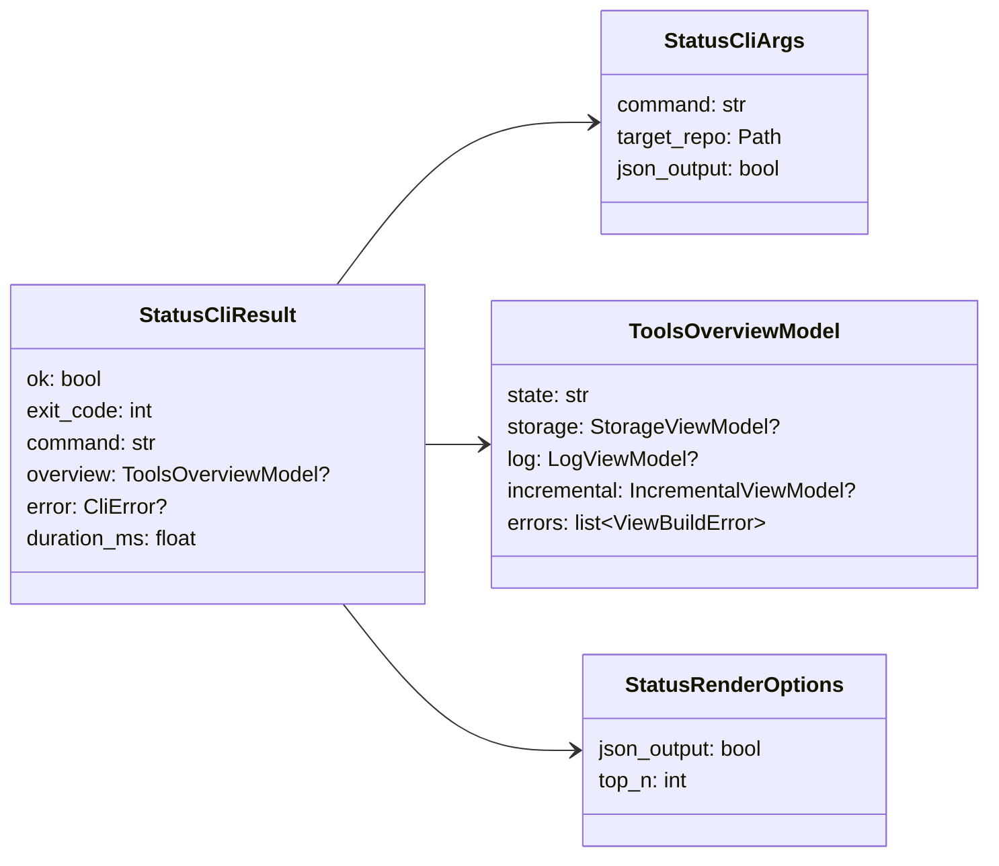

# cipher2 status CLI 设计草稿

- 状态：设计已合入，README 搬迁中，待实现
- 关联 issue：#43
- 范围：新增 `cipher2 status` 只读命令，把 `tools/views.build_overview()` 的 storage/log/incremental 状态呈现给用户

## 模块定位

- `src/cipher2/cli.py`：新增 `status` 子命令解析、调用 views、human/JSON 渲染和 `cli.status` 可观测事件。
- `src/cipher2/tools/views/`：复用既有 `build_overview()`、`ToolsOverviewModel`、`StorageViewModel`、`LogViewModel` 和 `IncrementalViewModel`；本功能不改变 views 内部聚合逻辑。
- `src/cipher2/tools/log/`：继续承载 `views.build`，新增 CLI 层 `cli.status` 事件。
- `README.md`、`docs/user-guide.md`、`src/cipher2/README.md`、`tests/README.md`：README 搬迁阶段递归更新 status 用法和测试门禁。

## 规格和约束

本功能不新增用户可配持久配置项，不修改 `.cipher/config.yml`，不新增 MCP tool，不运行 extractor，不写 snapshot，不执行 `init/rebuild`。

新增非持久 CLI 参数如下：

| 配置项 | type | 取值范围 | 默认值 | 作用 | 生效时机 | 非法值处理 |
|---|---|---|---|---|---|---|
| `command` | `str` | `status` | 必填 | 选择只读状态命令 | CLI 解析 | unknown command 返回 exit 2 |
| `target` | `Path` | 存在且可读目录 | 必填 | 目标仓库根目录 | CLI 解析后 | `CliError(code="invalid_target")` |
| `--json` | `bool flag` | `true/false` | `false` | 输出完整 `build_overview` JSON | 渲染阶段 | argparse 处理 |

行为约束：

- `cipher2 status /path/to/repo` 输出 human 多行摘要，面向终端阅读。
- `cipher2 status /path/to/repo --json` 输出完整 `ToolsOverviewModel` JSON；字段来自 `dataclasses.asdict()`，不得手工删减 section。
- status 可在没有 snapshot 的仓库运行，输出 `storage: empty` 或 section error；不得为了可读性自动初始化仓库。
- stdout 只写 status 结果；失败诊断写 stderr。human 输出不使用 ANSI 颜色或终端控制符。
- CLI 日志不得记录绝对 target path、源码正文、完整 query、traceback 或 secret。human stdout 可以显示用户输入的 target。

## 接口流程





## 数据结构



本节“成员表”是 class/dataclass 成员清单，不是数据库表。

### `StatusCliArgs` 成员表

| 成员名称 | type | 作用 | 并发粒度 |
|---|---|---|---|
| `command` | `str` | 固定为 `status` | 请求级 |
| `target_repo` | `Path` | 目标仓库根目录 | 请求级只读 |
| `json_output` | `bool` | 是否输出完整 JSON | 请求级 |

### `StatusCliResult` 成员表

| 成员名称 | type | 作用 | 并发粒度 |
|---|---|---|---|
| `ok` | `bool` | status 命令是否完成 | 响应实例级 |
| `exit_code` | `int` | 进程退出码 | 响应实例级 |
| `command` | `str` | 固定为 `status` | 响应实例级 |
| `overview` | `ToolsOverviewModel or None` | views 聚合结果 | 响应实例级 |
| `error` | `CliError or None` | CLI 层失败 | 响应实例级 |
| `duration_ms` | `float` | CLI 包装耗时 | 响应实例级 |

### `StatusRenderOptions` 成员表

| 成员名称 | type | 作用 | 并发粒度 |
|---|---|---|---|
| `json_output` | `bool` | 选择 JSON 或 human 渲染 | 请求级 |
| `top_n` | `int` | human 输出中 dict/list 摘要上限；固定为 5，不暴露 CLI 参数 | 请求级 |

## Human 输出

Human 输出固定为可扫描的多行文本：

```text
cipher-2 status: /path/to/repo
state: ready

storage: ready
  snapshot: sha256-abc123
  facts: 1,234  relatives: 5,678
  field_read: 890  field_write: 456
  sources: 133  profiles: debug

log: warning
  events: 42  channels: cli, config, initializer, storage
  errors: clang_ast_failed(3)
  latest: 2026-05-27T11:36:47Z

incremental: ready
  base: sha256-abc123  overlay: -
  dirty: 0  pending: 0  failed: 0
```

缺失 section 使用 `-`，section error 显示稳定 `code`，不得显示 traceback。

## 并发控制

- status 是只读命令，不持有 snapshot 写锁，不创建或移动 `snapshots/current`。
- storage snapshot、临时 overlay 和 log JSONL 的读并发由既有 storage/log/views 处理；status 不新增跨模块锁。
- 各 section 允许读取到不同时间点的状态；`generated_at` 标识本次 overview 构建时间。
- `cli.status` 日志写失败不得影响 status 输出或退出码。

## 可观测性

- `views.build`：复用既有事件，记录 include section 数、overview state 和 error_count。
- `views.section_error`：复用既有事件，记录 section 失败。
- `cli.status`：新增事件，`channel="cli"`、`status="ok"`，counts 写 `section_count`、`error_count`，payload 写 `operation="status"`、`outcome="rendered"`、`command_name="status"`、`json_output` 和 `overview_state`。
- `cli.error`：复用既有失败事件；status 解析后失败写 `command_name="status"`。
- views 中应能通过 log section 看到 `cli.status` 事件和状态命令次数。

## 测试门禁

README 搬迁 PR 合入后，TDD 实现 PR 首批失败测试必须覆盖：

- parser：`status target`、`status target --json`、unknown flag、missing target。
- human 输出：storage/log/incremental 三 section、empty snapshot、section error、无 ANSI、无 traceback。
- JSON 输出：完整 `ToolsOverviewModel`，包含 `state`、`storage`、`log`、`incremental`、`errors`。
- 错误分支：invalid target、views section error 不导致整个 status 失败、log write failure 不破坏输出。
- 可观测性：`cli.status` 写入 log；views log section 能看到 `cli.status` 事件；日志不记录绝对 target path。
- 场景组合：无 `.cipher/`、已有 snapshot、存在 log warning、存在 incremental overlay、`--json` 与 human 两种输出。
- 覆盖矩阵：更新 `tests/test_cli_coverage_matrix.py`，必要时更新 `tests/test_views_coverage_matrix.py`。

性能和小型化看护：

| 场景 | 输入规模 | 预算 |
|---|---|---|
| 小（512MB） | 1k facts / 1k log events | status 单次 < 1s，峰值 < 64MB |
| 中（4GB） | 100k facts / 100k log events | status 单次 < 10s，峰值 < 256MB |
| 大（8GB） | 1M facts / 1M log events | status 单次 < 90s，峰值 < 512MB |

实现 PR 必须补充或扩展 `scripts/cli_performance_gate.py`，覆盖 `cipher2 status` human 与 JSON 渲染路径。上仓前必须运行全量 unittest、CLI 相关测试和性能门禁。

## 递归文档更新

设计 PR 合入后，README 搬迁 PR 必须更新：

- `README.md`
- `docs/user-guide.md`
- `docs/maintenance-guide.md`
- `src/cipher2/README.md`
- `src/cipher2/tools/views/README.md`
- `tests/README.md`
- `scripts/README.md`

README 搬迁 PR 合入后才能进入 TDD 实现 PR。实现完成后提 PR，PR 合入视为维护者确认。
