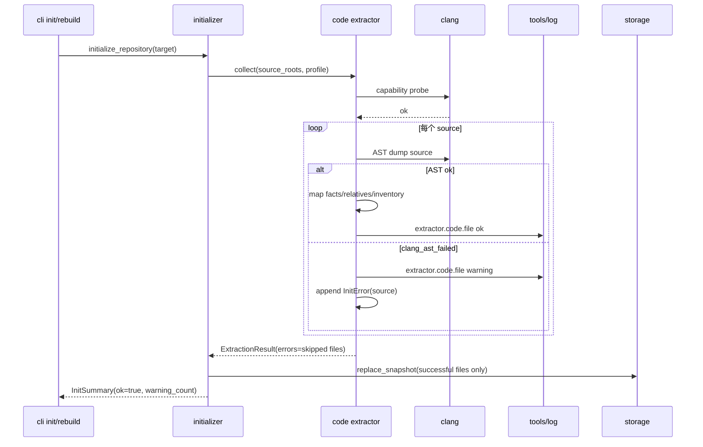
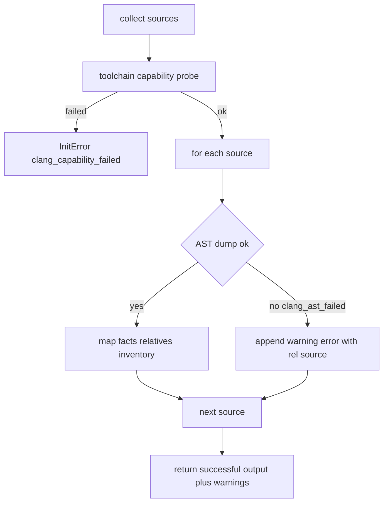
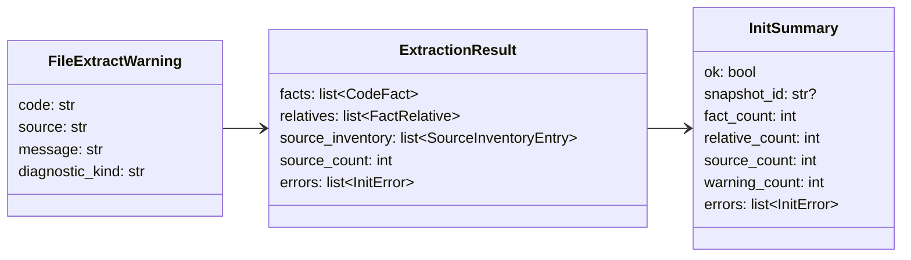

# 文件级 Clang AST Best-effort 设计草稿

## 状态

- 日期：2026-05-27
- 状态：设计已合入，README 搬迁 PR 待合入
- 来源：GitHub Issue #39 补充评论
- 范围：在已设计的 Clang AST JSON capability probe 基础上，把单文件 AST 失败从全局 fail-closed 调整为 best-effort warning。

## 模块定位

- `src/cipher2/initializer/extractor/code/`：工具链 capability probe 仍 fail-closed；单个 source AST dump 失败时跳过该文件，生成 warning error evidence，并继续处理其他文件。
- `src/cipher2/initializer/`：`InitSummary.warning_count` 和 `InitSummary.errors` 承载跳过文件列表；只要至少一个 source 成功或没有阻断错误，`initialize_repository()` 可以写入 snapshot。
- `src/cipher2/tools/log/`：记录文件级 warning，不泄漏完整 clang stderr、源码正文或绝对路径。
- `src/cipher2/tools/views/`：通过 log section 呈现 skipped source、warning_count 和 `clang_ast_failed`。
- `src/cipher2/storage/`：只接收成功抽取文件的 facts/relatives/source inventory；不为失败文件创建不完整 fact。

递归文档更新终点包括 `README.md`、`docs/user-guide.md`、`docs/maintenance-guide.md`、`tests/README.md`、`src/cipher2/initializer/README.md`、`src/cipher2/initializer/extractor/README.md`、`src/cipher2/initializer/extractor/code/README.md`、`src/cipher2/tools/log/README.md` 和 `src/cipher2/tools/views/README.md`。

## 规格与约束

本功能不新增用户可配配置项，不新增 CLI 参数，不新增 MCP 工具。

| 配置项 | type | 取值范围 | 默认值 | 作用 |
|---|---|---|---|---|
| 无新增配置 | n/a | n/a | n/a | 文件级 best-effort 始终启用 |

错误边界：

- `clang_unavailable`、`clang_capability_failed`、malformed compile database、非法 source root、path escape 和 storage 写入失败仍是阻断错误。
- 单文件 `_load_ast_json()` 返回 `clang_ast_failed` 时不抛出到 initializer 顶层；该 source 被跳过，错误加入 `ExtractionResult.errors`。
- `InitSummary.ok` 保持 `true`，`warning_count == len(errors)`。
- `InitSummary.errors[*].source` 必须是仓库相对路径，不得是绝对路径。
- 如果所有 source 都因 `clang_ast_failed` 被跳过，仍允许写入空或部分 metadata snapshot；`warning_count` 必须等于失败 source 数。该策略用于真实仓库在 include path 不完整时仍可服务可解析文件。
- warning 文件不得进入 `source_inventory`，避免 snapshot 声称该文件已成功分析。

## 接口流程





## 数据结构

本节“成员表”是内部 class/dataclass 成员清单，不是数据库表。



### `ExtractionResult` 成员表

| 成员名称 | type | 作用 | 并发粒度 |
|---|---|---|---|
| `facts` | `list[CodeFact]` | 成功文件产出的 facts | 单次 collect |
| `relatives` | `list[FactRelative]` | 成功文件产出的关系 | 单次 collect |
| `source_inventory` | `list[SourceInventoryEntry]` | 成功文件 inventory；失败文件不进入 | 单次 collect |
| `source_count` | `int` | 输入 source 总数，包含失败文件 | 单次 collect |
| `errors` | `list[InitError]` | 文件级 warning 列表 | 单次 collect |

### `InitSummary` 相关成员表

| 成员名称 | type | 作用 | 并发粒度 |
|---|---|---|---|
| `warning_count` | `int` | 文件级 warning 数 | 单次 init/rebuild |
| `errors` | `list[InitError]` | 跳过文件及错误码 | 单次 init/rebuild |
| `source_count` | `int` | 输入 source 总数 | 单次 init/rebuild |

### `FileExtractWarning` 成员表

| 成员名称 | type | 作用 | 并发粒度 |
|---|---|---|---|
| `code` | `str` | 固定为 `clang_ast_failed` | 单 source |
| `source` | `str` | 仓库相对路径 | 单 source |
| `message` | `str` | 有界摘要 | 单 source |
| `diagnostic_kind` | `str` | `fatal`、`malformed_ast`、`timeout` 或 `unknown` | 单 source |

## 对外接口

- CLI JSON 输出继续使用现有 `warning_count`；若已有错误列表输出，只输出相对 source 和稳定 code。
- Python API `InitSummary.errors` 返回文件级 warning；调用方不得把该列表视为 `ok=false`。
- MCP `search/detail` 不变。
- views 不新增 section，通过 log section 的 recent row 和 error code 聚合呈现。

## 并发控制

- 单次 collect 内的 warnings 只追加到局部 `errors` list，不共享全局状态。
- 文件级失败不提前释放或发布 snapshot；仍由 initializer 在 collect 完成后一次性调用 storage。
- storage 原子发布和 snapshot 锁不变。

## 可观测性

文件级失败写 `extractor.code.file`，而不是只写 `extractor.code.error`：

| event | status | error_code | counts | payload |
|---|---|---|---|---|
| `extractor.code.file` | `warning` | `clang_ast_failed` | `fact_count=0`、`relative_count=0`、`warning_count=1` | `operation=extract_file`、`outcome=skipped`、`source_kind`、`profile` |
| `initializer.run` | `ok` | `null` | `warning_count=<skipped files>` | `outcome=written` |

日志和 views 必须满足：

- recent events 可看到哪个相对 source 被跳过的脱敏 subject。
- error code 聚合包含 `clang_ast_failed`。
- 不记录完整 clang stderr、源码正文、绝对 target path、traceback、include path secret 或环境变量。

## 测试门禁

README 搬迁 PR 合入后，TDD 实现 PR 首批失败测试必须覆盖：

- capability probe 失败仍阻断 init。
- 单文件 AST 失败时，其他文件继续抽取并写入 snapshot。
- 多个文件全部 AST 失败时，init 返回 `ok=true`、`warning_count==source_count`，snapshot 为空或仅有可安全生成的全局 metadata。
- `InitSummary.errors` 包含 `InitError(code="clang_ast_failed", source="<rel path>")`。
- `extractor.code.file` warning 事件包含 `error_code=clang_ast_failed`、`outcome=skipped`、`warning_count=1`。
- `initializer.run` 仍为 ok，并聚合 warning_count。
- views log section 展示 `clang_ast_failed` error code 和 warning row。
- 日志不泄漏绝对路径、源码正文或完整 clang stderr。

覆盖率要求：

- 功能点覆盖率 100%：成功文件、失败文件、部分成功、全部失败、summary/errors/log/views。
- 异常分支覆盖率 90%+：timeout、nonzero exit、malformed AST、missing source、log write failure。
- 场景覆盖率 100%：无 compile database、compile database 存在、source_roots 单文件、多文件、header 与 C 文件组合。

实现 PR 必须运行：

```bash
git diff --check
PYTHONPATH=src python3 -m unittest discover -s tests
PYTHONPATH=src python3 scripts/initializer_performance_gate.py
PYTHONPATH=src python3 scripts/clang_extractor_performance_gate.py
PYTHONPATH=src python3 scripts/views_performance_gate.py
```

## 分阶段 PR

1. 设计 PR：新增本草稿并更新草稿索引。
2. README 搬迁 PR：把本草稿搬迁到相关 README，并修正 #41 中“目标 AST 失败 fail-closed”的旧表述。
3. 实现 PR：按 TDD 修改测试，再实现文件级 best-effort 和可观测性。
