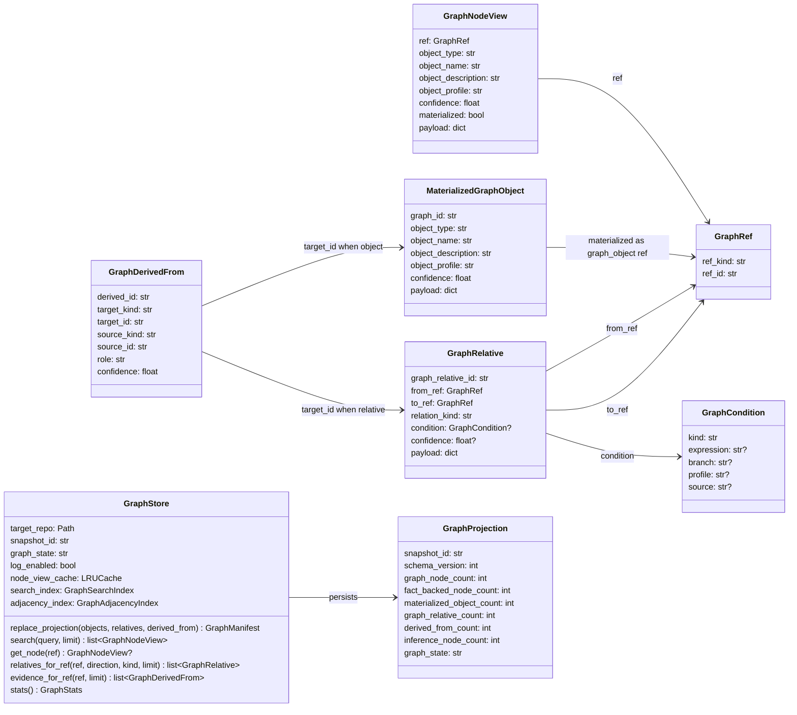
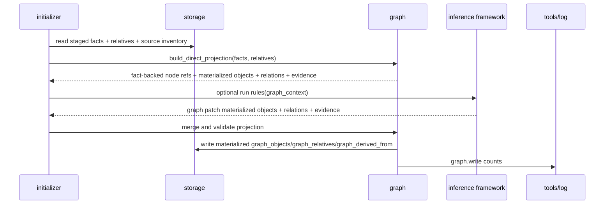
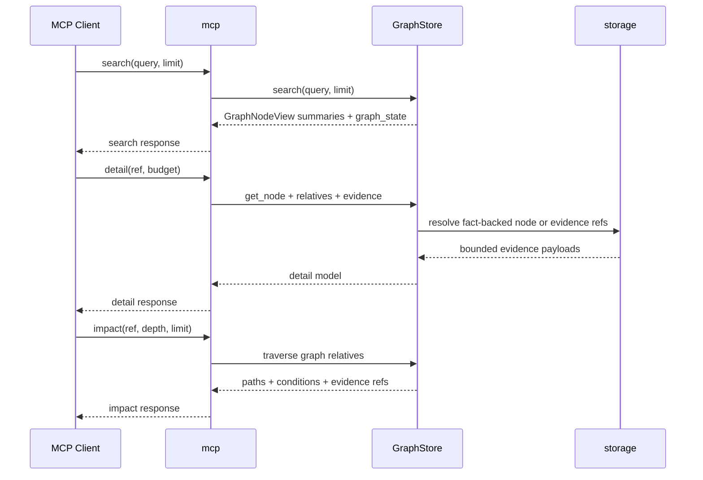
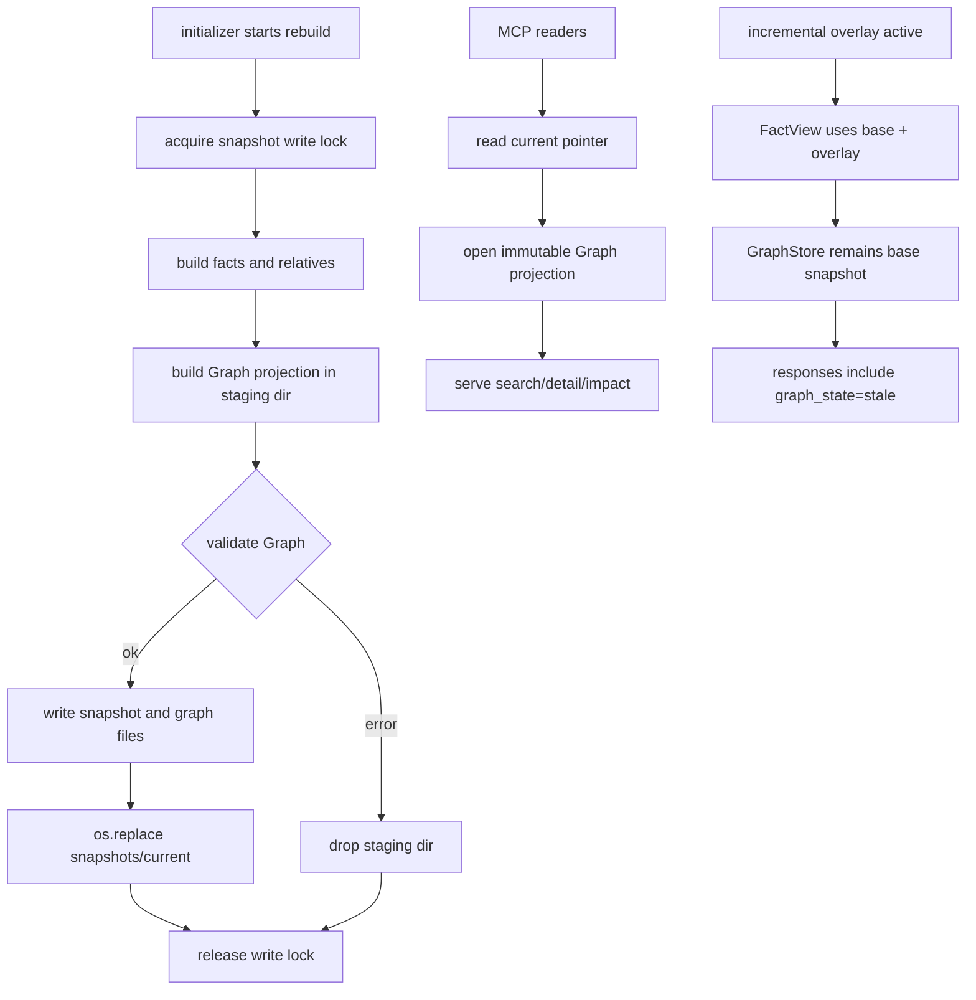

# Graph Runtime 设计草稿

## 状态

- 日期：2026-05-27
- 状态：草稿，等待设计 PR 检视
- 范围：Graph projection 运行时、Graph object、Graph relation、证据链、MCP Graph 查询、可观测和测试门禁

本设计只定义 Graph 如何承载和查询派生对象，不定义具体 inference 规则。Inference 规则框架和用户声明式规则见 `20260527-inference-rule-framework.md`。

## 模块定位

本功能新增 `src/cipher2/graph/`，作为 FACT/FactRelative 之上的派生投影层。

- `src/cipher2/graph/`：Graph 数据结构、projection store、Graph 查询、Graph stats。
- `src/cipher2/storage/`：在 snapshot 中持久化 Graph projection 文件，并校验端点和证据。
- `src/cipher2/storage/schema/`：记录 Graph 文件 schema。
- `src/cipher2/initializer/`：在全量 init/rebuild 中编排 Graph projection 构建和写入。
- `src/cipher2/mcp/`：`search/detail/impact` 读取 Graph；`relations` 不作为 MCP public tool 暴露，FactRelative 审计留在 storage 内部接口。
- `src/cipher2/tools/log/`：新增 `graph` channel。
- `src/cipher2/tools/views/`：新增 Graph section。

递归文档更新终点包括 `README.md`、`docs/README.md`、`docs/schema.md`、`docs/user-guide.md`、`docs/maintenance-guide.md`、`tests/README.md`、`src/cipher2/graph/README.md`、`src/cipher2/storage/README.md`、`src/cipher2/storage/schema/README.md`、`src/cipher2/mcp/README.md`、`src/cipher2/tools/log/README.md` 和 `src/cipher2/tools/views/README.md`。

## 规格与约束

本功能新增用户可配持久配置项，位于目标仓库 `.cipher/config.yml`。

| 配置项 | type | 取值范围 | 默认值 | 作用 | 生效时机 | 非法值处理 |
|---|---|---|---|---|---|---|
| `graph.enabled` | `bool` | `true` 或 `false` | `true` | 控制是否构建并查询 Graph projection | init/rebuild/MCP 启动 | `ConfigError(code="invalid_config")` |
| `graph.max_traversal_depth` | `int` | `0..16` | `4` | MCP `impact` 默认最大遍历深度 | MCP 参数归一化时 | `ConfigError(code="invalid_config")` |
| `graph.max_evidence_per_object` | `int` | `1..100` | `20` | 单个 GraphNodeView 或 materialized object 返回的证据上限 | Graph 构建与 `detail` | `ConfigError(code="invalid_config")` |

运行时约束：

- Collector、extractor 和 temporary incremental overlay 不得直接写 Graph。
- Graph 是派生投影，只能由 `TheFact`、`FactRelative` 和 inference framework 输出构建。
- Fact-backed Graph node 必须支持无投影直连：`function`、`global`、`type`、`macro`、`code_file` 等可搜索 fact 不复制到 `graph_objects.jsonl`，查询时虚拟成 `GraphNodeView(ref_kind="fact")`。
- `graph_objects.jsonl` 只保存 materialized graph objects，例如 inference 节点、用户规则生成对象或未来非 fact 原生对象。
- `MaterializedGraphObject(object_type="inference")` 允许存在，但其生成规则不在本文定义。
- `GraphRelative.relation_kind` 使用稳定粗粒度语义；领域细节写入 bounded payload。
- `GraphDerivedFrom` 必须解释 materialized graph object 或 Graph relation 的来源，来源可以是 fact、fact_relative 或 rule provenance。
- Fact-backed node 不需要 `GraphDerivedFrom(role="primary")`，因为 `GraphRef(ref_kind="fact")` 已经直接指向证据源。
- Graph projection 写入 `<target-repo>/.cipher/snapshots/<snapshot_id>/`，不写入源码树其他位置。
- 首版仍使用 file snapshot；SQLite 只允许作为 staging 或读侧临时索引，不引入图数据库后端。
- 在线临时增量 overlay 不实时重建 Graph；当 active `FactView` 含 overlay 时，MCP 和 views 必须暴露 `graph_state="stale"`。
- `search` 在 `graph.enabled=true` 时默认返回 GraphNodeView；`detail` 负责展开 evidence facts/relatives/rules。
- 日志、views 和 MCP 响应不得泄漏源码全文、绝对目标路径、完整用户 query、traceback、secret 或 provider internals。

## 性能 SLO 与索引策略

Graph runtime 的请求级延迟约束如下。冷启动、snapshot 打开和读侧索引构建必须单独记录，不得混入单次 MCP 请求耗时。

| 请求 | SLO | 硬约束 |
|---|---|---|
| `search(scope="graph")` | p95 <= 200ms | 不全量构造 GraphNodeView，只对返回 Top N 做投影 |
| `detail(scope="graph")` | p95 <= 50ms | 单次 evidence 上限由 `graph.max_evidence_per_object` 控制 |
| `impact` | p95 <= 1s | 达到 deadline、节点或边预算时返回 `truncated=true` |
| `detail.relative_preview` | p95 <= 50ms | 必须走 endpoint adjacency index，预览上限由 detail budget 控制 |

读侧索引策略：

- GraphStore 打开 snapshot 时按 `snapshot_id` 构建或复用只读索引：Graph search index、Graph adjacency index、materialized object index、fact id index。
- fact-backed node 使用 read-through LRU projection cache，key 为 `GraphRef`，value 为轻量 `GraphNodeView`；缓存只保存 name、description、type、profile、ref 和少量 display payload，不复制完整 FactRecord payload。
- Search 读取 Graph/fact 索引得到候选 ref，只对最终返回的 Top N 构造 GraphNodeView。
- `detail` 只按请求 ref 做 lazy projection；Graph 边预览和 `impact` 必须走 adjacency index，不得每次扫描 1M facts 构造全量 GraphNodeView。
- 缓存按 snapshot_id 失效；在线临时增量 overlay 存在时 Graph 仍读 base snapshot，并返回 `graph_state="stale"`。

`impact` 最坏情况控制：

- 默认 depth 为 4，配置允许上限 16，但遍历必须同时受 deadline 和预算限制。
- 单次 `impact` 最多访问 10,000 个 Graph refs、扫描 50,000 条 GraphRelative、保留 1,000 条路径候选，结果上限由请求 `limit` 控制。
- depth=16 只能在预算内继续；预算耗尽时停止扩展并返回 `truncation_reason`。
- `impact` 不做 100k 候选节点正则匹配，只沿 adjacency index 从 seed ref 扩展。

## Fact-backed Node 直连

Graph 查询层使用 `GraphNodeView` 作为统一节点视图。`GraphNodeView` 有两种来源：

| 来源 | ref | 是否写入 `graph_objects.jsonl` | 典型对象 | 说明 |
|---|---|---|---|---|
| fact-backed | `{"ref_kind":"fact","ref_id":"<fact_id>"}` | 否 | function、global、type、macro、code_file | 从 `FactRecord` 即时投影，只保留查询视图，不复制完整 payload |
| materialized | `{"ref_kind":"graph_object","ref_id":"<graph_id>"}` | 是 | inference node、用户规则生成对象、未来 concept | 不是原生 fact，必须写入 `graph_objects.jsonl` 并用 `GraphDerivedFrom` 解释来源 |

例如一个函数 fact 可以直接作为 Graph 节点：

```json
{
  "ref": {"ref_kind": "fact", "ref_id": "code:function:abc"},
  "object_type": "function",
  "object_name": "foo_init",
  "materialized": false
}
```

因此 fact object 不会再被完整复制一份 GraphObject。`detail(ref)` 遇到 `ref_kind="fact"` 时直接读取 `facts.jsonl`；遇到 `ref_kind="graph_object"` 时读取 `graph_objects.jsonl` 并通过 `graph_derived_from.jsonl` 回查证据。

## FactRelative 到 GraphRelative 映射

Graph builder 必须提供内置、硬编码、不可由用户配置覆盖的基础映射。用户声明式 inference rules 只能追加 GraphRelative，不能改变基础映射。

| FactRelative | GraphRelative | 方式 | 说明 |
|---|---|---|---|
| `include` | `depends_on` | 1:1 自动提升 | `code_file -> code_file`，用于文件依赖和 impact |
| `defines` | `contains` | 1:1 自动提升 | `code_file -> function/global/type/macro` |
| `declares` | `contains` | 1:1 自动提升 | payload 写 `source_relation_kind="declares"` |
| `has_field` | `contains` | 1:1 自动提升 | `type -> field` |
| `direct_call` | `calls` | 1:1 自动提升 | `function -> function` |
| `assigned_to` + `dispatches_via` | `may_call` | 合成 | 同一 slot 上的 `caller -> slot` 与 `slot -> target` 合成 `caller -> target` |

合成规则：

- `direct_call` 不与 `assigned_to`/`dispatches_via` 合并，直接生成 `calls`。
- `may_call` 只在 slot fact id 完全相同且 profile 兼容时合成。
- 合成边的 condition 是 dispatch condition 与 assignment condition 的保守合并；无法稳定合并时写 `GraphCondition(kind="unknown")`。
- 基础映射由 Graph builder 代码维护，v1 不提供用户配置项；领域自定义关系由 inference rule framework 追加。
- FactRelative 仍保留在 fact 层用于审计和 evidence；GraphRelative 是 MCP Graph traversal 和 impact 的默认关系层。

## 数据结构

本节“成员表”是 class 成员清单，不是数据库表。物理文件只在“物理文件布局”一节定义。



### `GraphRef` 成员表

| 成员名称 | type | 作用 | 并发粒度 |
|---|---|---|---|
| `ref_kind` | `Literal["fact","graph_object"]` | Graph node 来源；`fact` 表示直连 FactRecord，`graph_object` 表示 materialized graph object | ref 级、只读共享 |
| `ref_id` | `str` | `FactRecord.object_id` 或 `MaterializedGraphObject.graph_id` | ref 级、只读共享 |

Graph relation 的端点只能使用 `GraphRef(ref_kind="fact")` 或 `GraphRef(ref_kind="graph_object")`。这样 fact-backed node 无需复制成 materialized GraphObject，也可以参与 `detail.relative_preview` 和 `impact`。

### `GraphNodeView` 成员表

| 成员名称 | type | 作用 | 并发粒度 |
|---|---|---|---|
| `ref` | `GraphRef` | 查询入口引用，可直连 fact 或指向 materialized graph object | node view 级、只读共享 |
| `object_type` | `str` | `function`、`global`、`type`、`macro`、`file`、`inference` 等 | node view 级、只读共享 |
| `object_name` | `str` | 展示名和搜索字段 | node view 级、只读共享 |
| `object_description` | `str` | 有界摘要，不包含源码全文 | node view 级、只读共享 |
| `object_profile` | `str` | 生效 profile | node view 级、只读共享 |
| `confidence` | `float` | `0.0..1.0`；fact-backed node 通常为 `1.0` | node view 级、只读共享 |
| `materialized` | `bool` | 是否来自 `graph_objects.jsonl` | node view 级、只读共享 |
| `payload` | `dict[str, JSONValue]` | 轻量展示 payload；fact-backed node 不复制完整 fact payload | node view 级、只读共享 |

### `MaterializedGraphObject` 成员表

| 成员名称 | type | 作用 | 并发粒度 |
|---|---|---|---|
| `graph_id` | `str` | materialized graph object 稳定 ID | graph object 级、只读共享 |
| `object_type` | `str` | 首版主要为 `inference`，未来可扩展到非 fact 原生对象 | graph object 级、只读共享 |
| `object_name` | `str` | 展示名和搜索字段 | graph object 级、只读共享 |
| `object_description` | `str` | 有界摘要，不包含源码全文 | graph object 级、只读共享 |
| `object_profile` | `str` | 生效 profile | graph object 级、只读共享 |
| `confidence` | `float` | `0.0..1.0` | graph object 级、只读共享 |
| `payload` | `dict[str, JSONValue]` | materialized object 专属 payload，不得复制完整 fact payload | graph object 级、只读共享 |

### `GraphRelative` 成员表

| 成员名称 | type | 作用 | 并发粒度 |
|---|---|---|---|
| `graph_relative_id` | `str` | Graph relation 稳定 ID | relation 级、只读共享 |
| `from_ref` | `GraphRef` | 有向边起点，可直连 fact-backed node | relation 级、只读共享 |
| `to_ref` | `GraphRef` | 有向边终点，可直连 fact-backed node | relation 级、只读共享 |
| `relation_kind` | `str` | `calls`、`may_call`、`contains`、`defines`、`lifecycle`、`depends_on`、`explains`、`affects`、`suggests_optimization` 等粗粒度关系 | relation 级、只读共享 |
| `condition` | `GraphCondition or None` | 关系成立条件摘要 | relation 级、只读共享 |
| `confidence` | `float or None` | 关系可信度；声明式用户规则可为 `None`，表示该边是用户声明关系而非 evidence-aware 推断 | relation 级、只读共享 |
| `payload` | `dict[str, JSONValue]` | 领域扩展字段，必须 bounded | relation 级、只读共享 |

生命周期关系统一用 `relation_kind="lifecycle"`。领域含义放入 payload，例如：

| payload key | type | 作用 | 示例 |
|---|---|---|---|
| `lifecycle_domain` | `str` | 生命周期所属域 | `memory`、`lock`、`module` |
| `from_role` | `str` | 起点角色 | `allocate`、`lock`、`init` |
| `to_role` | `str` | 终点角色 | `free`、`unlock`、`exit` |
| `obligation` | `str or None` | 规则语义 | `must_release`、`must_unlock` |

### `GraphDerivedFrom` 成员表

| 成员名称 | type | 作用 | 并发粒度 |
|---|---|---|---|
| `derived_id` | `str` | 来源边稳定 ID | evidence 级、只读共享 |
| `target_kind` | `Literal["graph_object","graph_relative"]` | 被解释对象类型 | evidence 级、只读共享 |
| `target_id` | `str` | 被解释的 materialized `graph_id` 或 `graph_relative_id` | evidence 级、只读共享 |
| `source_kind` | `Literal["fact","fact_relative","rule"]` | 来源类别 | evidence 级、只读共享 |
| `source_id` | `str` | `FactRecord.object_id`、`FactRelative.relative_id` 或 rule provenance id | evidence 级、只读共享 |
| `role` | `Literal["primary","rule_source"]` | v1 只保留两类：`primary` 表示事实/关系直接来源，`rule_source` 表示用户规则来源 | evidence 级、只读共享 |
| `confidence` | `float` | 该证据对 Graph 对象或关系的贡献度 | evidence 级、只读共享 |

### `GraphCondition` 成员表

| 成员名称 | type | 作用 | 并发粒度 |
|---|---|---|---|
| `kind` | `str` | `branch`、`case`、`compile_guard`、`profile`、`path_summary`、`unknown` | condition 级、只读共享 |
| `expression` | `str or None` | 短表达式摘要 | condition 级、只读共享 |
| `branch` | `str or None` | `then`、`else`、`case 1` 等分支标签 | condition 级、只读共享 |
| `profile` | `str or None` | 适用 profile | condition 级、只读共享 |
| `source` | `str or None` | 条件来源位置或 provenance | condition 级、只读共享 |

### `GraphProjection` 成员表

| 成员名称 | type | 作用 | 并发粒度 |
|---|---|---|---|
| `snapshot_id` | `str` | Graph projection 对应的 base snapshot | snapshot 级、只读共享 |
| `schema_version` | `int` | Graph 物理 schema 版本 | snapshot 级、只读共享 |
| `graph_node_count` | `int` | GraphNodeView 总数，等于 fact-backed node 与 materialized object 之和 | snapshot 级、只读共享 |
| `fact_backed_node_count` | `int` | 可作为 Graph node 直连的 FactRecord 数量，不落 `graph_objects.jsonl` | snapshot 级、只读共享 |
| `materialized_object_count` | `int` | `graph_objects.jsonl` 中的 materialized object 数量 | snapshot 级、只读共享 |
| `graph_relative_count` | `int` | Graph relation 总数 | snapshot 级、只读共享 |
| `derived_from_count` | `int` | evidence link 总数 | snapshot 级、只读共享 |
| `inference_node_count` | `int` | `object_type="inference"` 节点数 | snapshot 级、只读共享 |
| `graph_state` | `Literal["ready","disabled","stale","error"]` | Graph 新鲜度和可用状态 | snapshot/view 级 |

### `GraphStore` 成员表

| 成员名称 | type | 作用 | 并发粒度 |
|---|---|---|---|
| `target_repo` | `Path` | 目标仓库根目录，只用于定位 `.cipher/` | store 实例级、只读共享 |
| `snapshot_id` | `str` | 当前打开的 immutable snapshot | snapshot 级、只读共享 |
| `graph_state` | `str` | `ready`、`disabled`、`stale` 或 `error` | snapshot/view 级 |
| `log_enabled` | `bool` | 是否写 `graph` channel 事件 | store 实例级 |
| `node_view_cache` | `LRUCache[GraphRef, GraphNodeView]` | fact-backed node 的 read-through 投影缓存 | snapshot 级 |
| `search_index` | `GraphSearchIndex` | Graph/fact 搜索索引，返回候选 GraphRef | snapshot 级、只读共享 |
| `adjacency_index` | `GraphAdjacencyIndex` | GraphRelative endpoint 索引，服务 detail.relative_preview 和 impact | snapshot 级、只读共享 |
| `replace_projection(objects, relatives, derived_from)` | `callable` | 写入 materialized Graph projection staging 文件 | snapshot 写入级 |
| `search(query, limit)` | `callable` | Graph 搜索入口 | 请求级 |
| `get_node(ref)` | `callable` | 按 GraphRef 读取 GraphNodeView | 请求级 |
| `relatives_for_ref(ref, direction, kind, limit)` | `callable` | Graph relation 查询入口 | 请求级 |
| `evidence_for_ref(ref, limit)` | `callable` | Graph evidence 查询入口；fact-backed node 可直接返回 fact evidence | 请求级 |
| `stats()` | `callable` | Graph 统计入口 | snapshot 读取级 |

## 对外接口流程

### Projection 构建流程



### MCP 查询流程



MCP 表面调整：

- 不新增 `graph/search`、`graph/detail`、`graph/relations` 三个独立工具，避免 tools/list 膨胀。
- `relations` 已从 MCP public tool 下线；完整 FactRelative 查询保留为 storage 内部审计接口，不增加 Graph scope，不查询 GraphRelative。
- `search(query, limit, scope)` 复用既有工具名；`scope` 取值为 `graph` 或 `fact`，`graph.enabled=true` 时默认 `graph`，否则默认 `fact`。
- `detail(ref, budget, scope)` 复用既有工具名；`scope="graph"` 时返回 GraphNodeView、bounded `relative_preview`、evidence facts/relatives/rules、condition 和 confidence；`ref_kind="fact"` 时直接读取 FactRecord。
- 新增唯一 Graph-only 工具 `impact(ref, depth, relation_kind, limit)`，沿 GraphRelative 遍历并返回有界路径。
- Graph 节点的局部边检查通过 `detail.relative_preview` 完成；跨节点影响分析通过 `impact` 完成。
- 当 `graph_state="stale"` 时，所有 Graph 结果必须标注 base snapshot 和 active overlay id。

## 并发控制



- Snapshot 写锁覆盖 facts、relatives、source inventory、Graph projection 和 `current` 指针切换。
- Graph 构建在 staging 目录中完成，校验通过后才随 snapshot 发布。
- MCP 只读 immutable projection，不在请求中触发 rebuild。
- `GraphStore` 读侧缓存按 `snapshot_id` 失效。
- 在线临时增量不修改 Graph projection，只暴露 stale 状态。

## 物理文件布局

```text
<target-repo>/.cipher/
  snapshots/
    sha256-<content_hash_prefix>/
      facts.jsonl
      relatives.jsonl
      source_inventory.jsonl
      graph_objects.jsonl
      graph_relatives.jsonl
      graph_derived_from.jsonl
      manifest.json
      stats.json
```

`graph_objects.jsonl` 只保存 materialized graph objects，不保存 fact-backed nodes。`graph_relatives.jsonl` 的端点必须使用 `GraphRef`；`ref_kind="fact"` 时 `ref_id` 必须存在于同一 snapshot 的 `facts.jsonl`，`ref_kind="graph_object"` 时 `ref_id` 必须存在于 `graph_objects.jsonl`。

`manifest.json` 和 `stats.json` 新增 `graph_node_count`、`fact_backed_node_count`、`materialized_object_count`、`graph_relative_count`、`graph_derived_from_count`、`inference_node_count`、`graph_schema_version` 和 `graph_state`。Graph 文件缺失、hash 不匹配、GraphRelative endpoint 缺失、GraphDerivedFrom source 缺失或 materialized inference 节点没有 evidence 时，读取必须返回稳定错误码。

## 可观测性与 Views

`tools/log` 新增 `graph` channel：

| event_name | 关键 counts | 说明 |
|---|---|---|
| `graph.write` | `graph_node_count`、`fact_backed_node_count`、`materialized_object_count`、`graph_relative_count`、`derived_from_count`、`inference_node_count` | snapshot Graph 写入结果 |
| `graph.validate` | `orphan_graph_relative_count`、`missing_evidence_count`、`stale_overlay_count` | Graph 校验结果 |
| `graph.search` | `result_count`、`truncated_count` | MCP search 读 Graph |
| `graph.detail` | `evidence_count`、`relative_count`、`truncated_evidence_count` | detail 展开证据 |
| `graph.impact` | `path_count`、`max_depth_seen`、`visited_ref_count`、`scanned_edge_count`、`truncated_path_count` | impact traversal |

`tools/views` 新增 Graph section，展示：

- `graph_state`、snapshot id、overlay stale 状态。
- GraphNodeView、fact-backed node、materialized object、GraphRelative、GraphDerivedFrom、inference node 总数。
- `object_type`、`relation_kind`、evidence source kind Top N。
- missing evidence、orphan GraphRelative、truncated evidence 计数。
- 最近 Graph search/detail/impact 请求数、错误码和慢操作。

## 测试与门禁

开发阶段必须遵守 TDD。Graph runtime PR 必须覆盖：

- direct Graph projection：100%。
- fact-backed node 无投影直连：100%。
- FactRelative 到 GraphRelative 的内置映射和 `may_call` 合成：100%。
- 请求级 SLO、read-through cache、adjacency index、impact deadline/预算截断：100%。
- Graph schema 写入、读取和损坏检测：100%。
- MCP `search/detail/impact` Graph 表面和 `relations` 非公开约束：100%。
- Views Graph section 和 log 事件字段：100%。
- 异常分支覆盖率：90% 以上。
- 场景覆盖：Graph disabled、Graph ready、Graph stale、FactRelative mapping、may_call synthesis、证据截断、orphan relation、missing evidence、overlay stale、impact budget exhausted。

新增测试建议：

- `tests/test_graph_record.py`
- `tests/test_graph_store.py`
- `tests/test_graph_projection.py`
- `tests/test_graph_schema_corruption.py`
- `tests/test_graph_mcp_search_detail.py`
- `tests/test_graph_mcp_impact.py`
- `tests/test_graph_incremental_stale_state.py`
- `tests/test_graph_observability.py`
- `tests/test_graph_views.py`

性能和小型化看护：

| 场景 | 输入规模 | 内存预算 | 必跑命令 |
|---|---|---|---|
| 小 | 1,000 facts、2,000 relatives、200 materialized objects | 512MB | `PYTHONPATH=src python3 scripts/graph_performance_gate.py --scenario small` |
| 中 | 100,000 facts、200,000 relatives、60,000 materialized objects | 4GB | `PYTHONPATH=src python3 scripts/graph_performance_gate.py --scenario medium` |
| 大 | 1,000,000 facts、2,000,000 relatives、600,000 materialized objects | 8GB | `PYTHONPATH=src python3 scripts/graph_performance_gate.py --scenario large` |

实现 PR 必须运行：

```bash
git diff --check
PYTHONPATH=src python3 -m unittest discover -s tests
PYTHONPATH=src python3 scripts/graph_performance_gate.py
```

## PR 拆分

1. Graph 设计 PR：只新增本草稿。
2. 文档搬迁 PR：搬迁到模块 README 和顶层文档，并二次确认无内容漂移。
3. Graph runtime 实现 PR：按 TDD 实现 Graph projection、schema、MCP、log、views 和性能门禁。

Inference rule framework 和具体领域规则必须走独立设计、文档搬迁和实现 PR。
