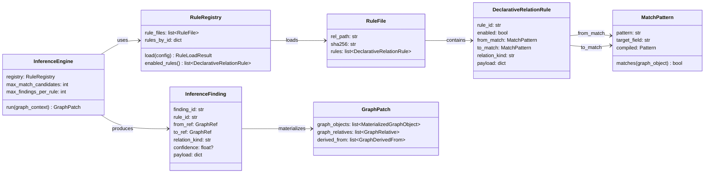
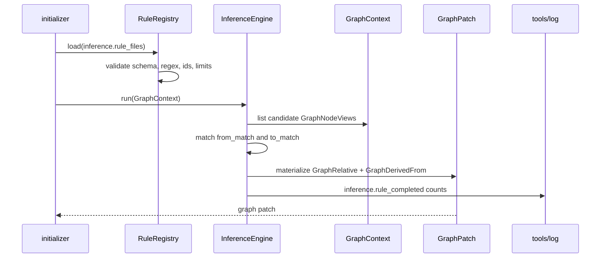
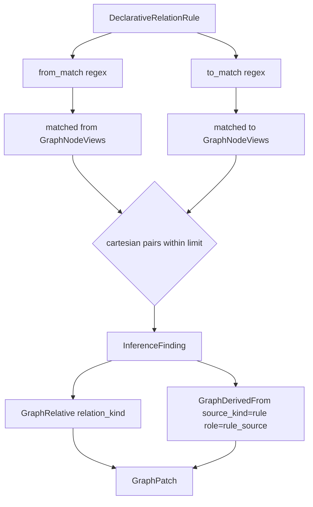
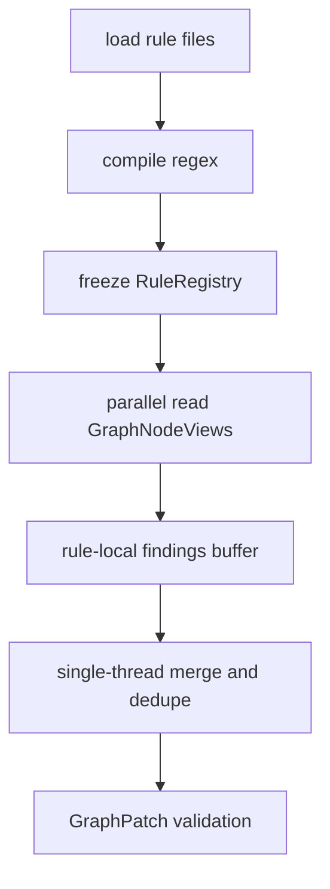

# Inference Rule Framework 设计草稿

## 状态

- 日期：2026-05-27
- 状态：草稿，等待设计 PR 检视
- 范围：用户可声明 inference rules、规则加载与校验、正则匹配、Graph patch 物化、结构化推断的数据前置条件、可观测和测试门禁

本设计不实现 memory、lock、module、performance 或 deep bug 的具体领域规则。它只定义规则框架：用户如何声明关系规则，runtime 如何执行规则并把结果交给 Graph runtime。

## 模块定位

本功能重定位 `src/cipher2/initializer/inference/`，作为 Graph 构建期间的 inference rule framework。

- `src/cipher2/initializer/inference/`：规则 schema、规则加载、正则匹配、规则执行、Graph patch 生成。
- `src/cipher2/graph/`：接收 inference framework 生成的 materialized graph objects、Graph relatives 和 rule provenance。
- `src/cipher2/config/`：新增 inference 配置项和规则文件路径校验。
- `src/cipher2/storage/`：不保存规则为 fact；只保存最终 Graph projection。
- `src/cipher2/tools/log/`：新增 `inference` channel。
- `src/cipher2/tools/views/`：新增 inference section。

递归文档更新终点包括 `README.md`、`docs/README.md`、`docs/user-guide.md`、`docs/maintenance-guide.md`、`tests/README.md`、`src/cipher2/initializer/inference/README.md`、`src/cipher2/config/README.md`、`src/cipher2/graph/README.md`、`src/cipher2/tools/log/README.md` 和 `src/cipher2/tools/views/README.md`。

## 规格与约束

本功能新增用户可配持久配置项，位于目标仓库 `.cipher/config.yml`。

| 配置项 | type | 取值范围 | 默认值 | 作用 | 生效时机 | 非法值处理 |
|---|---|---|---|---|---|---|
| `inference.enabled` | `bool` | `true` 或 `false` | `true` | 控制是否加载和执行用户规则 | init/rebuild | `ConfigError(code="invalid_config")` |
| `inference.rule_files` | `list[str]` | 目标仓库内相对路径；不得位于 `.cipher/snapshots` 或 `.cipher/run` | `[]` | 指定用户维护的规则文件 | config 加载时 | `ConfigError(code="invalid_inference_rule_file")` |
| `inference.max_rule_count` | `int` | `0..1000` | `100` | 单次运行最多加载的规则数 | rule load | `InferenceError(code="too_many_rules")` |
| `inference.max_match_candidates` | `int` | `1..100000` | `20000` | 单条规则最多扫描的 GraphNodeView 数 | rule execution | `InferenceError(code="match_candidate_limit")` |
| `inference.max_findings_per_rule` | `int` | `0..100000` | `10000` | 单条规则最多输出 finding 数 | rule execution | `InferenceError(code="finding_limit")` |
| `inference.max_regex_length` | `int` | `1..512` | `256` | `from_match` / `to_match` 的最大长度 | rule load | `InferenceError(code="regex_too_large")` |

规则约束：

- Inference rules 是可选增强。`inference.rule_files=[]` 时 Graph runtime 仍完整可用，包含 fact-backed nodes 和 Graph builder 从 FactRelative 内置映射出的 GraphRelative。
- 首版支持用户声明式关系规则，核心字段必须是 `from_match`、`to_match`、`relation_kind`。
- `from_match` 和 `to_match` 是正则表达式，默认匹配 `GraphNodeView.object_name`；匹配方式使用 `re.search`，大小写敏感。
- `relation_kind` 必须属于 Graph runtime 允许的粗粒度关系，例如 `lifecycle`、`depends_on`、`explains`、`affects`。
- 用户规则不是 fact，不进入 `facts.jsonl` 或 `relatives.jsonl`。
- 用户规则输出的是 Graph patch：`GraphRelative`，必要时附带 `MaterializedGraphObject(object_type="inference")` 和 `GraphDerivedFrom(source_kind="rule", role="rule_source")`。
- 用户规则 YAML 不包含 `confidence` 字段。声明式正则关系不是 evidence-aware 推断，生成的 `GraphRelative.confidence` 为 `null`；后续若引入结构化规则，必须在对应规则设计中定义 confidence 公式。
- 规则文件只允许位于目标仓库内，不得读取仓库外路径或生成产物目录。
- 规则文件不得包含 Python 代码、shell 命令、LLM prompt 或动态表达式。
- 正则只能用于匹配对象名；不能通过正则读取源码正文。
- 同一 rule id 必须全局唯一。
- 任何 finding 都必须能解释：匹配了哪个规则、哪些 GraphNodeView refs、哪些 source facts/relatives。

## 规则文件格式

规则文件使用 YAML 子集；实现可用仓库已有 YAML subset parser 或等价结构化 parser，不能使用任意代码执行。

```yaml
rules:
  - rule_id: project.memory.alloc_to_free
    enabled: true
    from_match: "^alloc_.*"
    to_match: "^free_.*"
    relation_kind: "lifecycle"
    payload:
      lifecycle_domain: "memory"
      from_role: "allocate"
      to_role: "free"
      obligation: "must_release"
```

`from_match` / `to_match` 匹配到的对象对会生成：

```text
from GraphNodeView --relation_kind--> to GraphNodeView
```

GraphNodeView 可以是 `ref_kind="fact"` 的 fact-backed node，也可以是 `ref_kind="graph_object"` 的 materialized node。声明式规则生成关系时只保存端点 `GraphRef`，不会为了匹配到 fact-backed node 而复制 FactRecord。

YAML 字段到 Graph 字段的映射：

| YAML 字段 | Graph 输出 | 说明 |
|---|---|---|
| `rule_id` | `GraphDerivedFrom.source_id`，并复制到 `GraphRelative.payload["rule_id"]` | 表示这条边来自哪条用户规则 |
| `enabled` | 不进入 Graph | 只决定是否执行 |
| `from_match` | `GraphRelative.from_ref` | 正则匹配命中的起点 `GraphNodeView.ref` |
| `to_match` | `GraphRelative.to_ref` | 正则匹配命中的终点 `GraphNodeView.ref` |
| `relation_kind` | `GraphRelative.relation_kind` | 必须属于 Graph runtime 允许集合 |
| `payload` | `GraphRelative.payload` | 只保存 bounded 领域字段；框架额外写入 `rule_id` |
| 无 | `GraphRelative.confidence` | 用户不填写；声明式正则规则写 `null`，表示用户声明关系而非 evidence-aware 推断 |
| 无 | `GraphDerivedFrom.target_kind/target_id` | 指向新生成的 `GraphRelative`，`role="rule_source"` |

例如：

```text
alloc_buffer --lifecycle--> free_buffer
```

这类规则只表达“用户声明的高层关系”。它不能自动证明内存是否泄漏、锁顺序是否安全、模块是否真的工作。

## 现有 FACT 能力边界

当前已实现的 C extractor 能产出 `direct_call`、`assigned_to`、`dispatches_via` 和 bounded `condition`。但 `direct_call` payload 目前只有 `line` 和 `source_kind`，没有实参、调用顺序、返回值绑定或状态写读。

因此，不补充 fact 数据时：

| 目标 | 当前可做 | 当前不能做 |
|---|---|---|
| 内存生命周期 | 通过规则声明 alloc-like 与 free-like 函数的 Graph lifecycle 关系 | allocation site、返回值绑定、free 实参 identity、owner 转移、逃逸、错误路径闭合 |
| 锁生命周期 | 通过规则声明 lock-like 与 unlock-like 函数的 Graph lifecycle 关系 | `lock(a)` 的 `a`、调用顺序、锁对象等价、ABBA、条件路径 |
| 模块初始化且工作 | 声明 init-like 与 exit-like/register-like 函数关系，或用现有 call/assignment 边做弱关联 | 入口可达性、注册宏/框架回调、profile 生效、全局状态写读、错误返回路径、回调是否触发 |

深层推断必须先补 Fact/FactRelative evidence contract。最低需要：

- callsite id。
- caller 内调用顺序。
- 实参 identity，例如 `decl_ref`、`member_ref`、`array_subscript`、`unknown_expr`。
- 返回值绑定，例如 `p = alloc()`.
- 条件和路径摘要。
- 状态写读、register/unregister、callback invocation 的结构化关系。

## 数据结构

本节“成员表”是 class 成员清单，不是数据库表。



### `DeclarativeRelationRule` 成员表

| 成员名称 | type | 作用 | 并发粒度 |
|---|---|---|---|
| `rule_id` | `str` | 用户规则稳定 ID，全局唯一 | rule 级、只读共享 |
| `enabled` | `bool` | 是否执行该规则 | rule 级、只读共享 |
| `from_match` | `MatchPattern` | 起点 GraphNodeView 名称正则 | rule 级、只读共享 |
| `to_match` | `MatchPattern` | 终点 GraphNodeView 名称正则 | rule 级、只读共享 |
| `relation_kind` | `str` | 输出 Graph relation kind | rule 级、只读共享 |
| `payload` | `dict[str, JSONValue]` | 输出关系 payload 模板，必须 bounded | rule 级、只读共享 |

### `MatchPattern` 成员表

| 成员名称 | type | 作用 | 并发粒度 |
|---|---|---|---|
| `pattern` | `str` | 用户提供的正则字符串 | rule 级、只读共享 |
| `target_field` | `Literal["object_name"]` | 首版固定匹配 GraphNodeView.object_name | rule 级、只读共享 |
| `compiled` | `re.Pattern` | 启动时编译后的正则 | 进程级、只读共享 |
| `matches(node_view)` | `callable` | 判断 GraphNodeView 是否命中 | 匹配调用级 |

### `RuleFile` 成员表

| 成员名称 | type | 作用 | 并发粒度 |
|---|---|---|---|
| `rel_path` | `str` | 规则文件仓库相对路径 | 文件级、只读共享 |
| `sha256` | `str` | 规则文件内容 hash | 文件级、只读共享 |
| `rules` | `list[DeclarativeRelationRule]` | 文件内规则 | 文件级、只读共享 |

### `RuleRegistry` 成员表

| 成员名称 | type | 作用 | 并发粒度 |
|---|---|---|---|
| `rule_files` | `list[RuleFile]` | 已加载规则文件 | registry 实例级、只读共享 |
| `rules_by_id` | `dict[str, DeclarativeRelationRule]` | rule id 索引 | registry 实例级、只读共享 |
| `load(config)` | `callable` | 加载、校验、编译规则 | init/rebuild 级 |
| `enabled_rules()` | `callable` | 返回启用规则 | engine 实例级 |

### `InferenceFinding` 成员表

| 成员名称 | type | 作用 | 并发粒度 |
|---|---|---|---|
| `finding_id` | `str` | 本次规则命中的稳定 ID | finding 级、只读共享 |
| `rule_id` | `str` | 产生该 finding 的规则 | finding 级、只读共享 |
| `from_ref` | `GraphRef` | 命中的起点 GraphNodeView 引用，可直连 fact-backed node | finding 级、只读共享 |
| `to_ref` | `GraphRef` | 命中的终点 GraphNodeView 引用，可直连 fact-backed node | finding 级、只读共享 |
| `relation_kind` | `str` | 输出 Graph relation kind | finding 级、只读共享 |
| `confidence` | `float or None` | 框架计算出的输出可信度；声明式正则规则为 `None` | finding 级、只读共享 |
| `payload` | `dict[str, JSONValue]` | 输出 payload | finding 级、只读共享 |

### `InferenceEngine` 成员表

| 成员名称 | type | 作用 | 并发粒度 |
|---|---|---|---|
| `registry` | `RuleRegistry` | 已加载规则 registry | engine 实例级、只读共享 |
| `max_match_candidates` | `int` | 单规则扫描 GraphNodeView 上限 | engine 实例级、只读共享 |
| `max_findings_per_rule` | `int` | 单规则输出上限 | engine 实例级、只读共享 |
| `run(graph_context)` | `callable` | 执行规则并返回 GraphPatch | snapshot 构建级 |

### `GraphPatch` 成员表

| 成员名称 | type | 作用 | 并发粒度 |
|---|---|---|---|
| `graph_objects` | `list[MaterializedGraphObject]` | 规则生成的 materialized inference nodes；声明式关系规则可为空 | patch 级 |
| `graph_relatives` | `list[GraphRelative]` | 规则生成的 Graph relations | patch 级 |
| `derived_from` | `list[GraphDerivedFrom]` | rule provenance；端点已经由 GraphRelative.from_ref/to_ref 表达 | patch 级 |

## 对外接口流程

### 声明式规则执行流程



### 匹配与物化流程



## 结构化行为规则边界

`from_match` / `to_match` / `relation_kind` 适合声明对象之间的高层关系，但不足以识别锁顺序、内存 owner 转移、模块真实可达性等行为。

例如：

```c
funcA() { lock(a); lock(b); }
funcB() { unlock(b); unlock(a); }
```

Clang AST 可以提供调用点实参表达式，但当前 snapshot 没有保存这些 evidence。若要识别这类行为，必须先设计并实现 FactRelative payload 扩展：

```json
{
  "relation_kind": "direct_call",
  "payload": {
    "callsite_id": "src/a.c:10:3",
    "call_order": 2,
    "args": [
      {
        "index": 0,
        "identity_kind": "decl_ref",
        "identity": "var:a",
        "display": "a"
      }
    ],
    "return_binding": null
  }
}
```

因此规则能力分级如下：

| 规则类型 | 是否属于本设计 | 需要的输入 | 可输出 |
|---|---|---|---|
| 声明式关系规则 | 是 | GraphNodeView name 正则匹配 | GraphRelative + `GraphDerivedFrom(role="rule_source")` |
| 结构化 callsite 规则 | 否，需后续设计 | callsite args、order、return binding、condition | 生命周期/顺序 inference |
| 跨接口协议规则 | 否，需后续设计 | 状态读写、callback invocation、错误路径、profile | 深层 bug inference |

## 并发控制



- 规则加载在 init/rebuild 的 Graph staging 阶段执行。
- `RuleRegistry` 加载完成后只读共享。
- 单条规则写入 rule-local buffer；合并阶段统一做 ID 去重和 limit 截断。
- MCP 请求不得动态加载或执行规则。
- 规则文件变化只在下一次 init/rebuild 生效；在线临时增量不重跑 inference。

## 可观测性与 Views

`tools/log` 新增 `inference` channel：

| event_name | 关键 counts | 说明 |
|---|---|---|
| `inference.rules_loaded` | `rule_file_count`、`rule_count`、`disabled_rule_count` | 规则加载结果 |
| `inference.rule_completed` | `from_match_count`、`to_match_count`、`finding_count`、`truncated_count` | 单条规则完成 |
| `inference.rule_failed` | `rule_count` | 规则加载或执行失败 |
| `inference.rule_skipped` | `disabled_rule_count`、`limit_hit_count` | 规则被跳过或截断 |

`tools/views` 新增 inference section，展示：

- 规则文件数量、规则总数、启用/禁用数量。
- 每条规则的 finding 数、截断状态和错误码。
- 正则编译失败、重复 rule id、非法 relation kind、match limit hit。
- GraphPatch 输出数量和 rule provenance 覆盖率。

## 测试与门禁

开发阶段必须遵守 TDD。Framework PR 必须覆盖：

- 规则文件加载和路径安全：100%。
- `from_match` / `to_match` 正则匹配：100%。
- `relation_kind` 校验和 GraphPatch 物化：100%。
- rule provenance：100%。
- log/views 可观测：100%。
- 异常分支覆盖率：90% 以上。
- 场景覆盖：空规则、禁用规则、重复 rule id、非法 regex、非法 relation kind、match 上限、finding 上限、Graph stale。

新增测试建议：

- `tests/test_inference_rule_file.py`
- `tests/test_inference_rule_registry.py`
- `tests/test_inference_declarative_relation_rule.py`
- `tests/test_inference_materialization.py`
- `tests/test_inference_observability.py`
- `tests/test_inference_views.py`

性能和小型化看护：

| 场景 | 输入规模 | 内存预算 | 必跑命令 |
|---|---|---|---|
| 小 | 1,000 GraphNodeViews、100 rules | 512MB | `PYTHONPATH=src python3 scripts/inference_performance_gate.py --scenario small` |
| 中 | 100,000 GraphNodeViews、100 rules | 4GB | `PYTHONPATH=src python3 scripts/inference_performance_gate.py --scenario medium` |
| 大 | 1,000,000 GraphNodeViews、100 rules | 8GB | `PYTHONPATH=src python3 scripts/inference_performance_gate.py --scenario large` |

实现 PR 必须运行：

```bash
git diff --check
PYTHONPATH=src python3 -m unittest discover -s tests
PYTHONPATH=src python3 scripts/inference_performance_gate.py
```

## PR 拆分

1. Inference framework 设计 PR：只新增本草稿。
2. 文档搬迁 PR：搬迁到模块 README 和顶层文档，并二次确认无内容漂移。
3. Framework 实现 PR：按 TDD 实现规则文件加载、正则匹配、GraphPatch、log/views 和性能门禁。
4. 领域规则设计 PR：memory/lock/module/performance/deep bug 等每个领域单独设计、单独实现。
