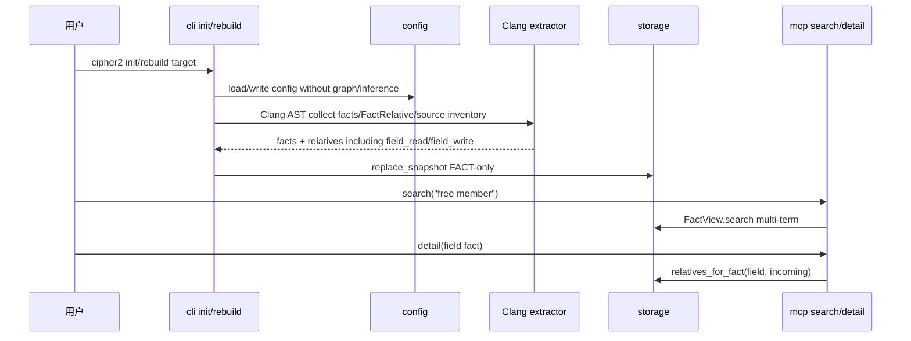
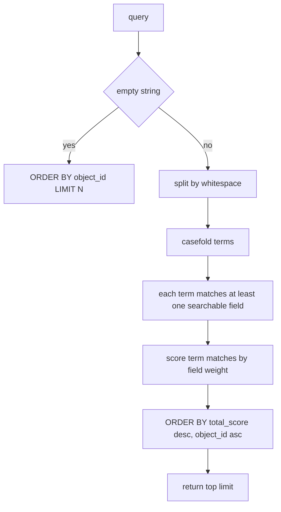
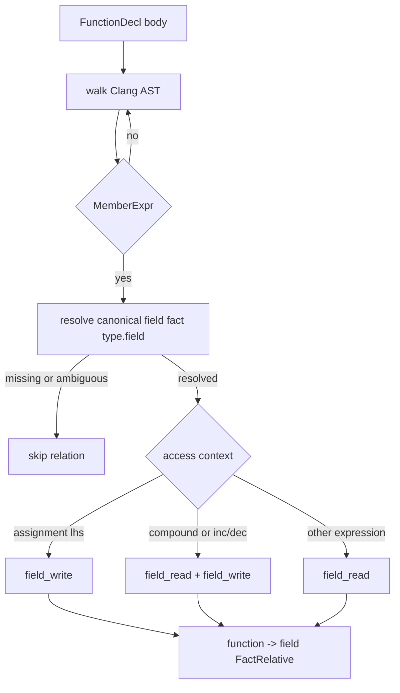
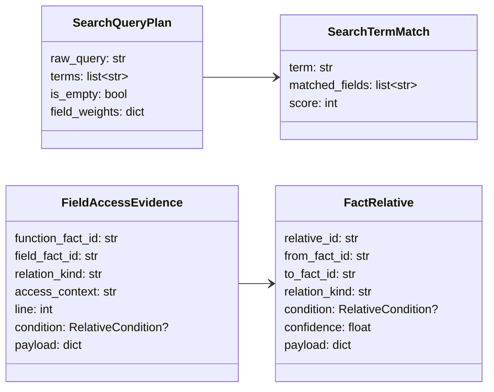
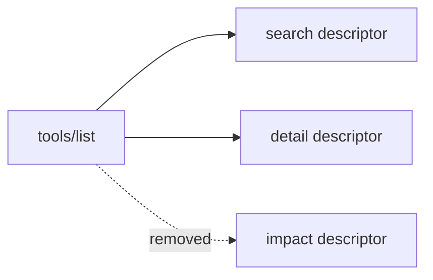

# 移除 Graph/Inference/Impact 与增强 FACT 搜索设计草稿

## 状态

- 日期：2026-05-27
- 状态：草稿，等待设计 PR 检视
- 来源：GitHub Issue #35
- 范围：移除 Graph projection、Inference rule framework、MCP `impact`、Graph scope 和交互式 inference setup；增强 FACT search 分词匹配；新增 C `field_read` / `field_write` FactRelative。

本设计修正当前 Graph/Inference 方向：模型真正依赖的是高质量 FACT、bounded `source_context`、可发现的 search 和 `detail.relative_preview`，而不是上层预计算抽象。Regex-only inference 会对生命周期和锁语义生成笛卡尔积假边，因此必须从 public runtime 中移除。

## 模块定位

- `src/cipher2/graph/`：删除整个模块；Graph 类型、GraphStore、Graph projection 文件和 impact traversal 不再是 runtime 能力。
- `src/cipher2/initializer/inference/`：删除整个模块；不再支持用户 YAML inference rules、`.cipher/inference/` 工作区或 `--interactive` inference setup。
- `src/cipher2/mcp/`：只公开 `search` 和 `detail`；删除 `impact` tool，删除 `scope=graph|fact`，所有查询只读 FACT view。
- `src/cipher2/storage/`：保留 FACT snapshot、FactRelative、source inventory 和 overlay；实现多 term search。
- `src/cipher2/initializer/extractor/code/`：基于 Clang AST `MemberExpr` 生成 `field_read` / `field_write` FactRelative。
- `src/cipher2/config/`：删除 `graph.*` 和 `inference.*` 持久配置项。
- `src/cipher2/tools/log/`：删除 graph/inference 专属事件；保留 search/detail/field_access 相关摘要字段。
- `src/cipher2/tools/views/`：删除 graph/inference view section；强化 storage/log/incremental 中的 FACT 和 field access 统计展示。

递归文档更新终点包括 `README.md`、`docs/README.md`、`docs/schema.md`、`docs/user-guide.md`、`docs/maintenance-guide.md`、`tests/README.md`、`scripts/README.md`、`src/README.md`、`src/cipher2/README.md`、`src/cipher2/config/README.md`、`src/cipher2/storage/README.md`、`src/cipher2/storage/schema/README.md`、`src/cipher2/initializer/README.md`、`src/cipher2/initializer/extractor/code/README.md`、`src/cipher2/mcp/README.md`、`src/cipher2/tools/log/README.md` 和 `src/cipher2/tools/views/README.md`。`src/cipher2/graph/README.md` 与 `src/cipher2/initializer/inference/README.md` 随模块删除。

## 规格与约束

本重构不新增用户可配持久配置项，且删除既有用户配置项。

| 配置项 | type | 变更 | 迁移行为 | 非法值处理 |
|---|---|---|---|---|
| `graph.*` | mixed | 删除 | `load_config` 遇到旧配置必须忽略并写兼容警告，不写回 | 不因旧配置失败 |
| `inference.*` | mixed | 删除 | `load_config` 遇到旧配置必须忽略并写兼容警告，不读取规则文件 | 不因旧配置失败 |

CLI 约束：

| CLI 参数 | type | 变更 | 行为 |
|---|---|---|---|
| `--interactive` | `bool flag` | 删除 | argparse 返回 usage error，`init/rebuild` 恢复纯 fire-and-forget |

MCP 约束：

| 接口 | 变更 | 行为 |
|---|---|---|
| `tools/list` | 只返回 `search`、`detail` | 不再暴露 `impact` |
| `search.scope` | 删除 | 传入 `scope` 返回 `invalid_args` 或 schema 拒绝 |
| `detail.scope` | 删除 | 传入 `scope` 返回 `invalid_args` 或 schema 拒绝 |
| `impact` | 删除 | `tools/call` 返回 `unknown_tool` |

Snapshot 约束：

- 新 snapshot 不再写 `graph_objects.jsonl`、`graph_relatives.jsonl`、`graph_derived_from.jsonl`。
- 读旧 snapshot 时不得因旧 Graph 文件存在失败；这些文件被忽略。
- storage schema 只承诺 `facts.jsonl`、`relatives.jsonl`、`source_inventory.jsonl` 和 manifest。

Search 约束：

- query 为空字符串时保持现有“按 `object_id` 排序返回前 N”语义。
- 非空 query 先按 Unicode whitespace 分词，空 term 丢弃，所有 term 必须命中同一 fact 的可搜索字段。
- 可搜索字段为 `object_name`、`object_description`、`object_caller`、`object_callee`、`object_source`，大小写不敏感。
- 排序先按所有 term 的加权分数降序，再按 `object_id` 升序稳定排序。
- 不改变 MCP `search` 输入参数形状，仍为 `query` + `limit`。

Field access 约束：

- `field_read` / `field_write` 是 FactRelative，不是 fact kind。
- 关系方向固定为 `function -> field`，使 `detail(<field fact>)` 的 incoming relative preview 能看到读写该字段的函数。
- `MemberExpr` 位于简单赋值左值时生成 `field_write`；位于右值、调用实参、return 表达式或条件表达式时生成 `field_read`。
- 复合赋值、自增和自减必须同时生成读写语义；首版若 AST opcode 无法稳定识别，必须保守生成 `field_read` 并在 payload 写 `access_confidence="partial"`。
- 未能解析到唯一 `type.field` 的 MemberExpr 不生成关系；不得生成模糊字段边。

## 运行流程

### 初始化与查询总流程

### Search 分词流程

### Field access 抽取流程

## 数据结构

本节“成员表”是 class 成员清单，不是数据库表。

### `SearchQueryPlan` 成员表

| 成员名称 | type | 作用 | 并发粒度 |
|---|---|---|---|
| `raw_query` | `str` | 原始 query，只用于 hash 和 preview | 请求级，只读 |
| `terms` | `list[str]` | whitespace 分词后 casefold 的 term | 请求级，只读 |
| `is_empty` | `bool` | 是否走空 query 分支 | 请求级，只读 |
| `field_weights` | `dict[str,int]` | 字段打分权重 | 进程级常量 |

### `SearchTermMatch` 成员表

| 成员名称 | type | 作用 | 并发粒度 |
|---|---|---|---|
| `term` | `str` | 单个查询 term | 请求级，只读 |
| `matched_fields` | `list[str]` | 命中的可搜索字段 | 候选 fact 级 |
| `score` | `int` | 该 term 对候选 fact 的得分 | 候选 fact 级 |

### `FieldAccessEvidence` 成员表

| 成员名称 | type | 作用 | 并发粒度 |
|---|---|---|---|
| `function_fact_id` | `str` | 访问字段的函数 fact id | 单 AST 文件级 |
| `field_fact_id` | `str` | 被访问字段 fact id | 单 AST 文件级 |
| `relation_kind` | `Literal["field_read","field_write"]` | 字段访问方向 | 单 MemberExpr 级 |
| `access_context` | `str` | `assignment_lhs`、`rvalue`、`argument`、`condition` 等 | 单 MemberExpr 级 |
| `line` | `int` | 访问行号 | 单 MemberExpr 级 |
| `condition` | `RelativeCondition or None` | 上层条件摘要 | 单 MemberExpr 级 |
| `payload` | `dict[str, JSONValue]` | `source_kind`、`member_name`、`owner_type`、`access_confidence` | 单 MemberExpr 级 |

### `FactRelative` 新 relation 成员约定

| 成员名称 | type | 作用 | 并发粒度 |
|---|---|---|---|
| `from_fact_id` | `str` | 函数 fact id | snapshot 级不可变 |
| `to_fact_id` | `str` | 字段 fact id | snapshot 级不可变 |
| `relation_kind` | `str` | `field_read` 或 `field_write` | snapshot 级不可变 |
| `condition` | `RelativeCondition or None` | 保守条件摘要 | relation 级 |
| `confidence` | `float` | 唯一字段解析为 `1.0`，保守上下文为 `0.5..1.0` | relation 级 |
| `payload` | `dict[str, JSONValue]` | 有界 evidence，不含源码全文和绝对路径 | relation 级 |

## 对外接口

### MCP `tools/list`

`search` input schema：

| 字段 | type | 取值范围 | 默认值 | 说明 |
|---|---|---|---|---|
| `query` | `str` | 任意 UTF-8 字符串，内部截断 preview | 必填 | 空格分词，所有 term 取交集 |
| `limit` | `int` | `1..50` | `20` | 返回条数上限 |

`detail` input schema：

| 字段 | type | 取值范围 | 默认值 | 说明 |
|---|---|---|---|---|
| `fact_id` | `str` | 非空 FACT id | 必填 | 只接受 FACT id |
| `budget` | `str` | `small`、`normal`、`large` | `normal` | 控制 payload、source_context 和 relative_preview 大小 |

### Python API

- `FileFactStore.search(query: str, limit: int = 20) -> list[FactRecord]` 保持签名不变，内部升级为多 term。
- `FactView.search(query: str, limit: int = 20) -> list[FactRecord]` 保持签名不变，overlay 与 base 使用同一打分语义。
- `open_mcp_server(...).search(query, limit=20)` 移除 `scope` 参数。
- `open_mcp_server(...).detail(fact_id, budget="normal")` 移除 `scope/ref` graph 兼容路径。

## 并发控制

- Search 分词计划是请求局部对象，不共享可变状态。
- SQLite read index 继续使用 `_ReadIndex.lock` 保护 connection；多 term SQL 在同一只读事务/connection 调用内完成。
- Overlay search 先取 base 候选再与 overlay upsert 合并，合并阶段不修改 overlay。
- Field access 抽取在单文件 AST mapper 内构建临时 evidence；最终仍通过 initializer 单线程收集并交给 storage snapshot writer。
- 删除 Graph 后，不再有 GraphStore 读侧索引、Graph cache 或 impact traversal 的并发状态。

## 可观测性与 Views

必须删除：

- `graph` log channel 和 views graph section。
- `inference` log channel 和 views inference section。
- `mcp.impact` 事件。

必须保留或新增：

- `storage.search` counts 增加 `term_count`，payload 增加 `query_kind="empty|terms"`。
- `extractor.code.file` counts 增加 `field_read_count`、`field_write_count`。
- `mcp.search` counts 增加 `term_count`，payload 保留 `view_state`。
- `tools/views` 的 storage section 展示 `field_read_count`、`field_write_count`、search_count、error_count。
- `tools/views` 的 log section 能以人类可读行展示 term search 和 field access 抽取摘要。

## 测试门禁

设计通过后，README 搬迁 PR 必须先完成，再进入 TDD 实现。实现 PR 不需要再次向用户确认，但必须提 PR，PR 合入视为通过。

TDD 用例必须先覆盖失败场景：

- MCP `tools/list` 只包含 `search`、`detail`。
- `tools/call impact` 返回 `unknown_tool`。
- `search/detail` 传 `scope` 被 schema 或参数校验拒绝。
- `search("free member")` 只返回同时命中两个 term 的 fact。
- `search("member free")` 与 `search("free member")` 命中集合一致，排序稳定。
- overlay view search 与 base search 的多 term 语义一致。
- Clang `MemberExpr` 读字段生成 `field_read`。
- Clang `MemberExpr` 写字段生成 `field_write`。
- `detail(type.field)` 的 relative_preview 展示读写该字段的函数。
- 旧 snapshot 中存在 Graph 文件时，storage/MCP/views 不失败且忽略旧文件。
- 旧 config 中存在 `graph.*`、`inference.*` 时不阻断 init/rebuild，并在 log 中给出迁移警告。

覆盖率要求：

- 新功能点覆盖率 100%。
- 异常分支覆盖率 90%+，包括 invalid query、invalid limit、unknown tool、旧 config、ambiguous MemberExpr、source path escape。
- 场景用例覆盖率 100%，覆盖 empty/single/multi term、base/overlay、field read/write/read-write、condition 分支、detail budgets。

性能和小型化看护：

| 场景 | 数据规模 | 预算 |
|---|---|---|
| 小 512MB | 1,000 facts，100 search/detail calls | peak < 16MB，wall-clock < 5s |
| 中 4GB | 100,000 facts，10,000 relatives | search p95 <= 200ms，detail p95 <= 50ms |
| 大 8GB | 1,000,000 facts，100,000 relatives | search p95 <= 500ms，detail p95 <= 100ms，无 Graph 文件写入 |

必须删除或替换的门禁脚本：

- 删除 `scripts/graph_performance_gate.py`。
- 删除 `scripts/inference_performance_gate.py`。
- 更新 `scripts/mcp_performance_gate.py`，只覆盖 search/detail。
- 更新 `scripts/storage_performance_gate.py`，覆盖 multi-term search。

## 实施拆分

建议拆成两个实现 PR，降低审查风险：

1. **删除 PR**：移除 Graph/Inference/impact/interactive setup/config/snapshot/docs/tests/scripts，确保 FACT-only search/detail 主线通过。
2. **增强 PR**：实现 search 分词和 `field_read` / `field_write`，补齐 MCP detail relative_preview、log/views 和性能门禁。

两个实现 PR 都不得直接 push main；必须提 PR，PR 合入视为维护者确认。
