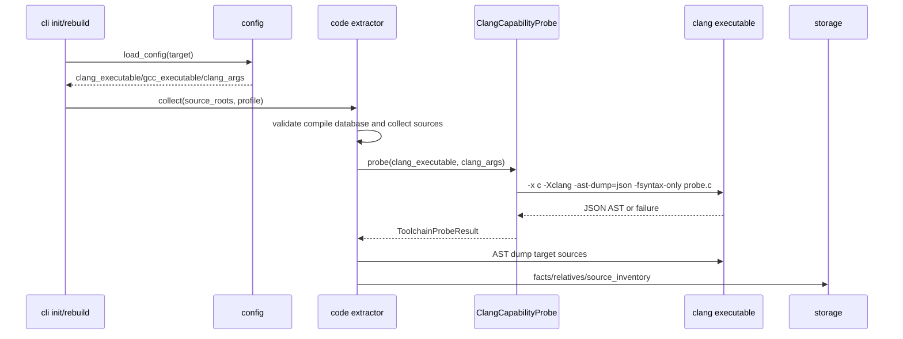
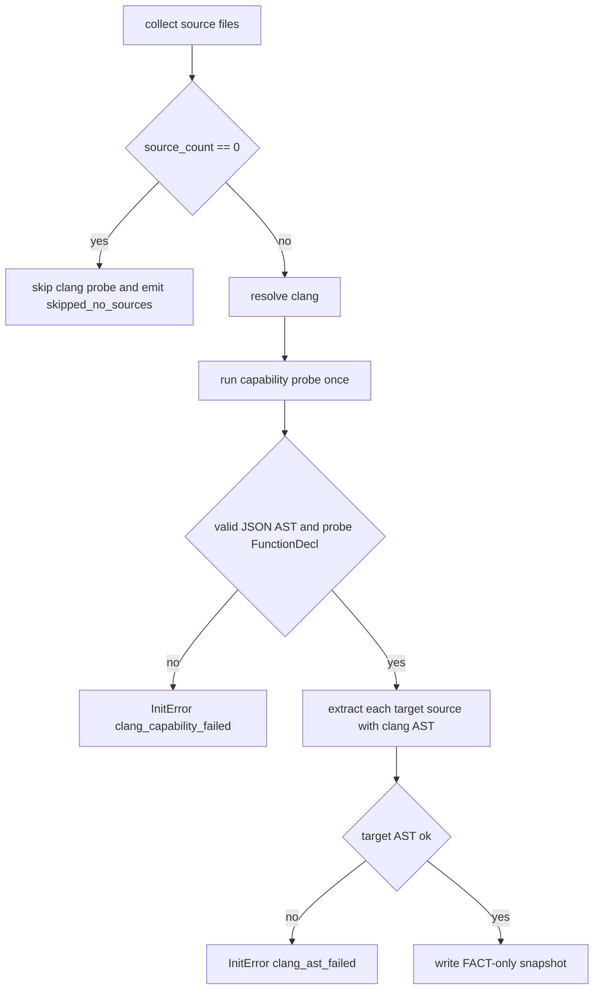
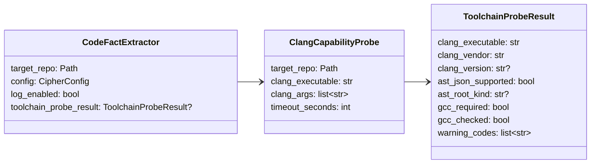

# Clang/GCC 工具链能力探测设计草稿

## 状态

- 日期：2026-05-27
- 状态：设计已合入并已搬迁；文件级目标 AST 失败语义由 `20260527-file-level-clang-best-effort.md` 修订
- 来源：GitHub Issue #39
- 范围：放宽 `initializer/extractor/code` 的 Clang/GCC 前置校验，使 extractor 以 Clang AST JSON 能力为准入条件，同时保持 C 场景 fail-closed 和无 lightweight parser fallback。

## 模块定位

- `src/cipher2/initializer/extractor/code/`：移除 LLVM/Clang 16 与 GCC 10.5.0 的精确版本硬锁，改为 Clang AST JSON capability probe；当前 AST-only 路径不再要求 GCC 必须存在。
- `src/cipher2/config/`：保留现有 `clang_executable`、`gcc_executable`、`clang_args` 配置形状，只调整 README 语义；路径安全和显式可执行文件校验不变。
- `src/cipher2/initializer/`：继续在 `init/rebuild` 前置阶段 fail-closed；工具链失败仍阻止 snapshot 写入。
- `src/cipher2/tools/log/`：记录工具链探测结果、Clang vendor/version、capability outcome 和 GCC 是否被检查。
- `src/cipher2/tools/views/`：展示最近一次 extractor toolchain 状态和失败原因，便于用户定位环境问题。

递归文档更新终点包括 `README.md`、`docs/README.md`、`docs/user-guide.md`、`docs/maintenance-guide.md`、`src/README.md`、`src/cipher2/README.md`、`src/cipher2/config/README.md`、`src/cipher2/initializer/README.md`、`src/cipher2/initializer/extractor/README.md`、`src/cipher2/initializer/extractor/code/README.md`、`src/cipher2/tools/log/README.md`、`src/cipher2/tools/views/README.md` 和 `tests/README.md`。

## 规格与约束

本功能不新增用户可配配置项，也不删除配置项。现有配置项语义调整如下：

| 配置项 | type | 取值范围 | 默认值 | 作用 | 非法值处理 |
|---|---|---|---|---|---|
| `extractor.code.clang_executable` | `str or null` | `null`、PATH 命令或可执行路径；运行期必须通过 AST JSON capability probe | `null` | 指定执行 capability probe 和 AST dump 的 Clang | `ConfigError(clang_unavailable/path_escape)` 或 `InitError(clang_capability_failed)` |
| `extractor.code.gcc_executable` | `str or null` | `null`、PATH 命令或可执行路径；当前 AST-only 路径不要求存在，显式路径仍必须可执行且不能位于 `.cipher/` | `null` | 为未来需要 GCC 预处理的路径保留；当前只进入 config 和 inventory hash | `ConfigError(gcc_unavailable/path_escape)`；当前 extractor 不再发出 `gcc_version_mismatch` |
| `extractor.code.clang_args` | `list[str]` | 只读编译参数；不得设置输出文件 | `[]` | 附加 capability probe 与 AST invocation 参数 | `ConfigError(invalid_config)` |

Clang 准入规则：

- 不再以版本字符串精确匹配作为准入条件；准入以 `clang -x c -Xclang -ast-dump=json -fsyntax-only` 的能力探测成功为准。
- 正式支持矩阵为 LLVM Clang >= 16、Apple Clang >= 15；其他 vendor 若 capability probe 通过可运行，但在 log/views 中标记 `clang_vendor="unknown"`。
- capability probe 必须解析 stdout 为 JSON object，并验证 root 或子节点包含稳定的 `TranslationUnitDecl` 与 probe 函数声明。
- capability probe 失败、返回非 0、超时、输出非 JSON 或 JSON AST 结构不满足最低要求时返回 `InitError(code="clang_capability_failed")`。
- 目标源码 AST dump 仍独立于 capability probe；能力探测通过后，单个源码 AST 失败返回 `clang_ast_failed`。文件级失败是否阻断 init 已由 `20260527-file-level-clang-best-effort.md` 修订为 warning + skip。
- C 场景不启用 lightweight parser，不静默跳过缺失源码、缺失 compile database、Clang 失败或 malformed AST。

GCC 准入规则：

- 当前 extractor 不调用 `gcc` 编译或预处理，因此 `collect()` 不再 resolve/probe GCC。
- `gcc_executable` 为显式路径时仍由 config 层做路径安全和可执行校验；为命令名或 `null` 时不触发当前 extractor 失败。
- 未来如果新增 GCC-backed 预处理路径，必须先新增设计，明确何时 `gcc_required=true`，再恢复对应能力探测。

## 接口流程





## 数据结构

本节“成员表”是内部 class/dataclass 成员清单，不是数据库表。



### `ClangCapabilityProbe` 成员表

| 成员名称 | type | 作用 | 并发粒度 |
|---|---|---|---|
| `target_repo` | `Path` | 目标仓库路径，仅用于安全上下文和日志，不写目标文件 | 单次 extractor collect |
| `clang_executable` | `str` | 已 resolve 的 Clang 命令或路径 | 单次 probe |
| `clang_args` | `list[str]` | 附加只读 Clang 参数 | 单次 probe，只读共享 |
| `timeout_seconds` | `int` | capability probe 超时 | 单次 probe |

### `ToolchainProbeResult` 成员表

| 成员名称 | type | 作用 | 并发粒度 |
|---|---|---|---|
| `clang_executable` | `str` | 实际执行的 Clang | 单次 probe，只读 |
| `clang_vendor` | `str` | `llvm`、`apple` 或 `unknown` | 单次 probe，只读 |
| `clang_version` | `str or None` | 版本字符串，仅用于观测和排障 | 单次 probe，只读 |
| `ast_json_supported` | `bool` | AST JSON capability 是否通过 | 单次 probe，只读 |
| `ast_root_kind` | `str or None` | AST root kind 摘要 | 单次 probe，只读 |
| `gcc_required` | `bool` | 当前路径是否需要 GCC；本设计固定为 `false` | 单次 collect |
| `gcc_checked` | `bool` | 是否执行 GCC 探测；本设计固定为 `false` | 单次 collect |
| `warning_codes` | `list[str]` | 非阻断提示，例如 unknown vendor | 单次 probe，只读 |

### `CodeFactExtractor` 新增成员表

| 成员名称 | type | 作用 | 并发粒度 |
|---|---|---|---|
| `toolchain_probe_result` | `ToolchainProbeResult or None` | 当前 collect 的工具链探测结果，供 log/views 和 source inventory 摘要使用 | 单次 collect；不跨线程写共享 |

## 对外接口

- CLI 参数不变：`cipher2 init/rebuild` 不新增 flag。
- config 文件形状不变：`.cipher/config.yml` 仍保留 `clang_executable`、`gcc_executable`、`clang_args`。
- MCP 工具不变：不新增工具，不暴露 toolchain probe 接口。
- 错误语义调整：
  - `clang_unavailable`：无法 resolve 或执行 Clang。
  - `clang_capability_failed`：Clang 可执行，但不满足 AST JSON capability。
  - `clang_ast_failed`：capability 通过后，目标源码 AST dump 失败。
  - `gcc_version_mismatch`：当前 AST-only 路径不再产生。

## 并发控制

- capability probe 在每次 `collect()` 开始时最多执行一次；无源码时跳过。
- probe 使用临时 C 文件和 subprocess stdout/stderr，不写 `.cipher/` 或目标源码。
- `ToolchainProbeResult` 是不可变结果，只在本次 collect 内引用；并发增量 worker 不共享可变 probe 状态。
- 多个进程同时 init/rebuild 时，仍由 storage snapshot 锁负责最终写入互斥，本设计不改变 storage 并发模型。

## 可观测性

新增或调整日志字段：

| 事件 | status | payload 字段 |
|---|---|---|
| `extractor.code.toolchain` | `ok` | `clang_vendor`、`clang_version`、`ast_json_supported=true`、`gcc_required=false`、`gcc_checked=false`、`warning_count` |
| `extractor.code.toolchain` | `warning` | unknown vendor 但 capability 通过 |
| `extractor.code.toolchain` | `error` | `error_code=clang_unavailable/clang_capability_failed`、`gcc_required=false`、`gcc_checked=false` |

`tools/views` 需要在 extractor 或 log 汇总视图中呈现：

- 最近一次 Clang capability 状态。
- Clang vendor/version。
- GCC 是否 required/checked。
- 最近一次失败错误码和摘要。

可观测信息不得输出完整绝对 target path、完整源码正文、完整 clang stderr、环境变量或 secret。

## 测试门禁

README 搬迁 PR 合入后，TDD 实现 PR 首批失败测试必须覆盖：

- LLVM Clang 16 fake executable 通过 capability probe，保持基线可用。
- LLVM Clang 17+ fake executable 通过 capability probe。
- Apple Clang 21 fake executable 在无 GCC 环境下完成 `collect()` 或 CLI init smoke。
- Clang 可执行但输出非 JSON、缺少 `TranslationUnitDecl` 或缺少 probe `FunctionDecl` 时返回 `clang_capability_failed`。
- `gcc_executable=None` 且系统无 GCC 时不影响当前 AST-only extractor。
- 显式无效 GCC 路径仍在 config 层返回 `gcc_unavailable/path_escape`。
- 目标源码 AST 失败返回 `clang_ast_failed`，不被 capability probe 混淆；文件级处理策略由 best-effort 设计决定。
- log 记录 `extractor.code.toolchain` 的 ok/warning/error 三类事件。
- views 展示 Clang capability、vendor/version、GCC required/checked 和错误码。
- 文档与测试矩阵不再声称 GCC 10.5.0 是当前必需运行条件。

覆盖率要求：

- 功能点覆盖率 100%：Clang resolve、capability 成功、capability 失败、unknown vendor warning、GCC optional、source inventory hash 稳定、CLI init/rebuild 路径。
- 异常分支覆盖率 90%+：missing clang、timeout、nonzero exit、malformed JSON、wrong AST root、missing probe function、invalid explicit GCC path、log write failure、view 空状态。
- 场景覆盖率 100%：用户在支持矩阵内选择默认 clang、指定 LLVM clang、指定 Apple clang、无 GCC、显式配置 GCC、compile database 存在或不存在的组合。

性能和小型化看护：

- 512MB：probe 只运行一次，不缓存完整 stderr，不复制目标源码。
- 4GB：Redis/SQLite 级仓库 init 的额外 probe 开销必须是常数级。
- 8GB：大仓库多文件抽取不得对每个文件重复 probe。

实现 PR 必须运行：

```bash
git diff --check
PYTHONPATH=src python3 -m unittest discover -s tests
PYTHONPATH=src python3 scripts/initializer_performance_gate.py
PYTHONPATH=src python3 scripts/clang_extractor_performance_gate.py
PYTHONPATH=src python3 scripts/cli_performance_gate.py
PYTHONPATH=src python3 scripts/views_performance_gate.py
```

## 分阶段 PR

1. 设计 PR：只新增本草稿并更新草稿索引。
2. README 搬迁 PR：将本设计搬迁到模块 README 和用户/维护文档，确认语义无漂移。
3. 实现 PR：按 TDD 修改测试，再实现 capability probe、日志和 views；PR 合入视为通过。
