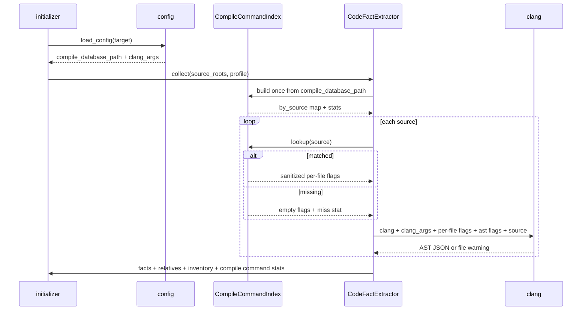
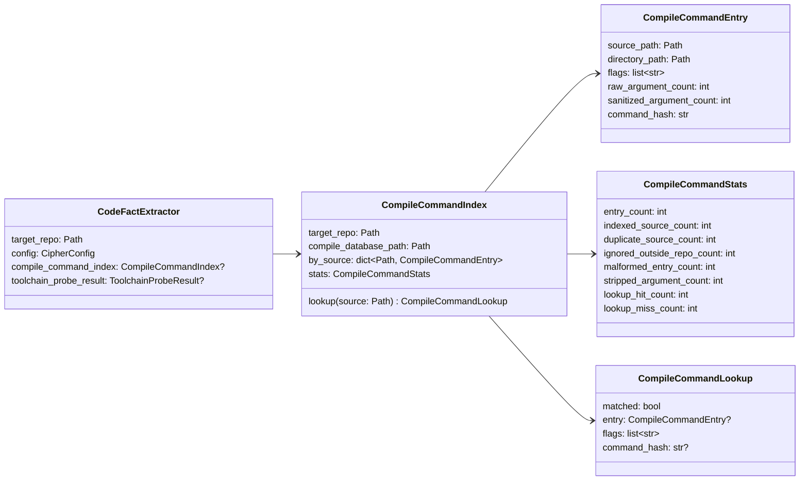
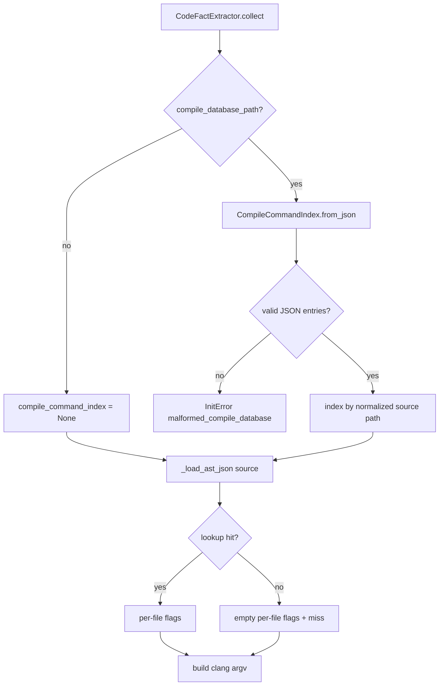

# Compile Database Per-file Flags 设计草稿

- 状态：设计 PR #70 已合入；权威规格搬迁到模块 README，代码实现等待 TDD PR
- 关联 issue：#54
- 范围：让 `initializer/extractor/code` 在每个 source 的 Clang AST invocation 中使用 `compile_commands.json` 对应编译参数

## 模块定位

- `src/cipher2/config/`：继续负责 `paths.compile_database` 的路径安全和可读性校验。
- `src/cipher2/initializer/extractor/code/`：解析 compile database，建立 source path 到 sanitized flags 的只读索引，并构建每个文件的 Clang AST 命令。
- `src/cipher2/tools/log/`：记录 compile command 命中、缺失、重复、解析失败和参数清洗统计。
- `src/cipher2/tools/views/`：在 log section 呈现 compile database 使用情况和异常状态。

## 规格和约束

本功能不新增用户可配配置项、不新增 CLI 参数、不新增 MCP tool、不修改 snapshot schema。

| 配置项 | type | 取值范围 | 默认值 | 作用 |
|---|---|---|---|---|
| `paths.compile_database` | `str or null` | `null` 或可读普通文件；不得位于目标仓库 `.cipher/` | `null` | compile database 只读输入 |
| `extractor.code.clang_args` | `list[str]` | 字符串列表；不得设置输出文件 | `[]` | 全局附加 Clang 参数，放在 per-file flags 之前 |

规则：

- capability probe 仍只使用 `extractor.code.clang_args`，不使用任一 source 的 compile command。
- 目标 AST invocation 固定使用配置解析出的 Clang executable；compile database 中的 compiler 程序名只用于定位待清洗参数，不得替换 Clang。
- compile database entry 支持 `arguments: list[str]` 和 `command: str`；同时存在时优先 `arguments`。
- `file` 相对路径按 entry 的 `directory` 解析；`directory` 相对路径按 compile database 文件所在目录解析。
- 只为目标仓库内 source 建索引；仓库外 entry 忽略并计数。
- 同一 source 多条 entry 时保留第一条，后续记为 duplicate，不随机选择。
- AST 命令参数顺序固定为：`clang_executable`、全局 `clang_args`、sanitized per-file flags、AST-only 控制参数、source path。per-file flags 是该 source 的权威构建设置，因此在重复语义上优先于全局 `clang_args`。
- 参数清洗必须使用显式 allowlist。只保留下列只读解析语义参数；其余参数一律丢弃并计入 stripped：
  - include/search path：`-I`、`-iquote`、`-isystem`、`-idirafter`、`-F`。
  - macro/pre-include：`-D`、`-U`、`-include`、`-imacros`。
  - language/target/sysroot：`-std`、`-x`、`--target`、`-target`、`-isysroot`、`--sysroot`。
  - include policy：`-nostdinc`、`-nostdinc++`、`-stdlib`。
- allowlist 必须同时支持连写和分写形式，例如 `-Iinclude` / `-I include`、`-isystem include`、`--target=x86_64-linux-gnu` / `--target x86_64-linux-gnu`。
- `@response_file`、`-Xclang`、`-fplugin`、`-load`、codegen/optimization、链接、写文件和未在 allowlist 中列出的参数必须丢弃。`-c`、`-o`、依赖输出、诊断输出等输出类参数必须连同其参数整体移除。
- compile database 存在但某个 source 无匹配 entry 时，使用全局 `clang_args` 继续尝试，并记录 miss；不因单文件缺 entry 阻断全仓抽取。
- compile database JSON 结构错误、entry 字段类型错误或 `command` 无法 shell split 时返回 `malformed_compile_database`，阻断 init/rebuild。
- 日志和 views 不记录完整 command、绝对路径、源码正文或环境变量。

## Clang Invocation 流程



## 数据结构



## 成员表

| class | 成员名称 | type | 作用 | 并发粒度 |
|---|---|---|---|---|
| `CodeFactExtractor` | `compile_command_index` | `CompileCommandIndex or None` | 单次 `collect()` 内缓存 compile database 解析结果 | 单 collect 只读 |
| `CompileCommandIndex` | `by_source` | `dict[Path, CompileCommandEntry]` | 规范化 source path 到命令条目 | 单 collect 只读 |
| `CompileCommandIndex` | `stats` | `CompileCommandStats` | 构建和 lookup 统计 | 单 collect 聚合 |
| `CompileCommandEntry` | `source_path` | `Path` | 规范化后的 source 绝对路径 | 单 entry 只读 |
| `CompileCommandEntry` | `flags` | `list[str]` | 清洗后的只读编译参数 | 单 entry 只读 |
| `CompileCommandEntry` | `command_hash` | `str` | source inventory 的 per-file compile command identity | 单 entry 只读 |
| `CompileCommandStats` | `lookup_hit_count` | `int` | source 命中 compile command 次数 | 单 collect 聚合 |
| `CompileCommandStats` | `lookup_miss_count` | `int` | source 未命中 compile command 次数 | 单 collect 聚合 |

## 对外接口

不新增公开 Python API、CLI 参数、MCP tool 或配置 schema。内部新增 helper 仅由 code extractor 使用：



source inventory 的 `compile_command_hash` 改为每个 source 自己的 entry hash；未命中时使用全局 `clang_args` hash。这样在线临时增量可以通过 source inventory 判断某个文件的编译参数是否变化。

## 并发控制

当前 extractor 仍是单进程串行抽取。`CompileCommandIndex` 在 `collect()` 开始时一次性构建，之后只读查询；不引入线程、后台任务、全局缓存或跨文件可变状态。未来若增量 worker 并发调用 extractor，每个 worker 持有自己的 index 实例，不共享可变对象。

## 可观测性

`extractor.code.file` counts 追加：

- `compile_command_hit_count`
- `compile_command_miss_count`
- `compile_command_argument_count`
- `compile_command_stripped_argument_count`

新增 `extractor.code.compile_database` 事件记录单次 index 构建统计；不得把 compile database 统计混入 `extractor.code.toolchain`：

- `compile_command_entry_count`
- `compile_command_indexed_source_count`
- `compile_command_duplicate_source_count`
- `compile_command_ignored_outside_repo_count`

`tools/views` 的 log model 聚合并展示 compile database 命中率、miss 数、duplicate 数和 ignored-outside-repo 数。若配置了 compile database 且 `compile_command_miss_count > 0`，log section 标记为 warning；未配置 compile database 时不标记 warning。

## 文档递归更新

设计合入后，README 搬迁 PR 需要更新：

- `src/cipher2/initializer/extractor/code/README.md`
- `src/cipher2/initializer/extractor/README.md`
- `src/cipher2/initializer/README.md`
- `src/cipher2/tools/log/README.md`
- `src/cipher2/tools/views/README.md`
- `src/cipher2/config/README.md`
- `docs/user-guide.md`
- `docs/maintenance-guide.md`
- `docs/schema.md`
- `README.md`
- `tests/README.md`

## TDD 与测试门禁

TDD 实现顺序：

1. 先写 compile database parser/index 失败测试：`arguments`、`command`、相对 `directory/file`、重复 entry、仓外 entry、malformed entry。
2. 再写 `_load_ast_json()` 失败测试：fake clang 断言 per-file `-I/-D` 被传入，compiler/source/output flags 被清洗，全局 `clang_args` 在前、per-file flags 在后，per-file 重复语义优先。
3. 补 source inventory 测试：不同 source 的 `compile_command_hash` 可不同，miss 使用 fallback hash。
4. 补 log/views 可观测测试：hit/miss/duplicate/ignored 计数进入 log summary 和 view warning。
5. 最后实现最小代码并跑全量门禁。

必须覆盖：

- 功能点 100%：arguments、command、path normalize、allowlist flags sanitize、per-file invocation、fallback、inventory hash、log/view。
- 异常分支 90%+：malformed JSON、entry 非 object、缺 file、arguments 类型错误、command split 失败、directory 类型错误、path escape、duplicate、response file/plugin/Xclang/output 参数被丢弃。
- 场景组合 100%：无 compile db、compile db 全命中、部分 miss、全 miss、多 source_roots、header source、全局 clang_args 与 per-file flags 共存。
- 性能和小型化：512MB/4GB/8GB 三档，index 构建 O(entry_count)，source lookup O(1)，不得引入跨文件 AST 常驻缓存。

实现 PR 运行：

```bash
git diff --check
PYTHONPATH=src python3 -m unittest discover -s tests
PYTHONPATH=src python3 scripts/clang_extractor_performance_gate.py
PYTHONPATH=src python3 scripts/initializer_performance_gate.py
PYTHONPATH=src python3 scripts/views_performance_gate.py
PYTHONPATH=src python3 scripts/log_performance_gate.py
```
