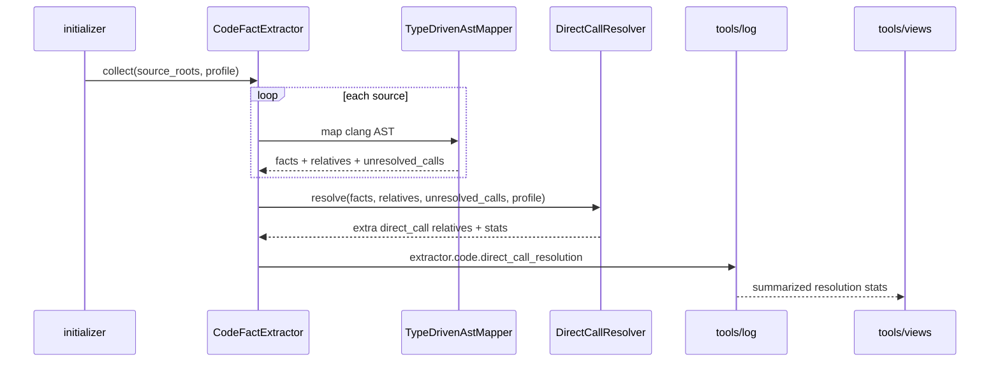
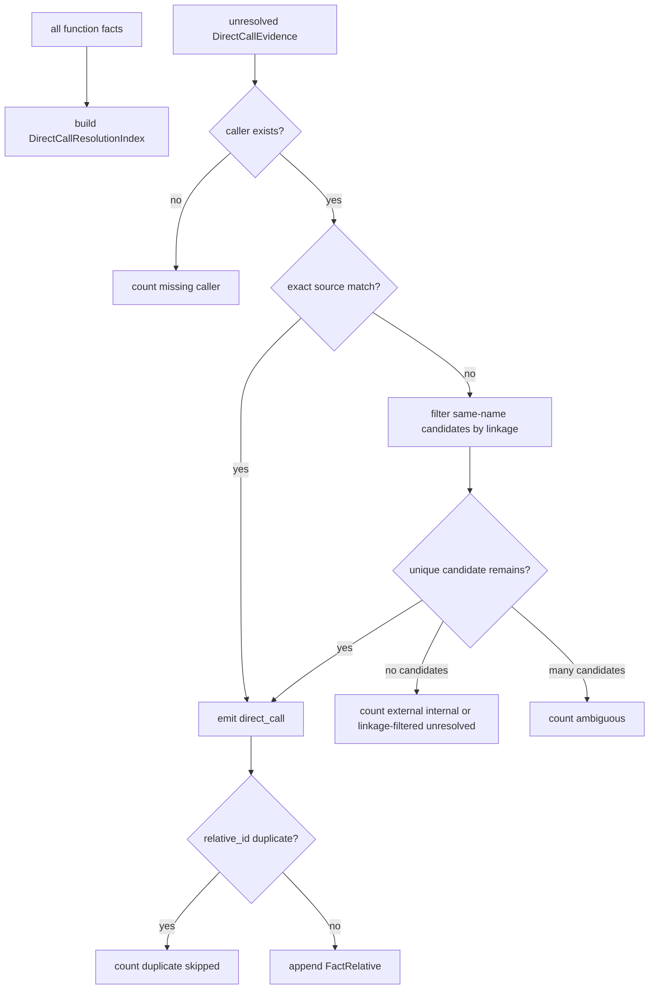
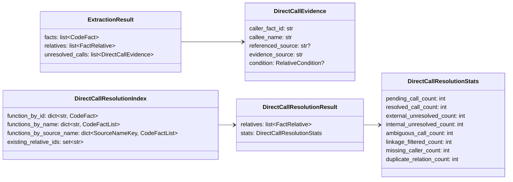

# 跨文件 Direct Call 后处理设计草稿

- 状态：设计 PR #73 已合入；权威规格已搬迁到模块 README，代码实现等待 TDD PR
- 范围：在 C 语言 Clang AST 抽取完成后，使用已收集 facts 拼接跨文件 `direct_call` relation

## 模块定位

- `src/cipher2/initializer/extractor/code/`：保留文件级 mapper，只记录 Clang `referencedDecl` 支持的 unresolved call evidence；在 `collect()` 末尾做全局、单线程 pending call resolution。
- `src/cipher2/storage/`：复用既有 `FactRelative` 和 `direct_call` relation kind，不改 snapshot schema。
- `src/cipher2/tools/log/`：记录跨文件 direct call 后处理统计。
- `src/cipher2/tools/views/`：在 log view 呈现 direct call resolution 核心统计和风险状态。

## 规格和约束

本功能不新增用户可配配置项、不新增 CLI 参数、不新增 MCP tool、不新增 snapshot 文件。

| 配置项 | type | 取值范围 | 默认值 | 作用 |
|---|---|---|---|---|
| 无新增配置 | n/a | n/a | n/a | 跨文件 direct call 后处理在 code extractor 内始终启用 |

规则：

- resolver 只能消费 Clang `CallExpr.referencedDecl` 产生的 `DirectCallEvidence`，不得按源码字符串或正则猜测调用关系。
- mapper 文件内已生成的 `direct_call` 不重复生成；pending 只处理当前文件 fact 索引找不到 callee 的调用。
- callee resolution 只在全局 function fact index 中查找 `payload.fact_kind == "function"` 的 fact。
- 若 `referenced_source` 有值，优先匹配 `(callee_name, referenced_source)`；无法匹配时才允许使用唯一同名 function fact fallback。
- 唯一同名 fallback 必须感知 `payload.linkage`：候选为 `static` / `internal` 且候选 `object_source` 不等于 caller `object_source` 时必须排除，不得把其他 translation unit 的 internal linkage 函数连成跨文件调用。
- fallback 过滤 linkage 后仍必须唯一；候选被 linkage 过滤为空时按 unresolved 计数，不生成 relation。
- 同名候选多于一个、caller fact 不存在、callee 无候选、或将生成重复 `relative_id` 时，不生成 relation，只计数并记录有界 evidence。
- `condition` 必须从 pending evidence 原样传递到生成的 `FactRelative`。
- 生成 relation 的 `payload` 只允许写 `evidence_source`、`callee_name`、`referenced_source`、`resolution_strategy`，不得写源码正文、绝对路径或完整 AST 片段。

## 接口流程





## 数据结构



## 成员表

| class | 成员名称 | type | 作用 | 并发粒度 |
|---|---|---|---|---|
| `ExtractionResult` | `unresolved_calls` | `list[DirectCallEvidence]` | 文件级 mapper 无法解析到当前文件 fact 的调用 evidence | 单 collect 聚合 |
| `DirectCallEvidence` | `caller_fact_id` | `str` | 调用方 function fact id | 单 CallExpr |
| `DirectCallEvidence` | `callee_name` | `str` | Clang referencedDecl 给出的 callee 名称 | 单 CallExpr |
| `DirectCallEvidence` | `referenced_source` | `str or None` | referencedDecl source，仓库相对路径 | 单 CallExpr |
| `DirectCallEvidence` | `evidence_source` | `str` | 调用发生位置，仓库相对路径加行号 | 单 CallExpr |
| `DirectCallEvidence` | `condition` | `RelativeCondition or None` | 调用所在条件 | 单 CallExpr |
| `DirectCallResolutionIndex` | `function_by_id` | `dict[str, CodeFact]` | caller 存在性校验；值为已有 function fact 引用 | 单 collect 只读 |
| `DirectCallResolutionIndex` | `functions_by_name` | `dict[str, list[CodeFact]]` | 唯一同名 fallback 查询；列表只保存已有 function fact 引用 | 单 collect 只读 |
| `DirectCallResolutionIndex` | `functions_by_source_name` | `dict[tuple[str, str], list[CodeFact]]` | source + name 精确查询；列表只保存已有 function fact 引用 | 单 collect 只读 |
| `DirectCallResolutionIndex` | `existing_relative_ids` | `set[str]` | relation 去重 | 单 collect 局部可变 |
| `DirectCallResolutionResult` | `relatives` | `list[FactRelative]` | 后处理新增的 `direct_call` relations | 单 collect 聚合 |
| `DirectCallResolutionResult` | `stats` | `DirectCallResolutionStats` | 后处理统计 | 单 collect 聚合 |
| `DirectCallResolutionStats` | `pending_call_count` | `int` | 待解析调用数 | 单 collect 聚合 |
| `DirectCallResolutionStats` | `resolved_call_count` | `int` | 成功补齐 relation 数 | 单 collect 聚合 |
| `DirectCallResolutionStats` | `external_unresolved_count` | `int` | 无仓内候选的外部调用数 | 单 collect 聚合 |
| `DirectCallResolutionStats` | `ambiguous_call_count` | `int` | 多候选未生成 relation 数 | 单 collect 聚合 |
| `DirectCallResolutionStats` | `linkage_filtered_count` | `int` | 因 internal linkage 跨 TU 被排除的候选数 | 单 collect 聚合 |
| `DirectCallResolutionStats` | `missing_caller_count` | `int` | caller fact 不存在的 pending 数 | 单 collect 聚合 |
| `DirectCallResolutionStats` | `duplicate_relation_count` | `int` | relative id 已存在而跳过的数量 | 单 collect 聚合 |
| `DirectCallResolutionStats` | `internal_unresolved_count` | `int` | referenced source 在仓内但无唯一 fact 的数量 | 单 collect 聚合 |

## 并发控制

- resolver 在所有文件 AST mapper 完成后运行一次，单线程处理，不引入后台任务。
- `DirectCallResolutionIndex` 只在单次 `collect()` 内存在，不写全局缓存。
- `DirectCallResolutionIndex` 只持有 collect 阶段已在内存中的 function fact 引用，不复制 payload、不保留 AST node、不重新读取 source 文件。
- relation 去重使用单次 collect 的 `existing_relative_ids`，不依赖 storage 失败来发现重复。
- storage snapshot 发布锁、日志 append 语义和增量 overlay 读路径保持不变。

## 可观测性

新增 `extractor.code.direct_call_resolution` 事件：

| status | counts 字段 | payload 字段 |
|---|---|---|
| `ok` | `pending_call_count`、`resolved_call_count`、`external_unresolved_count`、`internal_unresolved_count`、`ambiguous_call_count`、`linkage_filtered_count`、`missing_caller_count`、`duplicate_relation_count` | `operation="resolve_pending_direct_calls"`、`profile` |
| `warning` | 同上，且 `internal_unresolved_count > 0`、`ambiguous_call_count > 0` 或 `linkage_filtered_count > 0` | 同上 |

`tools/views` 的 log model 必须展示 pending、resolved、internal unresolved、ambiguous、linkage filtered 和 duplicate skipped 统计。外部库调用无法生成仓内 fact，默认不触发 warning；仓内 source 指向仍无法解析、同名多候选，或候选因 internal linkage 被过滤才触发 warning。

## 文档递归更新

设计 PR 合入后，README 搬迁 PR 需要更新：

- `src/cipher2/initializer/extractor/code/README.md`
- `src/cipher2/initializer/extractor/README.md`
- `src/cipher2/initializer/README.md`
- `src/cipher2/tools/log/README.md`
- `src/cipher2/tools/views/README.md`
- `src/cipher2/storage/schema/README.md`
- `docs/schema.md`
- `docs/user-guide.md`
- `docs/maintenance-guide.md`
- `tests/README.md`
- `README.md`

## TDD 与测试门禁

README 搬迁 PR 合入后，实现 PR 必须先写失败测试，再实现代码：

1. 两个 `.c` 文件跨文件调用，callee fact 已存在时补齐 `direct_call`。
2. `referenced_source` 精确匹配优先于唯一名称 fallback。
3. 头文件声明指向唯一实现时允许 fallback；同名 static 多候选时不生成 relation。
4. 唯一同名候选若为其他 source 的 `static` / `internal` function，不生成 relation，并计入 linkage filtered / unresolved。
5. 外部库调用只计入 `external_unresolved_count`，不触发 warning。
6. 条件调用保留 `RelativeCondition`。
7. 已存在 relation 或重复 pending evidence 不重复写入。
8. `extractor.code.direct_call_resolution` 事件和 views log model 展示统计并按规则 warning。

覆盖率要求：

- 功能点 100%：exact source、unique name fallback、linkage-aware fallback、condition、dedupe、external unresolved、internal unresolved、ambiguous、log/view。
- 异常分支 90%+：caller missing、callee candidate missing、duplicate relation、payload 超限防护、log disabled/log write failure。
- 场景组合 100%：单 source、多 source、多 source_roots、header declaration、static 同名、compile database 全命中和部分 miss。
- 性能和小型化：512MB/4GB/8GB 三档；resolver 时间复杂度 O(function facts + pending calls)，不得保留完整 AST。大档性能门禁必须包含高 pending 调用密度工况，确认 function index 与 pending 列表在三档内不突破内存预算。

实现 PR 运行：

```bash
git diff --check
PYTHONPATH=src python3 -m unittest discover -s tests
PYTHONPATH=src python3 scripts/clang_extractor_performance_gate.py
PYTHONPATH=src python3 scripts/initializer_performance_gate.py
PYTHONPATH=src python3 scripts/views_performance_gate.py
PYTHONPATH=src python3 scripts/log_performance_gate.py
PYTHONPATH=src python3 scripts/storage_relative_performance_gate.py
```

## 分阶段 PR

1. 设计 PR：新增本草稿并更新草稿索引。
2. README 搬迁 PR：把本草稿搬迁到相关 README，并递归更新到顶层文档。
3. 实现 PR：严格按 TDD 完成代码、测试、观测和性能门禁。
