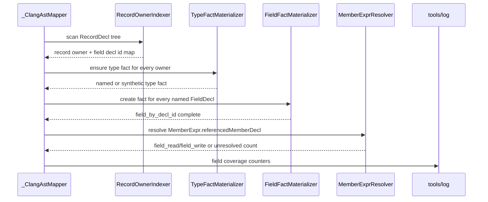
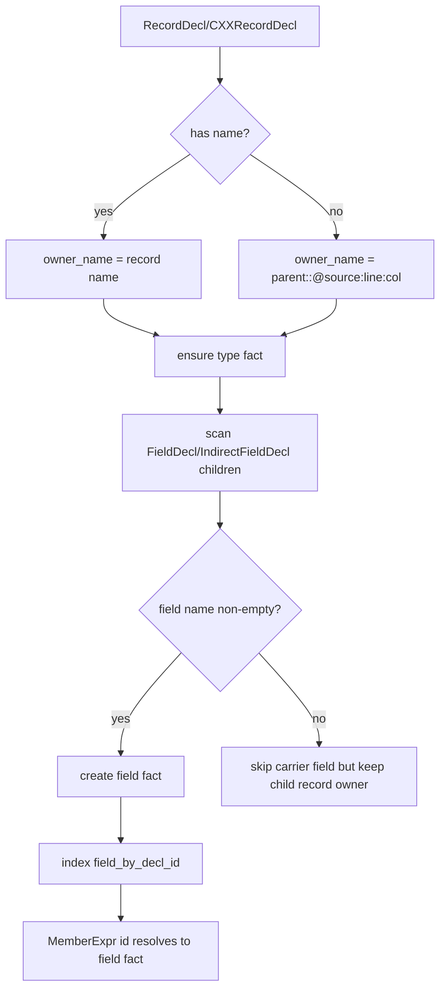
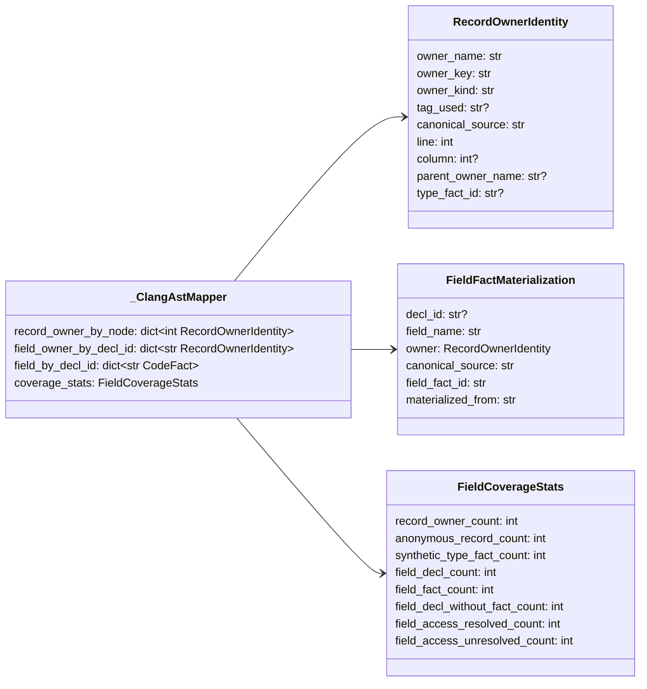

# Field Fact 覆盖补全设计草稿

- 状态：设计已合入；权威规格已搬迁到模块 README，代码实现等待 TDD PR
- 关联 issue：#65；补完 #60 中 field access recall 的剩余闭环
- 范围：为匿名 `struct/union`、嵌套 record 和未解析 type 创建可指向的 `field` fact，让 `MemberExpr.referencedMemberDecl` id 命中后一定有目标 fact

## 模块定位

- `src/cipher2/initializer/extractor/code/`：扩展 Clang AST mapper 的 record owner 建模、type fact materialize 和 field fact 创建策略。
- `src/cipher2/tools/log/`：记录 field declaration、field fact、匿名 owner、synthetic type 和 unresolved field access 计数。
- `src/cipher2/tools/views/`：在 log view 呈现 field 覆盖核心统计，帮助判断 field recall 是否被 fact 创建卡住。
- `src/cipher2/storage/` 与 `src/cipher2/mcp/`：不改 schema，不新增 public tool，只消费新增 facts/relatives。

## 规格和约束

本功能不新增用户可配持久配置项，不修改 `.cipher/config.yml`，不新增 CLI 参数，不新增 MCP tool。

| 配置项 | type | 取值范围 | 默认值 | 作用 | 本功能变化 |
|---|---|---|---|---|---|
| 新增用户可配配置项 | 无 | 无 | 无 | 无 | 不新增 |
| `extractor.code.clang_executable` | `str or null` | `null`、PATH 命令或可执行路径 | `null` | Clang AST dump | 继续使用既有能力探针 |
| `extractor.code.clang_args` | `list[str]` | 只读编译参数 | `[]` | 附加 Clang 参数 | 语义不变 |

行为约束：

- 任何带字段的 `RecordDecl/CXXRecordDecl` 都必须有 owner identity；匿名 record 使用稳定 synthetic owner。
- 只要 `FieldDecl/IndirectFieldDecl` 有非空字段名，就必须创建 `field` fact；不得因 record 无 `name` 或 `_resolve_type_fact` 失败而跳过。
- synthetic owner 不使用 Clang 内存地址式 `id` 构造 `object_id`；只能使用仓库相对 source、line、col、tagUsed 和父 owner path 等稳定 evidence。
- `has_field` 仍是 field owner 的权威关系；`field_read/field_write` 只指向唯一 field fact，无法唯一解析时不生成模糊边。
- 兼容 #64 已合入的 `referencedMemberDecl` string id 解析，不回退到字符串拼接推导。

## 接口流程





## 数据结构



本节“成员表”是 class/dataclass 成员清单，不是数据库表。

### `RecordOwnerIdentity` 成员表

| 成员名称 | type | 作用 | 并发粒度 |
|---|---|---|---|
| `owner_name` | `str` | field payload 与展示使用的 owner 名称 | 单 AST 文件级 |
| `owner_key` | `str` | 构造 type/field object_id 的稳定 owner identity | 单 AST 文件级 |
| `owner_kind` | `Literal["named","anonymous","synthetic_missing_type"]` | owner 来源 | 单 record |
| `tag_used` | `str or None` | `struct`、`union`、`enum` 等 Clang tag | 单 record |
| `canonical_source` | `str` | owner 定义所在仓库相对 source | 单 record |
| `line` | `int` | owner 定义行号 | 单 record |
| `column` | `int or None` | owner 定义列号，用于区分同一行匿名 record | 单 record |
| `parent_owner_name` | `str or None` | 嵌套匿名 record 的父 owner | 单 record |
| `type_fact_id` | `str or None` | materialize 后的 type fact id | 单 record |

### `FieldFactMaterialization` 成员表

| 成员名称 | type | 作用 | 并发粒度 |
|---|---|---|---|
| `decl_id` | `str or None` | Clang FieldDecl/IndirectFieldDecl id | 单 field decl |
| `field_name` | `str` | field fact 的 `object_name` | 单 field decl |
| `owner` | `RecordOwnerIdentity` | 字段所属 owner | 单 field decl |
| `canonical_source` | `str` | 字段定义 source | 单 field decl |
| `field_fact_id` | `str` | 生成后的 field fact id | 单 field decl |
| `materialized_from` | `Literal["named_record","anonymous_record","missing_type"]` | 创建原因 | 单 field decl |

### `FieldCoverageStats` 成员表

| 成员名称 | type | 作用 | 并发粒度 |
|---|---|---|---|
| `record_owner_count` | `int` | 已建模 record owner 数 | 单 AST 文件级 |
| `anonymous_record_count` | `int` | 匿名 owner 数 | 单 AST 文件级 |
| `synthetic_type_fact_count` | `int` | 因匿名或缺失 type 创建的 type fact 数 | 单 AST 文件级 |
| `field_decl_count` | `int` | 非空字段名的 field declaration 数 | 单 AST 文件级 |
| `field_fact_count` | `int` | 成功创建或复用的 field fact 数 | 单 AST 文件级 |
| `field_decl_without_fact_count` | `int` | 仍未 materialize 的 field declaration 数，目标为 0 | 单 AST 文件级 |
| `field_access_resolved_count` | `int` | MemberExpr 成功解析到 field fact 次数 | 单 AST 文件级 |
| `field_access_unresolved_count` | `int` | 有 member reference 但无唯一 field fact 的次数 | 单 AST 文件级 |

### `_ClangAstMapper` 新增成员表

| 成员名称 | type | 作用 | 并发粒度 |
|---|---|---|---|
| `record_owner_by_node` | `dict[int, RecordOwnerIdentity]` | AST node id 到 owner identity | 单 AST 文件级 |
| `field_owner_by_decl_id` | `dict[str, RecordOwnerIdentity]` | Clang field decl id 到 owner identity | 单 AST 文件级 |
| `field_by_decl_id` | `dict[str, CodeFact]` | Clang field decl id 到 field fact | 单 AST 文件级 |
| `coverage_stats` | `FieldCoverageStats` | 输出 log/views 的覆盖统计 | 单 AST 文件级 |

## Synthetic Owner 规则

```mermaid
flowchart TD
    A[RecordDecl] --> B{record name}
    B -->|named| C[owner_name = name]
    B -->|anonymous| D[read tagUsed/source/line/col]
    D --> E{has parent owner}
    E -->|yes| F[parent::<anonymous-tag>@source:line:col]
    E -->|no| G[<anonymous-tag>@source:line:col]
    C --> H[owner_key]
    F --> H
    G --> H
    H --> I[type fact object_id]
    H --> J[field fact object_id owner input]
```

示例：

- `struct Outer { union { int a; int b; }; }` 的匿名 union owner 为 `Outer::<anonymous-union>@src/foo.c:2:3`。
- 其字段 `a` 的 `object_name` 仍为 `a`，payload 写 `owner_name="Outer::<anonymous-union>@src/foo.c:2:3"`，并由 `has_field` 连接到 synthetic type fact。
- 匿名 carrier field 若没有 `name`，不创建 field fact；它只帮助子 record owner 建模。

## 可观测性

新增或补充 `extractor.code.file` payload/counts：

- `record_owner_count`
- `anonymous_record_count`
- `synthetic_type_fact_count`
- `field_decl_count`
- `field_fact_count`
- `field_decl_without_fact_count`
- `field_access_resolved_count`
- `field_access_unresolved_count`

`tools/views` 的 log model 必须展示最近一次 code extractor 的 field coverage 核心统计，至少包括 field fact 覆盖率、匿名 owner 数、未 materialize 字段数和 unresolved access 数。若 `field_decl_without_fact_count > 0` 或 `field_access_unresolved_count > 0`，view state 保持 warning。

## TDD 与测试门禁

开发阶段必须遵守 TDD。实现 PR 首批失败测试：

- 匿名 union 字段：`struct Outer { union { int a; int b; }; }; o->a` 生成 synthetic type、field fact、`has_field` 和 `field_read`。
- 匿名 struct 字段：`struct Outer { struct { int c; }; }; o->c` 同上。
- named record 但 type fact 预索引缺失时，`_map_fields` 仍 materialize type fact，不因 `_resolve_type_fact` 失败跳过字段。
- 同一行多个匿名 record 使用 column 或稳定 path 区分 owner identity。
- `FieldDecl/IndirectFieldDecl` 有 id 时，`field_by_decl_id` 必须覆盖所有非空字段名声明。
- log/view 呈现新增 field coverage counters，并对 unresolved/without fact 计数设计 warning 用例。

覆盖要求：

- 功能点覆盖率 100%：匿名 record、缺失 type、decl id 命中、field access relation、log/view。
- 异常分支覆盖率 90%+：缺 source、缺 line、缺 col、重复 owner、字段无 name、decl id 缺失。
- 场景用例覆盖率 100%：用户在 C 代码中可合法组合的 named/anonymous/nested field access 都必须有场景测试。
- 性能和小型化看护保留 512MB、4GB、8GB 三档；新增 owner 索引必须是单 AST 文件级线性扫描，不引入跨文件全量常驻结构。

实现 PR 必须运行：

- `PYTHONPATH=src python3 -m unittest tests.test_code_extractor_fixtures tests.test_initializer_observability tests.test_views_log_model`
- `PYTHONPATH=src python3 -m unittest discover -s tests`
- `PYTHONPATH=src python3 scripts/clang_extractor_performance_gate.py`
- `PYTHONPATH=src python3 scripts/initializer_performance_gate.py`
- `git diff --check`

## 文档递归更新

设计 PR 合入后，README 搬迁 PR 必须更新：

- `src/cipher2/initializer/extractor/code/README.md`
- `src/cipher2/tools/log/README.md`
- `src/cipher2/tools/views/README.md`
- `docs/schema.md`
- `docs/user-guide.md`
- `docs/maintenance-guide.md`
- `docs/README.md`
- `README.md`

README 搬迁 PR 合入并二次确认无内容漂移后，才能进入 TDD 实现 PR。

## PR 拆分

1. 设计 PR：只新增本草稿并更新草稿索引。
2. README 搬迁 PR：搬迁到 owning README 和顶层文档，确认语义无漂移。
3. 实现 PR：按 TDD 实现 owner index、type/field materialize、log/views 和性能门禁。
