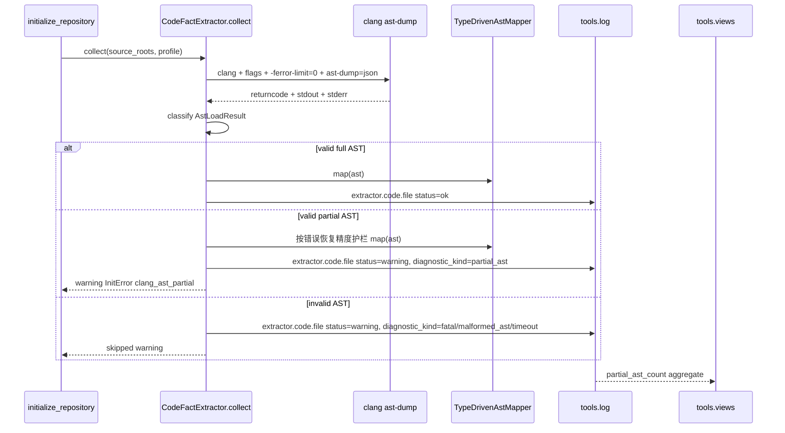
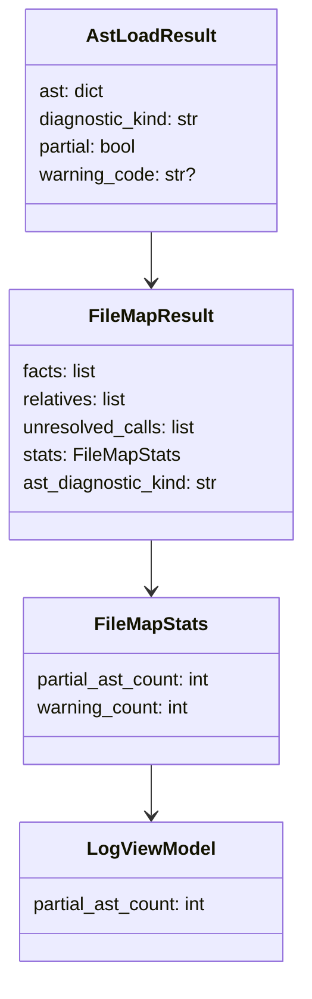

# 接受 Clang 部分 AST 设计草稿

- 状态：设计已合入；权威规格搬迁到模块 README；代码实现等待 TDD PR
- 目标 issue：#62
- 范围：`src/cipher2/initializer/extractor/code/`、`src/cipher2/initializer/`、`src/cipher2/tools/log/`、`src/cipher2/tools/views/` 和对应测试

## 模块定位

本功能只改变 C extractor 对目标文件 AST dump 的接受策略。Clang capability probe 仍然 fail-closed；正式抽取时若 Clang 产生有效 `TranslationUnitDecl` JSON，即使 returncode 非零或 stderr 含 error/fatal，也允许以 `partial_ast` warning 继续映射可用 facts/relatives。

## 规格与约束

- 不新增用户可配置配置项；`-ferror-limit=0` 是 extractor 内置参数，类型为固定命令行 flag，无取值范围，不暴露到 CLI/MCP/config。
- target AST 命令必须追加 `-ferror-limit=0`，并保留现有 `config.clang_args`、compile database per-file flags、AST JSON 参数顺序。
- 接受标准：stdout 可解析为 JSON object、根节点为 `TranslationUnitDecl`、`inner` 为非空 list。
- `returncode != 0` 或 stderr 含 `error:` / `fatal error:` 且满足接受标准时，文件继续映射，诊断为 `partial_ast`。
- 拒绝标准：timeout、OSError、stdout 非 JSON、根节点缺失/不是 `TranslationUnitDecl`、`inner` 缺失或为空。
- 精度护栏：partial AST 不放宽 mapper evidence 门槛；不得从 `RecoveryExpr`、`containsErrors=true`、`isInvalidDecl=true` 或缺失可解析 `qualType` / `referencedDecl` / `referencedMemberDecl` 的错误恢复节点及其子树产出 fact、relative 或 pending evidence。
- partial 文件中的 facts 必须与 full AST 同样满足 `loc.file`、声明引用和类型 evidence；证据缺失时只能跳过或记录既有 unresolved/gap 计数，不能用节点名称、源码片段或 AST 形状猜测。
- 不记录 raw stderr、源码正文、绝对路径或完整 AST；log/views 只记录有界计数和 `diagnostic_kind`。
- partial 文件进入 source inventory；skipped 文件不进入 source inventory。
- `InitSummary.warning_count` 必须包含 partial 文件；`errors` 列表追加 `InitError(code="clang_ast_partial", diagnostic_kind="partial_ast")`。

## 接口流程

## 数据结构

### `AstLoadResult` 成员表

| 成员名称 | type | 作用 | 并发粒度 |
|---|---|---|---|
| `ast` | `dict[str, JSONValue]` | 已接受的 Clang AST JSON；只传递引用 | 单 source |
| `diagnostic_kind` | `str` | `ok` 或 `partial_ast` | 单 source |
| `partial` | `bool` | 是否因 returncode/stderr 诊断降级为 partial | 单 source |
| `warning_code` | `str or None` | partial 时为 `clang_ast_partial` | 单 source |

### `_FileMapResult` 新增成员表

| 成员名称 | type | 作用 | 并发粒度 |
|---|---|---|---|
| `ast_diagnostic_kind` | `str` | 文件 AST 接受状态，供 collect 写 warning 与 log | 单 AST 文件级 |

### `_FileMapStats` 新增成员表

| 成员名称 | type | 作用 | 并发粒度 |
|---|---|---|---|
| `partial_ast_count` | `int` | 当前文件是否为 partial AST，取值 0 或 1 | 单 AST 文件级 |
| `warning_count` | `int` | 当前文件 warning 数，partial 时为 1 | 单 AST 文件级 |

### `LogViewModel` 新增成员表

| 成员名称 | type | 作用 | 并发粒度 |
|---|---|---|---|
| `partial_ast_count` | `int` | log summary 聚合的 partial AST 文件数 | view 构建级 |

## 对外接口

- CLI 参数、MCP tools、storage snapshot schema 不变。
- `InitSummary.warning_count` 和 `InitSummary.errors` 新增可恢复 warning 类型 `clang_ast_partial`。
- `extractor.code.file` 对 partial 文件使用 `status="warning"`、`error_code="clang_ast_partial"`、`payload.diagnostic_kind="partial_ast"`、`payload.outcome="extracted_partial"`。
- `tools/views` log section 展示 `partial_ast_count`；只要存在 partial AST，log section 为 warning。

## 并发控制

- AST classify 只在单文件 subprocess 返回后执行，不引入后台线程。
- `AstLoadResult.ast` 不复制 AST；mapper 只读消费同一个 dict 引用。
- partial warning 只追加到当前 collect 的 `errors` 列表，不写全局缓存。
- log 写入仍沿用现有 per-channel JSONL 锁；storage snapshot 写入仍由 storage 锁负责。

## 测试门禁

- TDD：先新增失败测试，再实现。
- partial AST：returncode 非零但 stdout 有有效 `TranslationUnitDecl` 时产出 facts、source inventory 和 `clang_ast_partial` warning。
- stderr fatal：returncode 为 0 但 stderr 含 fatal/error 且 AST 有效时标记 partial。
- partial AST 精度：含 `RecoveryExpr`、`containsErrors=true`、`isInvalidDecl=true`、未声明类型或未解析 member/call 引用的错误区域时，不得从错误恢复节点或其子树产出错误 fact、relative 或 pending evidence。
- 拒绝分支：malformed JSON、非 object、缺失/空 `inner`、timeout 仍为 `clang_ast_failed`。
- 可观测性：log digest 和 views model 展示 `partial_ast_count`，warning state 生效。
- 性能/小型化：`initializer_performance_gate.py` 和 `clang_extractor_performance_gate.py` 保持大/中/小三档通过；partial classify 不复制 AST，内存增长为 O(1) 附加元数据。
