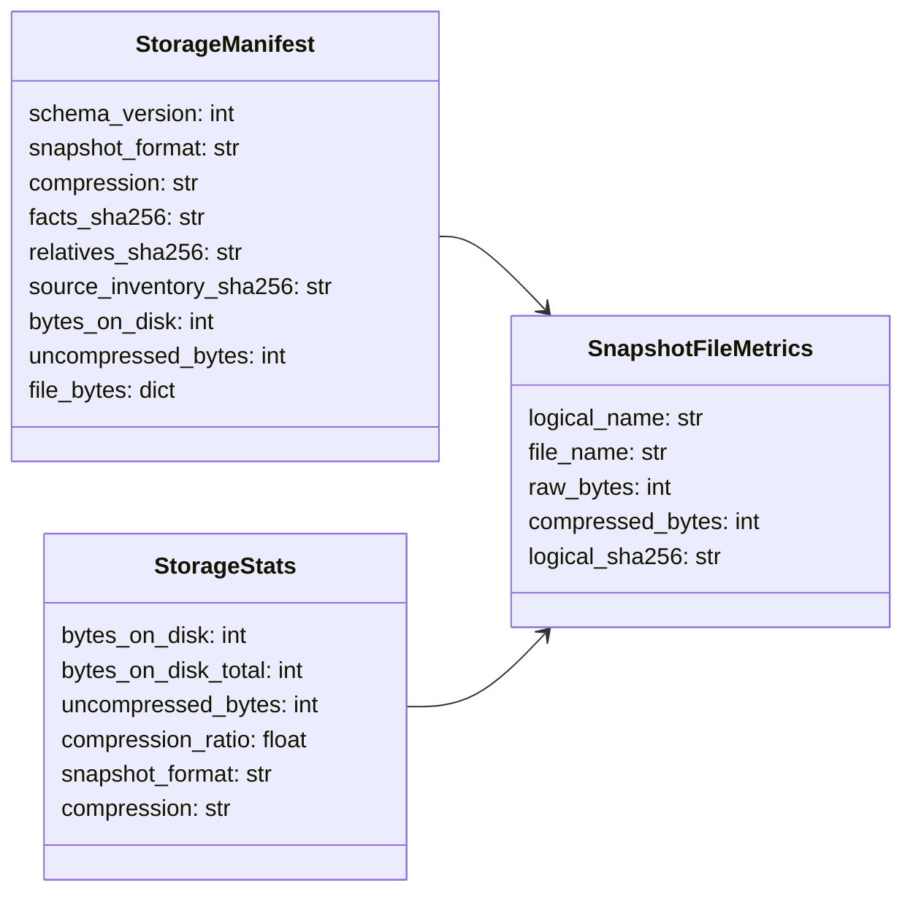
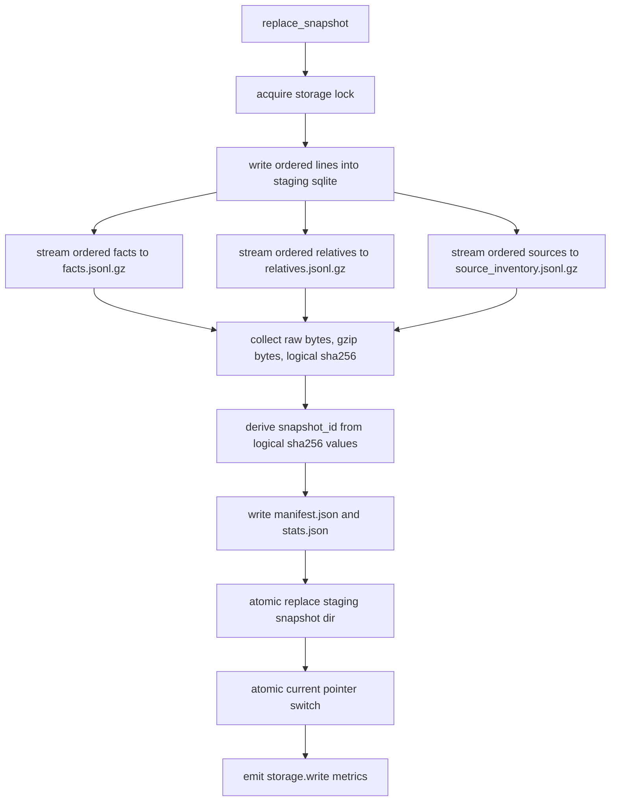
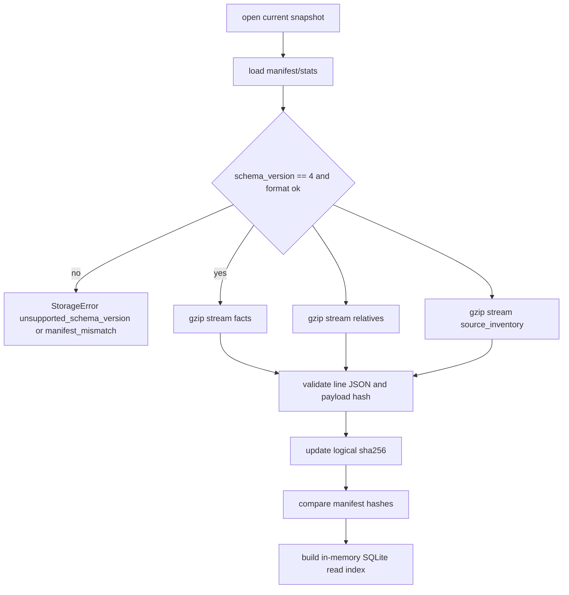

# storage 紧凑快照设计

- 状态：设计 PR #80 已合入，README 搬迁中
- 关联 issue：#56
- 范围：`src/cipher2/storage/` snapshot 文件格式、manifest/stats 字段、读索引构建输入、log/views 体积观测

## 模块定位

本设计只解决 `.cipher/snapshots/<snapshot_id>/` 下 FACT snapshot 明文 JSONL 体积过大的问题。storage 继续负责 `FactRecord`、`FactRelative`、source inventory、manifest、stats 和只读 SQLite index 构建；不实现 #55 的持久 SQLite index，不新增 MCP tool，不改变 search/detail 语义。

## 规格和约束

本功能不新增用户可配配置项，不新增 CLI 参数，不修改 `.cipher/config.yml`。

| 配置项 | type | 取值范围 | 默认值 | 作用 | 本功能变化 |
|---|---|---|---|---|---|
| 新增用户可配配置项 | 无 | 无 | 无 | 无 | 不新增 |

- 新 snapshot schema 升级为 `SCHEMA_VERSION = 4`。
- 新 snapshot 数据文件改为 `facts.jsonl.gz`、`relatives.jsonl.gz`、`source_inventory.jsonl.gz`。
- 压缩算法固定为标准库 `gzip`，`compresslevel=1`，`mtime=0`，保证输出稳定且不引入第三方依赖。
- gzip 内部仍是逐行 canonical JSON；`StoredFactLine`、`StoredRelativeLine`、`StoredSourceInventoryLine` 的逻辑字段不改。
- `facts_sha256`、`relatives_sha256`、`source_inventory_sha256` 继续表示未压缩 canonical line stream 的 sha256，用于 snapshot identity；压缩文件损坏由 gzip CRC、解压错误和未压缩 digest 校验共同拦截。
- `bytes_on_disk` 统计压缩后的实际文件大小；新增 `uncompressed_bytes` 和单文件压缩前后字节数，用于观测压缩收益。
- 不提供 v3 snapshot 迁移或回读兼容。已有 v3 snapshot 需要用户执行 `cipher2 rebuild` 重建；缺少 `.jsonl.gz` 或 schema 不匹配时报稳定错误。
- `stats.json` 和 `manifest.json` 保持未压缩，便于 `cipher2 status` 和人工快速定位 snapshot 状态。

## Snapshot 文件结构

```text
.cipher/snapshots/
  current
  <snapshot_id>/
    facts.jsonl.gz
    relatives.jsonl.gz
    source_inventory.jsonl.gz
    manifest.json
    stats.json
```

## 数据结构



### `StorageManifest` 新增/调整成员表

| 成员名称 | type | 作用 | 并发粒度 |
|---|---|---|---|
| `snapshot_format` | `str` | 固定为 `compact-jsonl-gzip`，标识数据文件格式 | snapshot 级不可变 |
| `compression` | `str` | 固定为 `gzip-1`，标识算法和压缩等级 | snapshot 级不可变 |
| `uncompressed_bytes` | `int` | 三个数据文件压缩前总字节数 | snapshot 级不可变 |
| `file_bytes` | `dict[str, dict]` | `facts`、`relatives`、`source_inventory` 的 raw/compressed 字节数 | snapshot 级不可变 |
| `facts_sha256` | `str` | 未压缩 `facts` line stream hash | snapshot 级不可变 |
| `relatives_sha256` | `str` | 未压缩 `relatives` line stream hash | snapshot 级不可变 |
| `source_inventory_sha256` | `str` | 未压缩 source inventory line stream hash | snapshot 级不可变 |

### `StorageStats` 新增成员表

| 成员名称 | type | 作用 | 并发粒度 |
|---|---|---|---|
| `snapshot_format` | `str` | views/status 展示当前 snapshot 格式 | snapshot 级不可变 |
| `compression` | `str` | views/status 展示压缩策略 | snapshot 级不可变 |
| `uncompressed_bytes` | `int` | 压缩前体积 | snapshot 级不可变 |
| `compression_ratio` | `float` | `bytes_on_disk / uncompressed_bytes`，写入时保留两位小数，无数据时为 `1.0` | snapshot 级不可变 |
| `file_bytes` | `dict[str, dict]` | 每类数据文件压缩前后字节数 | snapshot 级不可变 |

### `SnapshotFileMetrics` 成员表

| 成员名称 | type | 作用 | 并发粒度 |
|---|---|---|---|
| `logical_name` | `str` | `facts`、`relatives` 或 `source_inventory` | staging 文件级 |
| `file_name` | `str` | 落盘文件名，如 `facts.jsonl.gz` | staging 文件级 |
| `raw_bytes` | `int` | 写入 gzip 前的 canonical line bytes | staging 文件级 |
| `compressed_bytes` | `int` | gzip 关闭后的实际文件大小 | staging 文件级 |
| `logical_sha256` | `str` | 未压缩 canonical line stream hash | staging 文件级 |

## 写入流程



写入必须保持流式：不得把全部 facts、relatives 或 source inventory materialize 到 Python list。staging SQLite 仍只负责排序和去重；gzip 写入从排序结果逐行写出并同步更新未压缩 digest。

## 读取和索引流程



`_build_read_index` 仍从 line text 提取 `object_id`、搜索字段和 relative endpoint；差异仅是输入 reader 由普通文件改为 gzip text stream。`_ReadIndex` 不保存压缩内容，不改变查询排序和 relation preview。

## 对外接口

Python API 不变：

```python
store = open_fact_store(target, mode="w")
manifest = store.replace_snapshot(facts, relatives, source_inventory)
stats = store.stats()
records = store.search("alpha", limit=20)
```

`StorageManifest.to_json()` 和 `StorageStats.to_json()` 会多返回格式和压缩统计字段。MCP `search` / `detail` 不新增字段；views/status 可以读取 storage stats 呈现核心体积信息。

## 并发控制

- 写入仍使用 `.cipher/run` storage lock，锁粒度为单次 `replace_snapshot`。
- gzip 文件只在 staging 目录内创建；关闭并完成校验后才写 manifest/stats。
- `current` 指针切换仍为最后一步原子操作；读者不会看到半写入 `.jsonl.gz`。
- `_ReadIndex` cache key 使用 snapshot 路径、逻辑 sha256 和 counts 作为主身份；压缩文件 size/mtime 只作为防御性兜底。这样同内容重建时逻辑 sha256 保持稳定，cache 可命中；如果磁盘文件被外部替换但 manifest 未变，size/mtime 仍能阻止复用旧 index。

## 可观测性和 views

`storage.write` 新增或补齐 payload：

- `snapshot_format=compact-jsonl-gzip`
- `compression=gzip-1`

`storage.write` 新增或补齐 counts，所有值必须为整数：

- `bytes_written`
- `uncompressed_bytes`
- `compression_ratio_percent`：`round(bytes_on_disk * 100 / uncompressed_bytes)`，无数据时为 `100`
- `facts_raw_bytes` / `facts_compressed_bytes`
- `relatives_raw_bytes` / `relatives_compressed_bytes`
- `source_inventory_raw_bytes` / `source_inventory_compressed_bytes`

`storage.error` 必须覆盖 gzip 解压失败、manifest 文件缺失、schema 不匹配、digest mismatch。`tools/views` 的 storage section 展示 snapshot 格式、压缩策略、压缩前后体积、压缩率和总 snapshot bytes；空仓库显示 `none`，不得把缺失 snapshot 当作错误。

## 文档递归更新

设计 PR 合入后，README 搬迁 PR 必须更新：

1. `src/cipher2/storage/schema/README.md`：snapshot 文件名、manifest/stats 字段、schema v4、v3 不兼容语义。
2. `src/cipher2/storage/README.md`：storage 职责、数据结构、并发、可观测性和测试门禁。
3. `src/cipher2/tools/views/README.md`：storage section 的压缩统计展示。
4. `src/cipher2/tools/log/README.md`：`storage.write` 新增压缩指标。
5. `docs/schema.md`：更新 `Snapshot Layout` 文件名、schema v4 格式语义和旧 snapshot rebuild 要求。
6. `docs/user-guide.md`、`docs/maintenance-guide.md`、`docs/README.md`、`README.md`：用户可见 snapshot 结构、rebuild 注意事项和性能门禁。
7. `tests/README.md`：新增 storage compact snapshot 覆盖矩阵。

## TDD 与测试门禁

实现 PR 必须先提交失败测试，再写最小实现。首批失败测试：

- 新 snapshot 只生成 `.jsonl.gz`，不生成 `.jsonl`。
- `manifest.json` schema v4 包含 `snapshot_format`、`compression`、`uncompressed_bytes`、`file_bytes`。
- 写入后 `iter_facts`、`iter_relatives`、`iter_source_inventory`、`search`、`relatives_for_fact` 与压缩前语义一致。
- gzip 文件损坏、截断、非 gzip 内容、logical digest mismatch 均报稳定错误。
- v3 明文 snapshot 不被兼容读取，提示重建。
- `storage.write` 事件包含压缩统计；views storage section 展示压缩率和格式。
- 空 snapshot、facts-only、relative-heavy、source inventory-only、重复写入复用 snapshot id、并发读写边界均覆盖。

实现 PR 必须运行：

```bash
git diff --check
PYTHONPATH=src python3 -m unittest discover -s tests
PYTHONPATH=src python3 scripts/storage_performance_gate.py
PYTHONPATH=src python3 scripts/storage_relative_performance_gate.py
PYTHONPATH=src python3 scripts/views_performance_gate.py
PYTHONPATH=src python3 scripts/log_performance_gate.py
```

性能门禁需要扩展输出 `raw_snapshot_mb`、`compressed_snapshot_mb`、`compression_ratio` 和冷启动 `_build_read_index` 耗时。large 工况必须在 512MB、4GB、8GB 三档内保持内存预算；压缩后 snapshot 体积在标准 storage gate 和 relative-heavy gate 中应不高于同一 workload 未压缩 logical bytes 的 55%。gzip 会给 #55 关注的冷启动索引构建增加解压步骤，但也减少磁盘 I/O；实现 PR 必须用同一 workload 记录 gzip snapshot 的冷启动索引时间，确认没有放大 #55 痛点。若 gzip CPU 导致 large 工况超时或冷启动显著回归，必须回到设计阶段调整格式或门禁，不得降级为 warning。

## PR 拆分

1. 设计 PR：新增本草稿并更新草稿索引。
2. README 搬迁 PR：把本设计搬迁到 storage/schema、storage、log、views 和用户/维护文档，确认无内容漂移。
3. 实现 PR：按 TDD 实现 gzip snapshot、manifest/stats、log/views 和性能门禁。
