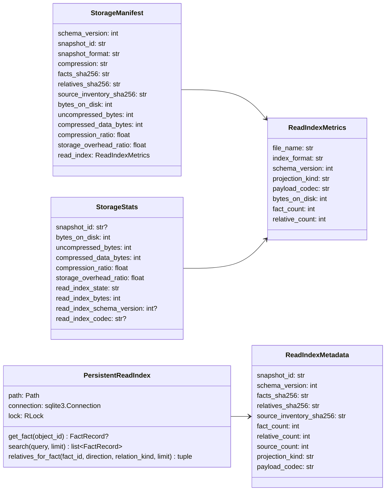
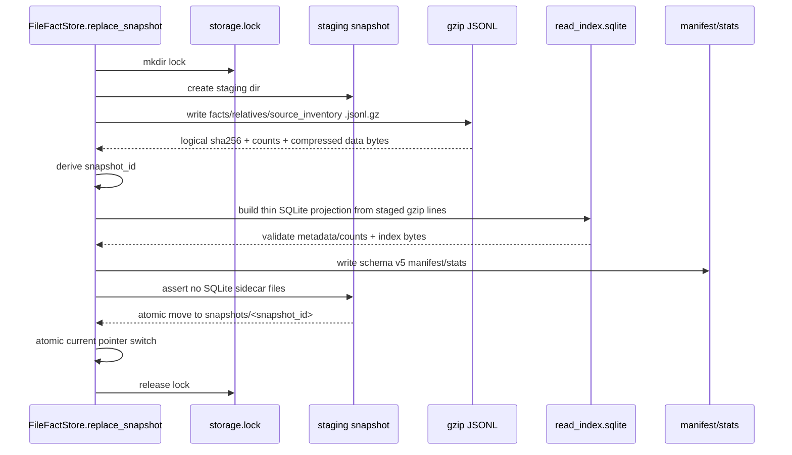
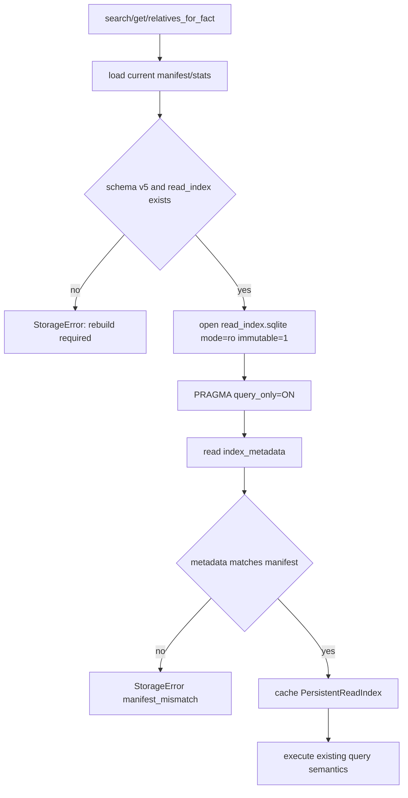
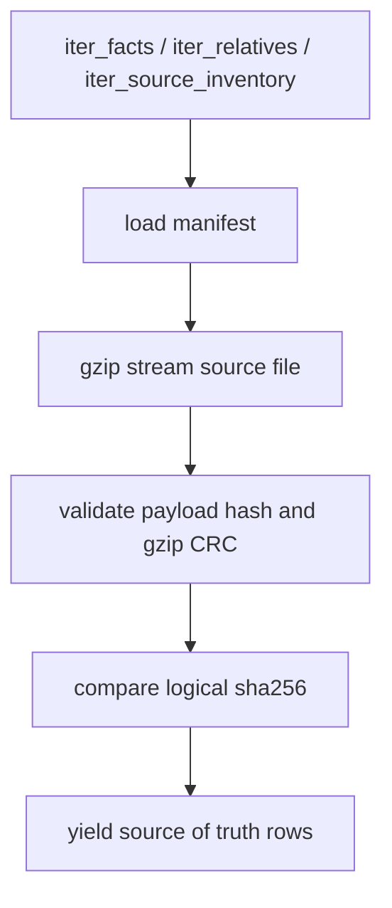

# storage 持久化读索引设计草稿

## 模块定位

- 范围：`src/cipher2/storage/` snapshot 写入、读索引打开、manifest/stats、`tools/log`、`tools/views`、性能门禁。
- 目标：把当前每次冷启动从 gzip JSONL 全量重建内存 SQLite，改为 snapshot 写入时生成持久 `read_index.sqlite`，读路径直接只读打开磁盘索引。
- 非目标：不新增 MCP tool，不改变 `search/detail/relatives_for_fact` 语义，不引入 Graph/Inference，不实现旧 snapshot 自动迁移。

## 规格与约束

- 新 snapshot schema 升级为 `SCHEMA_VERSION = 5`。
- `.cipher/snapshots/<snapshot_id>/read_index.sqlite` 成为必需文件；v4 snapshot 缺少该文件时不兼容，要求 `rebuild`。
- `snapshot_id` 仍只由 `facts_sha256`、`relatives_sha256`、`source_inventory_sha256` 推导；read index 是派生物，不参与 identity。
- read index 必须由同一 staging snapshot 的 gzip JSONL 构建，写入完成并校验 metadata 后才能切换 `current`。
- read index SQLite 不启用 WAL，不允许产生 `-wal`、`-shm`、`-journal` 副文件进入 snapshot。
- 查询路径不得在正常情况下调用 `_build_read_index()` 重建内存索引；缺失、损坏或 metadata mismatch 直接返回稳定错误。
- read index 必须是瘦投影：保存查询、重建 `FactRecord` / `FactRelative` 所需的列和压缩 payload/condition，不在 SQLite 内重复保存完整 canonical JSONL 行。
- `compressed_data_bytes` 只统计三个 gzip 数据文件；`bytes_on_disk` 统计 snapshot 总落盘体积；`compression_ratio = compressed_data_bytes / uncompressed_bytes`；`storage_overhead_ratio = bytes_on_disk / uncompressed_bytes`。
- 小型化门禁采用 #56 的 compact snapshot 目标优先：`storage_overhead_ratio <= 0.6`，且 `read_index_bytes / compressed_data_bytes <= 2.0`；若实测不能满足，必须先继续瘦身索引结构，不能直接放宽门禁。
- 新增用户可配配置项：无。

| 配置项 | type | 取值范围 | 作用 |
|---|---|---|---|
| 无 | N/A | N/A | 持久化读索引是 storage schema v5 固定行为，不提供开关或 backend 选择。 |

## Snapshot 布局

```text
.cipher/snapshots/<snapshot_id>/
  facts.jsonl.gz
  relatives.jsonl.gz
  source_inventory.jsonl.gz
  read_index.sqlite
  manifest.json
  stats.json
```

## 数据结构



### `ReadIndexMetrics` 成员表

| 成员名称 | type | 作用 | 并发粒度 |
|---|---|---|---|
| `file_name` | `str` | 固定为 `read_index.sqlite` | snapshot 级不可变 |
| `index_format` | `str` | 固定为 `sqlite-read-index` | snapshot 级不可变 |
| `schema_version` | `int` | read index 内部 schema 版本，当前为 `5` | snapshot 级不可变 |
| `projection_kind` | `str` | 固定为 `thin-column-projection`，禁止在 index 中重复保存完整 JSONL 行 | snapshot 级不可变 |
| `payload_codec` | `str` | payload/condition JSON 在 SQLite 中的编码，固定为 `json-text` | row 级不可变 |
| `bytes_on_disk` | `int` | `read_index.sqlite` 文件大小 | snapshot 级不可变 |
| `fact_count` | `int` | index 内 fact 行数 | snapshot 级不可变 |
| `relative_count` | `int` | index 内 relative 行数 | snapshot 级不可变 |

### `ReadIndexMetadata` 成员表

| 成员名称 | type | 作用 | 并发粒度 |
|---|---|---|---|
| `snapshot_id` | `str` | 防止 index 被错误复用到其他 snapshot | snapshot 级不可变 |
| `schema_version` | `int` | SQLite index schema 版本 | snapshot 级不可变 |
| `facts_sha256` | `str` | 与 manifest 对齐的未压缩 facts digest | snapshot 级不可变 |
| `relatives_sha256` | `str` | 与 manifest 对齐的未压缩 relatives digest | snapshot 级不可变 |
| `source_inventory_sha256` | `str` | 与 manifest 对齐的未压缩 source digest | snapshot 级不可变 |
| `fact_count` | `int` | 与 manifest 对齐的 fact count | snapshot 级不可变 |
| `relative_count` | `int` | 与 manifest 对齐的 relative count | snapshot 级不可变 |
| `source_count` | `int` | 与 manifest 对齐的 source count | snapshot 级不可变 |
| `projection_kind` | `str` | 与 manifest 对齐的 index 投影形态 | snapshot 级不可变 |
| `payload_codec` | `str` | `payload_json` / `condition_json` 解码方式 | snapshot 级不可变 |

### `PersistentReadIndex` 成员表

| 成员名称 | type | 作用 | 并发粒度 |
|---|---|---|---|
| `path` | `Path` | 当前 snapshot 的 `read_index.sqlite` | snapshot 级只读 |
| `connection` | `sqlite3.Connection` | 只读 SQLite connection，`query_only=ON` | index 实例级 |
| `lock` | `threading.RLock` | 保护同一 connection 的并发访问 | index 实例级 |
| `get_fact()` | `callable` | 通过 `object_id` 读取并解压单行 fact | 请求级 |
| `search()` | `callable` | 使用持久索引字段执行现有 AND 分词搜索 | 请求级 |
| `relatives_for_fact()` | `callable` | 使用 endpoint index 读取 bounded relatives | 请求级 |

## SQLite 表

```sql
CREATE TABLE index_metadata (key TEXT PRIMARY KEY, value TEXT NOT NULL);
CREATE TABLE facts (
  object_id TEXT PRIMARY KEY,
  object_name TEXT NOT NULL,
  object_description TEXT NOT NULL,
  object_source TEXT NOT NULL,
  object_profile TEXT NOT NULL,
  object_caller TEXT,
  object_callee TEXT,
  payload_json TEXT NOT NULL,
  fact_kind_rank INTEGER NOT NULL,
  object_name_cf TEXT,
  object_description_cf TEXT,
  object_caller_cf TEXT,
  object_callee_cf TEXT,
  object_source_cf TEXT
);
CREATE TABLE relatives (
  relative_id TEXT PRIMARY KEY,
  from_fact_id TEXT NOT NULL,
  to_fact_id TEXT NOT NULL,
  relation_kind_code INTEGER NOT NULL,
  confidence REAL NOT NULL,
  object_profile TEXT,
  evidence_source TEXT,
  condition_json TEXT,
  payload_json TEXT NOT NULL
);
CREATE INDEX relatives_from_idx ON relatives(from_fact_id, relation_kind_code);
CREATE INDEX relatives_to_idx ON relatives(to_fact_id, relation_kind_code);
```

`payload_json` 和 `condition_json` 保存 canonical JSON text。read index 不重复落地所有 casefold 文本；`object_*_cf` 是稀疏 fallback 列，只有 SQLite ASCII `lower()` 无法表达字段 casefold 时才写入。`fact_kind_rank` 只保存 search 排序所需整数权重，用于让同名 type/function/global 等定义类 fact 排在 field fact 前。搜索快路径使用 SQLite `lower()/instr()`，fallback 列保持现有 Unicode casefold 语义，并降低小型化门禁中的 index 体积。fact/relative 的固定字段以列保存，用于直接重建 API 返回对象和执行关系查询；gzip JSONL 仍是 source of truth。

SQLite 文件使用 1024 byte page，`index_metadata`、`facts` 和 `relatives` 主键表使用 `WITHOUT ROWID`。该布局专门看护 1k 级小仓库的固定页开销，不允许通过放宽 `storage_overhead_ratio <= 0.6` 或 `read_index_bytes / compressed_data_bytes <= 2.0` 门禁来掩盖体积回归。

`relatives.relation_kind_code` 使用按 relation kind 字符串排序后的稳定整数映射，避免同一 relation kind 字符串在 relative 表和两个 endpoint index 中重复存储；对外接口仍返回 relation kind 字符串。

`relatives.object_profile` 对 `default` 使用 `NULL` 编码，读出时还原为 `"default"`。其他 profile 原样存储；对外接口仍返回非空 profile 字符串。

## 接口流程

### 写入流程



### 读取流程



### 迭代流程



## 对外接口

- Python API 不变：`open_fact_store()`、`search()`、`get_fact()`、`relatives_for_fact()`、`iter_*()` 保持原签名。
- MCP public tools 不变：仍只公开 `search` 和 `detail`。
- CLI `status` 增加 read index 状态和大小展示。
- 内部 helper 规划：
  - `_build_read_index_file(snapshot_dir, manifest) -> ReadIndexMetrics`
  - `_open_persistent_read_index(snapshot_dir, manifest) -> PersistentReadIndex`
  - `_validate_read_index_metadata(connection, manifest) -> None`

## 并发控制

- 写入阶段在 `storage.lock` 内构建 `read_index.sqlite`，且只在 staging 目录中可见。
- `current` 切换前 read index 已关闭连接，避免跨进程残留 lock。
- 读取阶段使用 `sqlite3.connect("file:<path>?mode=ro&immutable=1", uri=True)`，并设置 `PRAGMA query_only=ON`。
- `_ReadIndex` cache key 使用 snapshot path、logical sha256、counts、read index schema version、read index size/mtime。
- cache eviction 继续关闭旧 connection；不同 snapshot 不共享 connection。
- 若 writer 发布新 snapshot，旧 reader 可继续读旧 snapshot 文件；不会覆盖同一路径。
- `immutable=1` 的前提是已发布 snapshot 在 reader 存活期间不被修改或删除；旧 snapshot 清理策略另行设计时，必须先处理 active reader 的引用保护或延迟删除。

## 兼容与错误

- v4 或更旧 snapshot：`unsupported_schema_version`，提示 rebuild。
- `read_index.sqlite` 缺失：`manifest_mismatch`。
- SQLite open、schema、解压或 metadata 失败：`snapshot_corrupt` 或 `manifest_mismatch`。
- gzip 数据文件仍是 source of truth；`iter_*()` 继续做 full digest 校验。
- indexed query 为冷启动性能不重新 hash gzip 全量内容，只校验 manifest、文件大小和 read index metadata。`.cipher/` 不作为对抗性篡改边界。

## 可观测性

- `storage.write` 增加：
  - `payload.read_index_format="sqlite-read-index"`
  - `payload.read_index_codec="json-text"`
  - `counts.read_index_bytes`
  - `counts.read_index_build_ms`
  - `counts.compressed_data_bytes`
  - `counts.storage_overhead_ratio_percent`
- 新增 `storage.index_open`：
  - `payload.index_backend="persistent-sqlite"`
  - `payload.outcome="opened"|"cache_hit"`
  - `counts.read_index_open_ms`
  - `counts.read_index_bytes`
- `storage.error` 覆盖 missing index、metadata mismatch、SQLite corrupt/open failed。
- views/storage 增加：
  - `read_index_state`
  - `read_index_bytes`
  - `read_index_schema_version`
  - `read_index_codec`
  - `storage_overhead_ratio`

## 测试门禁

- TDD 先写失败用例：
  - schema v5 snapshot 写出 `read_index.sqlite`、manifest/stats index 字段和无 SQLite sidecar。
  - `search/get_fact/relatives_for_fact` 首次查询直接打开持久 index，不调用内存 `_build_read_index()`。
  - missing index、metadata mismatch、SQLite corrupt、v4 snapshot 均返回稳定错误。
  - `iter_*()` 仍以 gzip source of truth 校验 payload hash、gzip CRC 和 logical digest。
  - `storage.write`、`storage.index_open`、views/storage、`cipher2 status` 展示 read index 指标。
- 覆盖矩阵必须更新 `test_storage_coverage_matrix.py`、`test_log_coverage_matrix.py`、`test_views_coverage_matrix.py`。
- 性能门禁：
  - `scripts/storage_performance_gate.py` 和 `scripts/storage_relative_performance_gate.py` 输出 `read_index_build_ms`、`cold_index_open_ms`、`first_search_ms`、`read_index_mb`、`storage_overhead_ratio`。
  - large `cold_index_open_ms <= 1000`，medium `<= 250`，small `<= 100`。
  - `compressed_data_bytes / uncompressed_bytes <= 0.55` 继续硬卡。
  - `bytes_on_disk / uncompressed_bytes <= 0.6`，保留 compact snapshot 的主要收益。
  - `read_index_bytes / compressed_data_bytes <= 2.0`，避免 read index 体积失控。
  - 512MB、4GB、8GB 三档继续使用现有 memory budgets。

## 后续清理议题

- 本功能不实现旧 snapshot retention/cleanup。
- #55 合入后必须单独登记旧 snapshot 清理策略，避免多次 rebuild 在 `.cipher/snapshots/` 中长期累积大索引文件。

## 递归文档更新计划

设计 PR 合入后，README 搬迁 PR 必须更新：

- `README.md`：把快速开始中的 v4 `compact-jsonl-gzip` snapshot 描述升级为 v5，列出 `read_index.sqlite`，并同步 storage 性能门禁说明。
- `docs/README.md`：更新 v1 架构索引中的 storage snapshot 边界，说明 read index 是 FACT snapshot 的派生索引，不改变 MCP public tools。
- `src/cipher2/storage/README.md`：更新 snapshot 文件列表、schema v5、写入流程、读取流程中 “build in-memory SQLite read index” 的旧描述，以及 cold-start `_build_read_index` 性能门禁说明。
- `src/cipher2/storage/schema/README.md`：补充 manifest/stats v5 字段、`ReadIndexMetrics`、`ReadIndexMetadata` 和 index metadata 校验规则。
- `src/cipher2/tools/log/README.md`：补充 `storage.write` 的 read index build/size/overhead 字段和 `storage.index_open` 事件。
- `src/cipher2/tools/views/README.md`：补充 storage view/status 的 `read_index_state`、schema、codec、大小和 overhead ratio。
- `docs/schema.md`：同步 v5 snapshot layout、manifest/stats 字段和 read index SQLite metadata。
- `docs/user-guide.md`：说明用户侧 rebuild 后会生成 read index，缺失或损坏时错误提示仍要求 `cipher2 rebuild`。
- `docs/maintenance-guide.md`：补充设计、README 搬迁、TDD 实现三阶段对 v5 read index 的检查点。
- `tests/README.md`：补充 v5 layout、持久索引打开、错误分支、log/views 可观测字段的测试矩阵。
- `scripts/README.md`：补充 storage 性能门禁输出 `read_index_build_ms`、`cold_index_open_ms`、`first_search_ms`、`read_index_mb` 和 overhead ratio。
