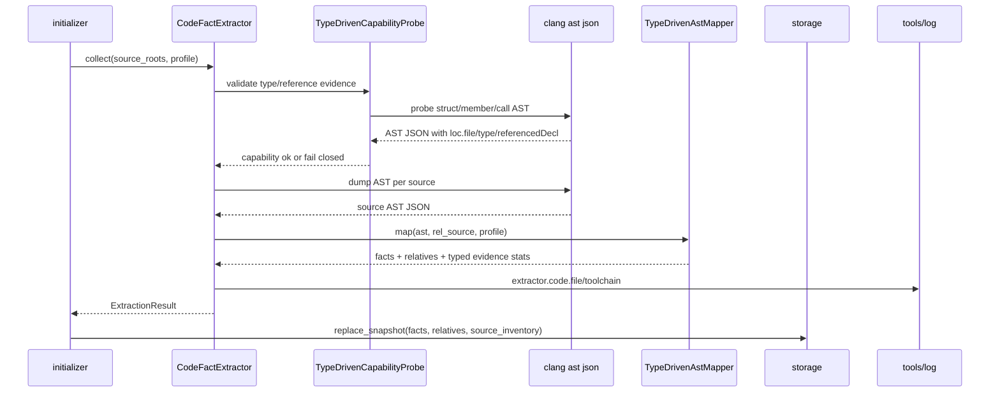
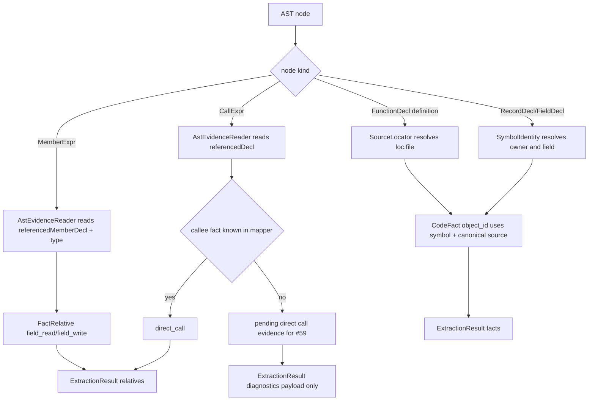
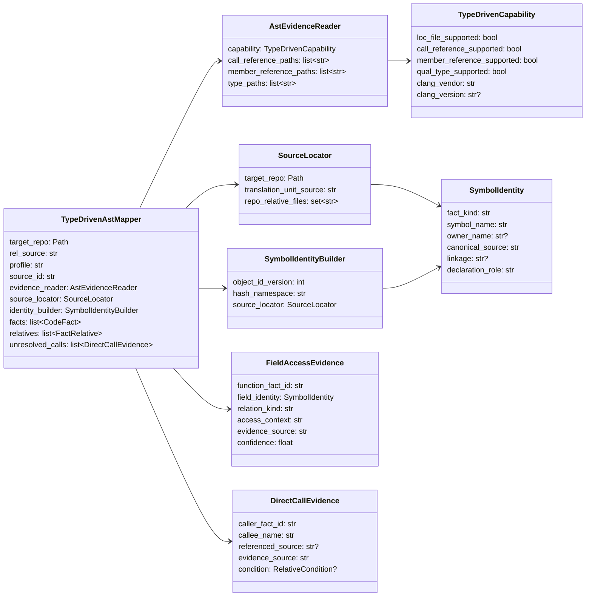
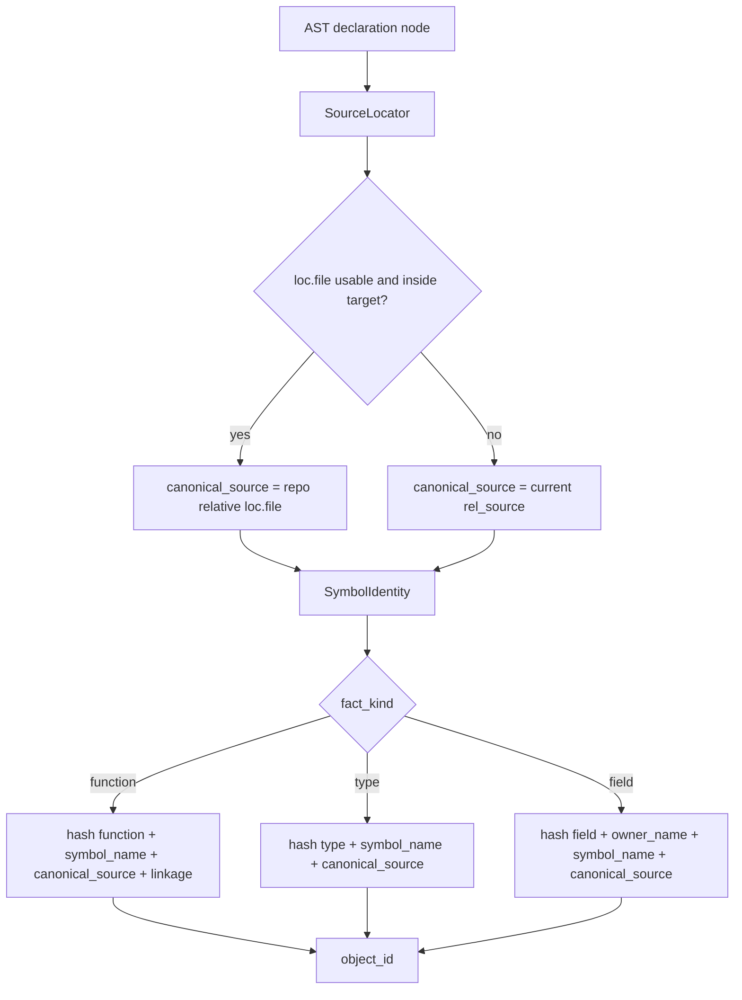

# 类型驱动 AST 提取与 object_id 重设计草稿

- 状态：设计已合入；权威规格已搬迁到模块 README；架构、call 路径和 object_id 实现已由 PR #64 合入，field fact 覆盖闭环转入 #65
- 关联 issue：#60；#57、#58 的核心规格已由 PR #64 消化，field access recall 剩余问题由 #65 继续闭环
- 范围：重构 C 语言 Clang AST mapper，从模式匹配改为类型/声明引用驱动，并重定义 code fact 的 identity、source 和 field 命名规则

## 模块定位

- `src/cipher2/initializer/extractor/code/`：新增类型驱动 AST evidence 读取、source 定位、symbol identity 和 mapper 规则；保留 Clang AST-only，不启用 lightweight parser。
- `src/cipher2/storage/`：不改 storage schema，但接受新 object_id、field object_name 和 relation payload；snapshot 不兼容，用户通过 `rebuild` 全量重建。
- `src/cipher2/mcp/`：不新增 tool；`search` / `detail` 只消费新 facts/relatives。
- `src/cipher2/tools/log/` 与 `src/cipher2/tools/views/`：展示类型驱动 capability、source 归属、field/call 提取统计和降级失败原因。
- `tests/` 与 `scripts/`：更新 fake clang fixture、覆盖矩阵和 extractor/initializer 性能门禁。

## 规格和约束

本功能不新增用户可配持久配置项，不修改 `.cipher/config.yml` schema，不新增 CLI 参数，不新增 MCP tool，不引入 Graph/Inference。既有 `extractor.code.clang_executable`、`gcc_executable`、`clang_args` 继续生效。

| 配置项 | type | 取值范围 | 默认值 | 作用 | 本功能变化 |
|---|---|---|---|---|---|
| 新增用户可配配置项 | 无 | 无 | 无 | 无 | 不新增 |
| `extractor.code.clang_executable` | `str or null` | `null`、PATH 命令或可执行路径 | `null` | Clang AST dump 与 capability probe | probe 增加类型/声明引用 evidence 检查 |
| `extractor.code.clang_args` | `list[str]` | 只读编译参数 | `[]` | 附加 Clang 参数 | 与 per-file compile flags 合并规则仍由 #54 处理 |

行为约束：

- 只信任 Clang AST 中的类型和声明引用 evidence；不得用字符串拼接、父子节点形状或手写 C 语法推导替代 Clang 语义。
- `object_source` 优先使用 AST `loc.file` / `range.begin.file` 中位于目标仓库内的路径；缺失或系统路径时回退到当前 translation unit 的 `rel_source`。
- function/type/field 的 `object_id` 必须包含足够区分同名符号的 source 或 owner identity。无需兼容旧 snapshot。
- field fact 的 `object_name` 只保存字段名；field 归属只由 `has_field` relation、payload owner 字段和 incoming relative 表达。
- #54、#55、#56 不在本设计内实现；#59 跨文件 direct_call 后处理可复用本设计的 call evidence，但仍独立关闭。

## 接口流程

## 数据结构

本节“成员表”是 class/dataclass 成员清单，不是数据库表。

### `TypeDrivenAstMapper` 成员表

| 成员名称 | type | 作用 | 并发粒度 |
|---|---|---|---|
| `target_repo` | `Path` | 目标仓库根目录 | 单 AST 文件级只读 |
| `rel_source` | `str` | 当前 translation unit 相对路径 | 单 AST 文件级只读 |
| `profile` | `str` | fact profile | 单 AST 文件级 |
| `source_id` | `str` | source inventory id | 单 AST 文件级 |
| `evidence_reader` | `AstEvidenceReader` | 读取 Clang 类型/引用 evidence | 单 AST 文件级只读 |
| `source_locator` | `SourceLocator` | 将 AST 文件位置转为仓库相对 source | 单 AST 文件级只读 |
| `identity_builder` | `SymbolIdentityBuilder` | 构造稳定 object_id identity | 单 AST 文件级 |
| `facts` | `list[CodeFact]` | 已生成 facts | 单 AST 文件级 |
| `relatives` | `list[FactRelative]` | 已生成关系 | 单 AST 文件级 |
| `unresolved_calls` | `list[DirectCallEvidence]` | #59 后处理可消费的跨文件调用 evidence | 单 AST 文件级 |

### `AstEvidenceReader` 成员表

| 成员名称 | type | 作用 | 并发粒度 |
|---|---|---|---|
| `capability` | `TypeDrivenCapability` | 当前 Clang evidence 能力 | 单 collect 只读 |
| `call_reference_paths` | `list[str]` | CallExpr callee 声明引用候选路径 | 单 collect 只读 |
| `member_reference_paths` | `list[str]` | MemberExpr 字段声明引用候选路径 | 单 collect 只读 |
| `type_paths` | `list[str]` | qualType / desugared type 候选路径 | 单 collect 只读 |

### `TypeDrivenCapability` 成员表

| 成员名称 | type | 作用 | 并发粒度 |
|---|---|---|---|
| `loc_file_supported` | `bool` | probe AST 是否携带可用 `loc.file` | 单次 probe |
| `call_reference_supported` | `bool` | CallExpr 是否能定位 callee declaration | 单次 probe |
| `member_reference_supported` | `bool` | MemberExpr 是否能定位 field declaration | 单次 probe |
| `qual_type_supported` | `bool` | expression/type 节点是否提供 qualType | 单次 probe |
| `clang_vendor` | `str` | llvm/apple/unknown | 单次 probe |
| `clang_version` | `str or None` | 版本摘要 | 单次 probe |

### `SourceLocator` 成员表

| 成员名称 | type | 作用 | 并发粒度 |
|---|---|---|---|
| `target_repo` | `Path` | 路径安全边界 | 单 collect 只读 |
| `translation_unit_source` | `str` | 当前 TU 回退 source | 单 AST 文件级只读 |
| `repo_relative_files` | `set[str]` | 已知仓库内文件集合 | 单 collect 只读 |

### `SymbolIdentityBuilder` 成员表

| 成员名称 | type | 作用 | 并发粒度 |
|---|---|---|---|
| `object_id_version` | `int` | identity 规则版本，随本重构递增 | 单 collect 只读 |
| `hash_namespace` | `str` | 防止不同 fact_kind identity 串扰 | 单 collect 只读 |
| `source_locator` | `SourceLocator` | 为 declaration 构造 canonical source | 单 AST 文件级只读 |

### `SymbolIdentity` 成员表

| 成员名称 | type | 作用 | 并发粒度 |
|---|---|---|---|
| `fact_kind` | `str` | function/type/field/global/macro | 单 fact |
| `symbol_name` | `str` | 展示名；field 为字段名，不含 type 前缀 | 单 fact |
| `owner_name` | `str or None` | field owner type 或嵌套 owner | 单 fact |
| `canonical_source` | `str` | 真实定义 source 或 TU 回退 source | 单 fact |
| `linkage` | `str or None` | static/extern/unknown | 单 fact |
| `declaration_role` | `str` | definition/declaration/member | 单 fact |

### `FieldAccessEvidence` 成员表

| 成员名称 | type | 作用 | 并发粒度 |
|---|---|---|---|
| `function_fact_id` | `str` | 访问字段的函数 | 单 MemberExpr |
| `field_identity` | `SymbolIdentity` | 被访问字段的稳定 identity | 单 MemberExpr |
| `relation_kind` | `str` | `field_read` 或 `field_write` | 单 MemberExpr |
| `access_context` | `str` | assignment/rvalue/argument/condition/read_write | 单 MemberExpr |
| `evidence_source` | `str` | 访问发生位置 | 单 MemberExpr |
| `confidence` | `float` | 类型 evidence 完整度 | 单 MemberExpr |

### `DirectCallEvidence` 成员表

| 成员名称 | type | 作用 | 并发粒度 |
|---|---|---|---|
| `caller_fact_id` | `str` | 调用方函数 fact id | 单 CallExpr |
| `callee_name` | `str` | Clang 声明引用解析出的 callee 名 | 单 CallExpr |
| `referenced_source` | `str or None` | callee 声明或定义 source | 单 CallExpr |
| `evidence_source` | `str` | 调用发生位置 | 单 CallExpr |
| `condition` | `RelativeCondition or None` | 上层条件 | 单 CallExpr |

## object_id 与 source 规则

字段展示名和关系规则：

- `CodeFact.fact_kind="field"` 时，`object_name` 固定为字段名，例如 `changedIndexDefs`。
- owner type 写入 field payload：`owner_name`、`owner_type_id`、`canonical_source`。
- `has_field` 使用 `type_fact -> field_fact`，`field_read` / `field_write` 的 `to_fact_id` 指向新 field id。
- 同名 field 允许产生多个 fact；模型通过 incoming `has_field`、`owner_name` payload 和 source context 区分。

## 并发控制

- capability probe 每次 `collect()` 最多执行一次，结果作为不可变 `TypeDrivenCapability` 注入每个 mapper。
- `TypeDrivenAstMapper` 只持有单 AST 文件内的可变集合，不跨文件共享；后续 #59 若做全局 pending call resolution，必须在所有文件映射完成后单线程合并。
- object_id 构造是纯函数，输入为 `SymbolIdentity`；不得依赖遍历顺序、source_roots 顺序或最后处理的 translation unit。
- storage snapshot 写锁仍由 storage 层负责；本设计不新增跨模块锁。

## 可观测性

- `extractor.code.toolchain` payload 增加 `type_driven_ast=true`、`loc_file_supported`、`call_reference_supported`、`member_reference_supported`、`qual_type_supported`。
- capability 缺失关键 evidence 时 fail-closed，`error_code="clang_capability_failed"`，payload 写 `missing_evidence` 摘要；不得回退到模式匹配 mapper。
- `extractor.code.file` counts 增加 `typed_member_expr_count`、`typed_call_expr_count`、`source_from_loc_file_count`、`source_fallback_count`、`unresolved_call_count`、`field_owner_count`。
- `tools/views` log section 必须能展示最近一次 type-driven capability 状态、缺失 evidence 错误码和 source fallback 统计。
- 日志和 views 不得记录绝对 target path、源码正文、完整 clang stderr 或 traceback。

## 可观测用例看护

- capability success：views 显示 `type_driven_ast=true` 且四类 evidence 均为 true。
- capability missing：CLI/init 返回 `clang_capability_failed`，views/log 能看到 `missing_evidence`，无 traceback。
- source attribution：头文件 `static inline` 的 `object_source` 指向头文件；log 中只展示仓库相对 source。
- field rename：`search(type)` 不被 field 前缀污染；`detail(field)` 可通过 incoming `has_field` 看到 owner。
- call evidence：CallExpr 解析数量、未解析数量和 direct_call 数量在 log/views 中可比较。

## 测试门禁

README 搬迁 PR 合入后，实现 PR 必须先写失败测试，再实现代码。首批失败测试覆盖：

- capability probe：缺失 `loc.file`、call reference、member reference、qualType 时 fail-closed。
- fake clang fixture：输出 type-driven AST 必需字段。
- source 归属：头文件 `static inline`、系统头文件 fallback、缺失 `loc.file` fallback、路径逃逸拒绝。
- object_id：不同 `.c` 文件中的 `static helper()` 不冲突；同一头文件 inline 在多 TU 中稳定；source_roots 顺序不影响 id。
- field 行为：field `object_name` 去 type 前缀；同名 field 分属不同 type；`has_field`、`field_read`、`field_write` 指向正确 field id。
- AST 表达式：链式 `a->b->c`、宏包装 MemberExpr、ImplicitCastExpr 包裹、复合赋值、自增自减、条件和调用实参。
- call 行为：`referencedDecl.name` 驱动 direct_call；找不到 callee fact 时记录 bounded unresolved evidence；不生成错误 callee。
- 场景组合：无 compile db、有 global clang_args、有 header include、多 source_roots、多 profile。
- 覆盖矩阵：更新 `tests/test_initializer_coverage_matrix.py`、必要时更新 `tests/test_storage_coverage_matrix.py` 和 `tests/test_mcp_coverage_matrix.py`。

性能和小型化看护：

| 场景 | 输入规模 | 预算 |
|---|---|---|
| 小（512MB） | 1k facts / 1k relatives / 1k AST evidence | extractor + initializer 单次 < 5s，峰值 < 64MB |
| 中（4GB） | 100k facts / 200k relatives | extractor + initializer 单次 < 120s，峰值 < 512MB |
| 大（8GB） | 1M facts / 2M relatives | extractor + initializer 单次 < 1,200s，峰值 < 2GB |

实现 PR 必须运行全量 unittest、`scripts/clang_extractor_performance_gate.py`、`scripts/initializer_performance_gate.py`、`scripts/storage_relative_performance_gate.py`，并对 Redis/PG 风险用例补充可复现 fixture 或记录跳过原因。

## 递归文档更新

设计 PR 合入后，README 搬迁 PR 必须更新：

- `README.md`
- `docs/README.md`
- `docs/user-guide.md`
- `docs/maintenance-guide.md`
- `docs/schema.md`
- `src/cipher2/README.md`
- `src/cipher2/initializer/README.md`
- `src/cipher2/initializer/extractor/README.md`
- `src/cipher2/initializer/extractor/code/README.md`
- `src/cipher2/tools/log/README.md`
- `src/cipher2/tools/views/README.md`
- `tests/README.md`
- `scripts/README.md`

README 搬迁 PR 合入后才能进入 TDD 实现 PR。实现完成后提 PR，PR 合入视为维护者确认。
