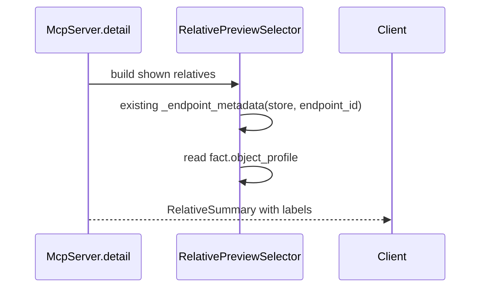
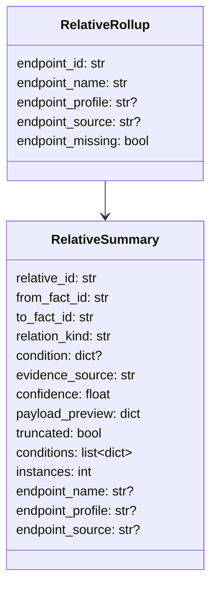

# Detail Relative Endpoint Profile 设计

## 模块定位

- 范围：`src/cipher2/mcp/` 的 `detail.relative_preview` 输出。
- 已有前提：#91 / PR #101 已在 `_endpoint_metadata()` 路径中解析 shown relative 的 `endpoint_name` / `endpoint_source`，不透明哈希问题已解决。
- 目标：在既有 endpoint metadata 上追加非自身 endpoint 的 `object_profile`，让模型一次响应即可区分 profile。
- 非目标：不新增 MCP tool、参数、snapshot 字段、extractor 行为或 relation。

## 规格与约束

- FACT-only：`endpoint_profile` 只来自既有 `_endpoint_metadata()` 已读取到的 `FactRecord.object_profile`。
- 不新增 storage / MCP / public Python 接口；不得新增 `FactView.get_facts()`。
- 不新增 `EndpointLabel`、`EndpointLabelResolver` 或其他并行抽象。
- 只处理每桶已展示的 relative；不扫描完整 bucket，不改变预算。
- overlay 与 base 视图必须输出同一语义。
- 不新增用户可配配置项。

| 配置项 | 类型 | 取值范围 | 作用 |
|---|---|---|---|
| 无 | - | - | 固定启用，无用户配置 |

## 流程

## 数据结构

| 成员名称 | type | 作用 | 并发粒度 |
|---|---|---|---|
| `RelativeSummary.endpoint_profile` | `str or None` | 非自身 endpoint 的 `object_profile` | 响应实例级 |
| `RelativeRollup.endpoint_profile` | `str or None` | 从 `_endpoint_metadata()` 读取到的 endpoint profile，传递给 summary | 请求级 |

`endpoint_id`、`endpoint_name`、`endpoint_source` 和 endpoint missing fallback 全部复用 #91 已有规则。若 endpoint fact 缺失，`endpoint_profile=None`；不得为了补 profile 生成新 fact、隐藏 relation 或改变排序。

## 对外接口

- MCP `detail` 输入不变。
- `relative_preview.buckets[*].relatives[*]` 和兼容扁平 `relative_preview.relatives[*]` 追加 `endpoint_profile`。
- 既有 `endpoint_name` / `endpoint_source` 字段保持不变。

## 并发控制

- profile 读取发生在既有 `_endpoint_metadata()` 请求内局部路径中。
- `FactView.get_fact()` 仍由 storage 处理 base / overlay 可见性。
- 不新增跨请求缓存或锁。

## 可观测性

- 不新增可观测字段：#91 已有 `relative_rollup_group_count`、`relative_collapsed_instance_count`、`relative_preview_source_file_count` 和 `relative_diversity_bucket_count` 足以观测 endpoint metadata 路径。
- `endpoint_profile` 缺失只表示 endpoint fact 缺失或 profile 为空，沿用既有 missing endpoint fallback，不额外改变 views state。

## 递归文档更新

- `src/cipher2/mcp/README.md`：更新 `RelativeSummary` 字段和 endpoint 标签解析规则。
- `docs/user-guide.md`：说明 `endpoint_profile` 可与 `endpoint_name` 一起用于枚举答案。
- `tests/README.md`：补 endpoint profile 用例范围。

## 测试门禁

- TDD 覆盖 callers、callees、field_readers / field_writers 的 `endpoint_profile`。
- 覆盖 endpoint fact 缺失时 `endpoint_name` 仍按既有 fallback，`endpoint_profile=None`，不丢 relation。
- 覆盖 base view 与 overlay view profile 输出一致。
- 运行 `PYTHONPATH=src python3 -m unittest discover -s tests`、`scripts/mcp_performance_gate.py` 和 `scripts/mcp_relative_performance_gate.py`。
