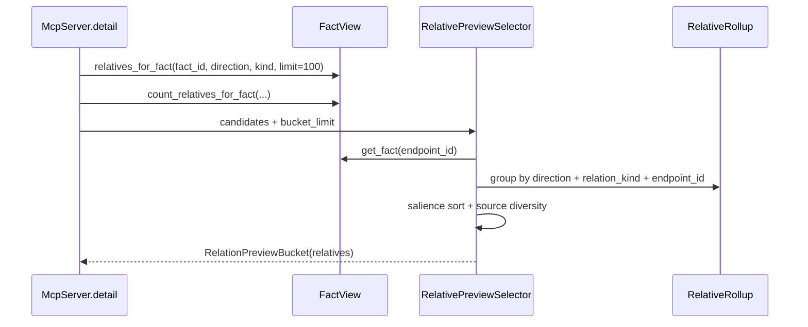
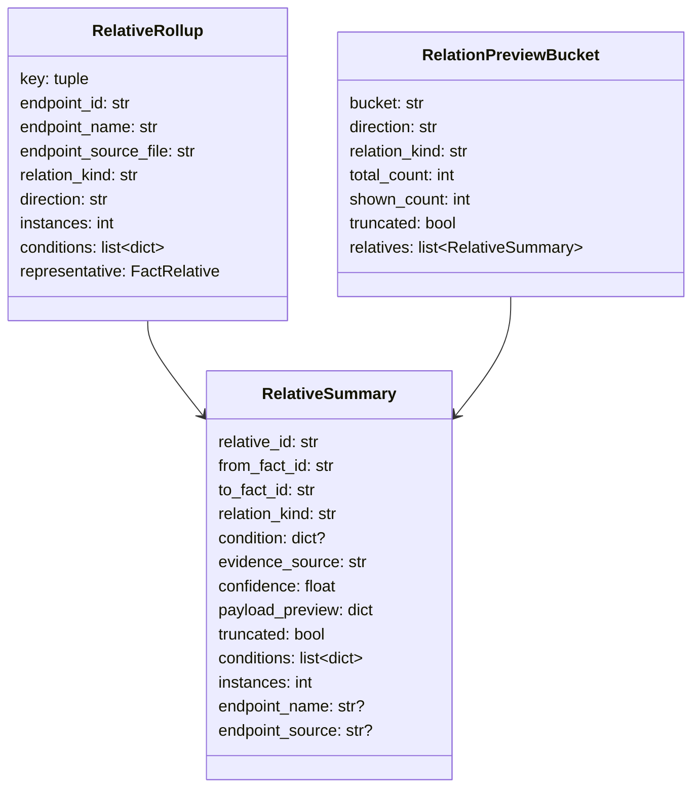

# Detail Relative Preview 桶内选择质量设计

## 模块定位

- 范围：`src/cipher2/mcp/` 的 `detail.relative_preview` 构造逻辑。
- 目标：在不增加输出预算的前提下，对每个 direction + relation_kind 桶做 call-site rollup、显著度排序和 endpoint source 多样化选择。
- 非目标：不新增 MCP tool、参数或 storage snapshot 字段；不改 extractor，不造新 relation。

## 规格与约束

- FACT-only：只读取 `FactRelative` 与 endpoint `FactRecord`，不得推断或合成边。
- 输出预算保持 `small=5`、`normal=25`、`large=100`，只改变桶内选择质量。
- `confidence` 当前固定为 `1.0`，不得参与排序。
- overlay `FactView` 与 base snapshot 必须走同一选择器。
- 不新增用户可配配置项。

| 配置项 | 类型 | 取值范围 | 作用 |
|---|---|---|---|
| 无 | - | - | 固定启用，无用户配置 |

## 流程

## 数据结构

| 成员名称 | type | 作用 | 并发粒度 |
|---|---|---|---|
| `RelativeSummary.instances` | `int` | 同一 endpoint 被归并的真实 call-site 数 | 响应实例级 |
| `RelativeSummary.conditions` | `list[dict]` | 去重并稳定排序的非空条件集合 | 响应实例级 |
| `RelativeSummary.endpoint_name` | `str or None` | 排序与展示用 endpoint 名称 | 响应实例级 |
| `RelativeSummary.endpoint_source` | `str or None` | endpoint `object_source`，用于多样化说明 | 响应实例级 |
| `RelativeRollup.endpoint_source_file` | `str` | `object_source` 去掉行号后的文件路径 | 请求级临时对象 |

`RelativeSummary` 既有字段 `relative_id`、`from_fact_id`、`to_fact_id`、`relation_kind`、`condition`、`evidence_source`、`confidence`、`payload_preview`、`truncated` 全部保留；`RelationPreviewBucket` 既有 `bucket`、`direction`、`relation_kind`、`total_count`、`shown_count`、`truncated`、`relatives` 全部保留。

## 选择规则

rollup key 固定为 `(direction, endpoint_id, relation_kind)`：incoming 使用 `from_fact_id` 作为 endpoint，outgoing 使用 `to_fact_id`。`relative_id` 保留代表性实例 ID，`instances` 记录多重性；`condition` 保留代表性条件以兼容旧客户端，`conditions` 返回去重后的完整条件列表。

endpoint fact 通过 `FactView.get_fact(endpoint_id)` 读取。若读取失败，`endpoint_name` 使用 `endpoint_id`，`endpoint_source=None`，`endpoint_source_file="<missing-endpoint>"`，并在排序中位于同等 tier、instances 和条件状态下的已解析 endpoint 之后。若 `object_source` 能从右侧解析出 `:<正整数行号>`，`endpoint_source_file` 使用行号前的路径；否则使用完整 `object_source`。空字符串或缺失 source 使用 `"<unknown-source>"`。这些 fallback 都是稳定字符串，参与排序和多样化分组。

排序键依次为：relation tier、`instances` 降序、无条件优先、endpoint 是否缺失、`endpoint_name` 升序、`endpoint_source_file` 升序、代表性 `relative_id` 升序。tier 为 `direct_call` / `dispatches_via`、`field_write`、`field_read`、`assigned_to`、`has_field` / `defines` / `include`、其他。

当 rollup 数超过桶预算时，先按排序键遍历并对同一 `endpoint_source_file` 施加软上限 2；若未填满预算，再按同一排序键补齐。该规则只影响 shown 集合，不改变 `total_count`。

## 对外接口

- MCP `detail` 输入不变。
- `relative_preview.buckets[*].relatives[*]` 追加 `instances`、`conditions`、`endpoint_name`、`endpoint_source`。
- 顶层兼容扁平 `relative_preview.relatives` 使用同一 rollup 结果。

## 并发控制

- 选择器只使用请求内局部列表和 dict，不持久化状态。
- `FactView` 仍由 storage 管理 snapshot / overlay 并发；MCP 不新增锁。

## 可观测性

- `mcp.detail` counts 增加 `relative_rollup_group_count`、`relative_collapsed_instance_count`、`relative_preview_source_file_count`、`relative_diversity_bucket_count`。
- `tools/log` digest allowlist 和 `tools/views` log section 必须展示上述统计；多样化生效或 collapsed instance 大于 0 时保持 `ok`，只作为质量观测，不提升为 warning。

## 递归文档更新

- `src/cipher2/mcp/README.md`：更新 relative preview 选择规则、数据结构和 observability。
- `docs/user-guide.md`：说明 `instances`、`conditions` 和桶内排序含义。
- `src/cipher2/tools/log/README.md`、`src/cipher2/tools/views/README.md`：登记可观测字段。
- `tests/README.md`：补 MCP relative preview 质量测试范围。

## 测试门禁

- TDD 覆盖同一 caller 多 call-site 被归并，`instances=3` 且 `conditions` 去重。
- 覆盖 direct_call / dispatches_via 优先于 defines、`instances` 降序、无条件优先和 endpoint 名称稳定兜底。
- 覆盖截断时 source 文件多样化，且未截断时纯排序不做额外扰动。
- 覆盖 overlay view 与 base view 输出一致。
- 覆盖 log digest 和 views 展示新增统计。
- 运行 `PYTHONPATH=src python3 -m unittest discover -s tests`、`scripts/mcp_performance_gate.py`、`scripts/mcp_relative_performance_gate.py`、`scripts/log_performance_gate.py`、`scripts/views_performance_gate.py`。
