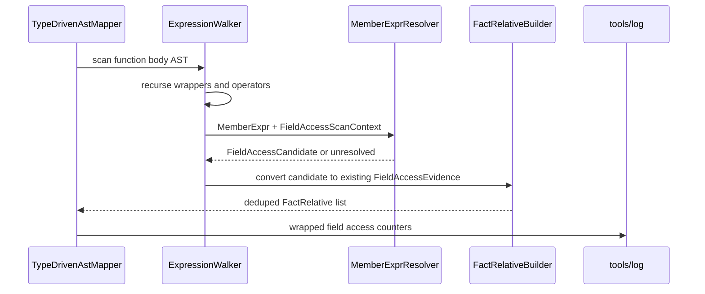
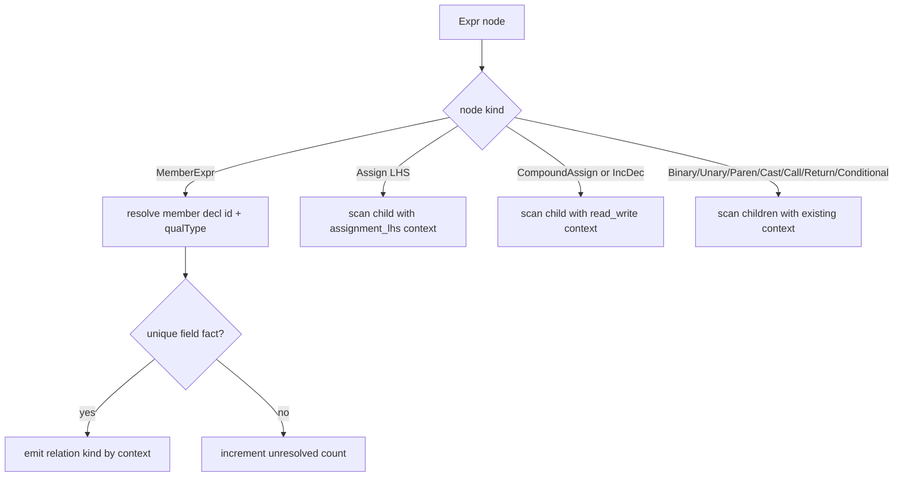
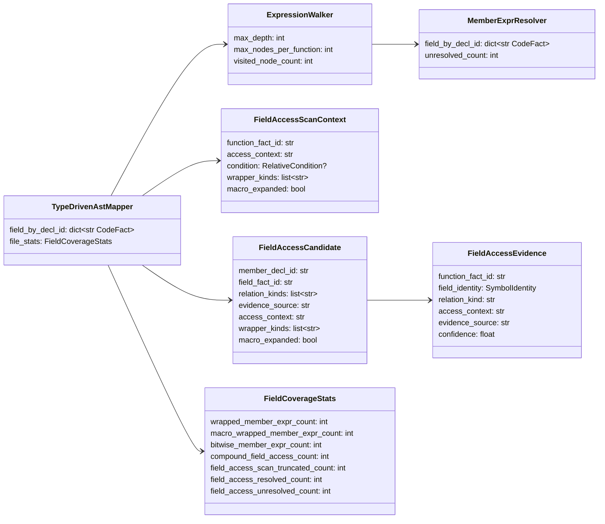

# Field Access 表达式递归设计草稿

- 状态：设计草稿，待 PR 检视
- 关联 issue：#93
- 范围：在 FACT-only 路径内提升 `field_read` / `field_write` 覆盖，专门处理宏、位运算和表达式包装下的 `MemberExpr`

## 模块定位

- `src/cipher2/initializer/extractor/code/`：扩展 Clang AST mapper 的字段访问扫描，递归下探表达式树并复用现有 field fact identity。
- `src/cipher2/tools/log/`：记录 wrapped/macro/bitwise 字段访问计数和 unresolved 计数。
- `src/cipher2/tools/views/`：展示字段访问覆盖核心统计，帮助判断 recall 是否被表达式包装限制。
- `src/cipher2/storage/`、`src/cipher2/mcp/`：不改 schema，不新增 public tool，只消费更多 `FactRelative`。

## 规格和约束

本功能不新增用户可配配置项，不修改 `.cipher/config.yml`，不新增 CLI 参数，不新增 MCP tool。

| 配置项 | type | 取值范围 | 默认值 | 作用 | 本功能变化 |
|---|---|---|---|---|---|
| 新增用户可配配置项 | 无 | 无 | 无 | 无 | 不新增 |
| `extractor.code.clang_executable` | `str or null` | `null`、PATH 命令或可执行路径 | `null` | Clang AST dump | 继续使用既有 capability probe |
| `extractor.code.clang_args` | `list[str]` | 编译参数字符串 | `[]` | 附加 Clang 参数 | 语义不变 |

行为约束：

- 字段访问只能来自 Clang AST `MemberExpr` 的 `referencedMemberDecl` / `referencedDecl` 和类型 evidence；不得从源码文本、宏名称、字段字符串或 token dump 推导。
- scanner 必须递归进入 `BinaryOperator`、`UnaryOperator`、`ParenExpr`、`ImplicitCastExpr`、`CStyleCastExpr`、`ConditionalOperator`、`CallExpr` 参数、`ReturnStmt`、宏展开后的表达式子树。
- 简单赋值 LHS 中的字段记 `field_write`；复合赋值、位运算赋值、自增自减记 `field_read` + `field_write`；其他上下文记 `field_read`。
- `F_ISSET(mc->mc_flags, C_INITIALIZED)` 这类宏展开后，只要 AST 子树含可解析 `MemberExpr`，必须生成字段访问关系；不得保存完整宏展开正文。
- 无唯一 field identity、缺 member reference、位于 Clang 错误恢复子树时不得生成模糊边，只增加 unresolved/gap 计数。
- 同一函数、同一字段、同一 source/line、同一 relation kind 的重复访问按既有 relative identity 去重。

`access_context` 必须沿用模块 README 已定义的 payload 词汇，不引入 `read` / `write` 这类新输出值：

| `access_context` | relation 输出 | 说明 |
|---|---|---|
| `assignment_lhs` | `field_write` | 简单赋值左值 |
| `read_write` | `field_read` + `field_write` | 复合赋值、自增、自减 |
| `condition` | `field_read` | 条件表达式 |
| `argument` | `field_read` | 调用实参 |
| `return` | `field_read` | return 表达式 |
| `rvalue` | `field_read` | 其他右值或无法更细分的只读上下文 |

## 接口流程





职责边界：

- `ExpressionWalker` 只负责遍历表达式树、维护递归预算、识别 wrapper/macro/bitwise/compound context，并产出 `FieldAccessScanContext`。
- `MemberExprResolver` 只负责用 `MemberExpr` 的声明引用和 `field_by_decl_id` 解析唯一 field fact，不做 AST 遍历、不做字符串推导。
- `FactRelativeBuilder` 复用既有 `FieldAccessEvidence` 到 `FactRelative` 的路径，继续负责 relation kind 展开、payload 生成和 relative id 去重。

## 数据结构



本节“成员表”是 class/dataclass 成员清单，不是数据库表。

### `FieldAccessScanContext` 成员表

| 成员名称 | type | 作用 | 并发粒度 |
|---|---|---|---|
| `function_fact_id` | `str` | 当前访问所属函数 fact | 单函数 AST |
| `access_context` | `str` | `assignment_lhs`、`rvalue`、`read_write`、`condition`、`argument`、`return` | 单表达式递归 |
| `condition` | `RelativeCondition or None` | 上层条件摘要 | 单表达式递归 |
| `wrapper_kinds` | `list[str]` | 包裹过该访问的 AST kind 摘要 | 单表达式递归 |
| `macro_expanded` | `bool` | source location 是否来自宏展开路径 | 单表达式递归 |

### `ExpressionWalker` 成员表

| 成员名称 | type | 作用 | 并发粒度 |
|---|---|---|---|
| `max_depth` | `int` | 单表达式递归深度上限，默认 `64` | 单函数 AST |
| `max_nodes_per_function` | `int` | 单函数表达式节点访问上限，默认 `10000` | 单函数 AST |
| `visited_node_count` | `int` | 当前函数已访问表达式节点数 | 单函数 AST |

### `MemberExprResolver` 成员表

| 成员名称 | type | 作用 | 并发粒度 |
|---|---|---|---|
| `field_by_decl_id` | `dict[str, CodeFact]` | 既有 field fact 索引，只读复用 | 单 AST 文件级 |
| `unresolved_count` | `int` | 缺 evidence 或无唯一 field fact 的数量 | 单 AST 文件级 |

### `FieldAccessCandidate` 成员表

`FieldAccessCandidate` 是 `ExpressionWalker` 与既有 `FieldAccessEvidence` 之间的非持久中间态：它不替代 `FieldAccessEvidence`，只携带 wrapper/macro 诊断信息；解析成功后转换为现有 `FieldAccessEvidence`，再由既有 builder 生成 `FactRelative`。

| 成员名称 | type | 作用 | 并发粒度 |
|---|---|---|---|
| `member_decl_id` | `str` | Clang member declaration id | 单 MemberExpr |
| `field_fact_id` | `str` | 解析出的唯一 field fact id | 单 MemberExpr |
| `relation_kinds` | `list[str]` | `field_read`、`field_write` 或二者 | 单 MemberExpr |
| `evidence_source` | `str` | 访问发生位置 | 单 MemberExpr |
| `access_context` | `str` | 读写判定原因 | 单 MemberExpr |
| `wrapper_kinds` | `list[str]` | 包裹 AST kind 摘要，用于诊断 | 单 MemberExpr |
| `macro_expanded` | `bool` | 是否来自宏展开子树 | 单 MemberExpr |

### `FieldCoverageStats` 扩展成员表

本功能扩展既有 `_FileMapStats` / README 中的 `FieldCoverageStats`，不创建平行统计结构。既有 `field_access_resolved_count` 与 `field_access_unresolved_count` 继续作为权威字段，本设计只新增包装表达式相关计数。

| 成员名称 | type | 作用 | 并发粒度 |
|---|---|---|---|
| `wrapped_member_expr_count` | `int` | 被表达式包装的 MemberExpr 数 | 单 AST 文件级 |
| `macro_wrapped_member_expr_count` | `int` | 宏展开路径中的字段访问数 | 单 AST 文件级 |
| `bitwise_member_expr_count` | `int` | 位运算子树中的字段访问数 | 单 AST 文件级 |
| `compound_field_access_count` | `int` | 复合赋值/自增自减字段访问数 | 单 AST 文件级 |
| `field_access_scan_truncated_count` | `int` | 触发递归深度或节点上限而跳过的子树数 | 单 AST 文件级 |
| `field_access_resolved_count` | `int` | 既有字段：成功生成关系的字段访问数 | 单 AST 文件级 |
| `field_access_unresolved_count` | `int` | 既有字段：未能唯一解析的字段访问数 | 单 AST 文件级 |

## 并发控制

- 表达式扫描只在单 AST 文件 mapper 内执行，所有上下文和统计为 mapper 局部可变状态。
- 不新增全局缓存、后台线程或跨文件共享索引；跨进程写入互斥仍由 storage snapshot 锁负责。
- 递归保护固定为 `max_depth=64`、`max_nodes_per_function=10000`，不是用户配置项。
- 触发深度或节点上限时跳过当前子树，递增 `field_access_scan_truncated_count` 和 `warning_count`，继续处理同一文件其他节点。

## 递归文档更新

设计合入后先搬迁到 `src/cipher2/initializer/extractor/code/README.md`，再递归更新：

- `docs/schema.md`：说明 `field_read` / `field_write` 可来自包装表达式内的 `MemberExpr`，但仍只信任 Clang evidence。
- `docs/user-guide.md`：补充字段访问覆盖说明和无法解析时的排障方向。
- `src/cipher2/tools/log/README.md`、`src/cipher2/tools/views/README.md`：补充新增观测计数。
- `tests/README.md` 和 coverage matrix：登记宏、位运算、复合赋值场景。

## 可观测性

`extractor.code.file` counts 新增或补充：

- `wrapped_member_expr_count`
- `macro_wrapped_member_expr_count`
- `bitwise_member_expr_count`
- `compound_field_access_count`
- `field_access_scan_truncated_count`
- `field_access_resolved_count`
- `field_access_unresolved_count`

log digest allowlist 必须具体注册：

- `src/cipher2/tools/log/__init__.py` 的 `DIGEST_PRIORITY_COUNT_FIELDS` 增加 `field_access_scan_truncated_count`，位置在 `field_access_unresolved_count` 之后。
- `PAYLOAD_FIELD_ORDER` 增加 `wrapped_member_expr_count`、`macro_wrapped_member_expr_count`、`bitwise_member_expr_count`、`compound_field_access_count`、`field_access_scan_truncated_count`。

`LogViewModel` 必须新增并从 `summary.custom_counts` 聚合以下字段：

- `wrapped_member_expr_count`
- `macro_wrapped_member_expr_count`
- `bitwise_member_expr_count`
- `compound_field_access_count`
- `field_access_scan_truncated_count`

既有 `field_access_resolved_count`、`field_access_unresolved_count` 继续复用。`tools/views` 必须展示最近一次字段访问覆盖统计。若 `field_access_unresolved_count > 0` 或 `field_access_scan_truncated_count > 0`，log section 保持 warning；不得展示源码正文、完整宏展开、绝对路径或 token dump。

## TDD 与测试门禁

实现 PR 必须先写失败测试，再实现代码：

- 宏读：`F_ISSET(mc->mc_flags, C_INITIALIZED)` 生成 `field_read`。
- 位运算读：`if (obj->flags & FLAG)` 生成 `field_read`。
- 复合赋值：`obj->flags |= FLAG` 生成 `field_read` 和 `field_write`。
- 包装表达式：`(obj->flags)`、`(unsigned)obj->flags`、`!!obj->flags` 均能递归捕获。
- 函数实参/返回/条件中的嵌套 `MemberExpr` 保持 `field_read`。
- 缺 member reference、ambiguous field identity、错误恢复子树不生成关系并记录 unresolved。
- 同一宏展开导致的重复访问必须去重。

覆盖要求：

- 功能点覆盖率 100%：宏、位运算、包装表达式、复合赋值、去重、log/views。
- 异常分支覆盖率 90%+：缺 evidence、ambiguous、malformed AST、source path escape、错误恢复节点。
- 场景用例覆盖率 100%：规格允许的读、写、读写、条件、参数、返回组合都要覆盖。
- 性能和小型化看护 512MB、4GB、8GB 三档；递归扫描应为单 AST 文件线性复杂度。

实现 PR 必须运行：

```bash
PYTHONPATH=src python3 -m unittest discover -s tests
PYTHONPATH=src python3 scripts/clang_extractor_performance_gate.py
PYTHONPATH=src python3 scripts/initializer_performance_gate.py
```
