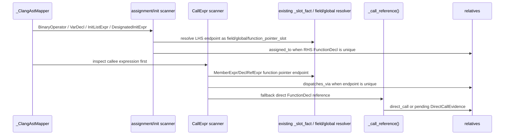
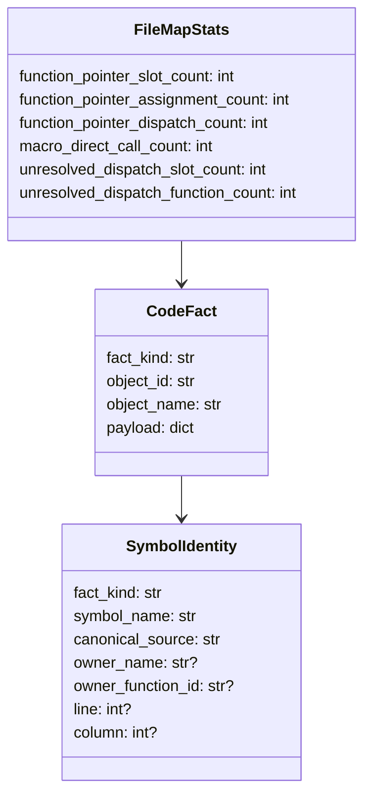

# 宏与函数指针 Dispatch 调用抽取设计

## 模块定位

- 范围：`src/cipher2/initializer/extractor/code/` 的 Clang AST-backed C extractor。
- 目标：基于真实 Clang AST evidence 补齐宏展开 direct call、函数指针赋值 `assigned_to` 和函数指针调用 `dispatches_via`。
- 现状：代码已有 `function_pointer_slot` fact kind、`_slot_fact()` 和 `assigned_slots` 机制，但只覆盖简单 `BinaryOperator("=")`，且 slot identity 仍偏临时；本设计复用并收敛这些既有结构，不引入 `slot` 新 fact kind。

## 根因

当前 `_call_reference()` 遍历 `CallExpr` 子树时遇到 `FieldDecl` / `IndirectFieldDecl` 会直接 `continue`。因此 `session->open()`、`connection->api->close()` 这类 callee 为 `MemberExpr` 的函数指针字段调用不会生成 `direct_call`，也没有机会转成 `dispatches_via`。宏展开 direct call 是否真实漏掉尚未由 fixture 证明；当前 helper 不检查 spelling/expansion location，Clang 展开后的 `CallExpr.referencedDecl` 可能已经能被捕获，需先用 fixture 固定现状。

## 规格与约束

- 仅使用 Clang AST declaration reference、`qualType` 和 source location evidence；不得从源码字符串、宏名、正则或 token dump 推导。
- 不新增用户可配配置项。

| 配置项 | 类型 | 取值范围 | 作用 |
|---|---|---|---|
| 无 | - | - | 随 Clang extractor 固定启用 |

- 复用 `function_pointer_slot` fact kind。field endpoint 继续使用 `field` fact，文件级函数指针变量继续使用 `global` fact，本地函数指针变量使用既有 `function_pointer_slot`。
- `function_pointer_slot` object identity 必须进入 `SymbolIdentity` / `_object_identity_payload()` 体系，使用 `slot_name`、`canonical_source`、owner function id/name、line/column 等稳定输入；Clang `id` 只能作为 lookup cache key 或 payload evidence，不能作为 object_id 输入。
- `_FileMapStats` 扩展统计字段，不创建平行 `DispatchStats`。`CodeFact` 和 `SymbolIdentity` 扩展语义，不创建平行 `DispatchSlotIdentity`。
- 解析不到唯一 endpoint 或唯一目标 function 时不得生成关系，只递增 unresolved 计数并保留有界 evidence。

## 流程

## 具体实现边界

- `_map_function_body()` 先对 `CallExpr` 的 callee 子表达式做函数指针 endpoint 解析；命中后生成 `dispatches_via`，并跳过 direct call 分支。
- `_call_reference()` 改为只返回直接 `FunctionDecl` / 可接受 function declaration reference；遇到 callee 子表达式中的 `FieldDecl` / `IndirectFieldDecl` 不再静默“继续搜索”并丢弃 dispatch 语义。
- 函数指针赋值扫描覆盖：
  - `BinaryOperator("=")`：`ops.read = my_read`、`fp = my_read`
  - `VarDecl` initializer：`int (*fp)(void) = my_read`
  - `InitListExpr` / `DesignatedInitExpr`：`struct ops ops = { .read = my_read }`
  - `UnaryOperator("&")`、`ImplicitCastExpr`、`ParenExpr` 包裹的 RHS function reference
- 函数指针调用扫描覆盖：
  - field callee：`session->open(session)`、`ops.read(ctx)`
  - global/local callee：`fp()`、`global_fp()`
  - macro 包裹 callee：只要展开后 AST callee expression 仍有可解析 declaration reference

## 与 #93 的交互

同一个 `MemberExpr` 位于 `CallExpr` callee 时可以同时表达“读取字段值”和“通过该字段 dispatch”。因此：

- `field_read` 与 `dispatches_via` 允许共存，二者 relation_kind 不互斥。
- `dispatches_via` 不抑制 #93 的 field access walker；若 #93 尚未合入，实现顺序应先落地字段 fact / MemberExpr 递归解析，再补 dispatch。
- `dispatches_via` endpoint 必须复用 #93 已解析出的唯一 field fact；不能重新按字符串构造 field endpoint。

## 数据结构

### `SymbolIdentity` 扩展成员表

| 成员名称 | type | 作用 | 并发粒度 |
|---|---|---|---|
| `owner_function_id` | `str or None` | 区分不同函数中的同名本地 function pointer slot | 单 local slot |
| `line` | `int or None` | 无 owner 时的稳定 source 位置补充 | 单 slot/global |
| `column` | `int or None` | 同一行多 slot 的稳定区分 | 单 slot/global |

### `_FileMapStats` 扩展成员表

| 成员名称 | type | 作用 | 并发粒度 |
|---|---|---|---|
| `function_pointer_slot_count` | `int` | 生成或复用的 `function_pointer_slot` 数 | 单 AST 文件级 |
| `function_pointer_assignment_count` | `int` | 成功生成 `assigned_to` 数 | 单 AST 文件级 |
| `function_pointer_dispatch_count` | `int` | 成功生成 `dispatches_via` 数 | 单 AST 文件级 |
| `macro_direct_call_count` | `int` | fixture 证明为宏展开来源的 direct call 数 | 单 AST 文件级 |
| `unresolved_dispatch_slot_count` | `int` | 间接调用 callee 或函数指针初始化 endpoint 不唯一、类型不满足次数；普通赋值不计入 | 单 AST 文件级 |
| `unresolved_dispatch_function_count` | `int` | RHS/target function 不唯一次数 | 单 AST 文件级 |

## 对外接口

- 不新增 CLI、MCP tool、MCP 参数或配置项。
- 既有 `search/detail` 通过 `function_pointer_slot` fact 和 `assigned_to` / `dispatches_via` relation 展示结果。
- `extractor.code.file` counts、`tools/log` digest allowlist 和 `tools/views` log model 增加 `_FileMapStats` 扩展字段；unresolved dispatch 计数大于 0 时 views log section 为 warning。

## 并发控制

- 单文件 mapper 内部维护局部 endpoint lookup 和 assigned slot set。
- 跨文件 function target 解析复用既有 direct call resolver 的单线程全局索引；不得在 worker 间共享可变 slot map。
- `_slot_fact()` 必须按稳定 identity 查找/创建，不能继续只按 `(fact_kind, slot_name)` 合并不同 scope 的本地 slot。

## 递归文档更新

- `src/cipher2/initializer/extractor/code/README.md`：补齐 `function_pointer_slot`、`_call_reference()` dispatch 分支、赋值/初始化节点和统计规格。
- `docs/schema.md`、`src/cipher2/storage/schema/README.md`：把 `function_pointer_slot` 登记为当前 fact kind，并明确 `assigned_to` / `dispatches_via` endpoint。
- `src/cipher2/tools/log/README.md`、`src/cipher2/tools/views/README.md`、`docs/user-guide.md`：补可观测字段和 warning。
- `tests/README.md`：补宏 direct call fixture、field/global/local dispatch、initializer assignment 和负例。

## 测试门禁

- 先写 fixture 证明当前宏 direct call 是否已被捕获；若已捕获，只新增统计/防回归，不重复设计修复。
- TDD 覆盖 `ops.read = my_read`、`int (*fp)() = my_read`、`{ .read = my_read }`、`session->open()`、`fp()`、宏包裹 call、条件内 dispatch、重复 relation 去重。
- 异常覆盖 ambiguous endpoint、非函数指针类型、RHS 非唯一 function、partial AST error subtree、路径逃逸和源码泄漏。
- 运行 `initializer_performance_gate.py`、`clang_extractor_performance_gate.py`，并增加 dispatch-heavy small/medium/large fixture 看护 512MB、4GB、8GB 场景。
