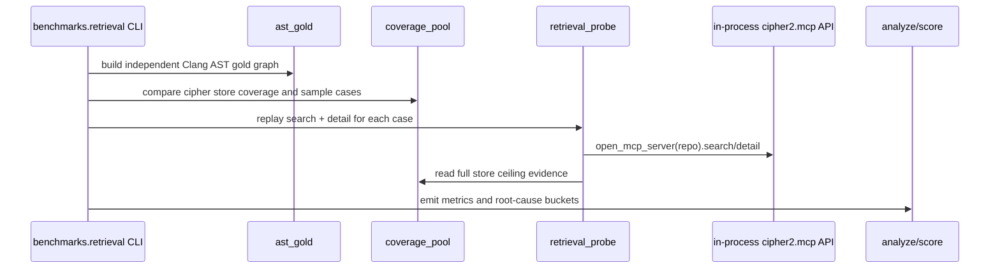
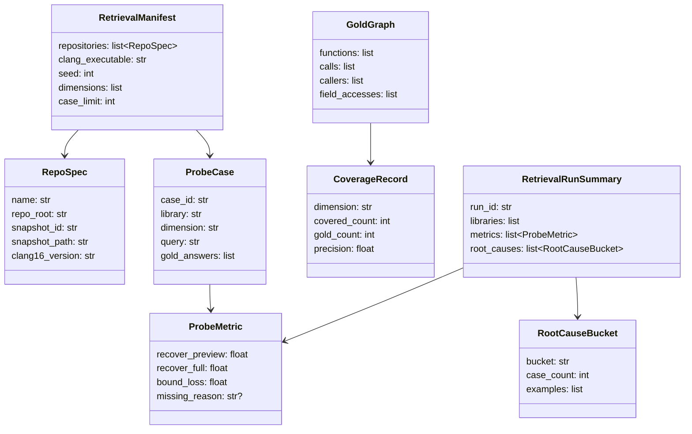

# 检索质量评估 Harness 设计

## 模块定位

- 范围：新增 `benchmarks/retrieval/` 离线评测工具包，配套 `tests/` 单测和文档。
- 目标：把 `/tmp/cipher-eval/` 原型中的 `ast_gold`、`coverage_pool`、`retrieval_probe`、`genq`、`score`、`analyze` 落地为可复现开发工具。
- 非目标：不改 MCP `search` / `detail`、storage snapshot、extractor 产物或用户运行时行为；弱模型 A/B 只预留报告字段，不属于本离线 harness 的默认流程。

## 规格与约束

- 离线、确定性、无外部 API；默认命令不得访问网络或调用模型。
- harness 只消费已经构建并锁定的目标仓库 `.cipher/snapshots/current`；不得自动执行 `cipher2 init` / `cipher2 rebuild`，manifest 中的 `snapshot_id` 必须与当前 snapshot 匹配，否则该仓库标记为 `snapshot_mismatch`。
- 金标准由 Clang AST 直接生成，不能读取 cipher facts 作为答案来源；发布基线 manifest 固定使用 LLVM Clang 16，其他通过 capability probe 的 Clang 版本必须在结果中单独标记，不能与 Clang 16 基线混算。
- `recover@preview` 只来自 in-process MCP Python API 构造的 `search` + `detail` 响应，并受 `--budget` 分桶和截断规则限制。
- `recover@full` 只来自 storage / coverage pool 直读的 store 天花板，不走 MCP `large`，避免被 100 条 bucket 上限截断。
- `bound_loss = recover@full - recover@preview`；它与 #95 草稿中的 `preview_gap` 同义，README 搬迁阶段统一命名为 `preview_gap`，`bound_loss` 可作为 retrieval_probe 输出兼容字段。
- 题池必须固定 seed，并混采 cipher 已覆盖与未覆盖对象，避免只测容易样本导致虚高。
- 不进 CI 硬门禁；CI 只跑小型 fixture 单测，真实大库作为手动回归基准。
- 不新增用户可配运行时配置项；仅新增评测命令参数和 manifest。

| 配置项 | 类型 | 取值范围 | 作用 |
|---|---|---|---|
| 无运行时配置 | - | - | 不影响 `.cipher/config.yml` |
| `--manifest` | path | JSON/YAML 文件 | 指定 RepoSpec、snapshot、Clang 16 版本、题量和 seed |
| `--budget` | enum | `small` / `normal` / `large` | 指定 MCP detail budget |
| `--output` | path | 目录或文件 | 写入 JSON/Markdown 评测结果 |
| `--max-workers` | int | `1..N`，默认 `1` | 仓库级并发上限；单仓库内不得并发 |

## 组件边界

| 组件 | 职责 | 不得做的事 |
|---|---|---|
| `ast_gold.py` | 用 Clang 16 AST 生成 functions、calls、callers、field_acc 金标准 | 不读取 cipher facts |
| `coverage_pool.py` | 计算 func/call_intra/fa 覆盖、边精度和覆盖/未覆盖混采题池 | 不按 cipher 命中结果筛掉难题 |
| `retrieval_probe.py` | 复现 MCP `search` + `detail` 可见输出并计算 preview/full | 不绕过 MCP 读取 preview |
| `genq.py` | 从题池生成稳定问题集 | 不调用模型或 API |
| `score.py` | 归一化答案名称并计算指标 | 不修改原始证据 |
| `analyze.py` | 汇总报告和根因分桶 | 不生成新证据 |

## 流程

## 数据结构

| 成员名称 | type | 作用 | 并发粒度 |
|---|---|---|---|
| `RetrievalManifest.seed` | `int` | 固定题池抽样顺序 | 单次运行只读 |
| `RepoSpec.name` | `str` | 报告中的仓库名称 | 单仓库只读 |
| `RepoSpec.repo_root` | `str` | 已初始化目标仓库根目录 | 单仓库只读 |
| `RepoSpec.snapshot_id` | `str` | 期望的 `.cipher/snapshots/current` 指向值 | 单仓库只读 |
| `RepoSpec.snapshot_path` | `str` | 锁定 snapshot 目录，用于校验和审计 | 单仓库只读 |
| `RepoSpec.clang16_version` | `str` | 生成 gold 的 Clang 16 版本标签 | 单仓库只读 |
| `GoldGraph.calls` | `list[CallEdge]` | Clang AST 金标准调用边 | 单仓库临时对象 |
| `CoverageRecord.precision` | `float` | cipher 边相对金标准的抽样精度 | 维度/仓库聚合级 |
| `ProbeCase.gold_answers` | `list[str]` | 该题应被还原的名称集合 | 单题级 |
| `ProbeMetric.recover_preview` | `float` | MCP preview 可见答案比例 | 维度/仓库聚合级 |
| `ProbeMetric.bound_loss` | `float` | `recover_full - recover_preview` | 维度/仓库聚合级 |
| `RootCauseBucket.bucket` | `str` | `missing_fact`、`missing_relative`、`preview_truncated`、`endpoint_name_missing` 等根因标签 | 维度/仓库聚合级 |
| `RetrievalRunSummary.run_id` | `str` | 本次离线复测编号 | 单次运行级 |
| `RetrievalRunSummary.root_causes` | `list[RootCauseBucket]` | 报告中的根因分桶摘要 | 单次运行聚合级 |

## 对外接口

- `PYTHONPATH=src:. python3 -m benchmarks.retrieval.retrieval_probe <repo-snapshot> --manifest ...`
- `PYTHONPATH=src:. python3 -m benchmarks.retrieval.run --manifest ... --output ...`
- `ast_gold.py`、`coverage_pool.py`、`genq.py`、`score.py`、`analyze.py` 是可 import 的内部模块，不提供独立 `python -m` 入口。
- `--max-workers` 只控制仓库级 worker 数；默认 `1` 必须是可复现基线。
- 输出必须包含每库每维度 `recover@preview`、`recover@full`、`bound_loss`、coverage、precision、题量、skip 原因和根因分桶。

`retrieval_probe` 的 JSON 输出必须稳定包含：

| 字段 | type | 含义 |
|---|---|---|
| `library` | `str` | 仓库名称，对应 `RepoSpec.name` |
| `dimension` | `str` | `CALLERS`、`CALLEES`、`FIELD_ACC`、`DEFLOC`、`ALL` 等维度 |
| `case_count` | `int` | 参与该聚合的题目数 |
| `recover_preview` | `float` | MCP preview 可还原率 |
| `recover_full` | `float` | store 天花板可还原率 |
| `bound_loss` | `float` | `recover_full - recover_preview` |
| `skip_reason` | `str or null` | 仓库或维度跳过原因 |

## 并发控制

- 默认逐仓库串行，避免多个大库 snapshot 和 AST JSON 同时常驻内存。
- 可选并发只允许仓库级 worker；每个 worker 使用独立临时目录、只读 snapshot 和 in-process `cipher2.mcp.open_mcp_server(repo_root)`，不得拉起 stdio MCP 子进程。
- 金标准 AST 解析按文件流式处理，不把全量 Clang AST 树长期缓存到进程全局。

## 可观测性

- 每次运行生成 `run_summary.json` 和 Markdown 报告，记录命令参数、Clang 版本、seed、仓库 skip、耗时、内存峰值、指标表和根因桶。
- 这是开发评测工具，不新增运行时 `tools/log` / `tools/views` 字段；评测日志只写入指定 output 目录。

## 递归文档更新

- `benchmarks/retrieval/README.md`：说明 harness 组件、口径、命令、manifest 和结果字段。
- `README.md`、`docs/README.md`：登记新的手动检索质量基准入口。
- `docs/maintenance-guide.md`：说明该 harness 是手动回归基准，不属于 CI 硬门禁。
- `tests/README.md`：登记 fixture、指标聚合、skip 分支和确定性抽样测试。

## 测试门禁

- TDD 先补小型 fixture：独立 gold、coverage 混采、`recover@preview/full`、`bound_loss`、endpoint 名字可还原性和根因分桶。
- 异常分支覆盖 manifest 缺字段、snapshot 缺失、Clang 不可用、MCP detail 失败、空题池和输出目录不可写。
- 场景覆盖 CALLERS、CALLEES、FIELD_ACC、DEFLOC、`gold_n>5` 与 ALL 聚合。
- 小型 fixture 进入普通 unittest；中/大真实库只作为手动门禁，512MB/4GB/8GB 场景必须证明工具逐库释放资源、不缓存全量 AST。
- 运行 `PYTHONPATH=src python3 -m unittest discover -s tests`；实现后追加 `PYTHONPATH=src:. python3 -m benchmarks.retrieval.run --manifest benchmarks/retrieval/fixtures/smoke.json --output /tmp/cipher2-retrieval-smoke`。
