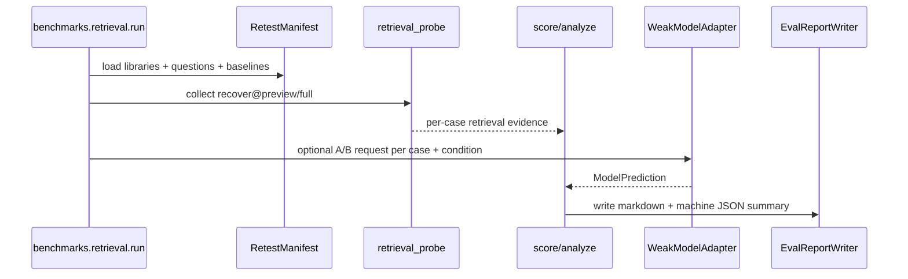
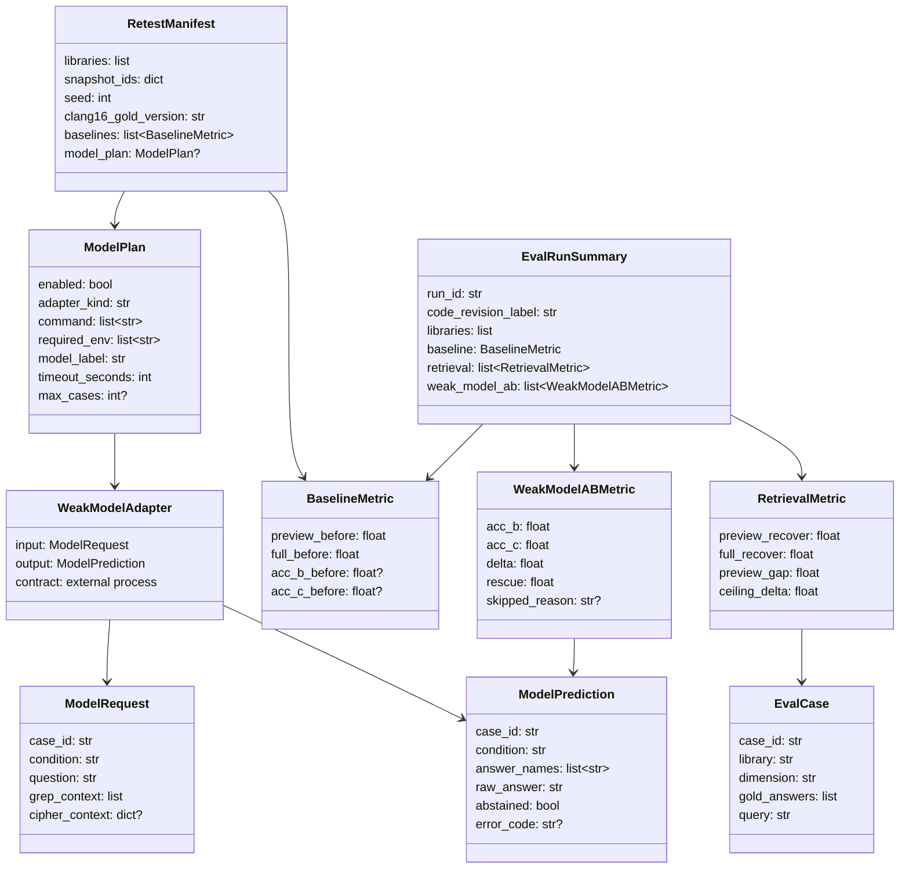

# 检索可还原率复测与弱模型 A/B 设计

## 模块定位

- 范围：复用 #94 的 `benchmarks/retrieval/` harness，新增 #95 专用 manifest、运行计划和 `docs/` 复测报告。
- 目标：在 #89、#91、#90、Tier-2 覆盖修复和 #94 harness 落地后，复测 `recover@preview` 是否向 `recover@full` 收敛，并在大库上复跑弱模型 grep vs `+cipher` A/B。
- 非目标：不改 MCP `search` / `detail` 输出，不新增工具、参数、snapshot 字段、运行时配置或第二套评测脚本。

## 规格与约束

- 复测必须复用 #94 harness 的 gold、coverage、retrieval_probe、score 和 analyze 口径，不得在 #95 中重新实现平行指标逻辑。
- 评测只读取已有 `.cipher/snapshots/current`、MCP `search/detail` 输出、#94 gold/题池和弱模型答案，不从源码推导新答案。
- `recover@preview` 只使用 MCP 响应可见信息；`recover@full` 只使用 store 内已存在关系，必须区分“呈现提升”和“覆盖天花板提升”。
- 弱模型 A/B 为手动门禁：无 API key、模型不可用、Claude Code 容器不可用或大库缺失时必须跳过并在报告中标记 `skipped`，不得伪造结果。
- 10 库复测 manifest 必须固定库列表、snapshot 标识、题集 seed、Clang 16 gold 版本和修复前基线值。
- 不新增用户可配运行时配置项；评测脚本可接受一次性 CLI 参数。

| 配置项 | 类型 | 取值范围 | 作用 |
|---|---|---|---|
| 无运行时配置 | - | - | 不影响 cipher 用户配置 |
| `--manifest` | path | 仓库内/外 JSON 或 YAML | 指定 10 库快照、题集、基线和模型计划 |
| `--baseline` | path | JSON 文件 | 读取修复前 `recover@preview/full` 与 A/B 基线 |
| `--output` | path | `docs/*.md` 或临时路径 | 写入评测报告 |
| `--mode` | enum | `probe` / `ab` / `all` | 选择复测范围 |
| `--max-workers` | int | `1..N`，默认 `1` | 仓库级并发上限，不允许同一仓库内并发 |

## 流程



## 数据结构



| 成员名称 | type | 作用 | 并发粒度 |
|---|---|---|---|
| `RetestManifest.libraries` | `list[str]` | 固定 10 库复测列表 | 单次运行只读 |
| `RetestManifest.snapshot_ids` | `dict[str,str]` | 每个库对应的 snapshot 标识 | 单次运行只读 |
| `RetestManifest.seed` | `int` | 复用 #94 题池抽样 seed | 单次运行只读 |
| `RetestManifest.clang16_gold_version` | `str` | gold 生成用 Clang 16 版本标签 | 单次运行只读 |
| `RetestManifest.baselines` | `list[BaselineMetric]` | 修复前指标和旧 A/B 指标 | 单次运行只读 |
| `RetestManifest.model_plan` | `ModelPlan or None` | 弱模型 A/B 外部适配器计划 | 单次运行只读 |
| `EvalCase.case_id` | `str` | 稳定标识一道评测题 | 单题级 |
| `ModelPlan.command` | `list[str]` | 外部模型适配器命令，不由 cipher 实现模型调用 | 单次运行只读 |
| `ModelPlan.required_env` | `list[str]` | 运行前必须存在的环境变量名，不记录 secret 值 | 单次运行只读 |
| `ModelRequest.condition` | `str` | `grep` 或 `grep_cipher`，决定传入上下文 | 单题单条件 |
| `ModelPrediction.answer_names` | `list[str]` | 适配器归一化输出的候选答案名称，用于打分 | 单题单条件 |
| `BaselineMetric.preview_before` | `float` | 修复前 `recover@preview` 基线 | 维度/库聚合级 |
| `RetrievalMetric.preview_recover` | `float` | MCP preview 可还原率 | 维度/库聚合级 |
| `RetrievalMetric.full_recover` | `float` | store 内事实天花板 | 维度/库聚合级 |
| `RetrievalMetric.preview_gap` | `float` | `full_recover - preview_recover`，呈现剩余损失 | 维度/库聚合级 |
| `RetrievalMetric.ceiling_delta` | `float` | 覆盖修复带来的 `recover@full` 变化 | 维度/库聚合级 |
| `WeakModelABMetric.rescue` | `float` | `+cipher` 相对 grep 救回率 | 维度/库聚合级 |
| `EvalRunSummary.run_id` | `str` | 报告与 JSON 摘要的运行编号 | 单次运行级 |

## 对外接口

- 复用 #94 入口：`PYTHONPATH=src:. python3 -m benchmarks.retrieval.run --manifest ... --mode probe --output ...`。
- A/B 模式由 `RetestManifest.model_plan` 显式启用。`model_plan.adapter_kind` 只支持 `external_command`；harness 通过 stdin 传入 `ModelRequest` JSON，从 stdout 读取 `ModelPrediction` JSON。缺少 `required_env`、命令不存在、超时或输出不合法时，该 case/库标记 `skipped` 或 `adapter_error`，不得回退到内置模型。
- `grep` 条件的 `ModelRequest` 只包含题目和 grep 上下文；`grep_cipher` 条件额外包含 #94 harness 从 MCP `search/detail` 收集到的 cipher 上下文。`gold_answers` 不得传给 adapter。
- `ModelPrediction.answer_names` 按 #94 `score` 的名称规范化和别名规则与 `EvalCase.gold_answers` 比对；`raw_answer` 只用于审计，不参与主指标。
- `WeakModelAdapter` 是外部协议，不是 cipher 运行时组件；#95 只定义评估协议和报告字段，不实现或绑定具体模型 provider。
- 报告输出包含修复前基线、当前 `recover@preview`、当前 `recover@full`、`preview_gap`、`ceiling_delta`、`acc_B`、`acc_C`、`delta`、`rescue` 和 skip 原因。

`model_plan` 在 manifest 中的形状固定为：

```yaml
model_plan:
  enabled: true
  adapter_kind: external_command
  command: ["python3", "tools/run_weak_model_adapter.py"]
  required_env: ["WEAK_MODEL_API_KEY"]
  model_label: "qwen-weak"
  timeout_seconds: 60
  max_cases: 200
```

manifest 只记录环境变量名，不保存 secret 值；报告只记录 `model_label`、adapter exit 状态和 skip/error code。

## 并发控制

- 默认逐库串行执行，避免同时打开多个大库 snapshot 或并发调用外部模型。
- 可选并发只能在库级启用，并受 `--max-workers` 限制；每个 worker 独占目标仓库 MCP 进程和临时目录。
- 报告写入先生成临时文件，再原子替换目标路径。

## 可观测性

- 评测脚本输出 JSON 摘要，记录库数量、题量、跳过项、preview/full 指标、A/B 指标、耗时和失败原因。
- 这是测试评估工具，不新增运行时 `tools/log` / `tools/views` 字段；若脚本失败，错误只进入脚本输出和报告。

## 递归文档更新

- `benchmarks/retrieval/README.md`：登记 #95 manifest、复测命令、基线来源、手动 A/B 门禁和跳过语义。
- `tests/README.md`：登记指标聚合、报告生成、skip 分支和小型 fixture 覆盖。
- `docs/README.md`：登记新增复测报告位置。
- `docs/maintenance-guide.md`：说明 #95 是人工触发回归报告，不进入普通 CI 硬门禁。
- `docs/eval-report-2026-05-29-retest.md`：记录最终对比报告；若原 `docs/eval-report-2026-05-29.md` 存在，则追加“复测”章节而不是另建冲突来源。

## 测试门禁

- TDD 先补失败用例：指标聚合、preview/full 分离、A/B `delta/rescue`、skip 原因、报告表格排序和 JSON 摘要。
- 异常分支覆盖 manifest 缺字段、baseline 缺维度、snapshot 缺失、MCP detail 错误、模型不可用、单库失败不影响其他库。
- 场景覆盖 CALLERS、FIELD_ACC、CALLEES、DEFLOC、`gold_n>5` 和 ALL 聚合。
- 小/中/大看护：小型 fixture 进 CI；中大型 snapshot 和弱模型 A/B 作为手动门禁，脚本必须逐库释放资源，8GB 场景不得一次性常驻全部库结果。
- 运行 `PYTHONPATH=src python3 -m unittest discover -s tests`；实现后追加 `PYTHONPATH=src:. python3 -m benchmarks.retrieval.run --manifest benchmarks/retrieval/manifests/retest-20260529-smoke.json --mode probe --output /tmp/cipher2-retest-smoke`。
