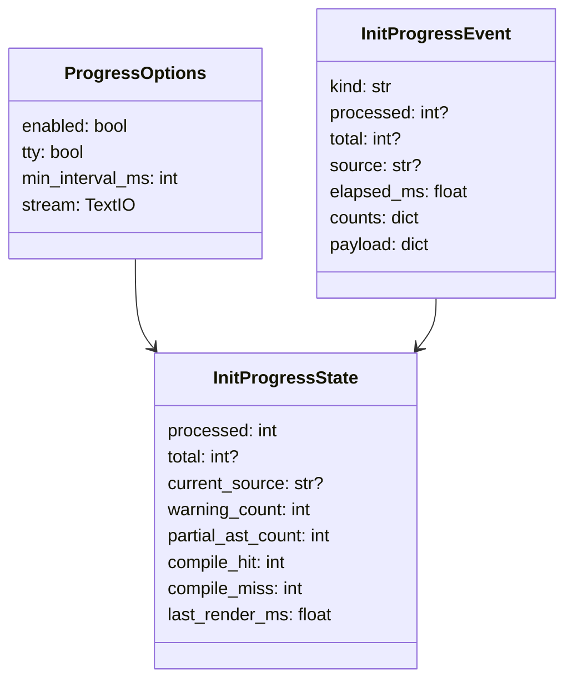
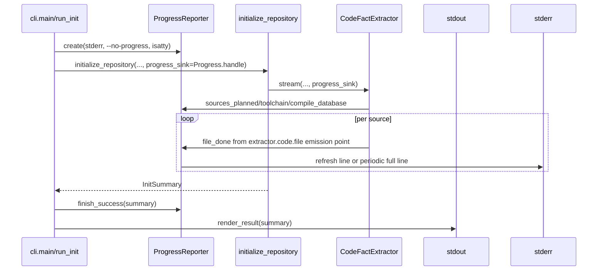

# init 进度 stderr 设计草稿

关联：Part of #162。

## 模块定位

本设计只覆盖 `cipher2 init` 运行期 liveness 展示。影响边界是 `src/cipher2/cli.py`、`src/cipher2/initializer/__init__.py`、`src/cipher2/initializer/extractor/code/` 的进度回调接线，以及后续 README 搬迁文档；不改变 FACT、FactRelative、source inventory、snapshot、Clang AST evidence 或 storage 语义。

设计基石沿用仓库 README：`init/rebuild` 非交互，stdout 必须保持现有 human/`--json` 结果契约，所有持久输出仍只写目标仓库 `.cipher/`，C 抽取仍是类型驱动 Clang AST 路径，不能为了进度展示增加源码解析 fallback。

## 规格约束

- 进度只写 stderr，stdout 不出现进度、心跳或环境摘要；`--json` stdout 仍是单个稳定 JSON object。
- 本设计确认新增 CLI flag 名称为 `--no-progress`，用于关闭默认开启的 init 进度。这是唯一新增外部接口，不新增持久配置项。若后续提供 `--quiet`，它必须至少关闭进度，但本 issue 不定义或实现额外 quiet 语义。
- `--no-log` 只关闭 `.cipher/log/` 持久日志，不关闭 stderr 进度。进度复用 extractor 每文件事件的同一发射点，但不依赖读取 JSONL 文件。
- TTY stderr 使用原地刷新单行；非 TTY stderr 使用周期性完整行日志，至少 start/end 必有，中间按时间节流，避免 CI/管道刷屏。
- 当前文件只显示仓库相对路径，必要时中间截断；不得输出源码正文、绝对 target path、完整 compile database path、环境变量、traceback 或 secret。
- 总数优先来自 extractor 已有 source 枚举结果；若未来改为流式发现且没有固定分母，则退化为 `processed=N current=... elapsed=...`。

建议显示格式：

```text
cipher2 init: sources=947 compile_db=configured clang=AppleClang 15 profile=default
cipher2 init: 234/947 src/backend/foo.c elapsed=45s warnings=2 partial_ast=1
cipher2 init: done files=947/947 facts=12345 relatives=6789 warnings=3 partial_ast=1 compile_db_hit=900 compile_db_miss=47 elapsed=182s
```

非 TTY 中间行使用同样字段但每行换行，不使用回车刷新。

## 数据结构

新增轻量展示状态，不进入 snapshot 或 log schema：



| 成员名称 | type | 作用 | 并发粒度 |
|---|---|---|---|
| `ProgressOptions.enabled` | `bool` | 是否输出进度；由 `--no-progress` 取反 | CLI 调用级 |
| `ProgressOptions.tty` | `bool` | 选择原地刷新或周期整行日志 | CLI 调用级 |
| `ProgressOptions.min_interval_ms` | `int` | 非 TTY 和高频 TTY 刷新节流 | CLI 调用级 |
| `InitProgressEvent.kind` | `str` | `sources_planned`、`toolchain`、`compile_database`、`file_done` | 事件级 |
| `InitProgressEvent.source` | `str or None` | 当前仓库相对 source path，只用于终端展示 | 事件级 |
| `InitProgressEvent.counts` | `dict` | 复用 `extractor.code.file` 计数 | 事件级 |
| `InitProgressState.processed` | `int` | 已完成 source 数 | CLI 调用级 |
| `InitProgressState.total` | `int or None` | source 总数；未知时为 `None` | CLI 调用级 |
| `InitProgressState.warning_count` | `int` | 文件级 warning 聚合 | CLI 调用级 |
| `InitProgressState.partial_ast_count` | `int` | partial AST 文件聚合 | CLI 调用级 |
| `InitProgressState.compile_hit` / `compile_miss` | `int` | per-file compile database 命中/缺失聚合 | CLI 调用级 |

`counts` 直接复用 `extractor.code.file` 已有计数，例如 `fact_count`、`relative_count`、`warning_count`、`partial_ast_count`、`compile_command_hit_count`、`compile_command_miss_count`。不通过解析 `summary` 字符串拿文件名，文件名由 extractor 发射点以仓库相对路径传给进度回调，仍不持久化到 log payload。

## 对外接口

`run_init` 增加 stderr/progress 注入能力，由 top-level CLI 传入真实 stderr，测试可传 fake stream：



`initialize_repository()` 增加可选 `progress_sink` 参数，默认 `None`，保持 Python API 兼容。`CodeFactExtractor` / `_StreamingExtraction` 接收同一个 sink：

- source 枚举后发 `kind="sources_planned"`，提供 `total`。
- compile database 和 toolchain 事件发出时，向 sink 传递可展示摘要。
- 每个 source 完成时，在写 `extractor.code.file` 的同一代码路径向 sink 发 `kind="file_done"`；skipped/partial 同样计入 processed。
- sink 异常、stderr `BrokenPipe` 或写失败不得影响抽取；renderer 应关闭自身后继续主流程。

不采用运行中 tail `.cipher/log/initializer.jsonl` 的方式，因为 `--no-log` 会关闭日志，且 tail 会引入文件轮询、排序和锁语义。

## 失败路径边界

`cli.main` 现有错误诊断仍是唯一错误码/错误消息输出来源，即 stderr 中的 `cipher2: <code>: <message>`。`ProgressReporter.finish_error()` 不得再输出等价的 error code 或 message，避免 stderr 出现两条语义重复的错误诊断。

失败时 progress renderer 只负责展示层收尾：TTY 清理正在刷新的进度行并补换行；如已有进度输出，可输出不含 code/message 的短状态，例如 `cipher2 init: stopped elapsed=45s`。真实失败原因仍由 CLI 错误 renderer 输出，stdout 继续按现有错误契约保持为空或 JSON 错误结果。

## 并发控制

当前 init 抽取主线串行执行，不新增后台线程、全局锁或 daemon。进度状态是单次 CLI 调用局部对象；stderr 写入使用单 stream 顺序写。未来若并行抽取，worker 只提交 per-file completion event，renderer 在主线程或受锁保护的单消费者中递增 `processed`，展示顺序按完成顺序而不是 source 枚举顺序。

storage lock、log flock、snapshot 原子发布保持现状。进度展示是 best-effort，不能参与成功/失败判定。

## 可观测性

此设计提升终端可观测性，但不新增持久观测 schema。持久可观测性仍来自 `extractor.code.toolchain`、`extractor.code.compile_database`、`extractor.code.file`、`extractor.code.direct_call_resolution`、`initializer.run` 和 `cli.command`。

终端 start summary 展示 source 总数、compile database 是否配置/索引、Clang vendor/version/profile。success end summary 展示 processed/total、facts、relatives、warnings、partial AST、compile db hit/miss 和 elapsed。failure 收尾不重复 error code/message。

## 可观测用例看护

- 大仓 init 期间，用户在 5 秒内应看到 start 或首条进度；之后 TTY 每个完成文件可刷新，非 TTY 至少周期性输出完整行。
- 单文件 timeout、malformed AST skipped、partial AST accepted 都必须推进 processed，并在 warning/partial 计数中可见。
- compile database 配置但部分 source miss 时，终端 end summary 能看到 hit/miss。
- `--json` + 进度开启时，stdout 可被 JSON parser 直接读取；所有进度只在 stderr。
- `--no-log` + 进度开启时仍有 stderr liveness；`--no-progress` 时 stderr 不输出进度。
- 失败路径 stderr 只出现一条带稳定 code/message 的 CLI 错误诊断，progress 收尾不复制该诊断。

## 递归文档更新

设计 PR 合入后，README 搬迁 PR 需要递归更新 `README.md`、`docs/user-guide.md`、`src/cipher2/README.md`、`src/cipher2/initializer/README.md`、`src/cipher2/initializer/extractor/README.md`、`src/cipher2/initializer/extractor/code/README.md`、`src/cipher2/tools/log/README.md` 和 `tests/README.md`。搬迁 PR 合入前不得写运行时代码或测试。

## 测试与门禁计划

设计合入后的 TDD 覆盖：

- CLI parser 覆盖 `--no-progress`，并确认这是本 issue 的 flag 名称。
- `run_init` fake stderr：TTY 原地刷新、非 TTY 周期整行、end summary 换行。
- `--json` stdout 纯净，stderr 有进度；`--no-progress` stderr 无进度。
- `--no-log` 不写 `.cipher/log/` 但仍触发 progress sink。
- per-file success/skipped/partial 都驱动 processed，partial/warning/compile hit/miss 聚合正确。
- 长路径截断不泄漏绝对 target path；stderr 写失败不改变 exit code。
- 无 source 仓库显示 `sources=0` 并完成，不运行 Clang probe 的既有语义不变。
- failure path 中 progress finish 不输出 error code/message；现有 `cipher2: <code>: <message>` 仍只出现一次。
