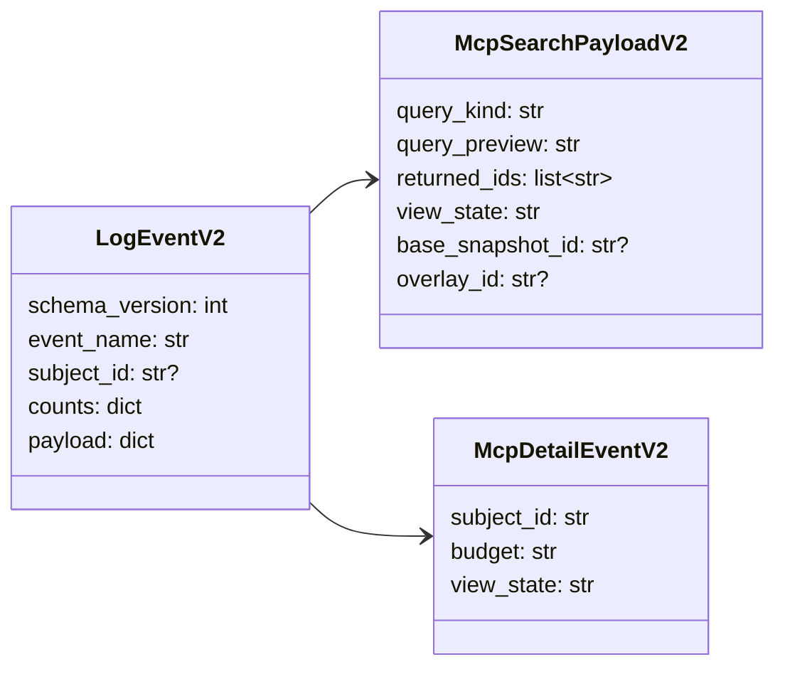
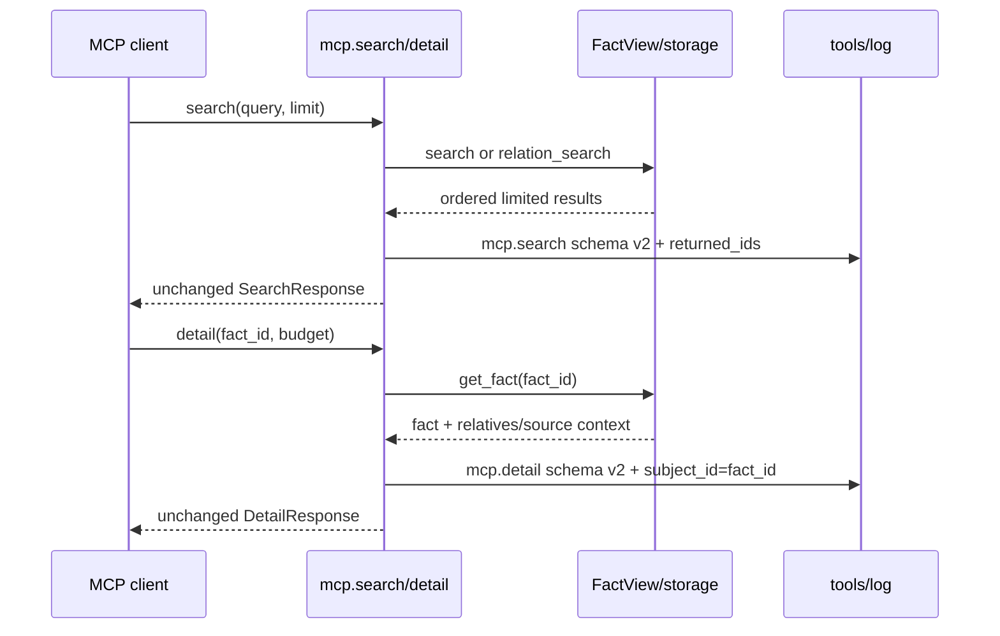

# Issue #156：检索取用可观测性 schema v2 设计草稿

## 模块定位

本设计只修改 `tools/log` 事件 schema 与 MCP/storage 检索事件的观测底料，目标是让 `.cipher/log/*.jsonl` 能回答“模型实际拿到了哪些 fact / detail 取用了哪条 fact”。运行时仍保持 README 的 FACT-only、本地 stdio MCP、`search` / `detail` 两个工具边界；不新增交互查看面板、不新增 MCP tool、不改变检索排序和返回语义。

## 规格约束

- `LogEvent.schema_version` 从 `1` 升到 `2`。reader 必须能读取 v1/v2 行；v2 写入不再产生 `query_sha256`。
- `mcp.search` 成功事件新增 `payload.returned_ids`，值为本次响应中已经过排序与 `limit` 截断后的 object id 列表。它不是 matched 全量集合，长度必须等于 `result_count` / `returned_count` 语义下的本次返回规模。
- `storage.search` 不强制新增 `returned_ids`。storage 层可继续只记录聚合计数，避免底层内部查询与模型可见结果混淆；如果实现阶段选择同步增加，必须同样 bounded by limit。
- `mcp.detail` 成功或 source warning 事件的顶层 `subject_id` 必须等于请求的 `fact_id`，用于按 fact id 归因 detail 取用。
- `query_sha256` 从 `storage.search` 与 `mcp.search` payload 删除。`query_preview` 继续保留 80 字符上限；仍不得写完整 query、源码正文、绝对 target path、payload dump、traceback、secret 或 provider internals。
- `base_snapshot_id` 必须保留。它是 incremental/status/view model 的快照身份字段，不属于本 issue 的冗余 query 字段。

## 数据结构

| 成员名称 | type | 作用 | 并发粒度 |
|---|---|---|---|
| `schema_version` | `int` | log event schema，v2 标识新字段与删字段 | 事件级 |
| `subject_id` | `str or None` | 被取用 fact id；`mcp.detail` 必填 | 事件级 |
| `payload.returned_ids` | `list[str]` | `mcp.search` 实际返回给模型的 object id，按响应顺序 | 请求级 |
| `payload.query_preview` | `str` | 截断后的查询可读摘要 | 请求级 |
| `payload.base_snapshot_id` | `str or None` | 当前视图依赖的基础 snapshot id | 视图级 |

## 接口流程

对外 MCP response schema 不变；只改变 `.cipher/log/*.jsonl` 事件行。`tools/log.summarize()` 继续按 channel、event_name、status、error_code 和 counts 聚合，不消费 `query_sha256`。

## 并发控制

不新增共享可变状态。`returned_ids` 从当前 request 已构造好的响应对象派生，必须在写 `mcp.search` 前复制为普通 list，避免后续对象复用影响日志。log 写入继续使用 `tools/log` channel 级锁；log 写失败不得影响 MCP response 或 storage search 返回。

## 递归文档更新

设计 PR 合入后，README 搬迁 PR 更新：

1. `src/cipher2/tools/log/README.md`：声明 schema v2、`returned_ids`、`mcp.detail.subject_id=fact_id`、删除 `query_sha256`，并保留 `base_snapshot_id` allowlist。
2. `src/cipher2/mcp/README.md`：更新 `mcp.search` / `mcp.detail` 可观测事件字段。
3. `src/cipher2/storage/README.md`：删除 search observability 中的 query hash 要求，说明 storage 是否记录 `returned_ids` 的最终选择。
4. `src/cipher2/tools/views/README.md`：确认 views 仍只聚合现有 counters，不新增交互查看面板。
5. `docs/README.md` 与 `README.md`：仅在顶层边界或流程文字确受影响时递归同步；本次通常不需要改 `CONTRIBUTING.md`。

## 可观测性

schema v2 后，一次 `search -> detail` 链路至少可从日志归因：

- `mcp.search.payload.returned_ids=["fact:a","fact:b"]`：模型实际拿到的候选 fact。
- `mcp.detail.subject_id="fact:a"`：模型随后展开的 fact。
- `view_state` / `base_snapshot_id` / `overlay_id`：这些取用来自哪个稳定 snapshot 与临时 overlay 视图。

`returned_ids` 进入 raw JSONL，但不要求 digest/recent row 全量展示，避免长列表挤占人类摘要。查看端增强另行设计。

## 测试门禁计划

- log schema：v2 事件可写可读；v1 历史事件仍可被 summary 跳过或兼容读取，具体策略在 README 搬迁时固化。
- MCP observability：普通 search、relation search、too_broad search 分别断言 `returned_ids` 为响应顺序且 bounded by limit。
- Detail observability：正常 detail 与 source warning detail 都断言 `subject_id == fact_id`。
- 删除字段：storage/mcp search 事件 payload 不含 `query_sha256`，相关旧测试更新为断言 `query_preview` 与无泄漏；实现阶段必须更新 `tests/test_storage_observability.py` 中当前对 64-hex `query_sha256` 的断言。
- 保留字段：incremental/status/view tests 继续覆盖 `base_snapshot_id`，防止被误删。
- Redaction：`returned_ids` 只允许 object id 字符串；不得把 object name、source path、完整 query 或 payload 混入该列表。
