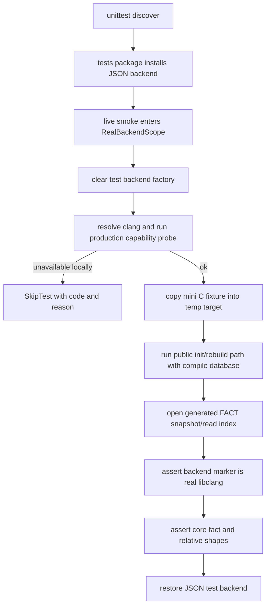

# live libclang smoke 测试架构设计草稿

## 状态与边界

- 日期：2026-06-06
- 状态：设计草稿；未搬迁 README；未实现。
- 关联 issue：#226；覆盖 #224、#225 暴露的测试架构盲区。
- README 基准：`cipher-2` 是 FACT-only、本地 stdio MCP；C 抽取正式路径必须通过类型驱动 libclang capability probe，并用标准库 `ctypes` 进程内遍历 `_LibclangAstBackend`；不得回退到 JSON dump、subprocess AST mapper 或 lightweight parser。工具链不可用、版本不匹配或 probe 缺 evidence 时 fail-closed；测试侧允许按 capability skip。
- 范围：测试后端注入边界、toolchain-gated live libclang fixture、CI 覆盖信号、测试覆盖矩阵和相关 README 搬迁。
- 非目标：不改变 snapshot schema、FACT/relative 规格、CLI/MCP/config、libclang 定位策略、mapper 运行时行为或生产 timeout 数值。

## 问题判断

当前 `tests/__init__.py` 在测试包导入时全局安装 `_install_json_test_libclang_backend()`。这保证大多数 unittest 可用合成 JSON AST 快速覆盖 mapper 规则，但也让测试默认路径经过 `_SyntheticAstExtractor` / `_JsonSubprocessTestBackend`，无法证明生产 `_LibclangAstBackend` 的 ctypes cursor 归一、timeout、referenced decl、member reference 和 type evidence 仍然等价。

本设计不移除 JSON oracle。JSON 后端继续用于快速、确定性的细粒度单元测试；新增 live smoke 只作为生产 backend canary，覆盖最容易因 JSON/backend 分歧漏检的核心关系模式。

## 模块定位

- `tests/__init__.py`：保留默认 JSON test backend 安装，避免全量测试强依赖本机 libclang。
- `tests/test_live_libclang_smoke.py`：实现阶段新增，单独清空测试 backend、运行真实 init/rebuild 路径并在 finally 恢复 JSON backend。
- `examples/mini-c/`：若目标分支已存在，优先复用为 smoke fixture；若不存在，实现 PR 在测试 fixture 中引入等价最小 C 仓库，不把本设计绑定到缺失路径。
- `src/cipher2/initializer/extractor/code/ast_backend.py`：只复用现有 `_clear_test_libclang_backend()` / `_install_json_test_libclang_backend()` 测试注入点；除非实现阶段发现恢复原 backend 不可靠，否则不新增用户公开 API。
- `tests/test_initializer_coverage_matrix.py`、`tests/README.md`：记录 live backend smoke 是 initializer/extractor 覆盖矩阵的硬要求。
- `.github/workflows/ci.yml`：确保默认 CI 在 `ubuntu-latest` 上具备 Clang + libclang capability，常态执行 smoke；本机缺工具链仍 skip。

## 规格约束

- live smoke 必须在进入抽取前清空 `_TEST_AST_BACKEND_FACTORY`，并在退出时恢复默认 JSON test backend，避免测试顺序影响其它 unittest。
- live smoke 必须通过 production capability probe 后才执行；本机缺 `clang`、`libclang`、版本匹配或 type-driven evidence 时使用 `unittest.SkipTest`，skip reason 写明具体 code。
- CI 的默认 runner 预期 probe 通过；若 runner 镜像变化导致 smoke skip，CI 日志必须能看到 skip reason，后续可由维护者把该 job 升级为 `CIPHER2_REQUIRE_LIVE_LIBCLANG=1` 的硬门禁。
- live smoke 必须跑公开 initializer 路径写出 `.cipher/` snapshot，而不是只调用 mapper 或直接喂 synthetic AST。
- live smoke 必须断言 backend evidence 来自真实 libclang：toolchain/backend 字段为 `libclang`，`libclang_library` 不得为 `test-json-backend`，且过程中不得调用 `_JsonSubprocessTestBackend`。
- fixture 使用最小 compile database，覆盖仓内 header include、两个 `.c` translation unit、结构体字段、函数指针和匿名 union；不得依赖系统头、网络、外部源码或非确定性路径。
- 断言面只检查稳定事实与关系 shape，不检查完整 snapshot id 或每个 libclang vendor 可能不同的诊断文本。
- live smoke 失败代表生产路径回归；不能通过扩大 JSON oracle、字符串解析或跳过关系断言来修复。

## live fixture 模式

首个 smoke fixture 至少覆盖：

- `direct_call`：普通函数调用和 header `static inline` 调用都能指向函数 fact。
- `field_read` / `field_write`：结构体字段在赋值、读取、复合读写中均可解析到 field fact。
- `function_pointer_slot`、`assigned_to`、`dispatches_via`：结构体或本地函数指针 endpoint 能生成赋值和间接调用关系，防止 #225 类生产 backend 缺失。
- 同名 `static` identity：不同 `.c` 文件中的同名 `static helper` / `static` global 不合并，`object_source` 区分文件。
- 匿名 union field：`struct Outer { union { int a; int b; }; };` 生成稳定 synthetic owner、field fact、`has_field` 和成员访问关系。

## 数据结构

只新增测试侧 helper，不新增运行时 schema 或用户配置。

| 名称 | type | 作用 | 并发粒度 |
|---|---|---|---|
| `LiveLibclangProbe` | test helper record | 保存 clang 路径、probe result、skip code/reason、是否 CI 期望 live | 单测试进程 |
| `RealBackendScope` | context manager | 保存当前 test backend，清空后运行真实 backend，并在 finally 恢复 | 单测试方法 |
| `LiveFixtureShape` | test assertion helper | 提取 fact kind/name/source 与 relation kind/endpoint 的稳定 shape | 单 fixture |

## 接口流程



## 并发控制

- smoke 至少覆盖 `extractor.worker_count=1` 的串行生产 backend。
- 若 fixture 含两个 translation unit，实现阶段可增加 `worker_count=2` parity 子用例，但不应把并行覆盖做成首个 smoke 的通过前置，以免扩大工具链差异面。
- `RealBackendScope` 只在当前测试方法内修改全局 backend factory；必须用 `try/finally` 恢复，避免与同进程后续测试互相污染。

## 可观测性

- skip reason 必须包含 `clang_unavailable`、`clang_capability_failed`、`libclang_unavailable` 或 `libclang_version_mismatch` 之一。
- 失败输出应包含 backend name、libclang version/library scope、fixture 名称和缺失的 fact/relative shape。
- 不新增生产 log 字段；smoke 只断言现有 toolchain/file/init summary 中能看出真实 backend 路径。

## README 搬迁计划

设计 PR 合入后，README 搬迁 PR 至少更新：

- `tests/README.md`：把 live `_LibclangAstBackend` smoke 写入 initializer/extractor 覆盖目标，说明 JSON oracle 与 production canary 的分工。
- `docs/maintenance-guide.md`：测试门禁增加 toolchain-gated live libclang smoke，注明本机 skip、CI 常态执行。
- `src/cipher2/initializer/extractor/code/README.md`：补充测试注入点边界，明确 production backend 回归不能只靠 `_JsonSubprocessTestBackend` 判定。
- `docs/design-drafts/README.md`：维护本草稿索引状态。

README 搬迁 PR 合入前不得修改测试或运行时代码。

## TDD 与门禁

实现 PR 先新增会在真实 backend 缺失关系时失败的 live smoke，再按失败修复生产路径；不得先改实现后补用例。

实现阶段至少运行：

```bash
PYTHONPATH=src python3 -m unittest tests.test_live_libclang_smoke
PYTHONPATH=src python3 -m unittest tests.test_initializer_toolchain tests.test_code_extractor_fixtures
PYTHONPATH=src python3 -m unittest discover -s tests
```

若 smoke 暴露 timeout、function pointer dispatch 或 cursor evidence 分歧，实现 PR 还必须补对应 regression case，并确认该 case 在清空 JSON backend 后覆盖真实 `_LibclangAstBackend`。

本设计阶段不运行测试、不修改实现。
