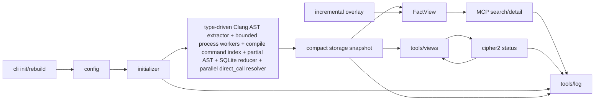
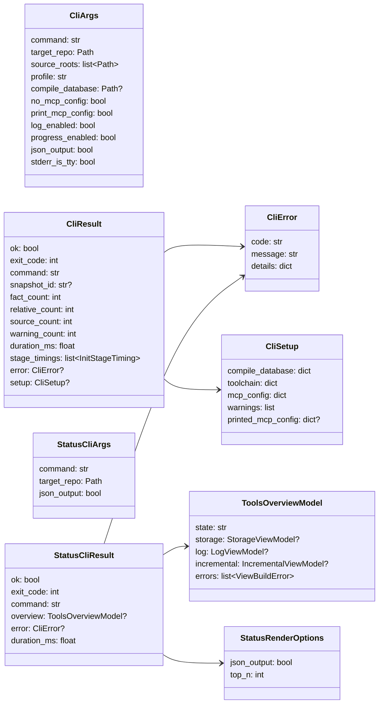
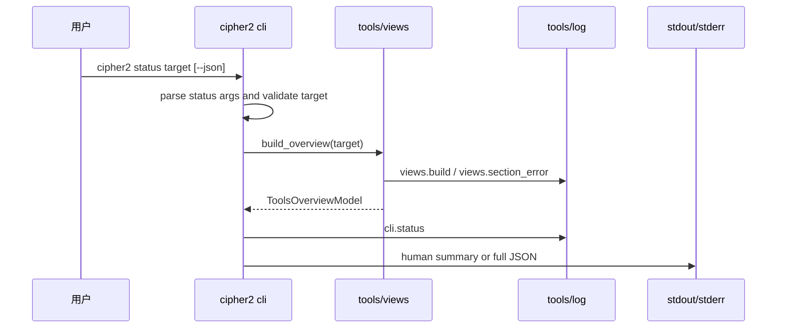
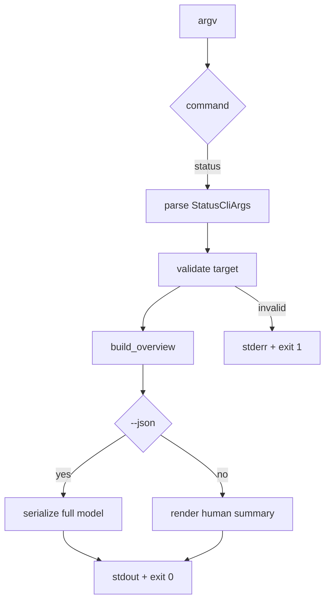

# cipher2

## 路径职责

这是 `cipher-2` 的主 Python 包。包级职责是把 CLI、config、initializer、storage、incremental、MCP、log 和 views 组合成 FACT-only 本地代码理解运行时。

## 包级数据流



## 子模块职责

| 路径 | 职责 |
|---|---|
| `cli.py` | `cipher2 init` / `cipher2 rebuild` / `cipher2 status` 参数解析、`init/rebuild` config 准备、initializer 或 views 调用和结果渲染。 |
| `__main__.py` | `python -m cipher2` 入口。 |
| `common/` | 共享窄类型。 |
| `config/` | `.cipher/config.yml` schema、toolchain、全量抽取 worker、incremental 和路径安全。 |
| `initializer/` | 全量初始化和重建编排。 |
| `initializer/extractor/code/` | C 语言类型驱动 Clang capability probe、全量 init/rebuild 有界 per-file process worker pool、worker-local exact relative dedup、SQLite-backed facts reducer、relatives external merge、compile database per-file flags、partial AST 接受、AST facts/relatives/source inventory、并行跨文件 direct_call 后处理和 field fact 覆盖抽取。 |
| `storage/` | v5 gzip FACT snapshot、持久 read index、FactView、multi-term search、关系 BFS、relatives、overlay 和 stats。 |
| `incremental/` | 在线临时增量 overlay。 |
| `mcp/` | stdio MCP `search` / `detail`，`search` 包含 FACT 分词、关系谓词、传递闭包和可达性查询，`detail` 包含响应字节预算和 bucketed relative preview。 |
| `tools/log/` | JSONL 事件写入、读取、摘要和脱敏。 |
| `tools/views/` | storage/log/incremental 人类可读 view model。 |

`graph/` 和 `initializer/inference/` runtime 模块已删除；新增能力不得重新引入 Graph projection、Inference rules 或 MCP `impact`。

## CLI 规格

```text
cipher2 init <target> [--source-root PATH] [--profile NAME] [--compile-database PATH] [--no-mcp-config] [--print-mcp-config] [--no-progress] [--no-log] [--json]
cipher2 rebuild <target> [--source-root PATH] [--profile NAME] [--compile-database PATH] [--no-log] [--json]
cipher2 status <target> [--json]
```

本包不新增 toolchain 持久配置写回接口。显式 `--compile-database` 会写入 `.cipher/config.yml` 的 `paths.compile_database`；`init` 未显式传参且现有 config 为空时，会自动探测仓库根、`build/`、`out/` 和浅层目录中的 `compile_commands.json`，找到后只把路径写入既有字段。找不到 compile database 不阻断 snapshot，但 human/JSON setup summary 必须给出 `compile_database_not_found` warning，说明 C AST 质量会因缺少真实 include/macro flags 降级，并提示 CMake/Bear 或显式 `--compile-database`。code extractor 读取该路径后，默认只把其中列出的仓内 source 作为独立抽取 TU，`source_roots` 只在该集合上继续收窄；每个被抽取 source 使用 allowlist 清洗后的 per-file flags。未列入 compile database 的源码不会用空 per-file flags 回退抽取；被这些 TU include 的仓内头文件仍会进入 source inventory/include graph，用于增量 header fanout。全量 `init/rebuild` 使用 `extractor.worker_count` 控制 per-file Clang 抽取 worker，省略或 `null` 解析为 CPU auto 且上限 32，显式 `1` 使用单 worker 串行调度，但 target AST 仍在可 kill/restart 的 worker 子进程内执行；大于 1 时使用多个长期 worker 进程绕开 Python GIL；实际 worker 数仍受 source 数限制；coordinator 在单文件 timeout 后 kill/restart 对应 worker 并记录 `clang_ast_failed` timeout warning。worker 将每个 source 的 facts/relatives/pending 写入 `.cipher/run/initializer-mapreduce/<run_id>/` run-local map 段，facts/pending 由 coordinator 流式写入 SQLite-backed reducer，relatives 写段前先在当前 worker 进程内按 `relative_id` 和 canonical line 指纹跳过 exact duplicate，再由 external merge 对残余行按 id 确定序、去重和 conflict 检测，跨文件 `direct_call` resolver 使用只读函数索引按 SQLite pending shard 并行运行。仓内共享头声明 cache 和 relative dedup 表只在同一 worker 进程内复用，不跨进程共享、不落盘。`init/rebuild` 始终非交互，不支持 `--interactive`。`init` 默认向 stderr 输出 source 进度和结束摘要；进度复用 `extractor.code.file` 发射点，不改变 stdout 合同，`--no-progress` 可关闭。`status` 是只读命令，不运行 extractor，不写 snapshot，不自动初始化仓库。

`init` 默认创建或合并仓库根 `.mcp.json`，作为 repo-local MCP project 配置；这是唯一默认非 `.cipher/` 写入，仍在目标仓库内。写入只创建或替换 `mcpServers["cipher-2"]`，保留其它 server 和顶层字段，使用运行 init 的 `sys.executable` 作为 `command`，并通过同目录临时文件加 `os.replace` 原子替换。已有 `.mcp.json` malformed 时不得覆盖，init 继续完成并输出 warning。`--no-mcp-config` 跳过该写入；`--print-mcp-config` 输出手工兜底片段。v1 不支持仓库外客户端配置写入 flag，也不支持 toolchain 绝对路径写回 flag。

storage snapshot 使用 v5 `compact-jsonl-gzip` 文件格式。`init/rebuild` 写出 `facts.jsonl.gz`、`relatives.jsonl.gz`、`source_inventory.jsonl.gz`、`read_index.sqlite`、`manifest.json` 和 `stats.json`；v4/v3 snapshot 不做回读兼容，需要用户执行 `rebuild`。

| 参数 | type | 默认值 | 作用 |
|---|---|---|---|
| `target` | `Path` | 必填 | 目标仓库根目录。 |
| `--source-root` | `Path`，可重复 | 扫描目标仓库 | 限定抽取范围。 |
| `--profile` | `str` | `default` | 写入 fact profile。 |
| `--compile-database` | `Path` | 保留或写 `null` | 指定 compile database，只持久化路径。 |
| `--no-mcp-config` | `bool flag` | `false` | `init` 跳过仓库根 `.mcp.json` 写入。 |
| `--print-mcp-config` | `bool flag` | `false` | `init` 输出可手工粘贴的 MCP 配置片段；JSON 模式进入 `setup.printed_mcp_config`。 |
| `--no-progress` | `bool flag` | `false` | 关闭 `init` 的 stderr 进度输出，不影响 stdout。 |
| `--no-log` | `bool flag` | `false` | 禁止本次 log。 |
| `--json` | `bool flag` | `false` | `init/rebuild` 输出 JSON 摘要；`status` 输出完整 `ToolsOverviewModel`。 |

`status` human 输出包含 storage、log、incremental 三个 section。缺失 section 使用 `-`，section error 只显示稳定 `code`，不得显示 traceback。stdout 只写状态结果，失败诊断写 stderr；human 输出不得使用 ANSI 颜色或终端控制符。
log section 必须能展示最近一次 type-driven Clang capability、compile database 命中/miss/重复/仓外忽略统计、全量抽取 worker pool 模式和成功/跳过计数、worker-local relative input/written/skipped/tracked/saturated、缺失 evidence、source fallback、field coverage、包装/宏/位运算字段访问、函数指针 dispatch、MCP response budget / relative preview quality、unresolved call、partial AST、relative external merge 和 direct call resolution 统计。
incremental section 展示临时 overlay 状态；在线增量只发布 `.cipher/run/incremental/` 下的可丢弃 overlay，不移动 `snapshots/current`。overlay 空闲 TTL 到期，或 base snapshot、storage/read-index schema、dirty source compile command、dirty source toolchain 指纹变化时必须 fail-closed 丢弃 overlay 并回到 base view。`incremental.worker_count` 是兼容配置字段，active worker 固定为 `1`。

## 数据结构



### `CliArgs` 成员表

| 成员名称 | type | 作用 | 并发粒度 |
|---|---|---|---|
| `command` | `str` | `init` 或 `rebuild` | 请求级 |
| `target_repo` | `Path` | 目标仓库根目录 | 只读共享 |
| `source_roots` | `list[Path]` | 抽取范围 | 请求级 |
| `profile` | `str` | fact profile | 请求级 |
| `compile_database` | `Path or None` | compile database override | 请求级 |
| `no_mcp_config` | `bool` | 是否跳过 repo-root `.mcp.json` 写入 | 请求级 |
| `print_mcp_config` | `bool` | 是否输出 MCP 兜底片段 | 请求级 |
| `log_enabled` | `bool` | 是否写 log | 请求级 |
| `progress_enabled` | `bool` | `init` 是否向 stderr 输出进度 | 请求级 |
| `json_output` | `bool` | stdout 是否输出 JSON | 请求级 |
| `stderr_is_tty` | `bool` | stderr 是否使用 TTY 原地刷新 | 请求级 |

### `CliResult` 成员表

| 成员名称 | type | 作用 | 并发粒度 |
|---|---|---|---|
| `ok` | `bool` | 命令是否成功 | 响应实例级 |
| `exit_code` | `int` | 进程退出码 | 响应实例级 |
| `command` | `str` | 子命令名 | 响应实例级 |
| `snapshot_id` | `str or None` | 写入 snapshot id | 响应实例级 |
| `fact_count` | `int` | FACT 总数 | 响应实例级 |
| `relative_count` | `int` | FactRelative 总数 | 响应实例级 |
| `source_count` | `int` | source inventory 数量 | 响应实例级 |
| `warning_count` | `int` | 警告数 | 响应实例级 |
| `duration_ms` | `float` | CLI 包装耗时 | 响应实例级 |
| `stage_timings` | `list[InitStageTiming]` | `init` / `rebuild` 阶段耗时；JSON 输出完整保留，human 输出渲染为 `stages: collect=...` | 响应实例级 |
| `error` | `CliError or None` | 失败详情 | 响应实例级 |
| `setup` | `CliSetup or None` | `init` setup 发现、工具链和 MCP 配置摘要 | 响应实例级 |

### `CliSetup` 成员表

| 成员名称 | type | 作用 | 并发粒度 |
|---|---|---|---|
| `compile_database` | `dict[str, JSONValue]` | compile database 显式、保留、发现或未发现结果 | 响应实例级 |
| `toolchain` | `dict[str, JSONValue]` | 本次 extractor capability probe 摘要；只报告，不写 config | 响应实例级 |
| `mcp_config` | `dict[str, JSONValue]` | repo-root `.mcp.json` created/updated/skipped/warning 结果 | 响应实例级 |
| `warnings` | `list[CliWarning]` | setup 级 warning，包含 compile db 未发现和 MCP 写入问题 | 响应实例级 |
| `printed_mcp_config` | `dict[str, JSONValue] or None` | `--print-mcp-config` 的手工兜底片段 | 响应实例级 |

### `CliError` 成员表

| 成员名称 | type | 作用 | 并发粒度 |
|---|---|---|---|
| `code` | `str` | 稳定错误码 | 错误实例级 |
| `message` | `str` | 短说明 | 错误实例级 |
| `details` | `dict[str, JSONValue]` | 有界上下文 | 错误实例级 |

### `StatusCliArgs` 成员表

| 成员名称 | type | 作用 | 并发粒度 |
|---|---|---|---|
| `command` | `str` | 固定为 `status` | 请求级 |
| `target_repo` | `Path` | 目标仓库根目录 | 请求级只读 |
| `json_output` | `bool` | 是否输出完整 JSON | 请求级 |

### `StatusCliResult` 成员表

| 成员名称 | type | 作用 | 并发粒度 |
|---|---|---|---|
| `ok` | `bool` | status 命令是否完成 | 响应实例级 |
| `exit_code` | `int` | 进程退出码 | 响应实例级 |
| `command` | `str` | 固定为 `status` | 响应实例级 |
| `overview` | `ToolsOverviewModel or None` | views 聚合结果 | 响应实例级 |
| `error` | `CliError or None` | CLI 层失败 | 响应实例级 |
| `duration_ms` | `float` | CLI 包装耗时 | 响应实例级 |

### `StatusRenderOptions` 成员表

| 成员名称 | type | 作用 | 并发粒度 |
|---|---|---|---|
| `json_output` | `bool` | 选择 JSON 或 human 渲染 | 请求级 |
| `top_n` | `int` | human dict/list 摘要上限，固定为 5，不暴露 CLI 参数 | 请求级 |

## status 接口流程





## status 并发控制

- status 不持有 snapshot 写锁，不创建或移动 `snapshots/current`。
- storage snapshot、临时 overlay 和 log JSONL 的读并发由 storage/log/views 处理；status 不新增跨模块锁。
- 各 section 允许读取到不同时间点的状态；`generated_at` 标识 overview 构建时间。
- status JSON 输出保留 `log.init_stage_timings`；human 输出从同一 view model 渲染 `init stages: ...`，无阶段记录时为 `-`。
- `cli.status` 日志写失败不得影响 status 输出或退出码。

## 可观测性

CLI 成功写 `cli.command` 或 `cli.status`，失败写 `cli.error`。`init` 另写 `cli.setup_discovery` 和 `cli.mcp_config`，用于记录 compile database 自动发现、repo-root `.mcp.json` 写入/跳过/异常；`init/rebuild` config 准备完成后调用 initializer 构建准备预检并写 `initializer.build_readiness`，initializer/storage 会继续写 `init.stage` 阶段事件。事件 payload 只保存 operation、outcome、command_name、exit_code、json_output、source_root_count、profile、candidate_count、server_name、readiness 布尔和计数等摘要字段，不保存绝对 target path、完整 MCP args 或源码正文。

`cli.status` 使用 `channel="cli"`、`status="ok"`，counts 写 `section_count` 和 `error_count`，payload 写 `operation="status"`、`outcome="rendered"`、`command_name="status"`、`json_output` 和 `overview_state`。views 的 log section 必须能看到 `cli.status` 事件和状态命令次数。

## 测试门禁

- argparse、unknown command、usage error 和 `--version`。
- `init/rebuild` 成功、失败、JSON 输出、`--no-log`。
- `init` compile database 自动探测优先级、已有 config 保留、显式参数优先、未发现 warning、repo-root `.mcp.json` create/update/malformed/skip/print。
- `status target`、`status target --json`、missing target、unknown flag、invalid target。
- `status` human 输出三 section、empty snapshot、section error、无 ANSI、无 traceback。
- `status` JSON 输出完整 `ToolsOverviewModel`，human/JSON 都能展示最近一次 init 阶段耗时；views section error 不导致整个 status 失败。
- `cli.status`、`initializer.build_readiness` 可观测，views log section 能看到 status/setup/readiness 事件，且日志不记录绝对 target path。
- `--interactive` 删除后的 usage error。
- CLI log 可观测、setup 可观测和 path safety。
- `scripts/cli_performance_gate.py`。
