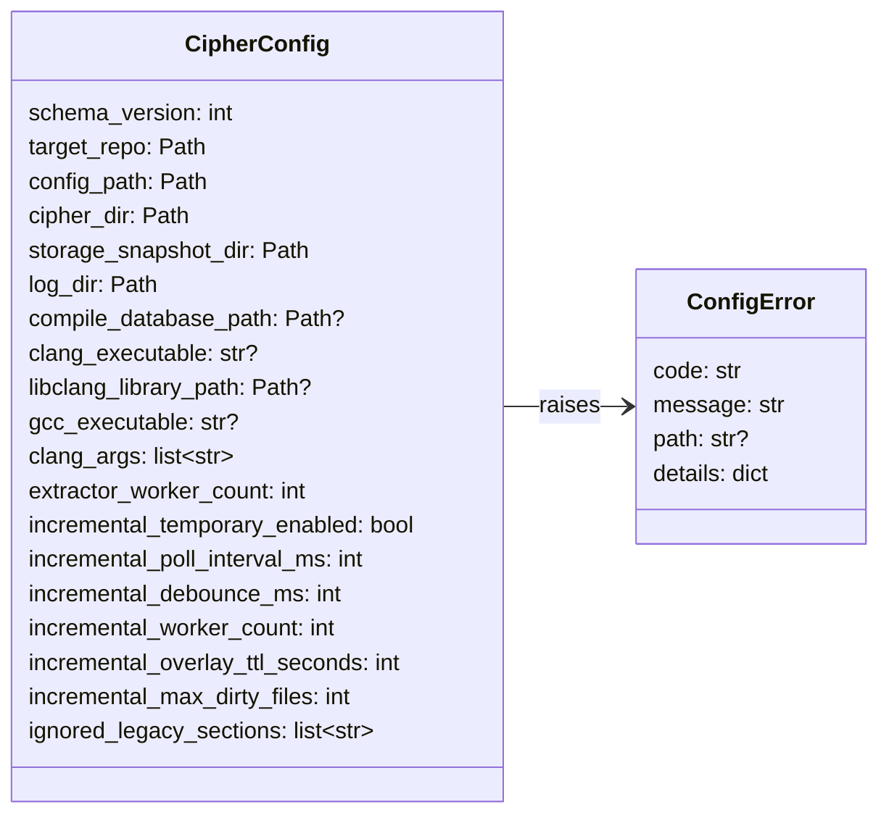
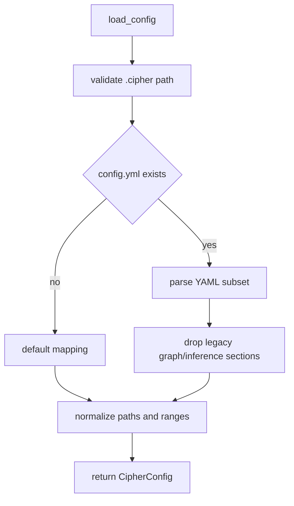

# config

## 路径职责

本模块负责目标仓库 `.cipher/config.yml` 的读取、写入、校验和 `.cipher/` 路径安全。配置只保存运行时必要的输入和在线临时增量参数；不保存 Graph、Inference 或 MCP 查询默认值。

## 配置文件

新建 `.cipher/config.yml` 使用带注释的有效 YAML 模板。每个字段都有一句说明；注释不参与解析，下面示例省略注释只展示 schema 形状：

```yaml
schema_version: 1
paths:
  compile_database:
extractor:
  worker_count:
  code:
    clang_executable:
    libclang_library:
    gcc_executable:
    clang_args:
incremental:
  temporary_enabled: true
  poll_interval_ms: 500
  debounce_ms: 100
  worker_count: 1
  overlay_ttl_seconds: 600
  max_dirty_files: 500
```

旧版本配置中的 `graph.*` 和 `inference.*` 已删除。读取旧配置时必须忽略这些 section，并在 `config.load` 或 `config.write` 相关日志中记录兼容警告；不得因为旧配置阻断 init/rebuild，也不得读取 `.cipher/inference/`。

`cipher2 init` 可在 config 缺少 `paths.compile_database` 时自动发现常见位置的 `compile_commands.json` 并只写入该路径。config 模块仍保持纯度：它只做路径安全、可读性和 schema 校验，不解析 compile database 内容、不判断 entry 命中、不清洗 flags。

## 用户可配配置项

| 配置项 | type | 取值范围 | 默认值 | 作用 | 非法值处理 |
|---|---|---|---|---|---|
| `schema_version` | `int` | 当前只支持 `1` | `1` | config schema 版本 | `ConfigError(unsupported_schema_version)` |
| `paths.compile_database` | `str or null` | `null` 或目标仓库内/外可读普通文件；不得位于目标 `.cipher/` | `null` | compile database 只读输入路径；本模块只做路径安全和可读性校验，内容由 code extractor 解析 | `ConfigError(compile_database_unreadable/path_escape)` |
| `extractor.worker_count` | `int or null` | `null`/省略表示 auto；显式值为 `1..32` | `null` | 全量 `init/rebuild` per-file Clang 抽取 worker 数；运行期 auto 解析为 `min(os.cpu_count() or 1, 32)`；实际 worker 数仍受 source 数限制 | `ConfigError(invalid_config)` |
| `extractor.code.clang_executable` | `str or null` | `null`、PATH 命令或可执行路径；路径不得位于 `.cipher/`；运行期必须通过类型驱动 libclang AST capability probe | `null` | 指定 Clang executable，用于版本探测和 libclang 自动定位 | `ConfigError(clang_unavailable/path_escape)`；运行期可能返回 `InitError(clang_capability_failed/libclang_unavailable/libclang_version_mismatch)` |
| `extractor.code.libclang_library` | `str or null` | `null` 或可读动态库路径；不得位于目标 `.cipher/` | `null` | libclang 自动定位失败后的 last-resort 逃生舱；常规路径不需要配置，运行期只在自动探测失败后读取 | `ConfigError(libclang_unavailable/path_escape/invalid_config)`；运行期仍会校验与 `clang_executable` 版本匹配 |
| `extractor.code.gcc_executable` | `str or null` | `null`、PATH 命令或可执行路径；路径不得位于 `.cipher/`；当前 AST-only 路径不要求存在 | `null` | 保留 GCC 输入用于未来预处理路径和 inventory 摘要 | `ConfigError(gcc_unavailable/path_escape)`；当前 extractor 不做 GCC 版本检查 |
| `extractor.code.clang_args` | `list[str]` | 字符串列表；不得包含输出重定向或 `-o` | `[]` | 全局只读 Clang 参数；用于 capability probe，并在 libclang parse 中放在 per-file compile database flags 之前 | `ConfigError(invalid_config)` |
| `incremental.temporary_enabled` | `bool` | `true`/`false` | `true` | 是否启用临时 overlay | `ConfigError(invalid_config)` |
| `incremental.poll_interval_ms` | `int` | `100..5000` | `500` | 文件轮询周期 | `ConfigError(invalid_config)` |
| `incremental.debounce_ms` | `int` | `50..1000` | `100` | dirty 事件防抖 | `ConfigError(invalid_config)` |
| `incremental.worker_count` | `int` | `1..8` | `1` | v1 保留兼容字段；校验并上报 configured value，但在线临时增量 active worker 固定为 `1` | `ConfigError(invalid_config)` |
| `incremental.overlay_ttl_seconds` | `int` | `10..3600` | `600` | 临时 overlay TTL | `ConfigError(invalid_config)` |
| `incremental.max_dirty_files` | `int` | `1..10000` | `500` | 单轮最多 dirty 文件数 | `ConfigError(invalid_config)` |

## 数据结构



### `CipherConfig` 成员表

| 成员名称 | type | 作用 | 并发粒度 |
|---|---|---|---|
| `schema_version` | `int` | config schema 版本 | 配置快照级 |
| `target_repo` | `Path` | 目标仓库根目录 | 只读共享 |
| `config_path` | `Path` | `.cipher/config.yml` | 文件级 |
| `cipher_dir` | `Path` | `.cipher/` 根目录 | 文件级 |
| `storage_snapshot_dir` | `Path` | `.cipher/snapshots/` | 文件级 |
| `log_dir` | `Path` | `.cipher/log/` | 文件级 |
| `compile_database_path` | `Path or None` | compile database 输入 | 配置快照级 |
| `clang_executable` | `str or None` | Clang 命令或路径 | 配置快照级 |
| `libclang_library_path` | `Path or None` | libclang 自动定位失败后的显式动态库路径；非例行配置 | 配置快照级 |
| `gcc_executable` | `str or None` | GCC 命令或路径 | 配置快照级 |
| `clang_args` | `list[str]` | 附加 Clang 参数 | 配置快照级 |
| `extractor_worker_count` | `int` | 归一化后的全量抽取 worker 数，auto 已解析为 `1..32` | 配置快照级只读共享 |
| `incremental_temporary_enabled` | `bool` | 是否启用临时增量 | 配置快照级 |
| `incremental_poll_interval_ms` | `int` | 轮询周期 | 配置快照级 |
| `incremental_debounce_ms` | `int` | 防抖时间 | 配置快照级 |
| `incremental_worker_count` | `int` | v1 保留兼容字段；不改变在线临时增量并行度 | 配置快照级 |
| `incremental_overlay_ttl_seconds` | `int` | overlay TTL | 配置快照级 |
| `incremental_max_dirty_files` | `int` | dirty 文件上限 | 配置快照级 |
| `ignored_legacy_sections` | `list[str]` | 被忽略的旧 section，如 `graph`、`inference` | 配置快照级 |

### `ConfigError` 成员表

| 成员名称 | type | 作用 | 并发粒度 |
|---|---|---|---|
| `code` | `str` | 稳定错误码 | 错误实例级 |
| `message` | `str` | 短说明 | 错误实例级 |
| `path` | `str or None` | 相关路径；日志中不得泄漏绝对 target path | 错误实例级 |
| `details` | `dict[str, JSONValue]` | 有界补充字段 | 错误实例级 |

## 流程



config 不解析 `compile_commands.json` 内容，不判断 entry 是否匹配 source，也不清洗 per-file flags。`malformed_compile_database` 属于 initializer/extractor/code 的运行期错误；`compile_database_unreadable` 和 `.cipher/` path escape 才属于 config 错误。config 也不探测 libclang 自动路径，只校验显式 `extractor.code.libclang_library` 的类型、可读性和 `.cipher/` path safety；自动定位、版本匹配和 capability probe 属于 code extractor 运行期。

## 并发控制

- `CipherConfig` 是不可变快照，可跨模块只读共享。
- `write_default_config` 先写临时文件，再 `os.replace` 原子替换。
- `.cipher/` 路径 helper 必须 resolve 后确认仍位于目标仓库 `.cipher/` 下。

## 可观测性

- `config.load`：记录 outcome、config_exists、compile_database_scope、tool scope、`libclang_library_scope`、`extractor_worker_count`、incremental 核心值和 legacy section count。
- `config.write`：记录写入结果和字段摘要。
- `config.error`：记录稳定错误码，不记录 traceback。
- `config.legacy_ignored`：当旧 `graph` 或 `inference` section 被忽略时记录 warning。

## 测试门禁

- 带注释默认配置、写入后读取、init 自动写入 compile database 路径但不解析内容、`extractor.worker_count` auto/显式/边界/非法类型、`extractor.code.libclang_library` last-resort 路径可读性和 path safety、incremental range 边界。
- `.cipher/` path safety。
- 旧 `graph.*` / `inference.*` 被忽略并写 warning。
- config observability 和 log 写失败容错。
- `scripts/config_performance_gate.py`。
