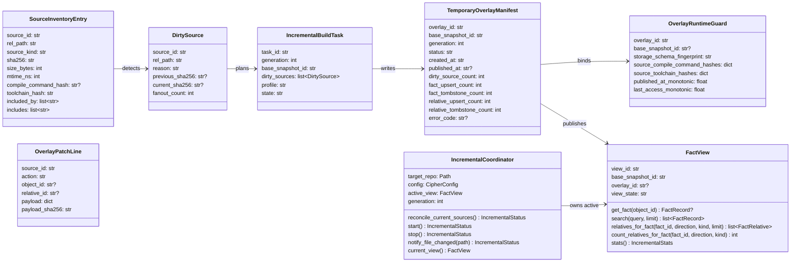
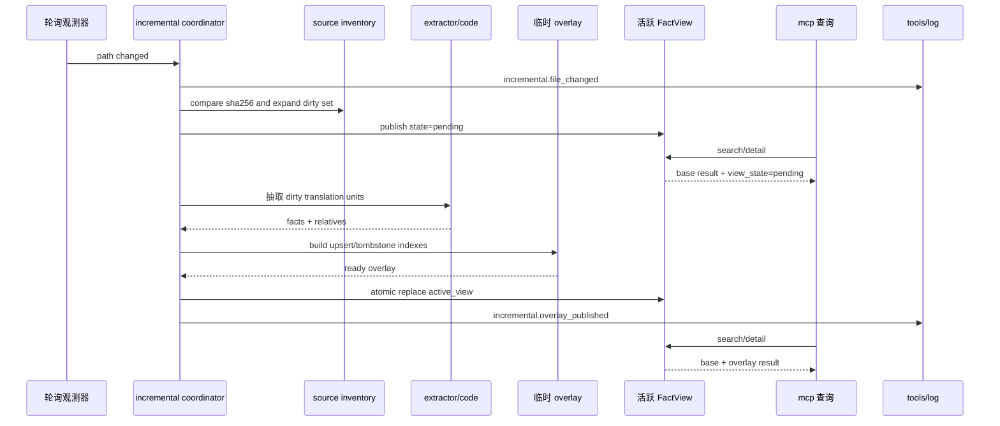
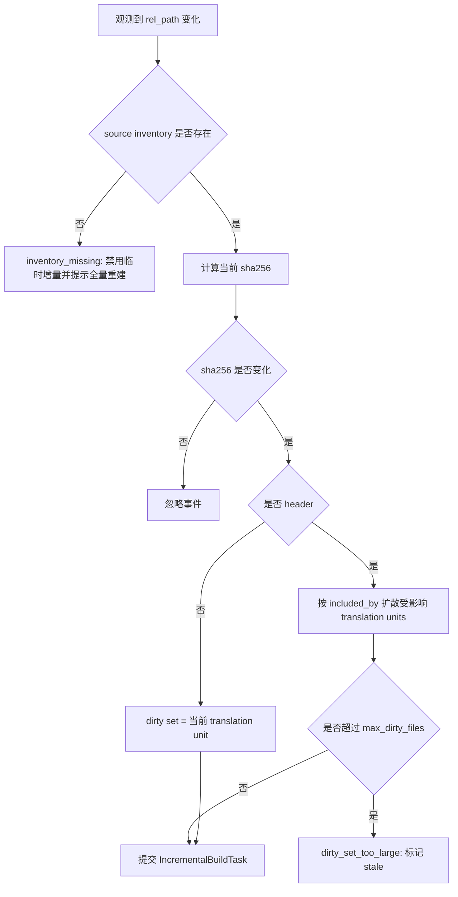
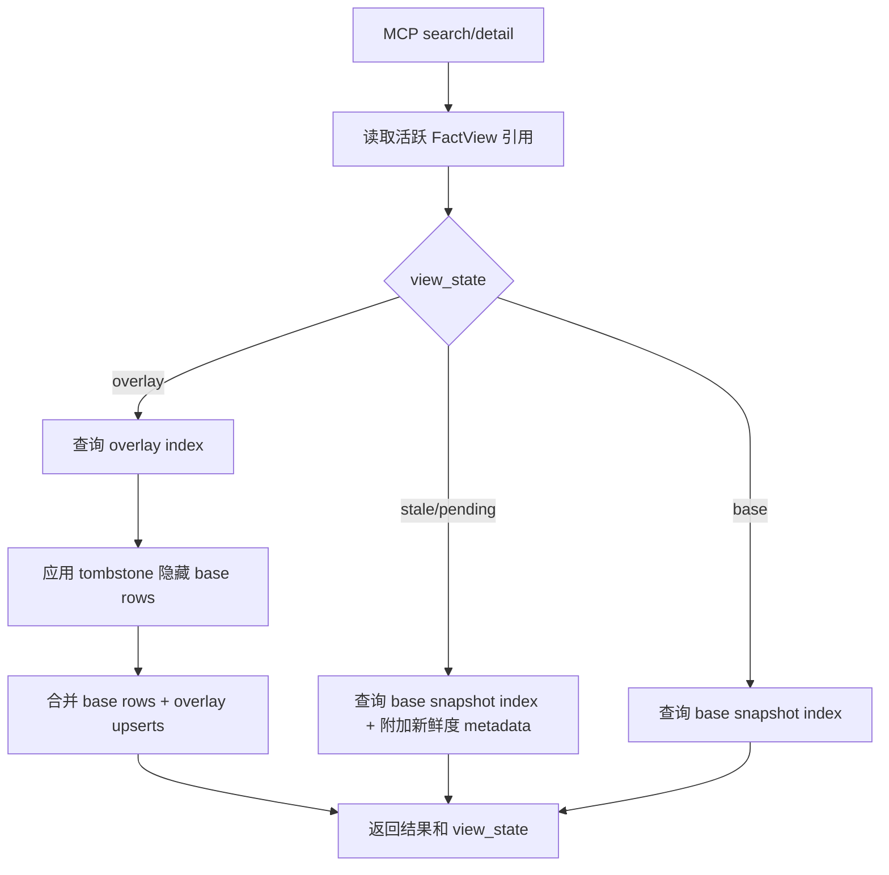
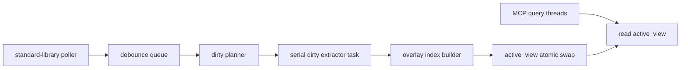

# incremental

## 路径职责

本包负责在线临时增量：观测目标仓库源码变化，规划 dirty sources，后台调用 Clang 抽取变更 translation unit，构建临时 overlay，并把查询读视图切换为 `base snapshot + overlay`。

离线永久更新不在本包实现持久 delta 合并。离线路径统一由 `cipher2 rebuild` 触发全量重建，写入新的完整 snapshot 后原子切换 `snapshots/current`。

## 应放入这里的内容

- 标准库轮询 source inventory 的变更观测。
- MCP 启动时的一次性 source inventory 对账，用 mtime/size 预筛和 sha256 确认已保存变更。
- dirty set 规划、header include fanout 扩散和 dirty 上限保护。
- 后台增量抽取任务协调。
- 临时 overlay 生命周期。
- `FactView` active view 发布与失效。
- incremental channel 可观测事件。

## 不应放入这里的内容

- 持久 delta chain、compaction 或永久 tombstone 合并。
- 类型驱动 Clang AST 解析细节。
- storage snapshot 物理 schema 读写细节。
- MCP text 渲染、TUI 渲染或 raw JSONL formatter。
- 第三方文件 watcher、HTTP daemon 或上层投影 runtime。

## 用户可配配置项

本包消费 `.cipher/config.yml` 的 `incremental.*` 配置。配置只影响在线临时增量；离线永久更新始终是全量重建。

| 配置项 | type | 取值范围 | 默认值 | 作用 | 生效时机 | 非法值处理 |
|---|---|---|---|---|---|---|
| `incremental.temporary_enabled` | `bool` | `true` 或 `false` | `true` | 控制 MCP 或显式 watch 场景是否启动在线临时增量 | 长驻服务启动时 | `ConfigError(code="invalid_config")` |
| `incremental.poll_interval_ms` | `int` | `100..5000` | `500` | 标准库轮询 source inventory 的间隔 | 观测器启动时 | `ConfigError(code="invalid_config")` |
| `incremental.debounce_ms` | `int` | `50..1000` | `100` | 文件保存事件合并窗口 | 文件变化进入 dirty queue 前 | `ConfigError(code="invalid_config")` |
| `incremental.worker_count` | `int` | `1..8` | `1` | v1 保留兼容字段；记录配置值但不改变增量抽取并行度，active worker 固定为 `1` | `IncrementalCoordinator.start()` 事件上报时 | `ConfigError(code="invalid_config")` |
| `incremental.overlay_ttl_seconds` | `int` | `10..3600` | `600` | 临时 overlay 空闲保留时间 | overlay 发布与清理时 | `ConfigError(code="invalid_config")` |
| `incremental.max_dirty_files` | `int` | `1..10000` | `500` | 单轮临时增量允许的 dirty source 上限 | dirty set 规划完成后 | `IncrementalError(code="dirty_set_too_large")` |

## 运行时约束

- 临时增量由保存后的源码内容 hash 变化触发，不要求用户执行 `make`、`ninja` 或真实编译。MCP server 启动时必须先对 source inventory 与活树做一次同步对账；若文件 mtime/size 显示可能晚于 base snapshot，再用当前 sha256 确认 dirty source，并在首个查询前发布临时 overlay。
- 首版只使用 Python 标准库轮询 source inventory；`notify_file_changed()` 仅作为测试和未来宿主集成入口。增量抽取在 v1 中是单任务串行协调，不实现独立 worker pool；真实增量 worker pool 需要另开设计覆盖进程隔离、取消、背压和性能门禁。
- 临时增量必须使用当前有效的 compile database、类型驱动 Clang AST capability probe 结果和 extractor/code 规则；当前 AST-only 路径不要求 GCC 存在。不得启用 lightweight parser、模式匹配 mapper 或静默降级。dirty 文件 AST 失败时按文件级 warning 处理，不发布该文件的临时 overlay facts。
- 临时 overlay 只写 `<target-repo>/.cipher/run/incremental/`，不得写入 `snapshots/`，不得移动 `snapshots/current`。
- 查询线程不得等待 Clang 抽取。overlay 未完成时返回 base 结果，并暴露 `view_state="stale"` 或 `view_state="pending"`。
- overlay 发布后，查询读取 `base snapshot + overlay`；overlay upsert 优先，overlay tombstone 隐藏 base 中同一 `source_id` 的 facts、由同一 `source_id` 产生的 relatives，以及端点已经不可见的 relatives。否则稳定 `object_id` 的 dirty 函数会把被删除的 base call edge 带回查询结果。
- overlay 发布后记录 `published_at_monotonic` 和 `last_access_monotonic`。`current_view()` 只做不会触发 extractor/storage 重扫描的轻量检查：空闲 TTL、当前 `snapshots/current` 指针和已缓存的启动 toolchain 指纹；超过 `incremental.overlay_ttl_seconds` 时丢弃 overlay，查询回到 base，并写 `incremental.overlay_dropped(status="warning", reason="ttl_expired")`。`notify_file_changed()`、`reconcile_current_sources()` 和轮询扫描入口会执行完整 runtime guard 校验。
- C 源文件变更优先只重抽对应 translation unit。header 变更必须通过 include relation 或 source inventory 反向扩大 dirty set；无法确定影响范围时标记 stale，并提示离线全量重建。
- 新增源文件若没有 compile command，不得猜测命令行；必须报 `compile_command_missing` 并保持 base 结果可查。
- dirty reason 必须只使用真实构造路径：`content_changed`、`included_header_changed`、`missing`、`compile_command_changed`、`toolchain_changed`。文件缺失时发布 pending 后构建 tombstone-only overlay；compile command fingerprint 变化时重抽对应 source；toolchain fingerprint 变化时发布 `view_state="stale"` 并提示执行 `cipher2 rebuild`，不自动做全仓临时 overlay。
- 语法错误、缺失 header、Clang fatal diagnostic 或 overlay 校验失败时，不发布半成品 overlay。
- base snapshot、storage/read-index schema、dirty source compile command 或 dirty source toolchain 变化时，当前 overlay 必须失效。base snapshot 变化通过查询热路径上的 `snapshots/current` 指针立即发现；schema、compile command 和 source inventory 校验在启动对账、显式 notify 和轮询扫描中执行，避免查询热路径运行 extractor 或重扫 inventory。`IncrementalCoordinator.config` 和 toolchain fingerprint 是长驻 stdio server 启动时快照，运行期不热加载配置，因此不实现 config-change guard。

时延目标：

| 阶段 | 指标 |
|---|---|
| 文件变化被轮询观测到后查询暴露 stale/pending | p95 < 100ms |
| facts/relatives 已准备好后的 overlay 发布 | p95 < 10ms |
| overlay 发布后的首次查询可见 | p95 < 20ms |
| 单个可解析 C translation unit 从观测到发布 | p95 <= 2s |
| 小范围 header fanout 从观测到分批可见 | p95 <= 5s |

大型 header 扇出、巨型 translation unit、生成头文件缺失和语法错误不承诺固定秒级，但必须持续可观测。

## 数据结构



### `SourceInventoryEntry` 成员表

| 成员名称 | type | 作用 | 并发粒度 |
|---|---|---|---|
| `source_id` | `str` | 源文件稳定 ID，基于仓库相对路径和 profile 构造 | source 级、只读共享 |
| `rel_path` | `str` | 仓库相对路径，不含绝对路径 | source 级、只读共享 |
| `source_kind` | `str` | `c_source`、`header` 或 `other` | source 级、只读共享 |
| `sha256` | `str` | snapshot 生成时的文件内容 hash | source 级、只读共享 |
| `size_bytes` | `int` | snapshot 生成时文件大小 | source 级、只读共享 |
| `mtime_ns` | `int` | snapshot 生成时 mtime，用于快速预筛 | source 级、只读共享 |
| `compile_command_hash` | `str or None` | 归一化 compile command 摘要；header 可为空 | source 级、只读共享 |
| `toolchain_hash` | `str` | Clang capability、GCC 配置输入和 config 组合摘要 | snapshot 级 |
| `included_by` | `list[str]` | 反向 include source_id 列表 | source 级、只读共享 |
| `includes` | `list[str]` | 正向 include source_id 列表 | source 级、只读共享 |

### `TemporaryOverlayManifest` 成员表

| 成员名称 | type | 作用 | 并发粒度 |
|---|---|---|---|
| `overlay_id` | `str` | 临时 overlay 唯一 ID，不进入 snapshot id | overlay 级 |
| `base_snapshot_id` | `str` | overlay 依赖的基础 snapshot | overlay 级、只读共享 |
| `generation` | `int` | 单进程递增代数，用于丢弃过期任务 | 进程级 |
| `status` | `Literal["building","ready","published","failed","dropped"]` | overlay 生命周期状态 | overlay 级 |
| `created_at` | `str` | UTC 创建时间 | overlay 级 |
| `published_at` | `str or None` | 发布到 active view 的时间 | overlay 级 |
| `dirty_source_count` | `int` | 本次覆盖的 dirty source 数 | overlay 级 |
| `fact_upsert_count` | `int` | 新增或替换 fact 数 | overlay 级 |
| `fact_tombstone_count` | `int` | 隐藏 base fact 数 | overlay 级 |
| `relative_upsert_count` | `int` | 新增或替换 relative 数 | overlay 级 |
| `relative_tombstone_count` | `int` | 隐藏 base relative 数 | overlay 级 |
| `error_code` | `str or None` | 失败原因 | overlay 级 |

### `OverlayRuntimeGuard` 成员表

| 成员名称 | type | 作用 | 并发粒度 |
|---|---|---|---|
| `overlay_id` | `str` | guard 绑定的 overlay ID | overlay 级 |
| `base_snapshot_id` | `str or None` | 发布时依赖的 base snapshot | overlay 级 |
| `storage_schema_fingerprint` | `str` | snapshot format、compression、read index state/schema/codec 摘要 | overlay 级 |
| `source_compile_command_hashes` | `dict[str,str or None]` | dirty source 发布时的 compile command 摘要 | source 级 |
| `source_toolchain_hashes` | `dict[str,str]` | dirty source 发布时的 toolchain 摘要 | source 级 |
| `published_at_monotonic` | `float` | overlay 发布单调时间，用于观测 | overlay 级 |
| `last_access_monotonic` | `float` | 最近一次通过 guard 的查询单调时间，用于空闲 TTL | overlay 级 |

### `OverlayPatchLine` 成员表

| 成员名称 | type | 作用 | 并发粒度 |
|---|---|---|---|
| `source_id` | `str` | patch 所属源文件 | line 级 |
| `action` | `Literal["upsert_fact","delete_fact","upsert_relative","delete_relative"]` | patch 动作 | line 级 |
| `object_id` | `str or None` | fact upsert/delete 的对象 ID | line 级 |
| `relative_id` | `str or None` | relative upsert/delete 的关系 ID | line 级 |
| `payload` | `dict[str, JSONValue]` | upsert 完整对象或 delete tombstone 说明 | line 级、只读共享 |
| `payload_sha256` | `str` | canonical payload 摘要 | line 级 |

### `DirtySource` 成员表

| 成员名称 | type | 作用 | 并发粒度 |
|---|---|---|---|
| `source_id` | `str` | dirty 源文件 ID | source 级 |
| `rel_path` | `str` | 仓库相对路径 | source 级 |
| `reason` | `Literal["content_changed","included_header_changed","missing","compile_command_changed","toolchain_changed"]` | dirty 原因 | source 级 |
| `previous_sha256` | `str or None` | base inventory 中的 hash | source 级 |
| `current_sha256` | `str or None` | 当前文件 hash；文件缺失时为空 | source 级 |
| `fanout_count` | `int` | header 影响扩散数量 | dirty 规划级 |

### `FactView` 成员表

| 成员名称 | type | 作用 | 并发粒度 |
|---|---|---|---|
| `view_id` | `str` | 查询视图 ID，base-only 或 base+overlay | view 级、只读共享 |
| `base_snapshot_id` | `str` | 基础 snapshot ID | snapshot 级、只读共享 |
| `overlay_id` | `str or None` | 当前生效 overlay ID | overlay 级、只读共享 |
| `view_state` | `Literal["base","stale","pending","overlay","error"]` | 查询数据新鲜度状态 | view 级 |
| `get_fact` | `callable` | 按 object_id 获取 fact，应用 tombstone | view 级、只读共享 |
| `search` | `callable` | 搜索 merged view，不在查询时解析 JSONL | view 级、只读共享 |
| `relatives_for_fact` | `callable` | 查询 merged relation，不返回 tombstone 隐藏边 | view 级、只读共享 |
| `count_relatives_for_fact` | `callable` | 统计 merged relation 总数，不受预览 limit 限制 | view 级、只读共享 |
| `stats` | `callable` | 返回 merged view 统计和 incremental 状态 | view 级、只读共享 |
| `_overlay_relatives_cache` | `list[FactRelative] or None` | active overlay 视图内惰性缓存可见 relatives；`active_view` 替换时自然失效，同一 view 上并发首次查询至多重复计算一次且结果一致 | view 实例级 |

### `IncrementalCoordinator` 成员表

| 成员名称 | type | 作用 | 并发粒度 |
|---|---|---|---|
| `target_repo` | `Path` | 目标仓库根目录 | 只读共享 |
| `config` | `CipherConfig` | 启动时配置快照 | 配置快照级 |
| `active_view` | `FactView` | 当前查询视图，发布时原子替换引用 | 进程级、读多写少 |
| `_overlay_guard` | `OverlayRuntimeGuard or None` | active overlay 的 fail-closed 指纹与 TTL 状态；base/stale/pending view 不绑定 guard | overlay 级 |
| `generation` | `int` | 文件变更代数，取消过期任务 | 进程级 |
| `reconcile_current_sources` | `callable` | MCP 启动时对现有 source inventory 做一次 mtime/size/hash 对账并同步发布 overlay | coordinator 对象级 |
| `start` | `callable` | 启动标准库轮询器并上报 configured/active worker 兼容计数 | coordinator 对象级 |
| `stop` | `callable` | 停止轮询器并清理 overlay | coordinator 对象级 |
| `notify_file_changed` | `callable` | 测试或未来宿主注入文件变化 | source 级 |
| `current_view` | `callable` | 返回当前 active view | 进程级、无阻塞读取 |

## 对外接口流程



dirty set 规划：



查询合并：



## 并发控制



- 查询只读取 `active_view` 引用，不持有 extractor 或 storage 写锁。
- `current_view()` 返回 active view 前只做轻量 guard：TTL、当前 `snapshots/current` 指针和 cached toolchain fingerprint 比较；不得打开 source inventory、解析 compile database 或运行 Clang/libclang probe。
- `reconcile_current_sources()`、`notify_file_changed()` 和轮询扫描入口执行完整 runtime guard：storage/read-index schema、dirty source compile command hash 和 source inventory toolchain hash 任一不匹配都先以 warning 丢弃 overlay，再继续规划或返回 base view。
- `active_view` 发布采用单赋值引用替换；旧 view 等正在运行的查询自然释放。
- 同一 `source_id` 的新变更会提高 `generation`；低 generation 任务完成后不得发布。
- overlay builder 必须先完成 facts、relatives、tombstone 和 endpoint 校验，再进入 ready。
- 临时 overlay 不持有 `storage.lock`，因为它不修改 `snapshots/current`。
- 离线全量重建沿用 storage 写锁；发布前若存在 active overlay，必须让 incremental coordinator 失效旧 overlay。
- log 写入失败不得阻塞增量发布；必须在 views 中呈现 log 降级。

## 可观测性与呈现

incremental 事件写入 `.cipher/log/incremental.jsonl`：

| 事件名 | status | 关键 counts | 关键 payload |
|---|---|---|---|
| `incremental.poll_started` | `ok` | `worker_count`、`configured_worker_count`、`active_worker_count` | `base_snapshot_id`、`poll_interval_ms`、`debounce_ms` |
| `incremental.file_changed` | `ok` | `changed_file_count` | `source_id`、`rel_path` |
| `incremental.dirty_planned` | `ok` / `warning` | `dirty_source_count`、`fanout_count` | `reason`、`base_snapshot_id` |
| `incremental.extract_started` | `ok` | `dirty_source_count` | `task_id`、`generation` |
| `incremental.extract_failed` | `error` | `dirty_source_count` | `error_code`、`task_id` |
| `incremental.overlay_built` | `ok` | `fact_upsert_count`、`relative_upsert_count`、`tombstone_count` | `overlay_id` |
| `incremental.overlay_published` | `ok` | `overlay_fact_count`、`overlay_relative_count` | `publish_latency_ms`、`view_id`、`guard_fingerprint` |
| `incremental.overlay_dropped` | `ok` / `warning` | `dropped_overlay_count` | `reason`；`ttl_expired`、`base_snapshot_changed`、`storage_schema_changed`、`compile_command_changed`、`toolchain_changed` 使用 `warning`，`stop`、`reverted_to_base` 使用 `ok` |
| `incremental.rebuild_published` | `ok` | `fact_count`、`relative_count`、`source_count` | `snapshot_id` |

`tools/views` 必须提供 `IncrementalViewModel`，展示 state、base snapshot、active overlay、dirty source、pending task、stale source、failed task、overlay fact/relative 数和最近发布耗时。用户不需要阅读 raw `incremental.jsonl`。

## 测试与门禁

测试文件：

- `tests/test_config_incremental.py`
- `tests/test_storage_source_inventory.py`
- `tests/test_incremental_overlay_view.py`
- `tests/test_incremental_mcp_view_state.py`
- `tests/test_incremental_observability.py`
- `tests/test_cli_rebuild_command.py`

功能点覆盖率必须达到 100%，覆盖保存触发、dirty set、C 文件重抽、header fanout、overlay publish、tombstone、query merge、stale/pending base view、TTL drop、runtime guard invalidation 和 offline full rebuild。异常分支覆盖率不得低于 90%，覆盖缺失 inventory、compile command 缺失/变化、toolchain 变化、dirty set 过大、Clang 失败、语法错误、header 缺失、overlay endpoint orphan、path escape、log 降级、base snapshot 变化和 storage/read-index schema 变化。

显式性能门禁：

```bash
PYTHONPATH=src python3 scripts/incremental_performance_gate.py
```

脚本覆盖：

- 小：1,000 base facts、1,000 relatives、1 个 dirty source，512MB 预算，模块峰值 <= 64MB，publish p95 < 10ms，first query p95 < 20ms。
- 中：100,000 base facts、100,000 relatives、100 dirty sources，4GB 预算，模块峰值 <= 256MB，publish p95 < 20ms，first query p95 < 50ms。
- 大：1,000,000 base facts、1,000,000 relatives、10,000 dirty sources，8GB 预算，模块峰值 <= 1GB，分批发布，无全量额外复制。
- hot path：配置 fake toolchain、生产路径 `_extractor=None`、active overlay 下重复 `current_view().search()`，toolchain probe 只允许在 publish/cache 阶段发生一次，query p95 < 20ms。

Clang 端到端探针不作为 overlay 发布门禁：

```bash
PYTHONPATH=src python3 scripts/incremental_clang_latency_probe.py
```

探针只记录单 TU、header fanout 和失败 fallback 耗时；正式性能门禁只断言 cipher 自身 overlay 构建、发布和查询体现。
