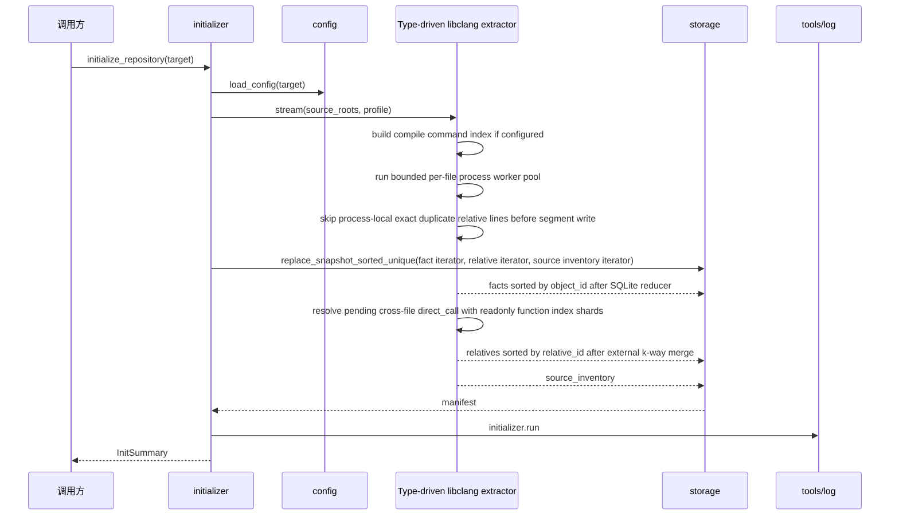
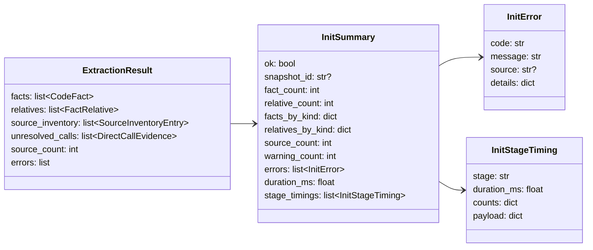

# initializer

## 路径职责

本包负责仓库初始化和离线全量重建。它读取 config，调用类型驱动 libclang AST extractor，使用有界 per-file process worker pool 收集 `TheFact`、`FactRelative` 与 source inventory，并通过 worker-local exact relative dedup、SQLite-backed facts reducer、SQLite pending direct-call staging 和 relatives external k-way merge 按 id 去重、排序和并行补齐跨文件 `direct_call` 后，把 sorted-unique 输入写入 storage snapshot。

initializer 不解析 argv、不渲染 stdout/stderr、不执行用户构建命令、不写 Graph projection。`cipher2 init` 的 setup UX 由 CLI 层负责：自动发现 compile database 路径、写 repo-root `.mcp.json` 和渲染 setup summary；initializer 只消费最终 config 并写 snapshot。

## 模块边界

- `initializer`：编排 config、extractor、storage 和 log。
- `initializer/extractor/code`：C 语言 facts/relatives/source inventory 抽取。
- `storage`：snapshot 写入和原子发布。
- `tools/log`：initializer 和 extractor 可观测事件。

已删除旧边界：`initializer/inference` 不再参与 runtime；用户 YAML rules、GraphPatch 和 `.cipher/inference/` 都不是主线能力。

## 用户可配配置项

initializer 不新增专属持久配置项，只消费 config 中的 compile database、toolchain 输入、libclang last-resort 路径、Clang args、全量抽取 worker 和 incremental 配置。

| 参数/配置 | type | 取值范围 | 默认值 | 作用 | 非法值处理 |
|---|---|---|---|---|---|
| `paths.compile_database` | `str or null` | 继承 config README | `null` | Clang compile database 输入；code extractor 用它建立 per-file flags 索引 | 路径错误透传 `ConfigError`，内容错误为 `InitError(malformed_compile_database)` |
| `extractor.worker_count` | `int or null` | `null`/省略 auto；显式 `1..32` | `null` | 全量 init/rebuild per-file Clang 抽取 worker 数；auto 为 CPU 数上限 32；实际 worker 数仍受 source 数限制；`1` 使用单 worker 子进程并保持串行调度语义 | `ConfigError(invalid_config)` |
| `extractor.code.clang_executable` | `str or null` | 继承 config README；运行期必须通过类型驱动 libclang AST capability probe | `null` | 指定 Clang executable | `InitError(clang_unavailable/clang_capability_failed/libclang_unavailable/libclang_version_mismatch)` |
| `extractor.code.libclang_library` | `str or null` | 继承 config README；只在自动定位 libclang 失败后读取 | `null` | last-resort libclang 动态库路径 | `ConfigError(libclang_unavailable/path_escape/invalid_config)`；运行期可能返回 `InitError(libclang_version_mismatch)` |
| `extractor.code.gcc_executable` | `str or null` | 继承 config README；当前 AST-only 路径不要求存在 | `null` | 保留 GCC 输入 | 透传 `ConfigError(gcc_unavailable/path_escape)` |
| `extractor.code.clang_args` | `list[str]` | 继承 config README | `[]` | capability probe 参数；libclang parse 中放在 per-file flags 之前 | `ConfigError(invalid_config)` |
| `source_roots` | `list[str or Path] or None` | 目标仓库内路径 | `None` | 限定抽取范围 | `InitError(path_escape/invalid_source_root)` |
| `profile` | `str or None` | 非空字符串 | `default` | 写入 `object_profile` | `InitError(invalid_profile)` |
| `log_enabled` | `bool or None` | `True`/`False`/`None` | `True` | 控制 log 写入 | `InitError(invalid_log_enabled)` |

## 运行流程

## 数据结构

### `InitSummary` 成员表

| 成员名称 | type | 作用 | 并发粒度 |
|---|---|---|---|
| `ok` | `bool` | 初始化是否成功 | 响应实例级 |
| `snapshot_id` | `str or None` | 写入 snapshot | 响应实例级 |
| `fact_count` | `int` | FACT 总数 | 响应实例级 |
| `relative_count` | `int` | FactRelative 总数 | 响应实例级 |
| `facts_by_kind` | `dict[str,int]` | fact kind 分布 | 响应实例级 |
| `relatives_by_kind` | `dict[str,int]` | relation kind 分布 | 响应实例级 |
| `source_count` | `int` | source inventory 数量 | 响应实例级 |
| `warning_count` | `int` | 文件级可恢复警告数 | 响应实例级 |
| `errors` | `list[InitError]` | 文件级 warning；阻断错误会直接抛出 | 响应实例级 |
| `duration_ms` | `float` | 初始化耗时 | 响应实例级 |
| `stage_timings` | `list[InitStageTiming]` | 最近一次 init/rebuild 在本次调用内记录的阶段耗时，顺序固定为 `collect`、`extract`、`reduce`、`resolve`、`relative_merge`、`snapshot_write`、`read_index` 中实际发生的阶段 | 响应实例级 |

### `InitStageTiming` 成员表

| 成员名称 | type | 作用 | 并发粒度 |
|---|---|---|---|
| `stage` | `str` | 阶段名，只允许固定阶段集合 | 阶段级 |
| `duration_ms` | `float` | 该阶段定义窗口的耗时毫秒 | 阶段级 |
| `counts` | `dict[str,int]` | 该阶段的稳定计数字段；非整数值会被丢弃 | 阶段级 |
| `payload` | `dict[str,JSONValue]` | 该阶段的有界标量上下文；不得包含源码正文、绝对 target path、traceback 或 secret | 阶段级 |

### `InitError` 成员表

| 成员名称 | type | 作用 | 并发粒度 |
|---|---|---|---|
| `code` | `str` | 稳定错误码 | 错误实例级 |
| `message` | `str` | 短说明 | 错误实例级 |
| `source` | `str or None` | 仓库相对源码路径 | 错误实例级 |
| `details` | `dict[str, JSONValue]` | 有界上下文；文件级 AST warning 至少包含 `diagnostic_kind`，partial/timeout 还包含 `reason`，timeout 额外包含 `timeout_seconds`；libclang partial 的 reason 使用 diagnostics severity 口径 | 错误实例级 |

## 初始化阶段耗时窗口

`initialize_repository()` 为每个实际发生的阶段记录 `InitStageTiming`，并在 log 启用时写入 `initializer` channel 的 `init.stage` 事件。阶段窗口定义如下：

| stage | `duration_ms` 窗口 | 主要 counts | 与其他阶段的关系 |
|---|---|---|---|
| `collect` | compile database index 构建和 source collection 的 wall-clock，从 `_iter_encoded_facts()` 开始到 source planned 事件发射前后 | `source_count`、`compile_database_configured_count` | 发生在 toolchain validation 和 worker pool 启动前 |
| `extract` | worker pool wall-clock，从 `collect` 结束后到所有 per-file worker outcome 已到达并被主进程处理完成 | `source_count`、`worker_count`、`successful_file_count`、`skipped_file_count`、`warning_count`、map output、worker timeout/restart/crash | worker outcome 到达后会立刻进入主进程 merge，因此该窗口包含与 `reduce` 交错执行的等待和 worker 运行时间 |
| `reduce` | 主进程 per-file outcome merge 累计耗时；每个 outcome 只计一次 `_merge_file_outcome`，粒度是文件 outcome，不是 fact/relative 行，也不是后续 iterator readback | `reduce_outcome_count`、`fact_count`、fact duplicate/reencode、relative map input/written/skipped | 与 `extract` 交错执行；该值只度量主进程消费 outcome 的累计 CPU/IO 窗口 |
| `resolve` | 跨文件 `direct_call` resolver wall-clock | pending/resolved/unresolved、resolver worker/shard、function index、duplicate skipped | facts reducer 完成后运行，resolved relative segment 会进入后续 `relative_merge` |
| `relative_merge` | storage 消费 encoded relative iterator 时触发的 external merge 或 fallback merge wall-clock | relative merge input/accepted/duplicate/conflict、segment/fan-in/pass/peak open 或 fallback input/accepted | 与 `snapshot_write` 的 relative 写入阶段交错，因为 storage 在写 snapshot 时拉取该 iterator |
| `snapshot_write` | storage staging preparation 的 wall-clock，覆盖 gzip line stream、hash/source inventory、manifest/stats 准备；阶段 counts 只报告 `compressed_data_bytes` 等数据体积，不重复报告 `bytes_written` | `fact_count`、`relative_count`、`source_count`、`uncompressed_bytes`、`compressed_data_bytes` | 会在消费 facts/relatives/source inventory 时拉动前面的 iterator；publish 仍在 staging 完整准备后原子发生 |
| `read_index` | persistent `read_index.sqlite` 构建 wall-clock | `read_index_bytes`、`read_index_build_ms` | 属于 storage staging 准备的一部分，完成后才发布 snapshot |

## 可观测性

- `init.stage`：记录 `stage`、`stage_duration_ms`、阶段 counts 和有界 payload；用于 `InitSummary.stage_timings`、`tools/log` 摘要、`tools/views` view model 和 CLI/status 渲染。
- `initializer.build_readiness`：CLI setup 或公开 API 的构建准备预检结果，记录 compile database 是否配置、Clang/GCC readiness 和缺失输入数量。
- `initializer.run`：snapshot、fact、relative、source 和 warning 摘要。
- `initializer.error`：稳定错误码。
- `extractor.code.file`：单文件 fact/relative/field_read/field_write、field coverage、包装/宏/位运算字段访问、函数指针 dispatch、header cache hit/miss/skipped/seed、`backend`、parse/traverse 耗时和 partial AST 摘要。
- `extractor.code.file` warning：单文件 `clang_ast_failed` 时记录 skipped 文件摘要；`clang_ast_partial` 时记录已接受部分 AST 的文件摘要。文件级 warning 同时进入 `InitSummary.errors`，CLI JSON 成功输出在存在 warning 时以 `warnings` 暴露相同的 source、code、message 和有界 details 清单。
- `extractor.code.compile_database`：compile database index 构建、重复 entry、仓外 entry 和参数清洗摘要。
- `extractor.code.worker_pool`：全量抽取 worker mode/count、成功/跳过、partial AST、最终 header cache entry、worker-local relative dedup input/written/skipped/tracked/saturated、worker timeout/restart/crash 和 warning 摘要；`worker_count=1` 时 mode 为 `serial` 但仍使用可 kill/restart 的单 worker 子进程，大于 1 时为 `bounded_pool`。
- `extractor.code.relative_merge`：file/resolved relative sorted segment 的 external k-way merge 输入行数、接受行数、exact duplicate、conflict、segment bytes、sidecar bytes、耗时、heap size、fan-in、pass count、peak open segment count 和 full-parse 计数；主路径 `relative_merge_full_parse_count=0`，且 `relative_merge_peak_open_segment_count <= relative_merge_fan_in`。
- `extractor.code.direct_call_resolution`：跨文件 direct call 后处理的 pending、resolved、unresolved、ambiguous、linkage filtered 和 duplicate skipped 摘要。
- `extractor.code.toolchain`：类型驱动 libclang capability、backend、Clang/libclang vendor/version、library scope、版本匹配、GCC required/checked、缺失 evidence 和 warning 摘要。
- `extractor.code.error`：Clang AST 或 source 输入错误。

`extractor.code.file` counts 必须包含 typed member/call、source fallback、field owner、field coverage、包装/宏/位运算字段访问、函数指针 dispatch、header cache hit/miss/skipped/seed、compile command hit/miss/argument/stripped、unresolved call、worker-local relative dedup input/written/skipped 和 `partial_ast_count` 计数，供 `tools/views` 呈现。`extractor.code.worker_pool` counts 必须包含 `source_count`、`worker_count`、`successful_file_count`、`skipped_file_count`、`partial_ast_count`、`warning_count`、最终 `header_decl_cache_entry_count`、`relative_map_input_count`、`relative_map_written_count`、`relative_map_skipped_exact_count`、`relative_worker_duplicate_exact_count`、`relative_worker_duplicate_conflict_count`、`relative_worker_dedup_tracked_entry_count`、`relative_worker_dedup_saturated_count`、`worker_timeout_count`、`worker_restart_count` 和 `worker_crash_count`。field coverage 至少包含 `record_owner_count`、`anonymous_record_count`、`synthetic_type_fact_count`、`field_decl_count`、`field_fact_count`、`field_decl_without_fact_count`、`wrapped_member_expr_count`、`macro_wrapped_member_expr_count`、`bitwise_member_expr_count`、`compound_field_access_count`、`field_access_scan_truncated_count`、`field_access_resolved_count` 和 `field_access_unresolved_count`；函数指针 dispatch 至少包含 `function_pointer_slot_count`、`function_pointer_assignment_count`、`function_pointer_dispatch_count`、`macro_direct_call_count`、`unresolved_dispatch_slot_count` 和 `unresolved_dispatch_function_count`。header cache counts、worker-local exact relative dedup counts 和 worker restart counts 只用于性能/恢复诊断，不改变 views warning；非 exact relative conflict 仍按 `map_reduce_conflict` 阻断。配置 compile database 且存在 miss、存在 partial AST、字段访问扫描触发上限、dispatch unresolved，或 direct call resolution 出现 internal unresolved、ambiguous、linkage filtered 时，views 的 log section 必须进入 warning。

`initialize_repository()` 可接收可选 progress sink。该 sink 只用于 CLI stderr 进度展示，复用 source planned、toolchain、compile database 和 `extractor.code.file` 的同一发射点；它不新增持久日志 schema，不影响 `--no-log`，sink 写失败或抛错不得阻断初始化。

`initialize_repository` 使用 extractor 的 sorted-unique 结果驱动 storage 写入：facts 按 `object_id`、relatives 按 `relative_id`、source inventory 按 `source_id` 确定序转换为 snapshot 输入，不再把全仓 `CodeFact` 和二次 `FactRecord` list 同时驻留内存，也不让 storage 对已排序输入做二次 `_prepare_snapshot_staging` re-sort。worker facts/relatives segment 行使用 storage v5 `StoredFactLine` / `StoredRelativeLine` 的 canonical JSON shape；facts reducer SQLite 保存 id、排序、统计 scalar 和最终行文本，duplicate exact 直接按 bytes 丢弃，只有同 source_seq fact bytes 不同时才解析两条行做子集/超集 merge。relatives segment 写入前由当前 worker 进程用完整 `relative_id` 和 canonical line byte/hash 过滤本进程已写 exact duplicate，命中时不写 `relatives.jsonl` 或 sidecar；同 id 但 byte/hash 不同必须立即 `map_reduce_conflict`，details 只包含有界 id 字段。dedup 表只在单 run/profile 的 worker 进程内存活，不跨 worker、run 或 profile 共享；达到内部内存上限后进入 partial mode，继续过滤已追踪 id，未追踪 id 继续写段并交给 coordinator external merge 兜底。写出的 relatives 仍由 worker 按 `relative_id` 排序并写 sidecar，sidecar 保存 endpoint、relation kind、profile、condition 和 canonical line byte/hash；coordinator 不 full-parse relative payload、不把 relatives 重 spool 到 SQLite，而是在所有 file segment 与 resolved direct-call segment ready 后，用有界 fan-in 的 sidecar + raw canonical line stream 做多趟 k 路归并、exact duplicate 丢弃和 conflict fail-closed；每趟同时打开的 source segment 数不得超过 fan-in。initializer 主线把 accepted encoded line stream 交给 storage internal pre-encoded sorted-unique 写入路径，避免 segment 读回后重建 `CodeFact` / `FactRelative`、再构造 storage record、再序列化 snapshot 行。per-file Clang 抽取允许最多 `extractor.worker_count` 个文件窗口并行运行；worker 可以乱序完成，每个 source 只写自己独占的 `.cipher/run/initializer-mapreduce/<run_id>/map/<source_seq>/` facts/relatives/pending 段，coordinator 对完成 outcome 立即流式读 facts/pending 并登记 sorted relative segment，避免等待更早 source 的 outcome 形成回压；启动时只 GC `initializer-mapreduce` 下失去 live lock 且超过 TTL 的旧 run，不触碰 `.cipher/run/incremental/`。`worker_count > 1` 时每个长期 worker 进程独立维护仓内共享头声明 cache 和 relative dedup 表，成功处理非 partial 文件后只发布 header cache 到本进程后续任务；跨进程不共享 cache、dedup 表或锁。pending direct-call evidence 进入临时 SQLite staging；跨文件 `direct_call` resolver 保留只读函数 fact 索引并按 SQLite pending shard 并行处理，resolver worker 写独占 sorted resolved-relative segment 后进入同一个 external merge，不保留全量 pending 或非函数 facts。`collect()` 仍保留为兼容的列表物化 API；初始化主线不得通过 `collect()` 写 snapshot。

## 测试门禁

- 空仓库、单文件、多文件、headers、source roots、profiles。
- Clang 缺失、libclang 自动定位失败、last-resort 显式库路径、Clang/libclang 版本不匹配、类型驱动 capability failed、文件级目标 AST failed/partial warning；GCC 当前为可选配置，仅显式无效路径失败。
- compile database `arguments`/`command`、相对 `directory/file`、重复 entry、仓外 entry、allowlist 参数清洗、hit/miss fallback、`malformed_compile_database` 阻断。
- object_id/source 稳定性、field `object_name` 去 type 前缀、匿名 `struct/union` field fact materialize、宏/位运算/包装表达式中的 field_read/field_write relation、宏 direct_call 和函数指针 assigned_to/dispatches_via relation 进入 summary 和 storage。
- 跨文件 direct_call 后处理：exact source、唯一同名 fallback、linkage-aware fallback、condition 传递、dedupe、external/internal unresolved、ambiguous 和 missing caller。
- 并行护栏：`extractor.worker_count=1` 使用单 worker 子进程并保持串行调度语义；多个 worker 进程乱序完成时 facts/relatives/source inventory/snapshot id 按 id 确定序稳定；单文件可恢复错误、timeout 或 worker crash 不取消其他 worker。
- 头声明缓存和 worker relative dedup 护栏：PG-like 仓内共享头压力工况中 process-local cache-on/cache-off 与 worker relative dedup 的 facts、relatives、source inventory 和 snapshot id 等价；cache hit/miss/skipped/seed、relative map input/written/skipped/tracked/saturated 进入 log/views；不同 compile context 不共享 header cache；partial AST 不发布 header cache。
- log/views 展示 type-driven capability、backend、libclang version/library scope、`missing_evidence`、source fallback、field coverage、包装/宏/位运算字段访问、函数指针 dispatch、compile database、worker pool、worker-local relative dedup、parse/traverse 耗时、unresolved call、partial AST、direct call resolution、relative external merge 和 fact/relative line byte passthrough 统计。
- storage 写入失败和 log 写失败容错。
- `scripts/initializer_performance_gate.py` 和 `scripts/storage_relative_performance_gate.py`；涉及 direct call resolver 时，大档性能门禁必须包含高 pending 调用密度工况。
- 初始化主线必须覆盖不调用 `collect()` 的 streaming write 路径，确保峰值内存随 `min(worker_count, source_count) * 单文件窗口`、函数索引、pending/staging 批量和有界 fan-in 的 relative merge heap 增长，而不是随全仓 facts/relatives 线性增长；relative merge 主路径必须证明 `relative_merge_full_parse_count=0`，且 `relative_merge_peak_open_segment_count <= relative_merge_fan_in`。
