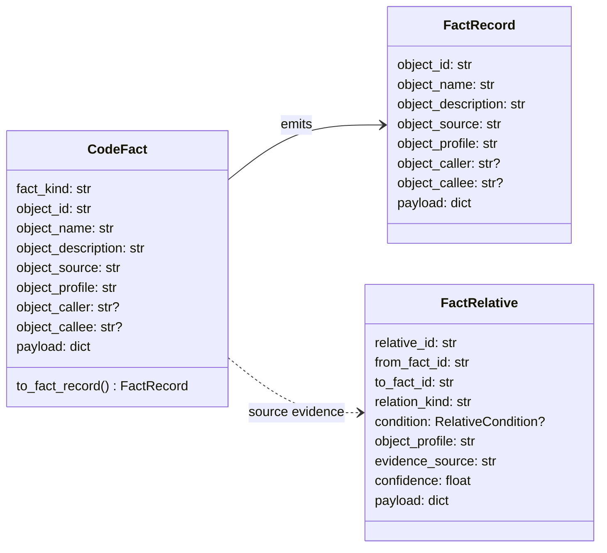
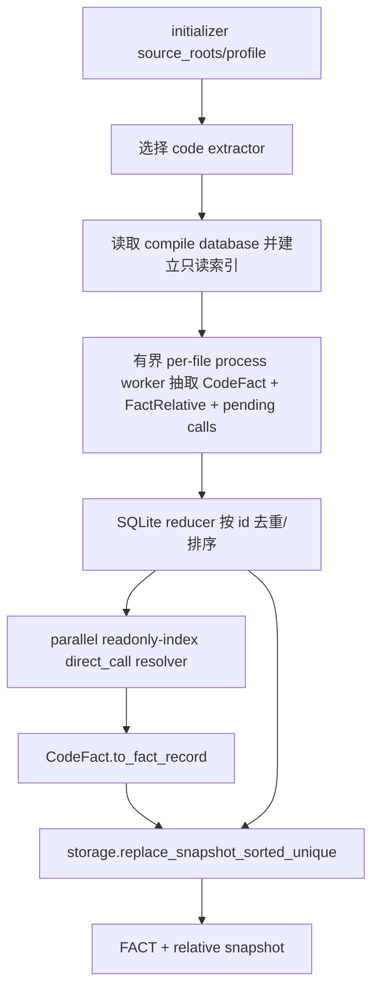

# initializer/extractor

## 路径职责

本包是所有事实抽取器的共同归属。v1 只运行 `code/` 抽取器；`doc/` 和 `git/` 是未来占位。

## 应放入这里的内容

- 面向具体来源的事实抽取模块。
- 共享抽取器接口和 fact/relative emission 契约。
- code、document 和 git 事实抽取器包。
- 从来源事实到 `storage.FactRecord` 的归一化边界。

## 不应放入这里的内容

- Graph projection 或 Inference 运行时。
- `GRAPH_RELATIVE` 或 `GRAPH_DERIVED_FROM` 运行时对象。
- storage adapter 实现。
- MCP 工具或 TUI 渲染。

## 用户可配配置项

本包不新增抽取器共享持久配置项。code 抽取器消费 config 中的 compile database、全量抽取 worker、Clang/libclang 输入、GCC toolchain 输入、全局 `clang_args` 和类型驱动 libclang capability 结果。

| 参数/配置 | type | 取值范围 | 默认值 | 作用 | 生效时机 | 非法值处理 |
|---|---|---|---|---|---|---|
| `paths.compile_database` | `str or null` | 继承 config README | `null` | code extractor 只读输入；用于建立 source -> sanitized per-file flags 索引 | initializer 加载配置时 | 路径错误透传 `ConfigError`，内容错误为 `malformed_compile_database` |
| `extractor.worker_count` | `int or null` | `null`/省略 auto；显式 `1..32` | `null` | 全量 init/rebuild per-file Clang 抽取 worker 数；auto 为 CPU 数上限 32；实际 worker 数仍受 source 数限制；`1` 为单 worker 串行调度且 target AST 仍在可 kill/restart 子进程内执行 | stream 启动后、source 枚举完成时 | `invalid_config` |
| `extractor.code.clang_executable` | `str or null` | 继承 config README，运行期必须通过类型驱动 libclang AST capability probe | `null` | code extractor Clang 命令或路径 | code extractor 初始化时 | `clang_unavailable`、`clang_capability_failed`、`libclang_unavailable`、`libclang_version_mismatch` |
| `extractor.code.libclang_library` | `str or null` | 继承 config README；自动定位 libclang 失败后才读取 | `null` | last-resort libclang 动态库路径 | 自动定位失败时 | `libclang_unavailable`、`libclang_version_mismatch` |
| `extractor.code.gcc_executable` | `str or null` | 继承 config README，当前 AST-only 路径不要求存在 | `null` | 未来 GCC-backed 预处理路径保留输入 | config 加载时 | `gcc_unavailable/path_escape` |
| `extractor.code.clang_args` | `list[str]` | 继承 config README | `[]` | capability probe 参数；libclang parse 中放在 per-file flags 之前 | libclang parse 构建时 | `invalid_config` |
| `source_roots` | `list[str or Path] or None` | 目标仓库内路径 | `None` | 限定抽取范围 | 单次抽取调用 | `path_escape` 或 `invalid_source_root` |
| `profile` | `str or None` | 非空字符串 | `"default"` | 写入 `object_profile` | 单次初始化调用 | `invalid_profile` |

## 共享 FACT/Relative Contract

### FACT 字段约束

| 字段 | type | 作用 | 并发粒度 |
|---|---|---|---|
| `object_id` | `str` | 唯一事实标识；C function/type/field 必须包含足够区分同名符号的 source 或 owner identity | fact 级 |
| `object_name` | `str` | 事实展示名；C field 只保存字段名，不包含 type 前缀 | fact 级 |
| `object_description` | `str` | 事实摘要或 payload 摘要 | fact 级 |
| `object_source` | `str` | 可追溯来源位置；C extractor 优先使用仓库内 AST `loc.file` / `range.begin.file` | fact 级 |
| `object_profile` | `str` | 构建或 profile 作用域 | fact 级 |
| `object_caller` | `str or None` | 可选直接上游对象 | fact 级 |
| `object_callee` | `str or None` | 可选直接下游对象 | fact 级 |
| `payload` | `dict[str, JSONValue]` | 来源专用补充字段，不得包含源码 dump | fact 级 |

## 对外接口流程

v1 不写 Graph 或 Inference 产物。未来 doc/git 抽取器也必须先产出 FACT/relative，并由 storage 与 MCP FACT view 消费。

## 模块边界

- `code/`：v1 C 代码 facts/relatives，运行时使用标准库 `ctypes` 薄封装 libclang C API 和类型驱动 capability probe，不引入 PyPI 运行时依赖；配置 compile database 时默认只把其 indexed repo source 作为独立 AST TU 抽取，并按 source 命中 sanitized per-file flags，为 libclang 把相对路径参数按 entry directory 归一为绝对路径，同时把这些 TU include 的仓内 headers 保留在 source inventory/include graph 中供增量 fanout 使用；全量 init/rebuild 使用有界 per-file process worker pool，完成 outcome 的 facts/pending 直接进入 SQLite-backed reducer，relatives 写段前在当前 worker 进程内 exact 去重后进入 external merge，并按 id 确定序输出，单次 collect 内用每个 worker 进程独立的仓内共享头声明 cache 和 relative dedup 表避免重复物化同进程已发布头子树及重复写出 exact relative；target AST timeout 基础 120 秒并按文件大小增长，文件级 AST failed/partial warning 必须携带有界原因；所有文件映射完成后用 Clang call reference evidence 和只读函数索引并行后处理跨文件 `direct_call`；当前 AST-only 路径不要求 GCC 参与，lightweight parser 不得在 C 场景启用。
- `doc/`：未来文档、Concept、CSV 和 diagram facts。
- `git/`：未来 commit、author 和 hunk facts。

## 并发控制

- 抽取器不共享可变全局状态。
- 单次 initializer 调用串行选择抽取器；C per-file Clang 抽取按 `extractor.worker_count` 运行在 worker 进程内，`1` 表示单 worker 串行调度，大于 1 时并行使用多个 worker 进程而不是线程。
- 抽取器只读源码和 compile database；code 抽取器只允许写 `.cipher/run/initializer-mapreduce/<run_id>/` 下的 run-local map/reducer 临时文件，不写 snapshot、log、read index 或 MCP 配置。compile command index 单次 collect 构建后只读。
- storage snapshot 锁由 storage 模块管理。
- libclang cursor AST 只在单文件窗口内流转，不序列化完整 TU JSON，不持久化 raw AST。
- 单文件 mapper 只共享不可变 capability/source 配置；facts、relatives 和 unresolved call evidence 不跨文件共享。仓内共享头声明 cache 只在同一 worker 进程内复用。
- initializer 主线使用 extractor 的 SQLite-backed facts reducer 和 relatives external merge 写 storage sorted-unique path，不持有全仓 facts/relatives list；并行完成结果不等待 source 序，snapshot 输入由 `object_id`、`relative_id` 和 `source_id` 排序保证确定性；`collect()` 仅作为兼容 API 物化结果。
- 跨文件 direct call resolver 在 fact reducer 完成后按 pending shard 并行运行，只读已有 function fact 索引和临时 staging 中的 pending evidence，不复制非函数 payload、不保留 AST、不重新读取源码。

## 可观测性与呈现

抽取器可观测事件写入 `initializer.jsonl`，不新建独立 log channel：

- `extractor.code.file`
- `extractor.code.compile_database`
- `extractor.code.worker_pool`
- `extractor.code.direct_call_resolution`
- `extractor.code.toolchain`
- `extractor.code.clang`
- `extractor.code.diagnostic`
- `extractor.code.error`

这些事件复用 `tools/views` log view 呈现，不新增 views section。
`extractor.code.toolchain` 必须呈现 backend、Clang/libclang version、library scope、version match、type-driven capability 和缺失 evidence；`extractor.code.compile_database` 必须呈现 entry、indexed、duplicate、ignored-outside-repo 和 stripped 计数；`extractor.code.worker_pool` 必须呈现 worker mode/count、成功/跳过、partial AST、最终 header cache entry、map output segment/bytes、stale run GC 和 warning 计数；`extractor.code.file` 必须呈现 backend、parse/traverse duration、typed call/member、source fallback、field owner、header cache hit/miss/skipped/seed、compile command hit/miss/argument、unresolved call 和 partial AST 计数；`extractor.code.direct_call_resolution` 必须呈现 pending、resolved、resolver worker/shard、function index、internal unresolved、ambiguous、linkage filtered 和 duplicate skipped 计数。

## 验证要求

每类抽取来源都应有来源专用 fixtures，并共享 FACT contract 测试。v1 initializer/code 实现必须覆盖：

- code fact 字段完整性和 `FactRecord` 转换。
- FACT/relative：不得创建 Graph、Inference、HTTP MCP 或其他上层产物。
- source path containment、compile database path/content 边界、compile database authoritative AST source set、仓内 included header source inventory fanout、per-file flags allowlist 清洗、libclang path 参数归一、compile command hit 和防御性 miss 观测、类型驱动 libclang capability fail-closed、libclang 自动定位/last-resort 路径/版本匹配、`extractor.worker_count=1` 单 worker 串行调度、乱序完成后按 id 确定序输出、仓内共享头 cache parity、单文件错误/timeout/worker crash 隔离、field 命名/owner、object_id/source 稳定性、跨文件 direct_call 并行后处理、文件级 AST failed/partial best-effort warning、GCC optional 语义和 log/views 降级。
