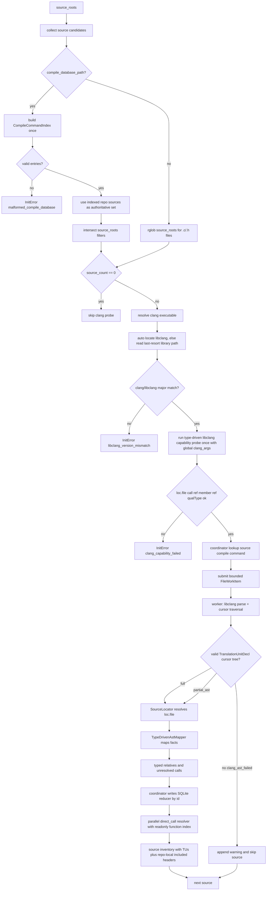
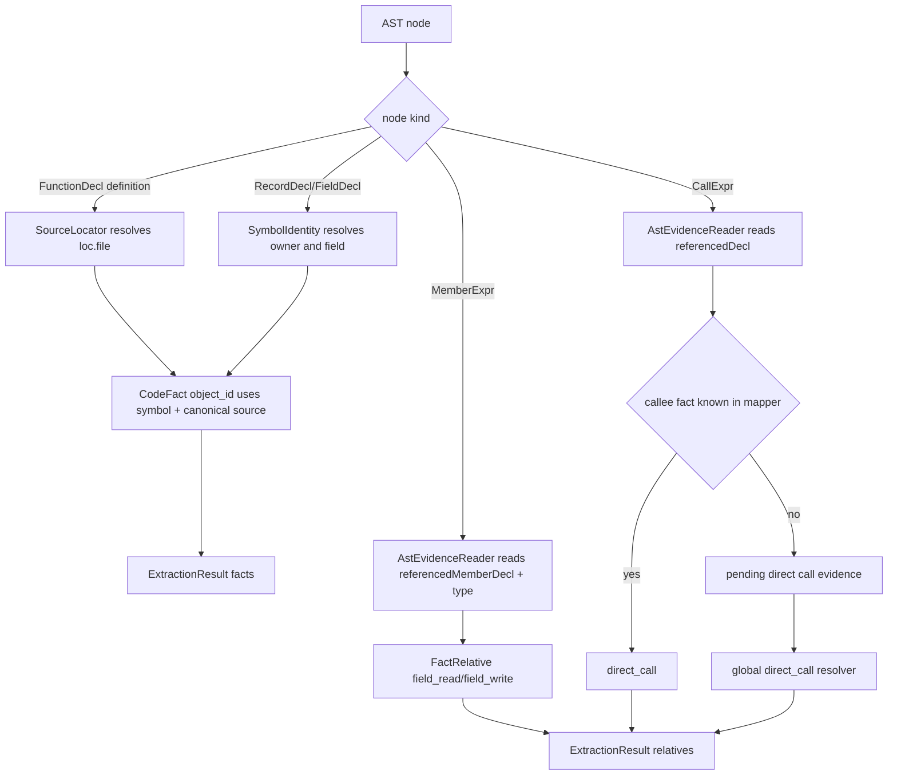
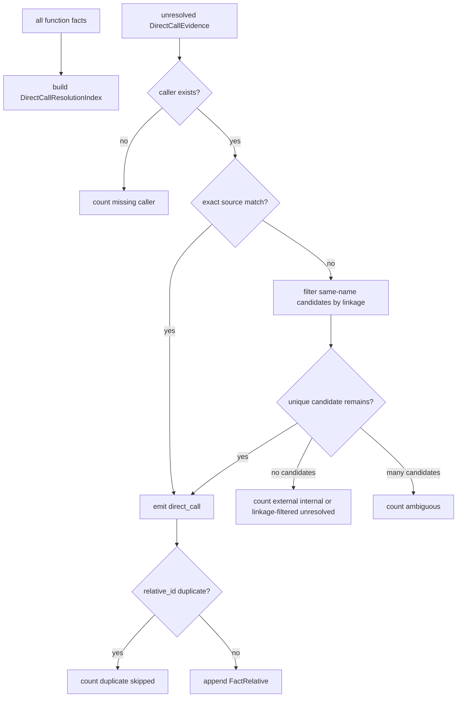
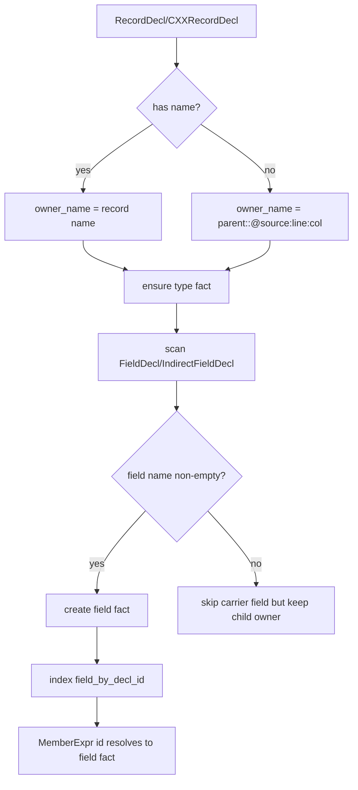

# initializer/extractor/code

## 路径职责

本模块是 C 语言类型驱动 libclang AST-backed extractor。它以 `loc.file`、call reference、member reference 和 `qualType` capability probe 作为准入条件：正式支持 LLVM Clang >= 16 和 Apple Clang >= 15，其他 vendor 若 probe 通过可运行但必须在 log/views 标记为 unknown。目标文件通过标准库 `ctypes` 薄封装 libclang C API 在进程内解析和 cursor 遍历，不生成完整 TU JSON，不引入 PyPI 运行时依赖。可解析 TU 中存在 error/fatal diagnostics 时可接受有效部分 AST 并记录 `partial_ast` warning。当前 AST-only 路径不要求 GCC 存在。lightweight parser、JSON AST dump 和 subprocess mapper 在 C 场景永远不启用，也不能作为 fallback。

本模块不新增 CLI 参数、不新增 MCP tool、不写 Graph 或 Inference。新增共享持久配置 `extractor.worker_count` 只控制全量 init/rebuild 的 per-file Clang 抽取并行度；显式 `1` 使用单 worker 串行调度但仍在可 kill/restart 的 worker 子进程内执行 target AST，显式大于 1 时使用多个长期 worker 进程执行 libclang parse、cursor traverse 和 mapper，绕开 Python GIL。既有 `paths.compile_database`、`extractor.code.clang_executable`、`extractor.code.gcc_executable` 和 `extractor.code.clang_args` 继续生效。`extractor.code.libclang_library` 是 owner 批准的唯一 code-specific 持久配置例外，只作为 libclang 自动定位失败后的 last-resort 逃生舱；正常路径必须先按既有 Clang/LLVM 工具链自动定位。target libclang parse 内置追加 `-ferror-limit=0`，该固定 flag 不暴露为配置项。单文件 target AST worker 使用内部 timeout：基础值为 120 秒，并按 source 文件大小每 1 MiB 增加 30 秒，最高 600 秒；该策略用于覆盖 parser/catalog 等超大文件，不作为持久配置项写入 config。

## 模块拆分

`__init__.py` 只保留 package 根兼容 re-export；运行时职责拆到聚焦模块，公开入口仍是 `CodeFact`、`ExtractionResult`、`DirectCallEvidence`、`ToolchainProbeResult` 和 `CodeFactExtractor`。repo 内测试和性能脚本仍可通过 package 根访问既有测试注入点与私有 helper；这些兼容 re-export 不扩大用户公开 API。

测试包默认在 `tests/__init__.py` 安装 `_JsonSubprocessTestBackend`，它只作为快速 JSON oracle 和 synthetic AST parity 辅助存在。任何声称覆盖生产 libclang 路径的用例必须在测试方法作用域内清空 `_TEST_AST_BACKEND_FACTORY`，通过真实 `_LibclangAstBackend` 执行 capability probe、ctypes parse/cursor 遍历和公开 initializer 写 snapshot 路径，并在 finally 恢复默认 JSON backend。`tests.test_live_libclang_smoke` 是该生产 backend canary：本机缺 Clang/libclang capability 时 skip，CI 默认要求它实际运行。

| 文件 | 职责 |
|---|---|
| `constants.py` | 后缀、timeout、spool、field access、condition、map-reduce TTL 等常量。 |
| `models.py` | `CodeFact`、抽取结果、map segment、direct_call、header cache seed、compile command lookup 等纯数据结构。 |
| `mapper_utils.py` | AST/source/path/helper 函数，供 mapper、backend、compile database 和 toolchain 共享。 |
| `toolchain.py` | libclang 错误类型、toolchain/version/capability probe、diagnostic helper。 |
| `compile_db.py` | compile database entry 解析、参数 allowlist 清洗和格式错误。 |
| `ast_backend.py` | libclang ctypes API、libclang AST backend、JSON test backend、in-memory backend 和测试注入点。 |
| `mapper.py` | `_ClangAstMapper` facade，保留类型驱动 fact/relative 映射语义。 |
| `streaming.py` | `_StreamingExtraction`、worker 生命周期和调度、SQLite facts reducer、source inventory 边界、direct_call resolver 编排。 |
| `streaming_segments.py` | worker-local relative dedup、map segment JSONL/sidecar 读写、encoded line 转换、relative external merge helper。 |
| `extractor.py` | `CodeFactExtractor` 编排 source collection、toolchain validation、worker backend spec、source inventory、log/progress。 |

## 抽取范围

- `code_file`
- `function`
- `global`
- `type`
- `field`
- `macro`
- `function_pointer_slot`
- `diagnostic`
- `include`、`defines`、`declares`、`has_field`
- `direct_call`
- `assigned_to`
- `dispatches_via`
- `field_read`
- `field_write`
- source inventory

本模块不写 Graph、不生成 Inference nodes、不执行用户规则。

## 用户可配配置项

本模块消费 config 中的全量 extractor worker 和 extractor code 配置。

| 配置项 | type | 取值范围 | 默认值 | 作用 | 非法值处理 |
|---|---|---|---|---|---|
| `paths.compile_database` | `str or null` | `null` 或可读普通文件；不得位于目标仓库 `.cipher/`；可由 `cipher2 init` 自动发现后写入路径 | `null` | compile database 只读输入；本模块解析 per-file flags | `ConfigError(compile_database_unreadable/path_escape)`；内容错误为 `InitError(malformed_compile_database)` |
| `extractor.worker_count` | `int or null` | `null`/省略 auto；显式 `1..32` | `null` | 全量 init/rebuild per-file Clang 抽取 worker 数；auto 为 CPU 数上限 32；实际 worker 数仍受 source 数限制；`1` 使用单 worker 子进程并保持串行调度语义 | `ConfigError(invalid_config)` |
| `extractor.code.clang_executable` | `str or null` | `null`、PATH 命令或可执行路径；运行期必须通过类型驱动 libclang AST capability probe | `null` | Clang 版本探测、libclang 自动定位和 capability probe | `InitError(clang_unavailable/clang_capability_failed/libclang_unavailable/libclang_version_mismatch)` |
| `extractor.code.libclang_library` | `str or null` | `null` 或可读动态库路径；不得位于目标仓库 `.cipher/` | `null` | libclang 自动定位失败后的 last-resort 逃生舱，不是常规配置旋钮 | `ConfigError(libclang_unavailable/path_escape/invalid_config)`；运行期仍校验版本匹配 |
| `extractor.code.gcc_executable` | `str or null` | `null`、PATH 命令或可执行路径；当前 AST-only 路径不要求存在；显式路径仍必须可执行且不得位于 `.cipher/` | `null` | 未来 GCC-backed 预处理路径保留输入；当前只进入 config 和 inventory 摘要 | `ConfigError(gcc_unavailable/path_escape)`；当前 extractor 不产生 `gcc_version_mismatch` |
| `extractor.code.clang_args` | `list[str]` | 只读编译参数；不得设置输出文件 | `[]` | capability probe 参数；libclang parse 中作为全局参数放在 per-file flags 之前 | `ConfigError(invalid_config)` |

## Clang 流程

capability probe 使用临时 C 输入通过 libclang C API 解析一次 TU，AST 中必须能定位 `TranslationUnitDecl`、probe 函数声明、可用 `loc.file`、CallExpr callee declaration、MemberExpr field declaration 和 expression/type `qualType`。Python 侧只绑定所需 libclang C API 子集；libclang 来自既有 Clang/LLVM 工具链自动定位，自动定位失败后才读取 `extractor.code.libclang_library`。Clang 不可用、libclang 不可用、Clang/libclang major 不匹配、parse 失败或缺少关键 evidence 时阻断 init/rebuild；capability 缺 evidence 返回 `clang_capability_failed`，payload 必须写 `missing_evidence`。能力探测通过后，单个目标源码通过 libclang parse 得到 `TranslationUnitDecl` cursor tree 且有非空子节点时进入 mapper；若 TU 可解析且 diagnostics 包含 error/fatal，则该文件标记为 `clang_ast_partial` warning，仍进入 `source_inventory`，warning details 需写 `reason` 为 `diagnostic_error`、`diagnostic_fatal` 或 `diagnostic_error_and_fatal`。parse 返回空 TU、根节点缺失、`inner` 缺失/为空、timeout 或 libclang C API 错误返回文件级 `clang_ast_failed` warning：该 source 被跳过，不进入 `source_inventory`，其他 source 继续抽取；timeout details 必须包含实际 `timeout_seconds`。

libclang cursor kind 必须在 `_cursor_to_ast` 边界归一到既有 `clang -ast-dump=json` mapper 词汇，再交给 mapper。目标源码 parse 的子游标递归只物化位置位于 `target_repo` 内且不在 `.cipher/` 内的子树；capability probe 的临时源码位于仓库外时，剪枝边界改用 probe 文件所在目录，避免把 probe AST 清空。系统头和仓库外头文件的声明子树必须剪枝，仓库内头文件中的 `static inline`、字段声明和类型定义必须保留。无显式文件位置的 cursor 保留给 mapper 继承上下文；外部声明只在仓库内节点通过 `referencedDecl` / `referencedMemberDecl` 实际引用时记录必要 evidence。至少包括：`MemberRefExpr -> MemberExpr`、`StructDecl/UnionDecl -> RecordDecl`、`ClassDecl -> CXXRecordDecl`、`ParmDecl -> ParmVarDecl`、`CXXMethod -> CXXMethodDecl`、`UnexposedExpr -> ImplicitCastExpr`。`StructDecl` / `UnionDecl` / `ClassDecl` 还必须写入稳定 `tagUsed`，否则 field/type facts、`has_field`、`field_read`、`field_write` 和 function-pointer dispatch 不能满足类型驱动精度契约。二元/一元 operator opcode helper 不是稳定 libclang C API；存在时可作为 fast path，缺失时必须通过稳定 `clang_tokenize` 对 cursor extent 推导 `opcode`，保持 `++`/`--`、复合赋值和简单赋值的 `field_read` / `field_write` / `access_context` 与 JSON oracle parity，不得将 backend 标记为 `libclang_unavailable` 或静默降级为 rvalue。

单次 collect 内维护仓内共享头声明物化缓存。`worker_count=1` 时缓存位于单个 worker 子进程；`worker_count>1` 时缓存位于各长期 worker 进程内，互不共享、无跨进程锁。缓存只适用于声明位置在目标仓库内、且 canonical source 不是当前 translation unit source 的 `FunctionDecl` / `CXXMethodDecl` / `RecordDecl` / `CXXRecordDecl` / `EnumDecl` / `TypedefDecl` / top-level `VarDecl`；`.h` 作为 source root 自身抽取时必须完整遍历。key 使用稳定 cursor/AST identity：kind、USR 或 fallback id、name、repo-relative canonical source、行列、extent 起点、linkage、`tagUsed` 和物化上下文 hash；上下文 hash 由 profile、sanitized clang flags 和 toolchain probe digest 派生，不包含当前 source 路径。命中同进程已发布 entry 时 `_cursor_to_ast` 只保留浅 declaration node 并标记 `cipher2HeaderCacheHit`，不递归进入该头声明子树；同进程首次遇到该声明时必须完整物化，保留头内 `static inline` body、field、direct call 和 function-pointer evidence。跨进程重复物化允许发生，coordinator 用 SQLite reducer 按 id 幂等去重；同 id 非幂等 payload 冲突必须 fail-closed。

`HeaderResolverSeed` 只保存已发布头声明的 fact 索引和字段解析索引，不保存完整 AST、源码正文、绝对路径或 compile command。mapper 在处理后续 TU 前加载 seed，用它解析当前 TU 中指向头声明的 `direct_call`、`field_read` / `field_write`、`assigned_to` / `dispatches_via` endpoint；cached declaration 自身不重复发出 `has_field`、头内 body relation 或头内 field access relation。若某类声明跳过后无法保持 cache-off parity，必须缩小候选范围，而不是接受 fact/relative 差异。

partial AST 只放宽单文件接受门槛，不放宽 fact/relative 的精度门槛。mapper 不得从 Clang 错误恢复节点或错误恢复子树产出 fact、relative 或 pending evidence；包括 `RecoveryExpr`、`containsErrors=true`、`isInvalidDecl=true`，以及缺失可解析 `qualType` / `referencedDecl` / `referencedMemberDecl` 的 `CallExpr`、`MemberExpr`。partial 文件中的 facts 必须与 full AST 同样满足 `loc.file`、声明引用和类型 evidence 约束；证据缺失时只能跳过、记录既有 unresolved/gap 计数，不能用节点名称、源码片段或 AST 形状猜测。

## Compile Database 与参数清洗

compile database 只影响目标源码的独立 translation unit set 和 libclang parse，不影响 capability probe。`cipher2 init` 可以自动发现常见位置的 `compile_commands.json` 并写入 `paths.compile_database`，但 config 阶段不解析内容；本模块仍是 JSON entry 解析、参数清洗和 hit/miss 统计的唯一运行期 owner。配置 compile database 后，本模块默认只把其中成功索引的仓内 source 作为独立 TU 抽取；`source_roots` 只在该权威构建集合上继续过滤，不会把未列入 compile database 的仓内源码重新加入独立抽取。被成功 TU include 的仓内头文件仍会进入 source inventory 和 include graph，用于 incremental header fanout，但不会作为 standalone TU 用空 flags 抽取。目标 parse 固定使用已匹配的 libclang backend；compile database entry 中的 compiler 程序名只用于定位参数，不得替换 `clang_executable` 或 libclang。

entry 支持 `arguments: list[str]` 和 `command: str`；两者同时存在时优先 `arguments`。`file` 相对路径按 entry 的 `directory` 解析，`directory` 相对路径按 compile database 文件所在目录解析。只为目标仓库内 source 建索引；仓库外 entry 忽略并计数。同一 source 多条 entry 时保留第一条，后续记为 duplicate。

libclang parse 参数顺序固定为：全局 `clang_args`、sanitized per-file flags、`-ferror-limit=0`。per-file flags 是该 source 的权威构建设置；重复语义上优先于全局 `clang_args`。`-ferror-limit=0` 是 extractor 内置恢复参数，不作为用户配置暴露。

libclang parse 不依赖 per-file subprocess cwd。命中 compile database entry 后，目标 source path 仍使用绝对 source 路径；相对 `-I`、`-iquote`、`-isystem`、`-idirafter`、`-F`、`-include`、`-imacros`、`-isysroot` 和 `--sysroot` 参数必须按 entry `directory` 归一为绝对路径，保持真实编译语义。未列入 compile database 的仓内源码默认不进入目标 parse，也不使用空 per-file flags 回退抽取；include graph 只保留已被成功 TU 直接或间接 include 的仓内头文件。

参数清洗必须使用显式 allowlist，只保留只读解析语义参数：

- include/search path：`-I`、`-iquote`、`-isystem`、`-idirafter`、`-F`。
- macro/pre-include：`-D`、`-U`、`-include`、`-imacros`。
- language/target/sysroot：`-std`、`-x`、`--target`、`-target`、`-isysroot`、`--sysroot`。
- include policy：`-nostdinc`、`-nostdinc++`、`-stdlib`。

allowlist 必须支持连写和分写形式，例如 `-Iinclude` / `-I include`、`--target=x86_64-linux-gnu` / `--target x86_64-linux-gnu`。`@response_file`、`-Xclang`、`-fplugin`、`-load`、codegen/optimization、链接、写文件和未在 allowlist 中列出的参数必须丢弃。`-c`、`-o`、依赖输出、诊断输出等输出类参数必须连同其参数整体移除。

compile database 存在时，source collection 必须以索引中的仓内 source 为默认 AST 输入；缺 entry 的同后缀文件不应通过 rglob 进入独立抽取。source inventory 必须在成功 AST 输入基础上补入仓内 header include closure，保持 `includes` / `included_by` 可用于 incremental fanout。`compile_command_miss_count` 只保留为内部 lookup 或非默认调用路径的诊断信号。compile database JSON 结构错误、entry 字段类型错误或 `command` 无法 shell split 时返回 `malformed_compile_database`，阻断 init/rebuild。日志和 views 不记录完整 command、绝对路径、源码正文或环境变量。

## 类型驱动 evidence、source 与 identity

mapper 只信任 Clang AST 中的类型和声明引用 evidence。不得使用字符串拼接、父子节点形状或手写 C 语法推导替代 Clang 语义。节点自身或任一祖先节点带错误恢复标记时，该子树不具备可抽取精度；mapper 必须跳过该子树内的 fact、relative 和 pending evidence 生成。

`object_source` 优先使用 AST `loc.file` / `range.begin.file` 中位于目标仓库内的路径；相对 `loc.file` 按当前 translation unit 命中的 compile command `directory` 解析，未命中 compile database 时按该 TU 的 `rel_source` 父目录解析；缺失、系统路径或路径逃逸时回退到当前 translation unit 的 `rel_source`。function/global/type/field 的 `object_id` 必须包含足够区分同名符号的 source 或 owner identity，且不兼容旧 snapshot：

| fact_kind | object_id 输入 | field/payload 规则 |
|---|---|---|
| `function` | `symbol_name`、`canonical_source`、`linkage` | 区分不同 `.c` 文件中的同名 static 函数。 |
| `global` | `symbol_name`、`canonical_source`、`linkage` | 头文件 `extern` global 跨 TU 归并；不同 source 中的同名 static global 不冲突。 |
| `type` | `symbol_name`、`canonical_source` | 区分不同 source 中的同名类型。 |
| `field` | `owner_name`、`symbol_name`、`canonical_source` | `object_name` 只保存字段名；owner 写入 payload 并由 `has_field` 表达。 |

头文件 `static inline` / `always_inline` 函数定义的 `canonical_source` 必须来自头文件声明位置；若 `FunctionDecl` 自身省略 `loc.file`，mapper 必须沿用 `_capture_lines()` 的深度优先最近显式文件上下文，不得回退到消费它的 `.c` TU。多个 translation unit 消费同一头文件内联函数时必须归并为一个 canonical function fact，`direct_call` 关系指向该 fact，精确 `callers:<function>` 查询不得因同名 TU 碎片返回 `needs_refinement`。头文件 `extern` global 的 `canonical_source` 必须来自头文件声明位置，且同一 `(symbol_name, canonical_source, linkage)` 被多个 TU 消费时必须归并为一个 canonical global fact；`payload.ordinal`、`payload.source_id` 和物化它的 TU 只可作为 payload 诊断/胜出证据，不得参与 `object_id`。`field` 的 `canonical_source` 必须来自 `FieldDecl/IndirectFieldDecl` 的声明位置；字段节点缺失文件时才回退到父 `RecordDecl/CXXRecordDecl` 的声明位置。Clang AST 可能在同一 source buffer 的后续节点省略 `loc.file`，mapper 必须在深度优先遍历时继承最近的显式文件上下文，避免头文件声明回退到消费它的 `.c` TU。`includedFrom.file` 只表示消费该头文件的 translation unit，不得作为声明 source；若 `RecordDecl/FieldDecl` 只有 `includedFrom` 且没有可继承的非 TU 文件上下文，mapper 必须使用基于声明形状的稳定 `unknown-header/...` source identity，而不是回退到当前 translation unit。头文件中声明的同一 `owner.field` 被多个 `.c` TU include 时必须归并为同一 field fact，`field_read` / `field_write` 都指向该 fact。`payload.owner_type_id` 只用于展示和追踪本 TU 中解析到的 owner type fact，不得参与 field `object_id`。

### Guard Condition 标注

mapper 必须在生成 call/member access relation 前先遍历真实 Clang AST，为 `CallExpr` 与 `MemberExpr` 标注 `cipher2_condition`。标注只来自封闭控制结构，不得由测试 fixture 手动注入替代生产路径：

- `IfStmt` then/else body 写 `kind="branch"`，`branch` 分别为 `then` / `else`，`expression` 为 AST 可读渲染的条件表达式。
- `WhileStmt`、`ForStmt` 和 `DoStmt` body 写 `kind="loop_guard"`，`branch="body"`，`expression` 为循环条件；无条件的无限 `for (;;)` 不写条件。
- `CaseStmt` / `DefaultStmt` body 写 `kind="case"`，`branch` 为 `case` / `default`，`expression` 为 case 表达式或 `default`。
- 源文件行级 `#if` / `#ifdef` / `#ifndef` / `#elif` / `#else` 作用域写 `kind="compile_guard"`；该路径只记录指令条件文本和相对 source line，不记录完整源码正文。

嵌套条件只保留最近的封闭守卫。结构化 AST 守卫与行级 compile guard 同时存在时，使用 source line 更靠内的条件。之后 direct call、field access、`assigned_to` 和 `dispatches_via` 的既有 relation 构造路径只读取该标注并原样传递到 `FactRelative.condition`。

### 跨文件 Direct Call 后处理

mapper 文件内已能解析的 `direct_call` 立即生成 relation。若 `CallExpr.referencedDecl` 指向当前文件 fact 索引找不到的 callee，mapper 只记录 `DirectCallEvidence`；fact reducer 完成后，resolver 使用只读全局 function fact index 按 pending shard 并行补齐跨文件 `direct_call`。initializer 主线把文件级 facts 和 pending evidence 写入临时 SQLite staging，文件级 relatives 写入 worker-local dedup 后的 sorted sidecar segment，避免为了 resolver 或 relative merge 持有全仓非函数 facts/relatives。
reducer 的 facts staging 行除 final canonical line 外，只额外保存 resolver 所需的 `fact_kind`、`object_name`、`object_source`、`linkage` 和 `canonical_source` scalar；`DirectCallResolutionIndex` 必须由 `WHERE fact_kind='function'` 的 scalar SELECT 构建，不得调用兼容 iterator 反序列化完整 `CodeFact` payload。

规则：

- resolver 只能消费 Clang `CallExpr.referencedDecl` 产生的 `DirectCallEvidence`，不得按源码字符串、函数名正则或 AST 形状猜测调用关系。
- callee resolution 只查询全局 `payload.fact_kind == "function"` 的 function fact。
- `referenced_source` 有值时优先匹配 `(callee_name, referenced_source)`；未命中时才允许唯一同名 function fallback。
- 唯一同名 fallback 必须感知 `payload.linkage`：候选为 `static` / `internal` 且候选 `object_source` 不等于 caller `object_source` 时必须排除。
- fallback 过滤 linkage 后仍必须唯一；候选为空、同名多候选、caller 缺失或 duplicate relative id 时不生成 relation，只计数并保留有界 evidence。
- `condition` 必须从 pending evidence 原样传递到生成的 `FactRelative`。
- 生成 relation 的 payload 只允许写 `evidence_source`、`callee_name`、`referenced_source` 和 `resolution_strategy`，不得写源码正文、绝对路径或完整 AST 片段。

### 函数指针 Dispatch

`assigned_to` 和 `dispatches_via` 必须基于真实 Clang AST evidence，不得按源码字符串或宏名猜测。函数指针类型识别必须读取 Clang `type.qualType`，并在存在 `type.desugaredQualType` 时用它覆盖 `typedef` 场景；例如结构体字段声明为 `ExecProcNodeMtd ExecProcNode` 时，成员访问 `node->ExecProcNode(node)` 仍应识别为函数指针 dispatch。endpoint 规则如下：

| endpoint | fact kind | identity |
|---|---|---|
| struct/union 函数指针字段 | `field` | 复用 `FieldDecl/IndirectFieldDecl` 对应 field fact |
| 文件级函数指针变量 | `global` | 复用 top-level `VarDecl` global fact |
| 本地函数指针变量 | `function_pointer_slot` | `slot_name`、`canonical_source`、owner function、line/column |

赋值点覆盖 `BinaryOperator("=")`、函数指针 `VarDecl` initializer、`InitListExpr` / `DesignatedInitExpr` 和 `UnaryOperator("&")`、`ImplicitCastExpr`、`ParenExpr` 包裹的 RHS function reference。只有 LHS 明确是函数指针 endpoint 且 RHS 唯一解析到 function fact 时才生成 `assigned_to`；普通字段或普通变量赋值必须忽略，不增加 dispatch unresolved。调用点先解析 `CallExpr` callee expression；若 callee 为函数指针 `MemberExpr` / `DeclRefExpr` 且 endpoint 唯一，则生成 `dispatches_via`，并跳过 direct call 分支。若 `CallExpr` callee 看起来是间接调用但 endpoint 非函数指针类型或不唯一，或函数指针赋值 RHS function 不唯一，不生成关系，只增加 unresolved dispatch 计数。

`assigned_to` 不做跨 translation unit 后处理；RHS function 必须在当前文件 mapper 已物化的 function fact 或仓内共享头 resolver seed 中唯一解析。RHS 只引用其他 source 中的函数且当前 mapper 没有对应 function fact 时，不按同名或源码文本猜测补边；当前全局 resolver 只补齐 `direct_call`。

`_call_reference()` 只返回直接 `FunctionDecl` / method declaration reference；callee 为 `FieldDecl`、`IndirectFieldDecl`、`VarDecl` 或其他非函数声明时不得静默搜索参数中的函数名来伪造 `direct_call`。宏展开内 direct call 只有在展开后的 `CallExpr` 仍携带唯一 function declaration reference 时才生成 `direct_call`，并增加 `macro_direct_call_count`。

同一 `MemberExpr` 位于 `CallExpr` callee 时，`field_read` 与 `dispatches_via` 可以共存；`dispatches_via` 必须复用 field access 路径能唯一解析的 field fact。

### Field Fact 覆盖

mapper 必须先为每个 `RecordDecl/CXXRecordDecl` 建立 owner identity，再创建 field fact。任何带字段的 record 都必须有 owner identity；匿名 `struct/union` 使用稳定 synthetic owner，不得使用 Clang 内存地址式 `id` 构造 `object_id`。

规则：

- `FieldDecl/IndirectFieldDecl` 只要有非空字段名，就必须创建或复用 `field` fact；不得因 record 无 `name` 或 `_resolve_type_fact` 失败而跳过。
- 匿名 owner 的稳定输入只能使用仓库相对 source、line、col、`tagUsed` 和父 owner path。
- `struct Outer { union { int a; int b; }; }` 的匿名 union owner 形如 `Outer::<anonymous-union>@src/foo.c:2:3`。字段 `a` 的 `object_name` 仍为 `a`，payload 写 synthetic owner，并通过 `has_field` 指向 synthetic type fact。
- 匿名 carrier field 如果没有 `name`，不创建 field fact；它只用于把内部 record 挂到父 owner path。
- 头文件里声明的 named owner 字段按声明 source 聚合，不得因不同 TU 解析出的 `owner_type_id` 不同而拆分；同名但不同 owner 的字段仍必须是不同 fact。
- `field_by_decl_id` 必须覆盖所有带 id 且有非空字段名的 `FieldDecl/IndirectFieldDecl`。`MemberExpr.referencedMemberDecl` 命中 id 后，应能直接解析到唯一 field fact。

## 行号解析

libclang cursor location 归一后的 AST dict 可能省略子节点或同一行后续兄弟节点的 `loc.line` / `range.begin.line`，只保留 `offset` 和 `col`。mapper 必须在遍历 AST 时维护最近一次显式行号：节点缺失行号时继承当前行号，遇到显式行号时更新当前行号，并把该行号用于 `object_source`、`evidence_source`、relative payload 和 `relative_id` identity。不得把缺失行号统一降级为 `1`。

mapper 必须在单 AST 文件级维护已生成的 `relative_id` 集合。同一行内宏展开或复杂表达式可能多次产生相同 `from/to/relation_kind/condition/payload/source/line` identity；重复 identity 只保留第一条关系，避免 storage 写入阶段出现 `duplicate_relative_id`。

## Field Access 映射

`MemberExpr` 必须通过 member reference 和类型 evidence 解析到唯一 field identity 后才能生成字段访问关系：

| AST 场景 | relation_kind | 方向 | payload |
|---|---|---|---|
| 简单赋值左值 `obj.member = x` | `field_write` | `function -> field` | `access_context="assignment_lhs"` |
| 右值 `x = obj.member` | `field_read` | `function -> field` | `access_context="rvalue"` |
| 调用实参 `free(obj.member)` | `field_read` | `function -> field` | `access_context="argument"` |
| 条件 `if (obj.member)` | `field_read` | `function -> field` | `access_context="condition"` |
| 复合赋值或自增自减 | `field_read` + `field_write` | `function -> field` | `access_context="read_write"` |
| 返回表达式 `return obj.member` | `field_read` | `function -> field` | `access_context="return"` |
| AST operator 上下文无法稳定判断读写 | `field_read` | `function -> field` | `access_context="rvalue_partial"`，`access_confidence="partial"` |

字段访问扫描必须递归下探函数体表达式树。`MemberExpr` 出现在 `BinaryOperator`、`CompoundAssignOperator`、`UnaryOperator`、`ParenExpr`、`ImplicitCastExpr`、`CStyleCastExpr`、`ConditionalOperator`、`CallExpr`、`ReturnStmt` 或宏展开子树中时，只要 member reference 能解析到唯一 field fact，就必须生成对应 `field_read` / `field_write`。简单赋值左值只写；复合赋值、位运算赋值、自增和自减同时读写；条件、实参、返回值和其他右值只读。

无法解析唯一字段时不得生成模糊关系。若 AST 上下文无法稳定判断读写，保守生成 `field_read`，payload 写 `access_confidence="partial"`。同名 field 允许产生多个 fact；模型通过 incoming `has_field`、`payload.owner_name` 和 source context 区分，不得依赖 `payload.owner_type_id` 作为稳定身份。扫描上限固定为 `max_depth=64`、`max_nodes_per_function=10000`，不是用户可配置项；触发上限时跳过当前子树，递增 `field_access_scan_truncated_count` 和 warning。

## 数据结构

```mermaid
classDiagram
    direction LR
    class CodeFactExtractor {
      target_repo: Path
      config: CipherConfig
      ast_backend: AstBackend?
      compile_command_index: CompileCommandIndex?
      toolchain_probe_result: ToolchainProbeResult?
    }
    class CompileCommandIndex {
      target_repo: Path
      compile_database_path: Path
      by_source: dict~Path, CompileCommandEntry~
      stats: CompileCommandStats
      lookup(source: Path) CompileCommandLookup
    }
    class CompileCommandEntry {
      source_path: Path
      directory_path: Path
      flags: list~str~
      raw_argument_count: int
      sanitized_argument_count: int
      command_hash: str
    }
    class CompileCommandLookup {
      matched: bool
      entry: CompileCommandEntry?
      flags: list~str~
      command_hash: str?
    }
    class CompileCommandStats {
      entry_count: int
      indexed_source_count: int
      duplicate_source_count: int
      ignored_outside_repo_count: int
      malformed_entry_count: int
      stripped_argument_count: int
      lookup_hit_count: int
      lookup_miss_count: int
    }
    class TypeDrivenAstMapper {
      target_repo: Path
      rel_source: str
      profile: str
      source_id: str
      evidence_reader: AstEvidenceReader
      source_locator: SourceLocator
      identity_builder: SymbolIdentityBuilder
      facts: list~CodeFact~
      relatives: list~FactRelative~
      unresolved_calls: list~DirectCallEvidence~
      record_owner_by_node: dict
      field_owner_by_decl_id: dict
      field_by_decl_id: dict
      coverage_stats: FieldCoverageStats
    }
    class AstEvidenceReader {
      capability: TypeDrivenCapability
      call_reference_paths: list~str~
      member_reference_paths: list~str~
      type_paths: list~str~
    }
    class TypeDrivenCapability {
      loc_file_supported: bool
      call_reference_supported: bool
      member_reference_supported: bool
      qual_type_supported: bool
      clang_vendor: str
      clang_version: str?
    }
    class SourceLocator {
      target_repo: Path
      translation_unit_source: str
      repo_relative_files: set~str~
    }
    class SymbolIdentityBuilder {
      object_id_version: int
      hash_namespace: str
      source_locator: SourceLocator
    }
    class SymbolIdentity {
      fact_kind: str
      symbol_name: str
      owner_name: str?
      canonical_source: str
      linkage: str?
      declaration_role: str
    }
    class CodeFact {
      fact_kind: str
      object_id: str
      object_name: str
      object_description: str
      object_source: str
      object_profile: str
      object_caller: str?
      object_callee: str?
      payload: dict
    }
    class FieldAccessEvidence {
      function_fact_id: str
      field_identity: SymbolIdentity
      relation_kind: str
      access_context: str
      evidence_source: str
      confidence: float
    }
    class RecordOwnerIdentity {
      owner_name: str
      owner_key: str
      owner_kind: str
      tag_used: str?
      canonical_source: str
      line: int
      column: int?
      parent_owner_name: str?
      type_fact_id: str?
    }
    class FieldCoverageStats {
      record_owner_count: int
      anonymous_record_count: int
      synthetic_type_fact_count: int
      field_decl_count: int
      field_fact_count: int
      field_decl_without_fact_count: int
      wrapped_member_expr_count: int
      macro_wrapped_member_expr_count: int
      bitwise_member_expr_count: int
      compound_field_access_count: int
      field_access_scan_truncated_count: int
      field_access_resolved_count: int
      field_access_unresolved_count: int
      function_pointer_slot_count: int
      function_pointer_assignment_count: int
      function_pointer_dispatch_count: int
      macro_direct_call_count: int
      unresolved_dispatch_slot_count: int
      unresolved_dispatch_function_count: int
    }
    class DirectCallEvidence {
      caller_fact_id: str
      callee_name: str
      referenced_source: str?
      evidence_source: str
      condition: RelativeCondition?
    }
    class DirectCallResolutionIndex {
      function_by_id: dict~str, DirectCallFunction~
      functions_by_name: dict~str, DirectCallFunctionList~
      functions_by_source_name: dict~SourceNameKey, DirectCallFunctionList~
      existing_relative_ids: set~str~
    }
    class DirectCallResolutionStats {
      pending_call_count: int
      resolved_call_count: int
      external_unresolved_count: int
      internal_unresolved_count: int
      ambiguous_call_count: int
      linkage_filtered_count: int
      missing_caller_count: int
      duplicate_relation_count: int
    }
    class DirectCallResolutionResult {
      relatives: list~FactRelative~
      stats: DirectCallResolutionStats
    }
    class AstLoadResult {
      ast: dict
      diagnostic_kind: str
      diagnostic_reason: str
      partial: bool
      warning_code: str?
      backend: str
      parse_duration_ms: float
    }
    class ToolchainProbeResult {
      clang_executable: str
      clang_vendor: str
      clang_version: str?
      ast_json_supported: bool
      type_driven_ast: bool
      loc_file_supported: bool
      call_reference_supported: bool
      member_reference_supported: bool
      qual_type_supported: bool
      ast_root_kind: str?
      gcc_required: bool
      gcc_checked: bool
      warning_codes: list~str~
      backend: str
      libclang_library: str?
      libclang_library_scope: str
      libclang_version: str?
      version_match: bool
    }
    class ExtractionResult {
      facts: list~CodeFact~
      relatives: list~FactRelative~
      source_inventory: list~SourceInventoryEntry~
      unresolved_calls: list~DirectCallEvidence~
      source_count: int
      errors: list
    }
    class FileExtractWarning {
      code: str
      source: str
      message: str
      diagnostic_kind: str
    }
    CodeFactExtractor --> CompileCommandIndex
    CodeFactExtractor --> ToolchainProbeResult
    CompileCommandIndex --> CompileCommandEntry
    CompileCommandIndex --> CompileCommandStats
    CompileCommandIndex --> CompileCommandLookup
    TypeDrivenAstMapper --> AstEvidenceReader
    TypeDrivenAstMapper --> SourceLocator
    TypeDrivenAstMapper --> SymbolIdentityBuilder
    TypeDrivenAstMapper --> RecordOwnerIdentity
    TypeDrivenAstMapper --> FieldCoverageStats
    AstEvidenceReader --> TypeDrivenCapability
    SourceLocator --> SymbolIdentity
    SymbolIdentityBuilder --> SymbolIdentity
    FieldAccessEvidence --> ExtractionResult
    DirectCallEvidence --> ExtractionResult
    DirectCallResolutionIndex --> DirectCallResolutionResult
    DirectCallResolutionResult --> DirectCallResolutionStats
    DirectCallResolutionResult --> ExtractionResult
    AstLoadResult --> ExtractionResult
    ToolchainProbeResult --> ExtractionResult
    FileExtractWarning --> ExtractionResult
    CodeFact --> ExtractionResult
```

本节“成员表”是 class/dataclass 成员清单，不是数据库表。实现时可以内联简单 wrapper，但行为字段、并发边界和可观测字段必须保持一致。

### `CodeFactExtractor` 成员表

| 成员名称 | type | 作用 | 并发粒度 |
|---|---|---|---|
| `target_repo` | `Path` | 目标仓库根目录 | 单 collect 只读 |
| `config` | `CipherConfig` | 已校验配置快照 | 单 collect 只读 |
| `_ast_backend` | `AstBackend or None` | capability probe 通过后的 libclang backend；无源码或 probe 前为 `None` | 单 collect 只读 |
| `compile_command_index` | `CompileCommandIndex or None` | compile database per-file flags 只读索引 | 单 collect 只读 |
| `toolchain_probe_result` | `ToolchainProbeResult or None` | libclang capability probe 结果 | 单 collect 只读 |

### `CompileCommandIndex` 成员表

| 成员名称 | type | 作用 | 并发粒度 |
|---|---|---|---|
| `target_repo` | `Path` | 判断 entry source 是否位于目标仓库内 | 单 collect 只读 |
| `compile_database_path` | `Path` | compile database 文件路径 | 单 collect 只读 |
| `by_source` | `dict[Path, CompileCommandEntry]` | 规范化 source path 到命令条目 | 单 collect 只读 |
| `stats` | `CompileCommandStats` | index 构建与 lookup 聚合计数 | 单 collect 聚合 |

### `CompileCommandEntry` 成员表

| 成员名称 | type | 作用 | 并发粒度 |
|---|---|---|---|
| `source_path` | `Path` | 规范化后的 source 绝对路径，仅内存使用 | 单 entry 只读 |
| `directory_path` | `Path` | entry `directory` 解析后的工作目录 | 单 entry 只读 |
| `flags` | `list[str]` | allowlist 清洗后的 per-file flags | 单 entry 只读 |
| `raw_argument_count` | `int` | 原始参数数，用于审计清洗比例 | 单 entry 只读 |
| `sanitized_argument_count` | `int` | 保留参数数 | 单 entry 只读 |
| `command_hash` | `str` | source inventory 的 per-file compile command identity | 单 entry 只读 |

### `CompileCommandLookup` 成员表

| 成员名称 | type | 作用 | 并发粒度 |
|---|---|---|---|
| `matched` | `bool` | 当前 source 是否命中 compile command | 单 source |
| `entry` | `CompileCommandEntry or None` | 命中的索引条目 | 单 source |
| `flags` | `list[str]` | allowlist 清洗后的 per-file flags；libclang backend 在使用前把路径参数归一为绝对路径；lookup 未命中时为空，默认 source collection 不应产生未命中 | 单 source |
| `command_hash` | `str or None` | 命中条目的 hash；lookup 未命中时由调用方使用全局 clang_args hash，作为非默认路径的防御性 fallback | 单 source |

### `CompileCommandStats` 成员表

| 成员名称 | type | 作用 | 并发粒度 |
|---|---|---|---|
| `entry_count` | `int` | compile database 原始 entry 数 | 单 collect 聚合 |
| `indexed_source_count` | `int` | 成功纳入索引的 source 数 | 单 collect 聚合 |
| `duplicate_source_count` | `int` | 重复 source entry 数 | 单 collect 聚合 |
| `ignored_outside_repo_count` | `int` | 仓库外 entry 数 | 单 collect 聚合 |
| `malformed_entry_count` | `int` | malformed entry 数；非 0 时阻断 | 单 collect 聚合 |
| `stripped_argument_count` | `int` | 被 allowlist 清洗丢弃的参数数 | 单 collect 聚合 |
| `lookup_hit_count` | `int` | source lookup 命中次数 | 单 collect 聚合 |
| `lookup_miss_count` | `int` | source lookup 未命中次数 | 单 collect 聚合 |

### `AstLoadResult` 成员表

| 成员名称 | type | 作用 | 并发粒度 |
|---|---|---|---|
| `ast` | `dict[str, JSONValue]` | libclang cursor tree 归一后的有界 AST-like dict；只传递引用，不是完整 TU JSON dump | 单 source |
| `diagnostic_kind` | `str` | `ok` 或 `partial_ast` | 单 source |
| `partial` | `bool` | 是否因 libclang error/fatal diagnostics 降级为 partial | 单 source |
| `warning_code` | `str or None` | partial 时为 `clang_ast_partial` | 单 source |
| `backend` | `str` | 正式路径固定为 `libclang` | 单 source |
| `parse_duration_ms` | `float` | libclang parse 耗时 | 单 source |

### `TypeDrivenAstMapper` 成员表

| 成员名称 | type | 作用 | 并发粒度 |
|---|---|---|---|
| `target_repo` | `Path` | 目标仓库根目录 | 单 AST 文件级只读 |
| `rel_source` | `str` | 当前 translation unit 相对路径 | 单 AST 文件级只读 |
| `profile` | `str` | fact profile | 单 AST 文件级 |
| `source_id` | `str` | source inventory id | 单 AST 文件级 |
| `evidence_reader` | `AstEvidenceReader` | 读取 Clang 类型和引用 evidence | 单 AST 文件级只读 |
| `source_locator` | `SourceLocator` | 将 AST 文件位置转为仓库相对 source | 单 AST 文件级只读 |
| `identity_builder` | `SymbolIdentityBuilder` | 构造稳定 object_id identity | 单 AST 文件级 |
| `facts` | `list[CodeFact]` | 已生成 facts | 单 AST 文件级 |
| `relatives` | `list[FactRelative]` | 已生成关系 | 单 AST 文件级 |
| `unresolved_calls` | `list[DirectCallEvidence]` | 跨文件 direct call resolver 可消费的调用 evidence | 单 AST 文件级 |
| `record_owner_by_node` | `dict[int, RecordOwnerIdentity]` | AST node 到 record owner identity | 单 AST 文件级 |
| `field_owner_by_decl_id` | `dict[str, RecordOwnerIdentity]` | Clang field declaration id 到 owner identity | 单 AST 文件级 |
| `field_by_decl_id` | `dict[str, CodeFact]` | Clang field declaration id 到 field fact | 单 AST 文件级 |
| `coverage_stats` | `FieldCoverageStats` | field fact 覆盖与 field access 解析统计 | 单 AST 文件级 |

### `AstEvidenceReader` 成员表

| 成员名称 | type | 作用 | 并发粒度 |
|---|---|---|---|
| `capability` | `TypeDrivenCapability` | 当前 Clang evidence 能力 | 单 collect 只读 |
| `call_reference_paths` | `list[str]` | CallExpr callee 声明引用候选路径 | 单 collect 只读 |
| `member_reference_paths` | `list[str]` | MemberExpr 字段声明引用候选路径 | 单 collect 只读 |
| `type_paths` | `list[str]` | qualType / desugared type 候选路径 | 单 collect 只读 |

### `TypeDrivenCapability` 成员表

| 成员名称 | type | 作用 | 并发粒度 |
|---|---|---|---|
| `loc_file_supported` | `bool` | probe AST 是否携带可用 `loc.file` | 单次 probe |
| `call_reference_supported` | `bool` | CallExpr 是否能定位 callee declaration | 单次 probe |
| `member_reference_supported` | `bool` | MemberExpr 是否能定位 field declaration | 单次 probe |
| `qual_type_supported` | `bool` | expression/type 节点是否提供 qualType | 单次 probe |
| `clang_vendor` | `str` | `llvm`、`apple` 或 `unknown` | 单次 probe |
| `clang_version` | `str or None` | 版本摘要 | 单次 probe |

### `SourceLocator` 成员表

| 成员名称 | type | 作用 | 并发粒度 |
|---|---|---|---|
| `target_repo` | `Path` | 路径安全边界 | 单 collect 只读 |
| `translation_unit_source` | `str` | 当前 TU 回退 source | 单 AST 文件级只读 |
| `repo_relative_files` | `set[str]` | 已知仓库内文件集合 | 单 collect 只读 |

### `SymbolIdentityBuilder` 成员表

| 成员名称 | type | 作用 | 并发粒度 |
|---|---|---|---|
| `object_id_version` | `int` | identity 规则版本，随本重构递增 | 单 collect 只读 |
| `hash_namespace` | `str` | 防止不同 fact_kind identity 串扰 | 单 collect 只读 |
| `source_locator` | `SourceLocator` | 为 declaration 构造 canonical source | 单 AST 文件级只读 |

### `SymbolIdentity` 成员表

| 成员名称 | type | 作用 | 并发粒度 |
|---|---|---|---|
| `fact_kind` | `str` | function/type/field/global/macro | 单 fact |
| `symbol_name` | `str` | 展示名；field 为字段名，不含 type 前缀 | 单 fact |
| `owner_name` | `str or None` | field owner type 或嵌套 owner | 单 fact |
| `canonical_source` | `str` | 真实定义 source；头内联函数和头字段不得回退到消费 TU | 单 fact |
| `linkage` | `str or None` | static/extern/unknown | 单 fact |
| `declaration_role` | `str` | definition/declaration/member | 单 fact |

### `CodeFact` 成员表

| 成员名称 | type | 作用 | 并发粒度 |
|---|---|---|---|
| `fact_kind` | `str` | fact 类型 | 单 AST 文件级 |
| `object_id` | `str` | 基于 `SymbolIdentity` 的稳定 id | 单 AST 文件级 |
| `object_name` | `str` | 名称；field 只保存字段名 | 单 AST 文件级 |
| `object_description` | `str` | 描述 | 单 AST 文件级 |
| `object_source` | `str` | 仓库相对源码位置，优先来自 AST `loc.file` | 单 AST 文件级 |
| `object_profile` | `str` | profile | 单 AST 文件级 |
| `object_caller` | `str or None` | caller 摘要 | 单 AST 文件级 |
| `object_callee` | `str or None` | callee 摘要 | 单 AST 文件级 |
| `payload` | `dict[str, JSONValue]` | 有界结构化数据 | 单 AST 文件级 |

### `FieldAccessEvidence` 成员表

| 成员名称 | type | 作用 | 并发粒度 |
|---|---|---|---|
| `function_fact_id` | `str` | 访问字段的函数 | 单 MemberExpr 级 |
| `field_identity` | `SymbolIdentity` | 被访问字段的稳定 identity | 单 MemberExpr 级 |
| `relation_kind` | `str` | `field_read` 或 `field_write` | 单 MemberExpr 级 |
| `access_context` | `str` | `assignment_lhs`、`rvalue`、`rvalue_partial`、`argument`、`condition`、`return` 或 `read_write` | 单 MemberExpr 级 |
| `evidence_source` | `str` | 访问发生位置 | 单 MemberExpr 级 |
| `confidence` | `float` | 类型 evidence 完整度 | 单 MemberExpr 级 |

### `RecordOwnerIdentity` 成员表

| 成员名称 | type | 作用 | 并发粒度 |
|---|---|---|---|
| `owner_name` | `str` | field payload 和展示使用的 owner 名称 | 单 record |
| `owner_key` | `str` | 构造 type/field object_id 的稳定 owner identity | 单 record |
| `owner_kind` | `Literal["named","anonymous","synthetic_missing_type"]` | owner 来源 | 单 record |
| `tag_used` | `str or None` | `struct`、`union`、`enum` 等 Clang tag | 单 record |
| `canonical_source` | `str` | owner 定义所在仓库相对 source | 单 record |
| `line` | `int` | owner 定义行号 | 单 record |
| `column` | `int or None` | owner 定义列号，用于区分同一行匿名 record | 单 record |
| `parent_owner_name` | `str or None` | 嵌套匿名 record 的父 owner | 单 record |
| `type_fact_id` | `str or None` | materialize 后的 type fact id | 单 record |

### `FieldCoverageStats` 成员表

| 成员名称 | type | 作用 | 并发粒度 |
|---|---|---|---|
| `record_owner_count` | `int` | 已建模 record owner 数 | 单 AST 文件级 |
| `anonymous_record_count` | `int` | 匿名 owner 数 | 单 AST 文件级 |
| `synthetic_type_fact_count` | `int` | 因匿名或缺失 type 创建的 type fact 数 | 单 AST 文件级 |
| `field_decl_count` | `int` | 非空字段名的 field declaration 数 | 单 AST 文件级 |
| `field_fact_count` | `int` | 成功创建或复用的 field fact 数 | 单 AST 文件级 |
| `field_decl_without_fact_count` | `int` | 未 materialize 的 field declaration 数，目标为 0 | 单 AST 文件级 |
| `wrapped_member_expr_count` | `int` | 位于包装表达式下的 `MemberExpr` 数 | 单 AST 文件级 |
| `macro_wrapped_member_expr_count` | `int` | 来自宏展开位置的包装 `MemberExpr` 数 | 单 AST 文件级 |
| `bitwise_member_expr_count` | `int` | 位运算或位运算赋值上下文中的 `MemberExpr` 数 | 单 AST 文件级 |
| `compound_field_access_count` | `int` | 复合赋值或自增自减产生读写语义的字段访问数 | 单 AST 文件级 |
| `field_access_scan_truncated_count` | `int` | 字段访问递归扫描触发深度或节点上限的子树数 | 单 AST 文件级 |
| `field_access_resolved_count` | `int` | MemberExpr 成功解析到 field fact 次数 | 单 AST 文件级 |
| `field_access_unresolved_count` | `int` | 有 member reference 但无唯一 field fact 的次数 | 单 AST 文件级 |
| `function_pointer_slot_count` | `int` | 生成 `function_pointer_slot` fact 数 | 单 AST 文件级 |
| `function_pointer_assignment_count` | `int` | 成功生成 `assigned_to` 的函数指针赋值数 | 单 AST 文件级 |
| `function_pointer_dispatch_count` | `int` | 成功生成 `dispatches_via` 的间接调用数 | 单 AST 文件级 |
| `macro_direct_call_count` | `int` | 宏展开位置中成功生成的 direct call 数 | 单 AST 文件级 |
| `unresolved_dispatch_slot_count` | `int` | 间接调用 callee 或函数指针初始化 endpoint 不唯一、类型不满足的次数；普通赋值不计入 | 单 AST 文件级 |
| `unresolved_dispatch_function_count` | `int` | 函数指针赋值 RHS 不能唯一解析到 function 的次数 | 单 AST 文件级 |

### `DirectCallEvidence` 成员表

| 成员名称 | type | 作用 | 并发粒度 |
|---|---|---|---|
| `caller_fact_id` | `str` | 调用方函数 fact id | 单 CallExpr |
| `callee_name` | `str` | Clang 声明引用解析出的 callee 名 | 单 CallExpr |
| `referenced_source` | `str or None` | callee 声明或定义 source | 单 CallExpr |
| `evidence_source` | `str` | 调用发生位置 | 单 CallExpr |
| `condition` | `RelativeCondition or None` | 上层条件 | 单 CallExpr |

### `DirectCallResolutionIndex` 成员表

| 成员名称 | type | 作用 | 并发粒度 |
|---|---|---|---|
| `function_by_id` | `dict[str, _DirectCallFunction]` | caller 存在性校验；值为 reducer scalar record，不含完整 payload | 单 collect 只读 |
| `functions_by_name` | `dict[str, list[_DirectCallFunction]]` | 唯一同名 fallback 查询；列表只保存 function scalar record | 单 collect 只读 |
| `functions_by_source_name` | `dict[tuple[str, str], list[_DirectCallFunction]]` | source + name 精确查询；列表只保存 function scalar record | 单 collect 只读 |
| `existing_relative_ids` | `set[str]` | 后处理 relation 去重 | 单 collect 局部可变 |

### `DirectCallResolutionResult` 成员表

| 成员名称 | type | 作用 | 并发粒度 |
|---|---|---|---|
| `relatives` | `list[FactRelative]` | 后处理新增的 `direct_call` relations | 单 collect 聚合 |
| `stats` | `DirectCallResolutionStats` | 后处理统计 | 单 collect 聚合 |

### `DirectCallResolutionStats` 成员表

| 成员名称 | type | 作用 | 并发粒度 |
|---|---|---|---|
| `pending_call_count` | `int` | 待解析调用数 | 单 collect 聚合 |
| `resolved_call_count` | `int` | 成功补齐 relation 数 | 单 collect 聚合 |
| `external_unresolved_count` | `int` | 无仓内候选的外部调用数 | 单 collect 聚合 |
| `internal_unresolved_count` | `int` | referenced source 在仓内但无唯一 fact 的数量 | 单 collect 聚合 |
| `ambiguous_call_count` | `int` | 多候选未生成 relation 数 | 单 collect 聚合 |
| `linkage_filtered_count` | `int` | 因 internal linkage 跨 TU 被排除的候选数 | 单 collect 聚合 |
| `missing_caller_count` | `int` | caller fact 不存在的 pending 数 | 单 collect 聚合 |
| `duplicate_relation_count` | `int` | relative id 已存在而跳过的数量 | 单 collect 聚合 |

### `ToolchainProbeResult` 成员表

| 成员名称 | type | 作用 | 并发粒度 |
|---|---|---|---|
| `clang_executable` | `str` | 实际执行的 Clang | 单次 probe，只读 |
| `clang_vendor` | `str` | `llvm`、`apple` 或 `unknown` | 单次 probe，只读 |
| `clang_version` | `str or None` | 版本字符串，仅用于观测和排障 | 单次 probe，只读 |
| `ast_json_supported` | `bool` | 正式 libclang backend 固定为 `false`；保留字段仅用于兼容旧观测 | 单次 probe，只读 |
| `type_driven_ast` | `bool` | 是否启用类型驱动 AST mapper，成功时固定为 `true` | 单次 probe，只读 |
| `loc_file_supported` | `bool` | AST 是否携带可用 `loc.file` | 单次 probe，只读 |
| `call_reference_supported` | `bool` | CallExpr 是否携带 callee declaration | 单次 probe，只读 |
| `member_reference_supported` | `bool` | MemberExpr 是否携带 field declaration | 单次 probe，只读 |
| `qual_type_supported` | `bool` | expression/type 是否携带 qualType | 单次 probe，只读 |
| `ast_root_kind` | `str or None` | AST root kind 摘要 | 单次 probe，只读 |
| `gcc_required` | `bool` | 当前路径是否需要 GCC；本阶段固定为 `false` | 单次 collect |
| `gcc_checked` | `bool` | 是否执行 GCC 探测；本阶段固定为 `false` | 单次 collect |
| `warning_codes` | `list[str]` | 非阻断提示，例如 unknown vendor | 单次 probe，只读 |
| `backend` | `str` | 正式路径固定为 `libclang` | 单次 probe，只读 |
| `libclang_library` | `str or None` | 实际加载的 libclang 动态库路径；日志不得泄漏绝对 target path | 单次 probe，只读 |
| `libclang_library_scope` | `str` | `auto` 或 `configured`；`configured` 只表示自动定位失败后的 last-resort 路径 | 单次 probe，只读 |
| `libclang_version` | `str or None` | libclang 版本摘要 | 单次 probe，只读 |
| `version_match` | `bool` | Clang/libclang major 是否匹配；成功 probe 固定为 `true` | 单次 probe，只读 |

### `ExtractionResult` 成员表

| 成员名称 | type | 作用 | 并发粒度 |
|---|---|---|---|
| `facts` | `list[CodeFact]` | 抽取 facts | 单 AST 文件级 |
| `relatives` | `list[FactRelative]` | 抽取关系 | 单 AST 文件级 |
| `source_inventory` | `list[SourceInventoryEntry]` | 成功和 partial 文件 source inventory；失败文件不进入 | 初始化级 |
| `unresolved_calls` | `list[DirectCallEvidence]` | 找不到 callee fact 的有界 call evidence；只供全局 resolver 消费 | 初始化级 |
| `source_count` | `int` | 输入源文件数，包含失败文件 | 初始化级 |
| `errors` | `list[InitError]` | 文件级 warning，如 `clang_ast_failed` / `clang_ast_partial` | 初始化级 |

### `FileExtractWarning` 成员表

| 成员名称 | type | 作用 | 并发粒度 |
|---|---|---|---|
| `code` | `str` | 稳定错误码：`clang_ast_failed` 或 `clang_ast_partial` | 单 source |
| `source` | `str` | 仓库相对路径 | 单 source |
| `message` | `str` | 有界摘要 | 单 source |
| `diagnostic_kind` | `str` | `fatal`、`malformed_ast`、`timeout`、`unknown` 或 `partial_ast` | 单 source |
| `reason` | `str or None` | libclang partial 使用 `diagnostic_error`、`diagnostic_fatal` 或 `diagnostic_error_and_fatal`；failed 使用 `parse_failed`、`timeout`、`worker_crash` 或 `libclang_error`；测试 JSON backend 可继续覆盖旧 `nonzero_exit` / `stderr_error` 口径 | 单 source |

## 并发控制

- capability probe 在每次 `collect()` 开始时最多执行一次；无源码时跳过。
- probe 使用临时 C 输入和 libclang C API，不写 `.cipher/` 或目标源码，不启动 `-ast-dump=json` subprocess。
- libclang 自动定位优先使用 `clang_executable` 所在工具链、`llvm-config --libdir` 和平台默认路径；只有全部失败时才读取 `extractor.code.libclang_library`，并将 `libclang_library_scope` 标记为 `configured`。
- `CompileCommandIndex` 在 `collect()` 开始时最多构建一次，之后只读 lookup；无 compile database 时为 `None`。配置 compile database 时，AST source collection 使用 indexed repo source 集合作为权威输入，`source_roots` 只做交集过滤；source inventory 在成功 AST source 基础上补入仓内 include header closure。
- 全量 `stream()` / `collect()` 先按仓库相对路径排序 source，再按 `extractor.worker_count` 提交有界 per-file worker；显式 `1` 使用单 worker 串行调度且 target AST 仍在可 kill/restart 子进程内执行，大于 1 使用多个长期 worker 进程。
- 命中 compile database 的单文件 libclang parse 不改变进程 cwd；worker 必须按 entry `directory_path` 把相对 include/pre-include/sysroot/framework 参数归一为绝对路径。
- 单文件 target AST worker timeout 由内部函数按文件大小计算，基础 120 秒、每 1 MiB 增加 30 秒、最高 600 秒；timeout warning 只写实际秒数，不记录命令、diagnostic 文本或绝对路径。
- compile command lookup 统计只在 coordinator 聚合；worker 进程只读 `CompileCommandLookup`，不修改 index stats。
- `TypeDrivenCapability` / `ToolchainProbeResult` 是单次 collect 内的不可变结果；并发增量 worker 不共享可变 probe 状态。
- `TypeDrivenAstMapper` 只持有单 AST 文件内的可变集合，不跨文件共享；worker 进程只写本 source 独占的 `.cipher/run/initializer-mapreduce/<run_id>/map/<source_seq>/` 段并返回有界 `FileWorkOutcome`，不写 storage、log、progress 或 resolver index。
- object_id 构造是纯函数，输入为 `SymbolIdentity`；不得依赖遍历顺序、`source_roots` 顺序或最后处理的 translation unit。
- 文件级 warnings 只追加到单次 `ExtractionResult.errors`，不共享全局状态。
- partial AST classify 只在 libclang diagnostics severity 汇总后执行，`AstLoadResult.ast` 只传递同一个 dict 引用，不复制完整 AST。
- coordinator 不等待下一个 source 序号；任一 worker 完成后立即流式读取其 facts/pending 段并写入 SQLite reducer，同时登记按 `relative_id` 排序的 relative segment，最终 source inventory 由成功 AST source 集合和 compile database 模式下的仓内 include header closure 按 `source_id` 确定序生成。
- 头声明物化缓存只在处理该文件的进程成功完成 AST 映射后发布到本进程；`clang_ast_partial` 可以消费本进程已发布 entry，也可以发布本文件已干净物化的头声明 entry。parse failed、空 `inner`、timeout、worker crash 或 libclang C API 错误仍为 `clang_ast_failed`，不会发布新的可跳过 entry；timeout/crash 后 replacement worker 从空 cache 和空 relative dedup 表继续处理后续文件。
- worker 开始处理单个文件时一次性读取本进程可见 header cache keys 与 resolver seed；遍历过程中后发布的 entry 对该文件不可见，避免跳过 seed 中不存在的头声明。
- 可见 header entry 必须来自同一 worker 进程、满足同一 context hash 且 `producer_seq < current_seq`；同序、未发布、in-progress、跨进程或 context hash 不同的声明一律按 miss 完整物化。
- 完成 outcome 不等待 source 序；coordinator 立即将 facts/pending 写入 SQLite reducer并登记 sorted relative segment，最终按 `object_id`、`relative_id` 和 `source_id` 确定序输出。峰值文件窗口按 `worker_count * 单文件窗口`、函数索引、pending staging 和 relative merge heap 增长，不随全仓 facts/relatives 线性增长。relative merge 的 k 路 fan-in 必须有固定上界；输入 segment 数超过该上界时必须分趟生成中间 sorted run，再继续归并，峰值同时打开的 source segment 不得随全仓文件数线性增长。
- worker segment 中的 facts/relatives 行必须使用 storage v5 snapshot 行 shape：fact 行等价于 `StoredFactLine.to_json()` canonical JSON，relative 行等价于 `StoredRelativeLine.to_json()` canonical JSON。`CodeFact` / `FactRelative` 首次编码 segment 时完成 payload hash 和大小校验；worker 写 relatives 前按完整 `relative_id` 和 canonical line byte/hash 查本进程 dedup 表，已追踪且 exact 相同则不写 `relatives.jsonl` 或 sidecar，已追踪但 byte/hash 不同则 fail-closed 为 `map_reduce_conflict`，details 只含 `relative_id` 等有界字段。首次见到的 relative 写段，并在内部内存上限内记录 id 与 line 指纹；达到上限后进入 partial mode，继续过滤已追踪 id 的 exact duplicate，未追踪 id 继续写段并交给 coordinator external merge 兜底。写出的 relatives 仍按 `relative_id` 排序，并同时写非 JSON sidecar，sidecar 至少包含 `relative_id`、`from_fact_id`、`to_fact_id`、`relation_kind`、`object_profile`、condition JSON、canonical line byte count 和 SHA-256。coordinator facts reducer 不再把 segment 行反序列化为 `CodeFact` 后重新序列化，只保存 final line bytes、统计 scalar，以及 direct call resolver 所需的 `linkage` / `canonical_source` scalar；coordinator relative merge 不再 full-parse relative payload 或插入 SQLite relatives 表，只读取 sidecar scalar 和 raw line 做 k 路归并、exact duplicate bytes 比较和 conflict 检测。兼容调用方仍可通过 streaming iterator 物化对象，但初始化主线必须使用 encoded line stream 写 storage。
- 同 `object_id` fact dedup 以 `source_seq` 为主规则：不同 source 产生同一 id 时，reducer 保留最小 `source_seq` 的完整 payload 原文，不比较、不剥离 `source_id` / `ordinal` / `linkage` 等 per-TU 字段，也不受 worker 完成顺序影响；只有同一 `source_seq` 内重复同 id 时才执行完全相同丢弃、严格子集/超集保留完整者，其他非子集差异 fail-closed 为 `map_reduce_conflict`。该规则复现 #177 串行最低 source 序 TU 的 header fact 胜出语义，同时满足 #161 确定性。
- 全局 pending call resolution 必须在 fact reducer 完成后按 pending shard 并行运行；resolver worker 输出 sorted resolved-relative segment 和 sidecar，随后进入同一个 external relative merge。
- `DirectCallResolutionIndex` 只持有当前流式抽取阶段已见的 function scalar record；全局 resolver rebuild 必须直接读取 reducer facts 表的 scalar 列，不重建全量 `CodeFact`。文件级 relatives 使用 worker-local dedup 后的 sorted segment，pending evidence 使用临时 SQLite staging；不得复制非函数 payload、不保留 AST node、不重新读取 source 文件。
- direct call resolver 时间复杂度为 O(function facts + pending calls)，不得引入全局缓存或跨 collect 共享可变状态。
- 多进程 init/rebuild 的最终写入互斥仍由 storage snapshot 锁负责；worker 进程只写自己独占的 run-local map 段，不写 `.cipher/snapshots/`、`.cipher/log/`、read index 或 `current` 指针。

## 可观测性

`extractor.code.toolchain` 记录工具链准入：

| status | payload 字段 |
|---|---|
| `ok` | `backend="libclang"`、`clang_vendor`、`clang_version`、`libclang_version`、`libclang_library_scope`、`version_match=true`、`ast_json_supported=false`、`type_driven_ast=true`、`loc_file_supported`、`call_reference_supported`、`member_reference_supported`、`qual_type_supported`、`gcc_required=false`、`gcc_checked=false`、`warning_count` |
| `warning` | unknown vendor 但 capability 通过 |
| `error` | `backend="libclang"`、`error_code=clang_unavailable/libclang_unavailable/libclang_version_mismatch/clang_capability_failed`、`missing_evidence`、`gcc_required=false`、`gcc_checked=false` |

`extractor.code.compile_database` 记录 compile database index 构建统计，不得混入 `extractor.code.toolchain`：

| status | counts 字段 |
|---|---|
| `ok` | `compile_command_entry_count`、`compile_command_indexed_source_count`、`compile_command_duplicate_source_count`、`compile_command_ignored_outside_repo_count`、`compile_command_stripped_argument_count` |
| `error` | `error_code=malformed_compile_database` 和已知 entry/stripped 计数 |

`extractor.code.worker_pool` 记录全量抽取 worker pool 汇总：

| status | counts 字段 | payload 字段 |
|---|---|---|
| `ok` | `source_count`、`worker_count`、`successful_file_count`、`skipped_file_count`、`partial_ast_count`、`warning_count`、`header_decl_cache_entry_count`、`map_output_segment_count`、`map_output_bytes`、`stale_run_gc_count`、`relative_map_input_count`、`relative_map_written_count`、`relative_map_skipped_exact_count`、`relative_worker_duplicate_exact_count`、`relative_worker_duplicate_conflict_count`、`relative_worker_dedup_tracked_entry_count`、`relative_worker_dedup_saturated_count`、`fact_line_passthrough_count`、`relative_line_passthrough_count`、`fact_line_passthrough_bytes`、`relative_line_passthrough_bytes`、`fact_line_reencoded_count`、`relative_line_reencoded_count`、`fact_duplicate_exact_count`、`fact_duplicate_merge_parse_count`、`fact_duplicate_conflict_count`、`relative_duplicate_exact_count`、`relative_duplicate_conflict_count`、`passthrough_ratio_percent` | `operation="parallel_extract"`、`outcome="completed"`、`mode="serial"` 或 `"bounded_pool"`、`max_unmerged`、`profile` |
| `warning` | 同上，且存在 skipped、partial AST 或 warning | `operation="parallel_extract"`、`outcome="warning"`、`mode`、`max_unmerged`、`profile` |

`extractor.code.relative_merge` 记录 file/resolved relative segment 的 external merge 统计；`relative_merge_fan_in` 是本次每趟归并使用的 source segment 上界，`relative_merge_pass_count` 是归并层数，`relative_merge_peak_open_segment_count` 是任一批次同时打开的 source segment 峰值：

| status | counts 字段 | payload 字段 |
|---|---|---|
| `ok` | `relative_merge_input_count`、`relative_merge_accepted_count`、`relative_merge_duplicate_exact_count`、`relative_merge_conflict_count`、`relative_merge_segment_count`、`relative_merge_input_bytes`、`relative_merge_index_bytes`、`relative_merge_duration_ms`、`relative_merge_full_parse_count`、`relative_merge_max_heap_size`、`relative_merge_fan_in`、`relative_merge_pass_count`、`relative_merge_peak_open_segment_count` | `operation="external_relative_merge"`、`outcome="merged"`、`mode="external_k_way"`、`profile` |
| `error` | 同上，且 `relative_merge_conflict_count > 0` | `operation="external_relative_merge"`、`outcome="conflict"`、`mode="external_k_way"`、`profile` |

主路径 `relative_merge_full_parse_count` 必须为 `0`；若它大于 `0`，说明 relative merge 退回了 full payload parse 或并行 parse fallback，不能作为 #193 的达成状态。`relative_merge_peak_open_segment_count` 必须小于等于 `relative_merge_fan_in`，segment 数大于 fan-in 时 `relative_merge_pass_count` 必须大于 `1`。

`extractor.code.direct_call_resolution` 记录跨文件 direct call 后处理统计：

| status | counts 字段 | payload 字段 |
|---|---|---|
| `ok` | `pending_call_count`、`resolved_call_count`、`external_unresolved_count`、`internal_unresolved_count`、`ambiguous_call_count`、`linkage_filtered_count`、`missing_caller_count`、`duplicate_relation_count`、`resolver_worker_count`、`pending_shard_count`、`function_index_entry_count`、`resolver_duration_ms` | `operation="resolve_pending_direct_calls"`、`profile` |
| `warning` | 同上，且 `internal_unresolved_count > 0`、`ambiguous_call_count > 0` 或 `linkage_filtered_count > 0` | 同上 |

`extractor.code.file` counts 必须包含：

- `fact_count`
- `relative_count`
- `relative_map_input_count`
- `relative_map_written_count`
- `relative_map_skipped_exact_count`
- `conditional_relative_count`
- `field_read_count`
- `field_write_count`
- `typed_member_expr_count`
- `typed_call_expr_count`
- `source_from_loc_file_count`
- `source_fallback_count`
- `unresolved_call_count`
- `field_owner_count`
- `record_owner_count`
- `anonymous_record_count`
- `synthetic_type_fact_count`
- `field_decl_count`
- `field_fact_count`
- `field_decl_without_fact_count`
- `wrapped_member_expr_count`
- `macro_wrapped_member_expr_count`
- `bitwise_member_expr_count`
- `compound_field_access_count`
- `field_access_scan_truncated_count`
- `field_access_resolved_count`
- `field_access_unresolved_count`
- `function_pointer_slot_count`
- `function_pointer_assignment_count`
- `function_pointer_dispatch_count`
- `macro_direct_call_count`
- `unresolved_dispatch_slot_count`
- `unresolved_dispatch_function_count`
- `header_decl_cache_hit_count`
- `header_decl_cache_miss_count`
- `header_decl_skipped_subtree_count`
- `header_decl_seed_count`
- `compile_command_hit_count`
- `compile_command_miss_count`
- `compile_command_argument_count`
- `compile_command_stripped_argument_count`
- `partial_ast_count`
- `warning_count`

payload 写 `source_kind`、`profile`、`backend="libclang"`、`parse_duration_ms`、`traverse_duration_ms`、`relation_kind_count`、`condition_kind_count` 和 partial 时的 `diagnostic_kind="partial_ast"`、`diagnostic_reason`。日志不得保存完整宏展开正文、token dump、源码正文或绝对 target path。
header cache counts、worker-local exact relative dedup counts 和 worker restart counts 只用于性能/恢复诊断；cache miss、hit、seed、exact dedup 或 restart 数不作为 warning 条件。`extractor.code.file` 聚合 hit/miss/skipped/seed 和本文件 relative map input/written/skipped，`extractor.code.worker_pool` 记录最终 header entry_count、worker dedup tracked/saturated、`worker_timeout_count`、`worker_restart_count` 和 `worker_crash_count` 汇总。views log section 必须能展示最近一次 type-driven capability 状态、backend、libclang version、library scope、版本匹配、缺失 evidence 错误码、worker pool mode/count、成功/跳过文件数、map output bytes、worker-local relative input/written/skipped/tracked/saturated、timeout/restart/crash、header cache entry/hit/miss/skipped/seed、source fallback 统计、field coverage 统计、包装/宏/位运算字段访问统计、函数指针 dispatch 统计、compile database 命中率、miss 数、duplicate 数、ignored-outside-repo 数、per-file parse/traverse 耗时、`partial_ast_count`，以及 direct call resolution 的 pending、resolved、resolver worker/shard、function index、internal unresolved、ambiguous、linkage filtered 和 duplicate skipped 统计。`field_decl_without_fact_count > 0`、`field_access_unresolved_count > 0`、`field_access_scan_truncated_count > 0`、`unresolved_dispatch_slot_count > 0`、`unresolved_dispatch_function_count > 0`、配置了 compile database 且 `compile_command_miss_count > 0`、`partial_ast_count > 0`，或 direct call resolution 中 `internal_unresolved_count > 0` / `ambiguous_call_count > 0` / `linkage_filtered_count > 0` 时，views 必须把 log section 标记为 warning。

CLI `init` 进度回调复用 `extractor.code.file` 的同一发射点读取当前 source 和 counts；该回调只写 stderr，不写 log payload，不要求 `log_enabled=True`，不得改变抽取结果、snapshot 或 source inventory。

单文件 AST 失败时也写 `extractor.code.file`，但 `status="warning"`、`error_code="clang_ast_failed"`、`counts.warning_count=1`，payload 写 `operation="extract_file"`、`outcome="skipped"`、`backend="libclang"`、`diagnostic_kind`、`diagnostic_reason`、`source_kind` 和 `profile`；timeout 额外写 `timeout_seconds`。partial AST 写同一事件，`status="warning"`、`error_code="clang_ast_partial"`、`counts.partial_ast_count=1`、`counts.warning_count=1`、`payload.outcome="extracted_partial"`、`payload.diagnostic_kind="partial_ast"`、`payload.diagnostic_reason`，同时保留实际 fact/relative/field/compile command 计数和 parse/traverse 耗时。不得记录完整 diagnostic 文本、源码正文或绝对 target path。

## 测试门禁

- function/global/type/field/macro/code_file/function_pointer_slot。
- include、defines、has_field、direct_call、assigned_to、dispatches_via。
- fake clang fixture 输出 type-driven AST 必需字段。
- capability probe 缺失 `loc.file`、call reference、member reference、`qualType` 时 fail-closed。
- source 归属：头文件 `static inline`、系统头文件 fallback、缺失 `loc.file` fallback、路径逃逸拒绝。
- object_id：不同 `.c` 文件中的 `static helper()` 不冲突；不同 source 中的同名 `static` global 不冲突；同一头文件 inline/global 在多 TU 中稳定；`source_roots` 顺序不影响 id。
- 全量并行：`extractor.worker_count=1` 使用单 worker 子进程并保持串行调度语义；多个 worker 进程乱序完成时仍按 id 确定序输出 facts、relatives 和 source inventory，warning summary 稳定，resolver 输入按 pending staging 稳定；单文件可恢复错误、timeout 或 worker crash 不取消其他 worker。
- worker relative dedup：同一 worker 内 exact duplicate relative 只写一次；同 id 非 exact canonical line 在 worker 阶段报 `map_reduce_conflict`；dedup 表 saturated 后不丢未追踪 relative，跨 worker residual duplicate 继续由 external merge 兜底；`worker_count=1` 与 `worker_count>1` 保持 snapshot identity parity。
- 仓内共享头缓存：process-local cache-on 与 cache-off 的 facts、relatives、source inventory 和 snapshot id 必须等价；覆盖头内 `static inline` body、跨文件 `direct_call`、`field_read` / `field_write`、`assigned_to` / `dispatches_via`、不同 macro/include context 不共享、partial AST 只发布无错误恢复子树的头声明、worker 单文件快照不消费后发布 entry，以及 `.h` 作为 source root 时完整遍历。
- field 行为：field `object_name` 去 type 前缀；同名 field 分属不同 type；头文件声明的同一 owner field 跨 TU 归并；`has_field`、`field_read`、`field_write` 指向正确 field id。
- field 覆盖：匿名 union 字段、匿名 struct 字段、嵌套匿名 record、同一行多个匿名 record、缺失 type fact materialize、`FieldDecl/IndirectFieldDecl` id 覆盖。
- AST 表达式：链式 `a->b->c`、宏包装 MemberExpr、位运算包裹、ParenExpr/ImplicitCastExpr/CStyleCastExpr 包裹、复合赋值、自增自减、条件、返回值和调用实参。
- call 行为：`referencedDecl.name` 驱动 direct_call；宏展开 direct call 统计；field/global/function_pointer_slot 函数指针赋值生成 `assigned_to`；函数指针 callee 生成 `dispatches_via`；跨文件 callee 由全局 resolver 补齐；找不到 callee fact 时记录 bounded unresolved evidence；不生成错误 callee。
- 跨文件 direct call：`referenced_source` 精确匹配、唯一同名 fallback、linkage-aware fallback、条件传递、duplicate 去重、external unresolved、internal unresolved、ambiguous、missing caller 和 `linkage_filtered_count`。
- compile database parser/index：`arguments`、`command`、相对 `directory/file`、重复 entry、仓外 entry、malformed JSON、entry 非 object、缺 `file`、类型错误、command split 失败，以及配置 compile database 时 AST source collection 只抽取 indexed repo source、`source_roots` 只做交集过滤，同时 source inventory 保留仓内 included headers。
- 参数清洗：allowlist 连写/分写形式保留；`@response_file`、`-Xclang`、plugin/load、codegen、链接、输出类参数及其值丢弃并计数。
- libclang parse：全局 `clang_args` 在前、per-file flags 在后、`-ferror-limit=0` 固定追加；命中 compile database 时相对 include/pre-include/sysroot/framework path 参数按 entry directory 归一为绝对路径；compile DB compiler 不替换 Clang executable 或 libclang。
- partial AST 精度：包含 `RecoveryExpr`、`containsErrors=true`、`isInvalidDecl=true` 或未解析类型/声明引用的错误区域时，不得从错误恢复节点或其子树产出错误 fact、relative 或 pending evidence；错误区域外的有效 declarations 仍可抽取。
- timeout 策略：覆盖默认 120 秒、按文件大小增长和 600 秒上限；timeout warning 在 `InitSummary.errors`、CLI JSON `warnings` 和 log payload 中暴露 source 与有界原因。
- source inventory：不同 source 的 `compile_command_hash` 可不同；未配置 compile database 时使用全局 `clang_args` hash，配置 compile database 的默认 AST source set 应命中 per-file entry，仓内 included headers 保持 `compile_command_hash=null`、`source_kind=header` 和 reverse include fanout。
- log/views：worker pool、worker-local relative dedup、compile database hit/miss/duplicate/ignored/stripped、partial AST、relative external merge 和 direct call resolution 计数进入 log summary 和 views；配置 compile database 且出现防御性 miss、存在 partial AST，或 direct call resolution 存在 internal unresolved、ambiguous、linkage filtered 时 view warning；worker-local exact relative dedup 只用于性能观测，不触发 warning。
- 场景组合：无 compile db、compile db 全命中、compile db 只覆盖仓内 source 子集、空 indexed source set、有 global clang_args、有 header include 和 incremental fanout、多 source_roots、多 profile。
- Clang AST 隐式行号继承和同一行重复关系去重，保证 repeated field access 的 `evidence_source` 正确且 `relative_id` 不重复。
- Clang unavailable、capability failed、文件级 target AST failed/partial warning。
- GCC 当前为 optional；显式无效路径仍在 config 层失败。
- AST malformed、空 `inner`、header missing、path safety。
- 更新 `tests/test_initializer_coverage_matrix.py`，必要时更新 storage/MCP/log/views 覆盖矩阵。
- 运行全量 unittest、`scripts/clang_extractor_performance_gate.py`、`scripts/initializer_performance_gate.py`、`scripts/views_performance_gate.py`、`scripts/log_performance_gate.py` 和必要的 `scripts/storage_relative_performance_gate.py`。大档性能门禁必须包含高 pending 调用密度工况，确认 function index 与 pending 列表在 512MB、4GB、8GB 三档内不突破内存预算。
