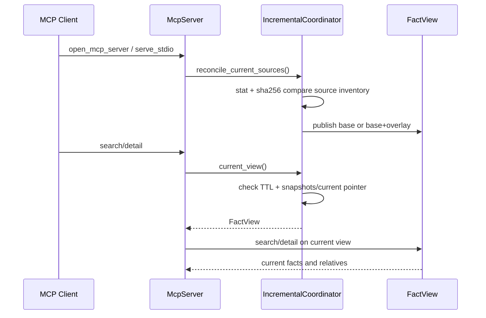
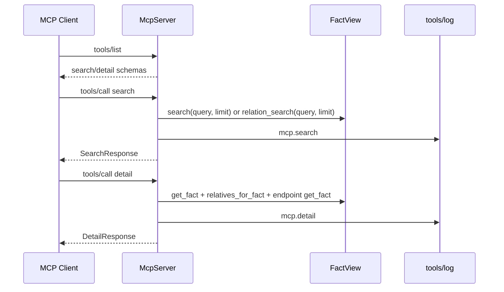
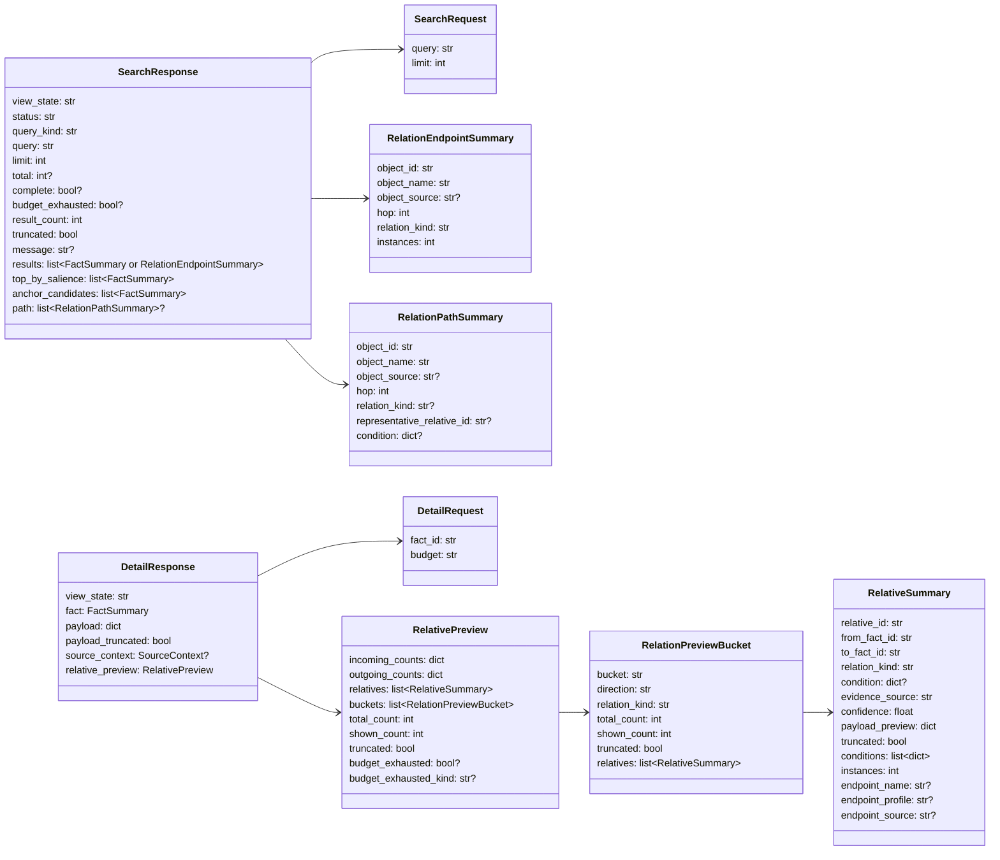

# mcp

## 路径职责

本包负责本地 stdio MCP server 和 Python 查询 API。v1 public tool 只包含 `search` 和 `detail`，均读取 FACT view。MCP 不写 snapshot；启动时若 `incremental.temporary_enabled=true`，会先用 source inventory 对活树做一次临时增量对账，把晚于 base snapshot 且内容 hash 已变化的 source 交给 incremental overlay 重抽。长驻 stdio server 的每次查询都会通过 incremental `current_view()` 取得视图，查询热路径只做 overlay TTL、当前 `snapshots/current` 指针和 cached toolchain fingerprint 的轻量检查；失效时返回 base view，并在结构化响应里暴露当前 `view_state`。MCP 不公开 `impact`、`relations` 或 Graph scope。

## 工具表面

| 工具 | 作用 |
|---|---|
| `search` | 在 FACT 层按多 term 交集匹配并返回 fact 摘要。 |
| `detail` | 展开一个 FACT，返回 payload、source context 和 relative preview。 |

`tools/list` 只能返回 `search` 和 `detail`。`tools/call impact` 必须返回 `unknown_tool`。`search` 和 `detail` 不接受 `scope` 参数。

## Agent 系统提示指导

仓库提供 [`docs/cipher-agent-system-prompt.md`](../../../docs/cipher-agent-system-prompt.md)
作为可直接附加到消费方 agent 系统提示的使用指导。该文件不由 MCP server 自动注入，也不改变 `tools/list`、输入 schema、状态码或运行时行为。

工具描述继续暴露查询语法和响应字段；系统提示指导承载弱模型行为约束，例如 `status="ok"` / `status="too_broad"` 只在当前 indexed FACT view 内表示完整或有界权威答案，以及 relation 结果不应用 grep、`name:` 猜测或自写 parser 补全。快照健康度仍由 `cipher2 status` / views 负责观测，消费方若需要 source-complete 口径应先检查这些告警。

## stdio 启动入口

当前命令行 `cipher2` 只提供 `init` 和 `rebuild`，没有 `serve` 子命令。外部 MCP 客户端需要通过 Python 入口启动 stdio server：

```python
from cipher2.mcp import serve_stdio

raise SystemExit(serve_stdio("/path/to/repo"))
```

`cipher2 init /path/to/repo` 默认会在仓库根创建或合并 `.mcp.json`，写入以下 server 形状。该文件只在目标仓库内；cipher2 不写仓库外客户端配置路径。已有 `.mcp.json` 会保留其它 server，只创建或替换 `mcpServers["cipher-2"]`，并用运行 init 的 `sys.executable` 作为 `command`。使用 `--no-mcp-config` 可跳过写入，使用 `--print-mcp-config` 可打印手工兜底片段。

```json
{
  "mcpServers": {
    "cipher-2": {
      "command": "/path/to/python",
      "args": [
        "-c",
        "from cipher2.mcp import serve_stdio; raise SystemExit(serve_stdio('/path/to/repo'))"
      ]
    }
  }
}
```

`/path/to/python` 必须能导入 `cipher2`，`/path/to/repo` 必须已通过 `cipher2 init` 或 `cipher2 rebuild` 生成 `.cipher/snapshots/current`。stdio server 不创建 snapshot、不监听 HTTP 端口；若启动时发现 source inventory 中的文件已被保存为不同 hash，会在 `.cipher/run/incremental/` 写临时 overlay 并让首个查询读取 overlay 事实，而不是继续返回陈旧 base 关系。若 dirty planning 正在运行或只能安全保留 base 查询，`search` / `detail` 返回 base 结果并分别标注 `view_state="pending"` 或 `view_state="stale"`。

## `search`

Input schema：

| 字段 | type | 取值范围 | 默认值 | 说明 |
|---|---|---|---|---|
| `query` | `str` | 任意字符串 | 必填 | whitespace 分词，所有 term 必须命中同一 fact；或使用 `readers:<field_object_id>` / `writers:<field_object_id>` / `accessors:<field_object_id>` / `dispatches_via:<field_object_id>` / `callers:<function_object_id_or_name>` / `callees:<function_object_id_or_name>` 查询既有边；`callers:` / `callees:` 可加 `depth:<N>` 做有界传递闭包，`reachable:<A>-><B>` 查询有界可达性；可加 `file:<path>` 过滤 |
| `limit` | `int` | `1..50` | `20` | 返回条数 |

Output 关键字段：

- `view_state`
- `base_snapshot_id`
- `overlay_id`
- `query`
- `status`
- `query_kind`
- `limit`
- `total`
- `result_count`
- `truncated`
- `message`
- `complete`
- `budget_exhausted`
- `available_filters`
- `examples`
- `results`
- `top_by_salience`
- `anchor_candidates`
- `path`

普通文本 search 保持原有分词 AND 语义。单个 C identifier 形式的 query 若返回了结果但没有任何精确 `object_name` 命中，response 必须带 `message` 说明结果是文本 fallback 候选，避免调用方把近名 fact 当成精确符号定义。关系型 search 由 `query` 中第一个关系谓词触发，不新增 MCP tool 或参数：

| 谓词 | 语义 |
|---|---|
| `readers:<field_object_id>` | 返回 incoming `field_read` 指向该字段的函数。 |
| `writers:<field_object_id>` | 返回 incoming `field_write` 指向该字段的函数。 |
| `accessors:<field_object_id>` | 合并返回 incoming `field_read` / `field_write` 指向该字段的函数；当 `writers:<field_object_id>` 为空但问题允许读访问兜底时使用。 |
| `dispatches_via:<field_object_id>` | 返回该函数指针字段经 `assigned_to` 解析出的候选函数。 |
| `callers:<function>` | 返回 incoming call edge 的调用方函数，包含 `direct_call` 和 `dispatches_via` 合成跳。 |
| `callees:<function>` | 返回 outgoing call edge 的被调方函数，包含 `direct_call` 和 `dispatches_via` 合成跳。 |
| `callers:<function> depth:<N>` | 返回 incoming call edge N 跳内有界传递调用者闭包。 |
| `callees:<function> depth:<N>` | 返回 outgoing call edge N 跳内有界传递被调函数闭包。 |
| `reachable:<A>-><B>` | 判断 function A 是否在内置有界深度内经 outgoing call edge 到达 function B，并在命中时返回一条最短路径。 |
| `reachable:<A>-><B> depth:<N>` | 使用显式有界深度做同一可达性查询。 |

关系型过滤器包括 `file:<substring>`、`caller:<substring>` 和 `name:<substring>`；`caller:` 与 `name:` 是无条件同义词，均匹配返回端点的 `object_name`，只适合检查已知的特定端点，不应作为枚举候选名的手段。`file:` 匹配返回端点的 repository-relative `object_source` 去掉右侧 `:<正整数行号>` 后的 source file，因此 `ruleutils.c:9647` 可由 `file:ruleutils.c` 命中。bare term 继续按返回端点的可搜索字段执行 AND 匹配。`condition:` 不属于 v1 公开语义。工具描述必须直接暴露 `search(字段名/owner term) -> 取 field result.object_id -> readers:/writers:/accessors:<object_id>` 工作流，不能用 `Type.field` 示例引导调用方合成 anchor。

关系型 anchor 的可靠输入是 search/detail 返回的 exact `object_id`。兼容路径仍会按 field owner alias、exact `object_name`、同 kind 文本 fallback 尝试解析，但调用方不得依赖 `Type.field` 字符串，因为 field `object_name` 只保存裸字段名，owner alias 可能因 typedef、匿名 owner 或模糊 payload 文本落空。候选数为 0 时返回 `status="ok"` 且空结果，候选数大于 1 时返回 `status="needs_refinement"`、有序 `anchor_candidates` 和可执行 example，不执行 join 或 BFS。若只命中同 kind 文本 fallback，即使只有 1 个候选也返回 `status="needs_refinement"`，`message` 必须说明没有精确 anchor，并直接列出候选 `(object_id, owner, source)`；候选 summary 的 `payload_preview.anchor_match` 标为 `fuzzy`。候选排序固定为 resolution tier、exact name、endpoint source file、完整 source、`object_id`。`reachable:<A>-><B>` 独立解析 start 和 target；任一侧歧义时，候选必须标明 `start` 或 `target`。

硬错误（`McpError` / `StorageError`）同样面向模型消费：错误文本必须先陈述事实，再给出可执行下一步；不得回显完整 query、源码正文、绝对 target path 或 traceback。FACT id 不存在时提示重新 `search('<symbol name>')` 获取当前 `object_id`；关系查询的多谓词、空 anchor、`reachable` 格式、`condition:` 或不支持的 `relation_kind` 必须提示保留单一谓词、从 `search` 结果复制 `result.object_id`、用 `detail(<fact_id>)` 查看 relative `condition`，或列出受支持 relation kind。

`depth` 只支持 `callers:`、`callees:` 和 `reachable:`。`callers:` / `callees:` 缺省 `depth:1`，显式深度上限固定为 3；`reachable:` 内置上限固定为 8，显式 `depth` 也不得超过该上限。`depth:0`、负数、非数字、重复 `depth:` 或在 `readers:` / `writers:` / `accessors:` / `dispatches_via:` 上使用 `depth` 时，响应必须是 `status="needs_refinement"`，并给出可执行修正 query，不得静默退化为一跳查询。这些上限是运行时常量，不是用户配置项。

一跳关系查询天然在深度与成本预算内完成：`readers:`、`writers:`、`accessors:`、`dispatches_via:` 以及缺省 `depth:1` 的 `callers:` / `callees:` 若因 `matched_endpoint_count > limit` 返回 `status="too_broad"`，必须同时返回 `complete=true`、`budget_exhausted=false` 和准确 `total`。
`writers:<field_object_id>` 若已解析到字段但没有 `field_write` 端点，响应保持 `status="ok"`、`total=0`，并在 `message` / `examples` 中提示可尝试 `accessors:<field_object_id>` 或 `detail(<field_object_id>)` 查看读写桶。这个提示不表示写覆盖完整，只是避免调用方把“无直接写边”误解为必须弃用 cipher。

传递闭包和可达性查询的 BFS 沿 call edge 的 fact id 执行，不按中间端点名称重新解析，因此链路中间的同名函数不会打断遍历。`direct_call` 直接连接函数；函数指针 dispatch 通过同一 slot 上的 `dispatches_via` 与 `assigned_to` 合成函数 endpoint，并在结果 `relation_kind` / path 中标为 `dispatches_via`。`callees` 使用 outgoing 边，`callers` 使用 incoming 边；root function 距离为 0 且不作为结果返回，环通过请求级 `seen` 集合去重。`file:`、`name:` / `caller:` 和 bare term 只过滤返回端点，不裁剪 frontier，不改变 `reachable:` 的可达性判断。base snapshot 和临时 overlay 可见的 call edge 必须具有相同 anchor、BFS、过滤、计数、排序和 path 语义。

传递查询在 depth 和成本预算都完成时，必须先计算过滤后的精确 `matched_endpoint_count`，再应用 `limit`，`limit` 硬上限为 50。当 `matched_endpoint_count > limit` 时返回 `status="too_broad"`、`complete=true`、准确 `total`、`available_filters`、`examples` 和最显著 `results` 子集；不得只返回弱 `truncated=true`。成本预算固定为 `visited_function_count=10000` 和 `frontier_edge_count=50000`，且在 endpoint 过滤和 `limit` 之前生效；耗尽预算时返回 `status="too_broad"`、`complete=false`、`budget_exhausted=true`、非精确 `matched_endpoint_count`、耗尽类型和可执行收窄提示，不得给出假 `total`。

关系型 `results` 在本契约中采用 slim endpoint row，显式取代 #122 中 `results` / `top_by_salience` 复制完整 fact summary 的关系输出形状。每行只包含端点枚举所需字段，例如 `object_id`、`object_name`、`object_source`、`hop`、`relation_kind` 和 `instances`；不得包含 relation payload preview、source snippet、完整 endpoint payload 或重复完整 summary。关系型 `status="too_broad"` 时 `results` 是显著子集，`top_by_salience` 必须省略或为空，避免与 `results` 重复。端点排序为 shortest `hop`、instances 降序、无条件优先、endpoint 名称、endpoint source file、endpoint id、代表性 relation id。

`reachable:<A>-><B>` 返回 `query_kind="relation_reachable"`。命中时返回 `reachable=true`、`complete=true` 和一条最短 `path`，path entries 使用同一 slim 字段；每个非 root path entry 可带 `condition` 字段，字段为 null 时省略，表示这一跳调用点的局部分支/守卫条件。例如 `reachable:funcC->funcClearA` 可返回 `path[2].condition={"kind":"branch","expression":"reset_flag","branch":"then","source":"src/main.c:4"}`，表示该跳只在 `reset_flag` 为真时发生；多跳 path 的复合成立条件是各跳非空 condition 的逻辑 AND。未命中且 frontier 在深度和成本预算内耗尽时返回 `reachable=false`、`complete=true`。若到达深度边界时仍有未访问 frontier，返回 `reachable=false`、`complete=false`，说明只是 bounded depth 内未到达，不宣称全局无路径；若成本预算先耗尽，还必须返回 `budget_exhausted=true` 和可执行收窄提示。

## `detail`

Input schema：

| 字段 | type | 取值范围 | 默认值 | 说明 |
|---|---|---|---|---|
| `fact_id` | `str` | 非空 FACT id | 必填 | 要展开的 fact |
| `budget` | `str` | `small`、`normal`、`large` | `normal` | 控制 payload、source context、relative preview 大小，并对序列化 `DetailResponse` 施加响应字节上限 |

Output 关键字段：

- `view_state`
- `fact`
- `payload`
- `payload_truncated`
- `source_context`
- `relative_preview`

`relative_preview` 必须按 direction + relation_kind 分桶展示 incoming/outgoing 计数和摘要，不得让 `include`、`has_field`、`direct_call`、`field_read` / `field_write` 混抢同一组名额。字段访问场景中，field fact 的 `object_name` 只保存字段名；`detail(field_id)` 应通过 incoming `has_field` 展示 owner，并通过 incoming `field_read` / `field_write` 展示读写该字段的函数。

relative preview 预算按桶生效：`small=5`、`normal=25`、`large=50`；每桶最多预取 100 条用于排序、多样化和真实计数，`large` 不等于吐出全部预取结果。每个非空桶返回 `bucket`、`direction`、`relation_kind`、`total_count`、`shown_count`、`truncated` 和 `relatives`；`buckets` 是权威关系预览形状。顶层 `relatives` 仅保留最多 8 条扁平兼容样本，供旧客户端降级展示，不再逐字节复制所有 bucket relatives。常用桶名包括 `callers`、`callees`、`field_readers`、`field_writers`、`fields` 和 `field_owner`。

序列化后的 `DetailResponse` 必须满足预算响应上限：`small <= 8KB`、`normal <= 32KB`、`large <= 128KB`。组装完成后若超过上限，运行时按固定顺序裁剪：先收缩顶层扁平 `relatives` 兼容样本，再按显著度逆序清空低显著度 bucket 的 `relatives` 并把对应 `shown_count` 降为 0，再缩小 `source_context` 行数，最后缩小 payload；`total_count`、incoming/outgoing counts 和各 bucket `total_count` 仍保持真实计数，不用裁剪后的数量伪造总量。触发响应字节裁剪时，相关 `payload_truncated`、`source_context.truncated`、`relative_preview.truncated` 或 bucket `truncated` 标志必须置位，并在 `relative_preview` 上返回 `budget_exhausted=true` 与 `budget_exhausted_kind="response_bytes"`。本改动不新增用户可配配置项，也不新增 MCP tool 或参数。

桶内选择先按 `(direction, endpoint, relation_kind)` 归并重复 call-site，`instances` 保留真实多重性，`conditions` 保留去重后的非空条件。排序不使用固定为 `1.0` 的 confidence，而是按 relation tier、`instances` 降序、无条件优先、endpoint 是否缺失、endpoint 名称、endpoint source file 和代表性 `relative_id` 稳定排序。桶被截断时，同一 endpoint source file 先施加 2 条软上限，再按同一排序补齐，保证 shown 集合优先跨源文件。该选择器同样适用于 `field_readers` / `field_writers`：高扇入字段可以出现 `total_count` 远大于 `shown_count` 且 `truncated=true`，这是 bounded preview 的预期状态，不表示 field fact 或 field access relation 缺失。endpoint source file 从 `object_source` 右侧 `:<正整数行号>` 解析；解析失败使用完整 `object_source`，空值使用 `<unknown-source>`。endpoint fact 缺失时使用 `endpoint_name=endpoint_id`、`endpoint_profile=null`、`endpoint_source=null` 和 `<missing-endpoint>`，并排在同等显著度的已解析 endpoint 后。

## 流程

启动对账流程：





`search` 普通文本路径复用 storage 的 kind-aware 排序：精确同名的 `type`、`function`、`global` 等定义类 fact 会优先于同名 `field` fact，避免字段枚举淹没默认结果窗口；同时精确字段名也有按 kind 的小额保底，保证字段名仍能命中 field fact 并继续通过 `detail` 查看 field readers/writers。字段 owner 可参与低权重消歧：`search("Owner.field")`、`search("Owner::field")` 或 `search("Owner field")` 应命中对应 owner 的 field fact，不新增 MCP tool 或参数。字段关系查询的推荐流程是先用普通 `search` 找到 field fact，再把 `result.object_id` 传给 `readers:` / `writers:` / `accessors:`，例如 `search("NullableDatum value") -> result.object_id -> search("writers:<field_object_id>")`。

## 数据结构



### `SearchRequest` 成员表

| 成员名称 | type | 作用 | 并发粒度 |
|---|---|---|---|
| `query` | `str` | 原始查询字符串 | 请求级 |
| `limit` | `int` | 返回条数上限 | 请求级 |

### `SearchResponse` 成员表

| 成员名称 | type | 作用 | 并发粒度 |
|---|---|---|---|
| `view_state` | `str` | base/stale/pending/overlay/error | 响应实例级 |
| `query` | `str` | 原始 query | 响应实例级 |
| `limit` | `int` | 请求 limit | 响应实例级 |
| `result_count` | `int` | 返回数量 | 响应实例级 |
| `truncated` | `bool` | 是否被 limit 或预算截断 | 响应实例级 |
| `complete` | `bool or None` | 关系闭包或可达性查询是否在深度和成本预算内完成 | 响应实例级 |
| `budget_exhausted` | `bool or None` | 关系 BFS 是否耗尽访问或 frontier 成本预算 | 响应实例级 |
| `results` | `list[FactSummary] or list[RelationEndpointSummary]` | 普通 search 为 fact 摘要；关系型 search 为 slim endpoint rows | 响应实例级 |
| `path` | `list[RelationPathSummary] or None` | `reachable` 命中时的一条最短 slim path | 响应实例级 |

### `RelationEndpointSummary` 成员表

| 成员名称 | type | 作用 | 并发粒度 |
|---|---|---|---|
| `object_id` | `str` | endpoint fact id | 响应实例级 |
| `object_name` | `str` | endpoint 名称 | 响应实例级 |
| `object_source` | `str or None` | endpoint repository-relative source | 响应实例级 |
| `hop` | `int` | 离 anchor 的最短 BFS 距离；`reachable` path 中按路径顺序递增 | 响应实例级 |
| `relation_kind` | `str` | 当前为 `direct_call`、`dispatches_via` 或普通一跳关系实际 relation kind | 响应实例级 |
| `instances` | `int` | 该 hop endpoint 的归并 relation 数 | 响应实例级 |

### `RelationPathSummary` 成员表

| 成员名称 | type | 作用 | 并发粒度 |
|---|---|---|---|
| `object_id` | `str` | path node fact id | 响应实例级 |
| `object_name` | `str` | path node 名称 | 响应实例级 |
| `object_source` | `str or None` | path node repository-relative source | 响应实例级 |
| `hop` | `int` | 离 anchor 的最短 BFS 距离；按路径顺序递增 | 响应实例级 |
| `relation_kind` | `str or None` | 到达该 node 的跳类型；root 为 null 或省略 | 响应实例级 |
| `representative_relative_id` | `str or None` | 到达该 node 的代表性 relation id；root 为 null 或省略 | 响应实例级 |
| `condition` | `dict or None` | 到达该 node 的局部分支/守卫条件；null 时省略，多跳复合条件为各跳非空 condition 的逻辑 AND | 响应实例级 |

### `DetailRequest` 成员表

| 成员名称 | type | 作用 | 并发粒度 |
|---|---|---|---|
| `fact_id` | `str` | 要展开的 fact id | 请求级 |
| `budget` | `str` | small/normal/large | 请求级 |

### `DetailResponse` 成员表

| 成员名称 | type | 作用 | 并发粒度 |
|---|---|---|---|
| `view_state` | `str` | 当前视图状态 | 响应实例级 |
| `fact` | `FactSummary` | fact 摘要 | 响应实例级 |
| `payload` | `dict` | bounded payload | 响应实例级 |
| `payload_truncated` | `bool` | payload 是否截断 | 响应实例级 |
| `source_context` | `SourceContext or None` | bounded 源码上下文 | 响应实例级 |
| `relative_preview` | `RelativePreview` | 有界关系预览 | 响应实例级 |

### `RelativePreview` 成员表

| 成员名称 | type | 作用 | 并发粒度 |
|---|---|---|---|
| `incoming_counts` | `dict[str,int]` | incoming relation kind 计数 | 响应实例级 |
| `outgoing_counts` | `dict[str,int]` | outgoing relation kind 计数 | 响应实例级 |
| `relatives` | `list[RelativeSummary]` | 最多 8 条关系摘要的兼容扁平样本；完整预览以 `buckets` 为准 | 响应实例级 |
| `buckets` | `list[RelationPreviewBucket]` | 按 direction + relation_kind 分桶后的关系摘要 | 响应实例级 |
| `total_count` | `int` | 各桶真实 relation 总数 | 响应实例级 |
| `shown_count` | `int` | 已实际返回的 relation 摘要数 | 响应实例级 |
| `truncated` | `bool` | 是否截断 | 响应实例级 |
| `budget_exhausted` | `bool or None` | detail 响应字节预算是否触发裁剪；未触发时可省略 | 响应实例级 |
| `budget_exhausted_kind` | `str or None` | 预算耗尽类型；响应字节裁剪时为 `response_bytes` | 响应实例级 |

### `RelativeSummary` 成员表

| 成员名称 | type | 作用 | 并发粒度 |
|---|---|---|---|
| `relative_id` | `str` | 代表性 relation id | 响应实例级 |
| `from_fact_id` | `str` | 代表性 relation from endpoint | 响应实例级 |
| `to_fact_id` | `str` | 代表性 relation to endpoint | 响应实例级 |
| `relation_kind` | `str` | 关系类型 | 响应实例级 |
| `condition` | `dict or None` | 兼容旧客户端的代表性条件 | 响应实例级 |
| `evidence_source` | `str` | 代表性 evidence source | 响应实例级 |
| `confidence` | `float` | 原 relation confidence；不参与排序 | 响应实例级 |
| `payload_preview` | `dict` | bounded relation payload | 响应实例级 |
| `truncated` | `bool` | payload preview 是否截断 | 响应实例级 |
| `conditions` | `list[dict]` | rollup 后去重条件列表 | 响应实例级 |
| `instances` | `int` | rollup 覆盖的真实 relation 数 | 响应实例级 |
| `endpoint_name` | `str or None` | 归并 endpoint 名称；缺失 endpoint 时为 endpoint id | 响应实例级 |
| `endpoint_profile` | `str or None` | 归并 endpoint 的 `object_profile`；缺失 endpoint 时为 null | 响应实例级 |
| `endpoint_source` | `str or None` | 归并 endpoint 的 `object_source` | 响应实例级 |

### `RelationPreviewBucket` 成员表

| 成员名称 | type | 作用 | 并发粒度 |
|---|---|---|---|
| `bucket` | `str` | 人类和模型可读的桶名，例如 `callers` | 响应实例级 |
| `direction` | `str` | `incoming` 或 `outgoing` | 响应实例级 |
| `relation_kind` | `str` | 对应 FactRelative kind | 响应实例级 |
| `total_count` | `int` | 该桶中真实 relation 数 | 响应实例级 |
| `shown_count` | `int` | 该桶已返回的摘要数 | 响应实例级 |
| `truncated` | `bool` | 该桶是否被预算截断 | 响应实例级 |
| `relatives` | `list[RelativeSummary]` | 该桶的关系摘要 | 响应实例级 |

## 并发控制

- MCP server 是只读 facade，不共享可变请求状态。
- 每次请求打开当前 `FactView`，由 storage 处理 snapshot/overlay 并发。
- stdio JSON-RPC 按输入顺序处理；不要求跨请求事务一致性，响应必须标明 `view_state`。

## 可观测性

- `mcp.request`：工具调用入口。
- `mcp.search`：`result_count`、`limit`、`term_count`、`view_state` 和 raw JSONL `payload.returned_ids`。`returned_ids` 按 response `results` 顺序记录已经过排序、过滤和 `limit` 截断后实际返回给模型的 object id，不记录全 matched 集。关系 BFS 还必须记录 `query_kind=relation|relation_transitive|relation_reachable`、`relation_predicate`、`depth_requested`、`depth_used`、`depth_max`、`anchor_candidate_count`、`visited_function_count`、`visited_function_budget`、`frontier_edge_count`、`frontier_edge_budget`、`matched_endpoint_count`、`total_is_exact`、`returned_count`、`too_broad_count`、`budget_exhausted`、`budget_exhausted_kind`、`reachable_hit`、`path_length` 和 `skipped_missing_endpoint_count`。不得记录 `query_sha256`、完整 query、源码正文、绝对 target path、payload dump、traceback 或完整 path。
- `mcp.detail`：顶层 `subject_id` 必须等于请求的 `fact_id`；counts 记录 `response_bytes`、`response_bytes_limit`、`response_truncated_count`、`flat_relative_count`、`flat_relative_dropped_count`、`bucket_relative_dropped_count`、`relative_bucket_dropped_count`、`budget_exhausted_count`、`source_context_line_dropped_count`、`payload_field_dropped_count`、`context_line_count`、`relative_count`、`relative_total_count`、`relative_bucket_count`、`relative_rollup_group_count`、`relative_collapsed_instance_count`、`relative_preview_source_file_count`、`relative_diversity_bucket_count`、`budget`、`view_state`；payload 记录 `response_truncated`、`budget_exhausted` 和 `budget_exhausted_kind`。
- `mcp.error`：unknown tool、invalid args、not found、storage error。

## 测试门禁

- `tools/list` 只含 `search`、`detail`。
- `impact` 返回 `unknown_tool`。
- `scope` 参数被拒绝。
- search multi-term AND 语义和排序。
- relation search 的 `depth` parser、`callers` / `callees` 有界 BFS、`reachable` 最短 path、path node 条件序列化、slim rows、broad/budget 响应、overlay parity 和无新增 tool/参数。
- detail source context、分桶 relative preview、call-site rollup、salience 排序、source 多样化、overlay parity、field_read/field_write 展示。
- stdio initialize/tools/list/tools/call。
- `scripts/mcp_performance_gate.py` 和 `scripts/mcp_relative_performance_gate.py`。
