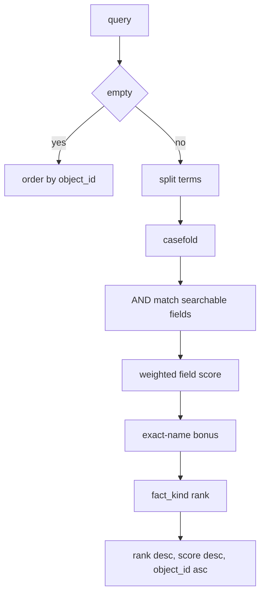
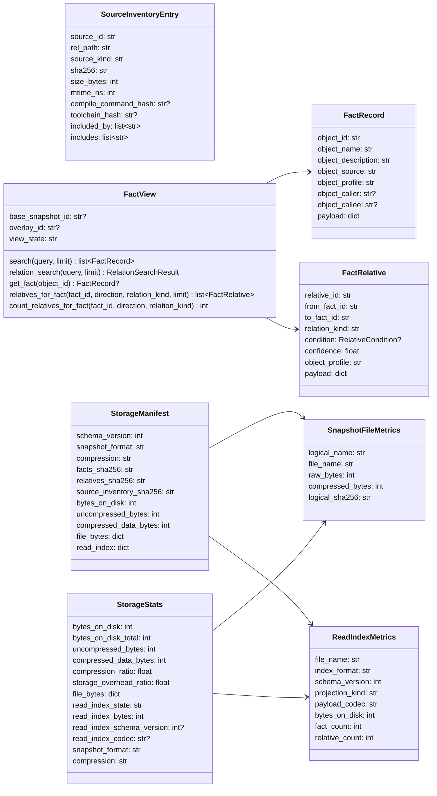
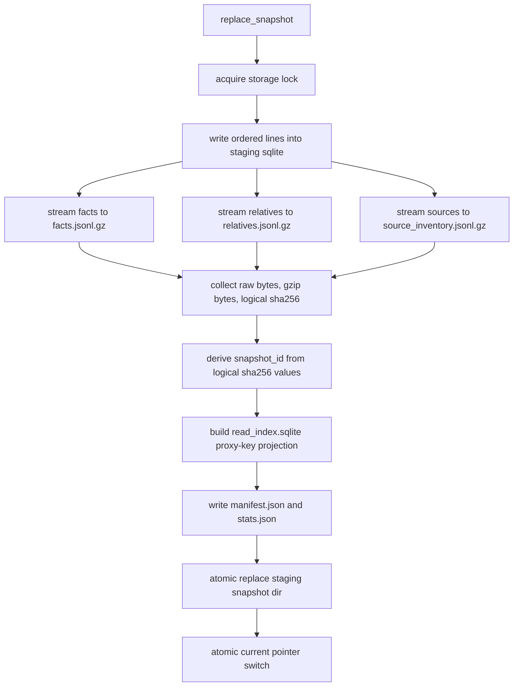
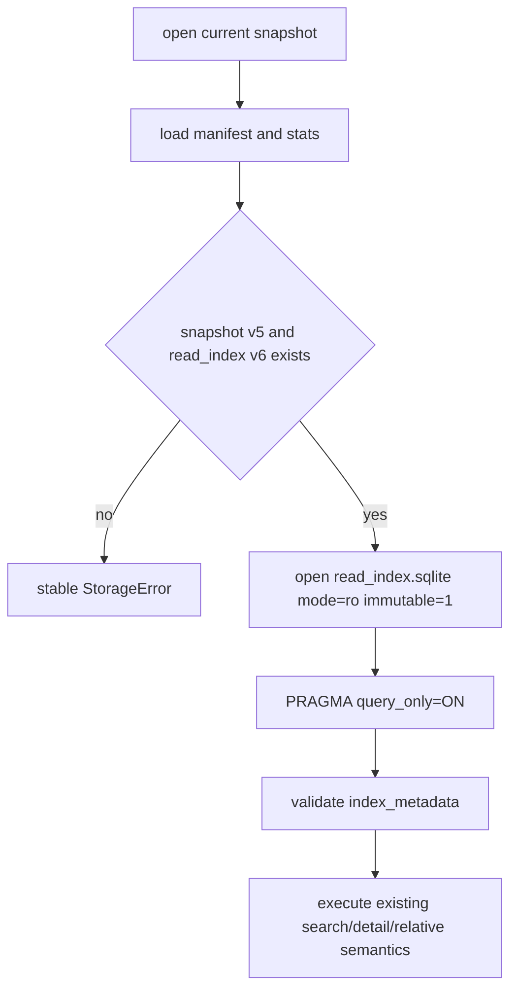

# storage

## 路径职责

storage 负责目标仓库 `.cipher/snapshots/` 下的 FACT snapshot、FactRelative、source inventory、SQLite 读索引、FactView、临时 overlay、搜索、关系预览和统计。它不保存 Graph projection，不提供 MCP public `relations` tool。

## 模块拆分

`__init__.py` 只保留 package 根 re-export，继续支持 `from cipher2.storage import FactView`、`open_fact_store()` 等既有公开导入；snapshot schema、read index schema、CLI/MCP 输出和 Python API 不因拆分改变。

| 文件 | 职责 |
|---|---|
| `constants.py` | snapshot/read-index/gzip/search/relationship 常量。 |
| `models.py` | `StorageError`、`FactRecord`、`FactRelative`、stored/encoded line 和 source inventory 数据结构。 |
| `utils.py` | canonical JSON、hash、gzip/raw line、metadata、路径和时间 helper。 |
| `search.py` | `RelationSearch*` 类型、关系 query parser、in-memory search/relation/closure/reachable 算法。 |
| `views.py` | `TemporaryOverlay`、`FactView`、`StorageManifest` 和 `StorageStats`。 |
| `serialization.py` | snapshot line validation、staged line iterator、gzip JSONL writer 和 field validation helper。 |
| `read_index.py` | `_ReadIndex` 查询、persistent read index row codec、batch insert 和 proxy-key projection helper。 |
| `snapshot_reader.py` | current snapshot 定位、metadata/stats 读取、manifest/file size 校验和 current stream reader。 |
| `snapshot_writer.py` | unsorted/sorted/pre-encoded staging、read-index 构建、manifest/stats 写入和 atomic publish。 |
| `store_events.py` | storage log event、degraded manifest 写回、path safety、snapshot lock 和 size/count helper。 |
| `store.py` | `FileFactStore` facade 与 `open_fact_store()`，public method 保持原签名并委托到上述内部模块。 |

## Snapshot

```text
.cipher/snapshots/
  current
  <snapshot_id>/
    facts.jsonl.gz
    relatives.jsonl.gz
    source_inventory.jsonl.gz
    read_index.sqlite
    manifest.json
    stats.json
```

新 snapshot schema 为 v5，数据文件使用 deterministic gzip JSONL：标准库 `gzip`、`compresslevel=1`、`mtime=0`。gzip 内部仍是逐行 canonical JSON；`facts_sha256`、`relatives_sha256` 和 `source_inventory_sha256` 基于未压缩 line stream，用于 snapshot identity。`read_index.sqlite` 是同一 staging snapshot 派生出的只读 SQLite 查询索引，不参与 `snapshot_id` identity，但 v5 snapshot 必须存在该文件。当前 read index schema version 为 6，relatives 热表和 endpoint 索引使用整数代理键保存 `from_k` / `to_k` / `relative_k`，查询边界再映射回公开字符串 id。`compressed_data_bytes` 只统计三个 gzip 数据文件，`bytes_on_disk` 统计 gzip 数据、`read_index.sqlite`、manifest 和 stats 总大小；`compression_ratio` 表示 `compressed_data_bytes / uncompressed_bytes`，`storage_overhead_ratio` 表示 `bytes_on_disk / uncompressed_bytes`。

新 snapshot 不写 Graph 文件。旧 snapshot 中存在 Graph 文件时，storage 读路径忽略。v4 或更早 snapshot 不做回读兼容；用户需要执行 `cipher2 rebuild` 生成 v5 snapshot。

## Python API

```python
store = open_fact_store(target, mode="r")
records = store.search("free member", limit=20)
field = store.search("NullableDatum value", limit=20)[0]
related = store.relation_search(f"readers:{field.object_id} file:numeric.c", limit=20)
closure = store.relation_search("callees:in_range_numeric_numeric depth:2", limit=50)
path = store.relation_search("reachable:in_range_numeric_numeric->add_var", limit=20)
fact = store.get_fact("fact:function:...")
relatives = store.relatives_for_fact(fact.object_id, direction="both", limit=20)
relative_count = store.count_relatives_for_fact(fact.object_id, direction="both")
view = store.open_view()
```

`FileFactStore.search` 和 `FactView.search` 使用同一分词交集语义。空 query 返回按 `object_id` 排序的前 N 条；非空 query 按 whitespace 分词，所有 term 必须命中同一 fact 的可搜索字段。
`FileFactStore.relation_search` 和 `FactView.relation_search` 是 MCP `search.query` 关系型谓词的内部实现；它只读取已有 facts/relatives，不公开为 MCP tool。
C field fact 的 `object_name` 只保存字段名；字段 owner 不通过 `Type.field` 字符串表达，而是由 incoming `has_field`、payload owner 字段和 relative preview 提供。匿名 `struct/union` 字段使用 extractor 提供的 synthetic owner/type fact；storage 不重新推导 owner。
`direct_call` 关系由 extractor 基于 Clang call reference 写入；跨文件补齐必须在写入 storage 前完成。storage 不按名称重新解析 callee，也不绕过 extractor 的 linkage-aware fallback 规则。

写入路径有两种：

- `replace_snapshot()` 接受未排序 iterable，storage 使用 staging SQLite 按 id 排序、校验 duplicate 和 relation endpoint，再写 gzip snapshot。
- `replace_snapshot_sorted_unique()` 只供 initializer reducer 这类已排序去重的调用方使用。该路径要求 facts 按 `object_id`、relatives 按 `relative_id`、source inventory 按 `source_id` 单调递增且无重复；storage 只做流式顺序/重复校验、relation endpoint 校验、gzip/hash/read-index/manifest/stats 写入，不再调用 `_prepare_snapshot_staging` 对全量记录二次 re-sort。若调用方传入乱序或重复 id，仍以稳定 `StorageError` fail。

initializer 内部还可以调用 pre-encoded sorted-unique 写入路径。该路径接收已经按 storage v5 snapshot line shape 编码好的 `EncodedFactLine` / `EncodedRelativeLine`，也可以接收由 initializer relative external merge 构造出的 raw canonical line + endpoint/kind/profile/condition scalar 引用，直接把 canonical line bytes 写入 gzip，并复用同一 relation endpoint 校验、hash、read index、manifest/stats 和 atomic publish 逻辑；它不是 public API，不接受未排序输入，也不改变已发布 snapshot schema。

read index 是 gzip JSONL 的派生投影。构建时按 `object_id` 升序分配 `fact_k`，按 `relative_id` 升序分配 `relative_k`；`facts` 继续以公开 `object_id` 保存 search/detail 所需列，`fact_keys` 只在 snapshot 含 relatives 时保存 `fact_k -> object_id` 代理键映射，`relative_ids` 只在返回有限结果时把 `relative_k` 映射回 `relative_id`。`relatives` 表只保存 `from_k`、`to_k` 和 `relative_k`，因此 endpoint 二级索引不再重复保存长字符串；无 relatives 的 fact-only snapshot 不写入 `fact_keys` 行，避免为关系优化增加体积。旧 schema version 5 的 `read_index.sqlite` 与新 reader 不兼容，缺失、损坏或 metadata mismatch 时必须提示 rebuild，不得静默重建内存索引。

## Search 语义



可搜索字段：

- `object_name`
- `object_description`
- `object_caller`
- `object_callee`
- `object_source`
- field owner alias：仅 field fact 派生自 `payload.owner_name` / `payload.type`，包含 owner 名、`Owner.field` 和 `Owner::field`

非空 query 的排序为 kind-aware：先按字段匹配分、精确 `object_name` bonus 和 `fact_kind_rank` 合成排序分，再用原字段匹配分、精确名、kind rank 和 `object_id` 打破平局。`type`、`function`、`global`、`macro`、`code_file`、`function_pointer_slot` 等定义或调用端点 fact 的 kind rank 高于 `field`，因此同名字段不会填满默认结果窗口并挤出同名 type/function fact。为避免字段检索路径断裂，精确 `object_name == query` 的候选按 fact_kind 提供小额保底；例如 `search("client")` 应同时看到 `client` type/function 和若干 `client` field，`search("next")` 应在默认窗口内返回 `next` field fact。该规则不新增用户配置项或 MCP 参数。

字段权重：

| 字段 | 权重 |
|---|---|
| `object_name` | 3 |
| `object_description` | 2 |
| `object_caller` | 2 |
| `object_callee` | 2 |
| `object_source` | 1 |
| field owner alias | 1 |

每个 term 独立打分，候选 fact 的总分为所有 term 得分之和。缺任意 term 则不返回。
field owner alias 权重较低，只用于 owner 限定检索消歧；例如 `search("NullableDatum.value")` 或 `search("NullableDatum value")` 应直接返回 `NullableDatum` owner 的 `value` field fact，之后用返回的 `object_id` 调 `detail(field_id)` 或 `readers:<field_id>` / `writers:<field_id>` / `accessors:<field_id>` 查看关系。

关系型 search 在同一 `query` 字符串中使用一个谓词：`readers:<field_id>`、`writers:<field_id>`、`accessors:<field_id>`、`dispatches_via:<field_id>`、`callers:<function>`、`callees:<function>` 或 `reachable:<start>-><target>`。`dispatches_via:<field_id>` 以函数指针字段为 anchor，返回该 slot 经 `assigned_to` 解析出的候选函数。`callers:` / `callees:` 可追加 `depth:<N>` 做有界传递闭包；`reachable:` 可追加 `depth:<N>` 限制有界可达性。anchor 的可靠输入是 exact `object_id`；兼容路径仍按 field owner alias、exact `object_name`、同 kind 文本 fallback 尝试解析。调用方不得依赖自造 `Type.field`，因为 field fact 的 `object_name` 只保存裸字段名，owner alias 可能因 typedef、匿名 owner 或 payload 模糊匹配落空。候选数大于 1 时返回 `needs_refinement`。若只命中同 kind 文本 fallback，即使只有 1 个候选也返回 `needs_refinement`，不得把近名 fact 静默当作确定 anchor 执行 join 或 BFS。候选按 resolution tier、exact name、line-stripped source file、完整 source、`object_id` 排序；MCP message 会列出候选 `(object_id, owner, source)`。关系 join 使用已有 `field_read`、`field_write` 和 `assigned_to` relation；call BFS 使用 `direct_call`，并把同一 slot 上的 `dispatches_via` + `assigned_to` 合成为候选 function endpoint。

关系型过滤器包括 `file:<substring>`、`caller:<substring>` 和 `name:<substring>`；`caller:` 与 `name:` 是无条件同义词。`file:` 对返回端点的 `object_source` 从右侧剥离 `:<正整数行号>` 后再做 casefold substring 匹配，避免 `ruleutils.c:9647` 和 `ruleutils.c` 被当成不同文件。bare term 继续按返回端点的普通可搜索字段 AND 匹配；`condition:` 不属于 v1。

`depth` 只支持 `callers:`、`callees:` 和 `reachable:`。`callers:` / `callees:` 缺省为 `depth:1`，显式上限固定为 3；`reachable:` 内置上限固定为 8。`depth:0`、负数、非数字、重复 `depth:`、超过对应上限，或在 `readers:` / `writers:` / `accessors:` / `dispatches_via:` 上使用 `depth`，都必须返回 `needs_refinement` 和可执行修正 query，不得静默退化为一跳关系搜索。

一跳关系查询天然在深度与成本预算内完成：`readers:`、`writers:`、`accessors:`、`dispatches_via:` 以及缺省 `depth:1` 的 `callers:` / `callees:` 若因 `matched_endpoint_count > limit` 返回 `too_broad`，必须同时暴露 `complete=true`、`budget_exhausted=false` 和准确 `total`。
当 `writers:<field_id>` 已解析到字段但没有匹配 `field_write` 端点时，结果保持 `ok` / `total=0`，并在 message/examples 中提示可尝试 `accessors:<field_id>` 或 `detail(<field_id>)` 作为读访问兜底。

`callers:` / `callees:` 的传递闭包由 read index 对 call edge 做 BFS：`direct_call` 直接连接 `function -> function`；函数指针 dispatch 通过同一 slot 上的 `function -> slot dispatches_via` 与 `slot -> function assigned_to` 合成一条候选 call edge，并在结果 `relation_kind` / path 中标为 `dispatches_via`。`callees` 走 outgoing 边，`callers` 走 incoming 边，root function 距离为 0 且不作为 endpoint 返回；每个 endpoint 只按最短 hop 返回一次；请求级 `seen` 集合必须处理环。中间节点跟随 stored endpoint id，不重新按名称解析；缺失 endpoint fact 的边跳过显示和遍历，并计入 `skipped_missing_endpoint_count`。`file:`、`name:` / `caller:` 和 bare term 只过滤返回端点，不裁剪 frontier，因此不会改变可达性。base snapshot 和临时 overlay 视图必须在 anchor、BFS、过滤、计数、排序和 path 构建上保持一致。

`reachable:<A>-><B>` 总是从 A 沿 outgoing call edge 查找 B，并在首次命中时返回一条最短 path；直接调用 path node 标为 `direct_call`，dispatch 合成跳标为 `dispatches_via`。path node 的 `condition` 保留该跳代表性 `FactRelative.condition` 或 `None`，表示这一跳调用点的局部分支/守卫条件；多跳 path 的复合成立条件是各跳非空 condition 的逻辑 AND。若 frontier 在深度和成本预算内耗尽，返回 `reachable=false`、`complete=true`；若到达深度边界时仍有未访问 frontier，返回 `reachable=false`、`complete=false`，不声明全局无路径；若成本预算先耗尽，返回 `reachable=false`、`complete=false`、`budget_exhausted=true` 和可执行收窄提示。

关系型结果先按 endpoint id 归并，再按 shortest `hop`、instances 降序、无条件优先、endpoint 名称、endpoint source file、endpoint id、代表性 relation id 排序。closure 查询只有在 depth 与成本预算都完成时，才能在应用 `limit` 前给出精确 `matched_endpoint_count` 和 `total`；若大于 `limit`，MCP 层返回 `status="too_broad"`、准确 `total` 和可执行精化提示，而不是只暴露 `truncated=true`。成本预算固定为 `visited_function_count=10000` 和 `frontier_edge_count=50000`，并在 endpoint 过滤和 `limit` 之前生效；预算耗尽时必须返回 `complete=false`、`budget_exhausted=true`、非精确 `matched_endpoint_count`，且不得给出假 `total`。

关系型 output row 是 slim endpoint row，面向枚举而非完整 fact 展示：只包含 `object_id`、`object_name`、`object_source`、`hop`、`relation_kind`、`instances` 等必要字段；不包含 relation payload preview、source snippet、完整 endpoint payload 或重复 full summary。`reachable` 的 `path` 使用同一 slim row 形状，并在非空时带 `condition`，保留 path 顺序、每跳 `direct_call` / `dispatches_via` 类型和局部条件。

## 数据结构



### `FactRecord` 成员表

| 成员名称 | type | 作用 | 并发粒度 |
|---|---|---|---|
| `object_id` | `str` | 稳定 fact id；C function/type/field 可包含 source 或 owner identity | snapshot 级不可变 |
| `object_name` | `str` | 可搜索名称；C field 只保存字段名 | snapshot 级不可变 |
| `object_description` | `str` | 可搜索描述 | snapshot 级不可变 |
| `object_source` | `str` | 仓库相对源码位置 | snapshot 级不可变 |
| `object_profile` | `str` | profile | snapshot 级不可变 |
| `object_caller` | `str or None` | caller 摘要 | snapshot 级不可变 |
| `object_callee` | `str or None` | callee 摘要 | snapshot 级不可变 |
| `payload` | `dict[str, JSONValue]` | 有界结构化数据 | snapshot 级不可变 |

### `FactRelative` 成员表

| 成员名称 | type | 作用 | 并发粒度 |
|---|---|---|---|
| `relative_id` | `str` | 稳定 relation id | snapshot 级不可变 |
| `from_fact_id` | `str` | 起点 fact id | snapshot 级不可变 |
| `to_fact_id` | `str` | 终点 fact id | snapshot 级不可变 |
| `relation_kind` | `str` | include/direct_call/field_read 等关系类型 | snapshot 级不可变 |
| `condition` | `RelativeCondition or None` | 保守条件摘要 | relation 级 |
| `confidence` | `float` | 抽取置信度 | relation 级 |
| `object_profile` | `str` | profile | relation 级 |
| `payload` | `dict[str, JSONValue]` | 有界 evidence | relation 级 |

### `SourceInventoryEntry` 成员表

| 成员名称 | type | 作用 | 并发粒度 |
|---|---|---|---|
| `source_id` | `str` | 稳定 source id | snapshot 级不可变 |
| `rel_path` | `str` | 仓库相对路径 | snapshot 级不可变 |
| `source_kind` | `str` | 文件类型 | snapshot 级不可变 |
| `sha256` | `str` | 文件 hash | snapshot 级不可变 |
| `size_bytes` | `int` | 文件大小 | snapshot 级不可变 |
| `mtime_ns` | `int` | 修改时间 | snapshot 级不可变 |
| `compile_command_hash` | `str or None` | 当前 source 的 compile command 摘要；配置 compile database 的独立 AST source 来自 per-file entry，未配置 compile database 时来自全局 `clang_args`；被 include graph 跟踪的 header 可为空 | snapshot 级不可变 |
| `toolchain_hash` | `str or None` | toolchain 摘要 | snapshot 级不可变 |
| `included_by` | `list[str]` | 反向 include source ids | snapshot 级不可变 |
| `includes` | `list[str]` | 正向 include source ids | snapshot 级不可变 |

### `FactView` 成员表

| 成员名称 | type | 作用 | 并发粒度 |
|---|---|---|---|
| `base_snapshot_id` | `str or None` | base snapshot | view 实例级 |
| `overlay_id` | `str or None` | 临时 overlay id | view 实例级 |
| `view_state` | `str` | `base`、`stale`、`pending`、`overlay` 或 `error` | view 实例级 |
| `search()` | `callable` | base 或 base+overlay 分词搜索 | 请求级 |
| `relation_search()` | `callable` | base 或 base+overlay 关系谓词、传递闭包和可达性查询 | 请求级 |
| `get_fact()` | `callable` | 读取可见 fact | 请求级 |
| `relatives_for_fact()` | `callable` | 读取 bounded 关系预览 | 请求级 |
| `count_relatives_for_fact()` | `callable` | 读取匹配关系总数，不受 preview limit 限制 | 请求级 |
| `_overlay_relatives_cache` | `list[FactRelative] or None` | active overlay 视图首次 relation 查询时惰性物化可见 relatives，供 `relatives_for_fact()`、`count_relatives_for_fact()` 和 relation search 共享，避免同一 detail 请求重复全量扫描 base relatives；base 视图仍走 read index | view 实例级 |

### `StorageManifest` 新增/调整成员表

| 成员名称 | type | 作用 | 并发粒度 |
|---|---|---|---|
| `snapshot_format` | `str` | 固定为 `compact-jsonl-gzip`，标识数据文件格式 | snapshot 级不可变 |
| `compression` | `str` | 固定为 `gzip-1`，标识算法和压缩等级 | snapshot 级不可变 |
| `uncompressed_bytes` | `int` | 三个数据文件压缩前总字节数 | snapshot 级不可变 |
| `compressed_data_bytes` | `int` | 三个 gzip 数据文件压缩后总字节数 | snapshot 级不可变 |
| `file_bytes` | `dict[str,dict]` | `facts`、`relatives`、`source_inventory` 的 raw/compressed 字节数 | snapshot 级不可变 |
| `read_index` | `dict[str,JSONValue]` | `read_index.sqlite` 文件名、schema、projection、codec、大小和行数 | snapshot 级不可变 |
| `facts_sha256` | `str` | 未压缩 `facts` line stream hash | snapshot 级不可变 |
| `relatives_sha256` | `str` | 未压缩 `relatives` line stream hash | snapshot 级不可变 |
| `source_inventory_sha256` | `str` | 未压缩 source inventory line stream hash | snapshot 级不可变 |

### `StorageStats` 新增成员表

| 成员名称 | type | 作用 | 并发粒度 |
|---|---|---|---|
| `snapshot_format` | `str` | views/status 展示当前 snapshot 格式 | snapshot 级不可变 |
| `compression` | `str` | views/status 展示压缩策略 | snapshot 级不可变 |
| `uncompressed_bytes` | `int` | 压缩前体积 | snapshot 级不可变 |
| `compressed_data_bytes` | `int` | 三个 gzip 数据文件压缩后体积 | snapshot 级不可变 |
| `compression_ratio` | `float` | `compressed_data_bytes / uncompressed_bytes`，写入时保留两位小数，无数据时为 `1.0` | snapshot 级不可变 |
| `storage_overhead_ratio` | `float` | `bytes_on_disk / uncompressed_bytes`，包含 read index 和 metadata | snapshot 级不可变 |
| `file_bytes` | `dict[str,dict]` | 每类数据文件压缩前后字节数 | snapshot 级不可变 |
| `read_index_state` | `str` | `ready` 或 `missing` | snapshot 级不可变 |
| `read_index_bytes` | `int` | `read_index.sqlite` 文件大小 | snapshot 级不可变 |
| `read_index_schema_version` | `int or None` | read index schema，当前为 `6` | snapshot 级不可变 |
| `read_index_codec` | `str or None` | payload/condition 编码，当前为 `json-text` | snapshot 级不可变 |

### `SnapshotFileMetrics` 成员表

| 成员名称 | type | 作用 | 并发粒度 |
|---|---|---|---|
| `logical_name` | `str` | `facts`、`relatives` 或 `source_inventory` | staging 文件级 |
| `file_name` | `str` | 落盘文件名，如 `facts.jsonl.gz` | staging 文件级 |
| `raw_bytes` | `int` | 写入 gzip 前的 canonical line bytes | staging 文件级 |
| `compressed_bytes` | `int` | gzip 关闭后的实际文件大小 | staging 文件级 |
| `logical_sha256` | `str` | 未压缩 canonical line stream hash | staging 文件级 |

## 写入和读取流程





## 并发控制

- snapshot 写入使用 staging 目录，gzip 文件关闭、hash 校验、manifest/stats 写入后原子切换 `current`。
- `replace_snapshot` 按 iterable 顺序消费 facts、relatives、source inventory；staging SQLite 负责排序、去重错误和 relation endpoint 校验，不把全量 fact id 集合保存在 Python 内存中。`replace_snapshot_sorted_unique` 复用 storage 的 snapshot 写入、hash、read index 和 publish 逻辑，但跳过全量记录 re-sort，只用临时 SQLite fact id 表校验 relative endpoint。pre-encoded sorted-unique 路径同样只保留 fact id 表用于 endpoint 校验，facts/relatives 数据行按调用方提供的 canonical bytes 流式写入，不再构造 `FactRecord` / `FactRelative` 只为重建 snapshot line；read index 构建仍从最终 gzip JSONL 解析公开 snapshot 行，属于 storage 阶段而不是 initializer merge 阶段。initializer 传入 `stage_sink` 时，storage 在 staging 准备完成后发 `snapshot_write` 阶段，在 persistent read index 构建完成后发 `read_index` 阶段。
- SQLite read index 由 `_ReadIndex.lock` 保护 connection。
- `_ReadIndex` cache key 使用 snapshot 路径、逻辑 sha256、counts、read index schema、read index size/mtime 作为身份；schema version 5 或 metadata 不匹配的旧 read index 必须返回稳定 rebuild 提示。
- `FactView` 是只读视图；overlay 合并不修改 base snapshot。
- writer 不删除旧 snapshot；`immutable=1` 依赖已发布 snapshot 在 reader 存活期间不被修改或删除，清理策略必须单独设计 active reader 保护。

## 可观测性

- `storage.write`：fact、relative、source 数量、`snapshot_format`、`compression`、压缩前后 bytes、分文件 bytes、`read_index_bytes`、`read_index_build_ms`、`compression_ratio_percent` 和 `storage_overhead_ratio_percent`。
- `init.stage(snapshot_write)`：storage staging preparation wall-clock，覆盖 gzip/hash/source inventory/manifest/stats 准备；counts 包含 `fact_count`、`relative_count`、`source_count`、`uncompressed_bytes`、`compressed_data_bytes`，不重复写 `bytes_written`。
- `init.stage(read_index)`：persistent `read_index.sqlite` 构建 wall-clock；counts 包含 `read_index_bytes` 和 `read_index_build_ms`。`read_index_build_ms` 字段名保留，口径与 read index 构建窗口一致。
- `storage.index_open`：`index_backend=persistent-sqlite`、`outcome=opened|cache_hit`、`read_index_open_ms` 和 `read_index_bytes`。
- `storage.search`：`matched_count`、`limit`、`term_count`、`query_kind=empty|terms|relation|relation_transitive|relation_reachable` 和 `query_preview`；关系 BFS 还必须记录 `relation_predicate`、`depth_requested`、`depth_used`、`depth_max`、`anchor_candidate_count`、`visited_function_count`、`visited_function_budget`、`frontier_edge_count`、`frontier_edge_budget`、`matched_endpoint_count`、`total_is_exact`、`returned_count`、`too_broad_count`、`budget_exhausted`、`budget_exhausted_kind`、`reachable_hit`、`path_length` 和 `skipped_missing_endpoint_count`。storage 层不记录 `query_sha256`，也不承担模型可见 `returned_ids` 归因；模型实际拿到的 result id 只由 `mcp.search.payload.returned_ids` 记录。不得记录完整 query、源码正文、绝对 target path、payload dump、traceback 或完整 path。
- `storage.detail` / `storage.relations`：内部审计事件，不作为 MCP public tool。
- `storage.error`：稳定错误码，覆盖 gzip 解压失败、manifest 缺失、schema 不匹配和 digest mismatch。

## 测试门禁

- snapshot v5 gzip + `read_index.sqlite` schema v6 写读、整数代理键投影、hash 校验、gzip corruption、digest mismatch、path safety。
- v4 或更旧 snapshot 不兼容并提示 rebuild。
- multi-term search：空 query、单 term、多 term、顺序无关、AND 语义、排序稳定。
- overlay search 与 base search 语义一致。
- relation search：一跳 `callers` / `callees` 默认语义、`depth` parser、`callers` / `callees` 有界 BFS、cycle 去重、endpoint filters 不裁剪 frontier、`reachable` 最短 path、path node 条件传递、完整/不完整可达性区分、高扇出预算耗尽、slim endpoint rows、base/overlay parity。
- field_read/field_write relation stats 和 relative preview。
- `storage.write` / `storage.index_open` 索引统计和 views storage section 展示。
- `scripts/storage_performance_gate.py` 与 `scripts/storage_relative_performance_gate.py` 必须输出 raw/compressed/total snapshot MB、`read_index_mb`、read-index/压缩数据比例、压缩率、storage overhead、`cold_index_open_ms` 和 `first_search_ms`。
