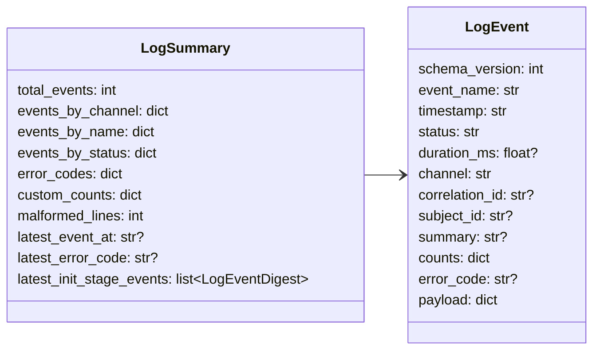

# tools/log

## 路径职责

`tools/log` 是目标仓库 `.cipher/log/*.jsonl` 的追加式机器事件源。它为 config、initializer、extractor、storage、incremental、MCP 和 views 提供结构化事件、脱敏、读取和摘要。

不再保留 `graph` 或 `inference` 专属 channel。旧日志文件存在时可以读取，但 views 不再构建 graph/inference section。

## 事件文件

```text
.cipher/log/
  cli.jsonl
  config.jsonl
  initializer.jsonl
  storage.jsonl
  incremental.jsonl
  mcp.jsonl
  views.jsonl
  log.jsonl
```

## LogEvent



### `LogEvent` 成员表

| 成员名称 | type | 作用 | 并发粒度 |
|---|---|---|---|
| `schema_version` | `int` | log schema 版本；新写入事件为 `2`，reader/summary 兼容历史 `1` 和当前 `2` | 事件级 |
| `event_name` | `str` | dot-separated 事件名 | 事件级 |
| `timestamp` | `str` | UTC 时间 | 事件级 |
| `status` | `str` | `ok`、`warning`、`error` | 事件级 |
| `duration_ms` | `float or None` | 耗时 | 事件级 |
| `channel` | `str` | 文件 channel | 事件级 |
| `correlation_id` | `str or None` | 关联 id | 事件级 |
| `subject_id` | `str or None` | 脱敏主体 id | 事件级 |
| `summary` | `str or None` | 短摘要 | 事件级 |
| `counts` | `dict[str,int]` | 可聚合计数 | 事件级 |
| `error_code` | `str or None` | 稳定错误码 | 事件级 |
| `payload` | `dict[str, JSONValue]` | 有界字段 | 事件级 |

### `LogSummary` 成员表

| 成员名称 | type | 作用 | 并发粒度 |
|---|---|---|---|
| `total_events` | `int` | 总事件数 | 查询级 |
| `events_by_channel` | `dict[str,int]` | channel 分布 | 查询级 |
| `events_by_name` | `dict[str,int]` | event name 分布 | 查询级 |
| `events_by_status` | `dict[str,int]` | status 分布 | 查询级 |
| `error_codes` | `dict[str,int]` | 错误码分布 | 查询级 |
| `custom_counts` | `dict[str,int]` | counts 聚合 | 查询级 |
| `malformed_lines` | `int` | 损坏行数 | 查询级 |
| `latest_event_at` | `str or None` | 最近事件时间 | 查询级 |
| `latest_error_code` | `str or None` | 最近错误码 | 查询级 |
| `latest_init_stage_events` | `list[LogEventDigest]` | 最近一次 init/rebuild 各 `init.stage` 阶段事件摘要，即使这些事件已不在 `recent_events` 窗口内也会保留 | 查询级 |

## 字段摘要 allowlist

Log digest 只展示 allowlist 中的 payload 标量，包含：

- `operation`
- `outcome`
- `stage`
- `stage_duration_ms`
- `query_kind`
- `query_preview`
- `relation_predicate`
- `term_count`
- `matched_count`
- `matched_endpoint_count`
- `returned_count`
- `anchor_candidate_count`
- `too_broad_count`
- `filter_count`
- `limit`
- `relation_kind`
- `field_read_count`
- `field_write_count`
- `has_compile_database`
- `compile_database_scope`
- `compile_command_hit_count`
- `compile_command_miss_count`
- `compile_command_argument_count`
- `compile_command_stripped_argument_count`
- `compile_command_entry_count`
- `compile_command_indexed_source_count`
- `compile_command_duplicate_source_count`
- `compile_command_ignored_outside_repo_count`
- `extractor_worker_count`
- `worker_count`
- `successful_file_count`
- `skipped_file_count`
- `max_unmerged`
- `mode`
- `relative_map_input_count`
- `relative_map_written_count`
- `relative_map_skipped_exact_count`
- `relative_worker_duplicate_exact_count`
- `relative_worker_duplicate_conflict_count`
- `relative_worker_dedup_tracked_entry_count`
- `relative_worker_dedup_saturated_count`
- `relative_merge_input_count`
- `relative_merge_accepted_count`
- `relative_merge_duplicate_exact_count`
- `relative_merge_conflict_count`
- `relative_merge_segment_count`
- `relative_merge_input_bytes`
- `relative_merge_index_bytes`
- `relative_merge_duration_ms`
- `relative_merge_full_parse_count`
- `relative_merge_max_heap_size`
- `relative_merge_fan_in`
- `relative_merge_pass_count`
- `relative_merge_peak_open_segment_count`
- `clang_executable_scope`
- `libclang_library_scope`
- `gcc_executable_scope`
- `backend`
- `clang_vendor`
- `clang_version`
- `libclang_version`
- `version_match`
- `ast_json_supported`
- `type_driven_ast`
- `loc_file_supported`
- `call_reference_supported`
- `member_reference_supported`
- `qual_type_supported`
- `missing_evidence`
- `typed_member_expr_count`
- `typed_call_expr_count`
- `source_from_loc_file_count`
- `source_fallback_count`
- `unresolved_call_count`
- `parse_duration_ms`
- `traverse_duration_ms`
- `partial_ast_count`
- `pending_call_count`
- `resolved_call_count`
- `external_unresolved_count`
- `internal_unresolved_count`
- `ambiguous_call_count`
- `linkage_filtered_count`
- `missing_caller_count`
- `duplicate_relation_count`
- `field_owner_count`
- `record_owner_count`
- `anonymous_record_count`
- `synthetic_type_fact_count`
- `field_decl_count`
- `field_fact_count`
- `field_decl_without_fact_count`
- `wrapped_member_expr_count`
- `macro_wrapped_member_expr_count`
- `bitwise_member_expr_count`
- `compound_field_access_count`
- `field_access_scan_truncated_count`
- `field_access_resolved_count`
- `field_access_unresolved_count`
- `function_pointer_slot_count`
- `function_pointer_assignment_count`
- `function_pointer_dispatch_count`
- `macro_direct_call_count`
- `unresolved_dispatch_slot_count`
- `unresolved_dispatch_function_count`
- `header_decl_cache_entry_count`
- `header_decl_cache_hit_count`
- `header_decl_cache_miss_count`
- `header_decl_skipped_subtree_count`
- `header_decl_seed_count`
- `relative_rollup_group_count`
- `relative_collapsed_instance_count`
- `relative_preview_source_file_count`
- `relative_diversity_bucket_count`
- `gcc_required`
- `gcc_checked`
- `warning_count`
- `incremental_enabled`
- `command_name`
- `exit_code`
- `json_output`
- `source_root_count`
- `profile`
- `snapshot_format`
- `compression`
- `bytes_written`
- `uncompressed_bytes`
- `compressed_data_bytes`
- `read_index_bytes`
- `read_index_build_ms`
- `read_index_open_ms`
- `compression_ratio_percent`
- `storage_overhead_ratio_percent`
- `facts_raw_bytes`
- `facts_compressed_bytes`
- `relatives_raw_bytes`
- `relatives_compressed_bytes`
- `source_inventory_raw_bytes`
- `source_inventory_compressed_bytes`
- `view_state`
- `overview_state`
- `base_snapshot_id`
- `overlay_id`
- `pending_task_count`
- `stale_source_count`
- `budget`
- `tool_name`
- `error_code`

不得加入源码正文、绝对 target path、完整 query、traceback、secret 或 provider internals。`mcp.search.payload.returned_ids` 只保留在 raw JSONL 中，不进入 digest allowlist，避免长 id 列表挤占摘要视图；`base_snapshot_id` 继续保留在 allowlist 中，用于 status、view model 和快照复现。Digest 事件行最多展示 8 个 `count.*` 字段；选择顺序先保留 warning/partial/coverage 相关计数（如 `partial_ast_count`、`warning_count`、field gap、direct call warning、compile database miss），再保留 worker pool source/worker/success/skipped 和 header cache hit/skipped/entry/miss/seed 等性能诊断计数，最后按字段名补足，保证人类视图优先看到会改变 section state 的信号。

## Storage Snapshot 可观测事件

`storage.write` 写入 `storage.jsonl`，用于呈现 snapshot 写入、压缩格式和小型化收益。该事件不得保存完整 query、源码正文、绝对 target path 或 gzip 文件内容。

| 字段 | 值 |
|---|---|
| `payload.snapshot_format` | `compact-jsonl-gzip` |
| `payload.compression` | `gzip-1` |
| `payload.read_index_format` | `sqlite-read-index` |
| `payload.read_index_codec` | `json-text` |
| `counts.bytes_written` | snapshot 总字节数，包含 gzip 数据、read index 和 metadata |
| `counts.uncompressed_bytes` | 三个数据文件压缩前总字节数 |
| `counts.compressed_data_bytes` | 三个 gzip 数据文件总字节数 |
| `counts.read_index_bytes` | `read_index.sqlite` 文件大小 |
| `counts.read_index_build_ms` | 写入阶段构建 read index 的耗时 |
| `counts.compression_ratio_percent` | `round(compressed_data_bytes * 100 / uncompressed_bytes)`，无数据时为 `100` |
| `counts.storage_overhead_ratio_percent` | `round(bytes_written * 100 / uncompressed_bytes)`，无数据时为 `100` |
| `counts.facts_raw_bytes` / `counts.facts_compressed_bytes` | facts 文件压缩前后字节数 |
| `counts.relatives_raw_bytes` / `counts.relatives_compressed_bytes` | relatives 文件压缩前后字节数 |
| `counts.source_inventory_raw_bytes` / `counts.source_inventory_compressed_bytes` | source inventory 文件压缩前后字节数 |

`storage.index_open` 写入 read index 打开观测，payload 包含 `index_backend=persistent-sqlite` 和 `outcome=opened|cache_hit`，counts 包含 `read_index_open_ms` 与 `read_index_bytes`。`storage.error` 必须使用稳定错误码覆盖 gzip 解压失败、manifest 文件缺失、schema 不匹配、digest mismatch、read index 缺失或损坏。

## Init Stage 可观测事件

`init.stage` 写入 `initializer.jsonl`，用于把一次 `init` / `rebuild` 的阶段耗时从事件层传递到 summary、views 和 CLI/status。事件 payload 必须包含 `operation="initialize_repository"`、`outcome="stage_completed"`、`stage` 和 `stage_duration_ms`。`LogSummary.latest_init_stage_events` 按阶段保留最近一次阶段摘要，不依赖 `recent_events` 的 20 条窗口。

| stage | 口径 | counts 约束 |
|---|---|---|
| `collect` | compile database index + source collection wall-clock | `source_count`、`compile_database_configured_count` |
| `extract` | worker pool wall-clock，从 collect 后到所有 per-file outcome 已到达且被主进程处理完成 | worker/source/map output/warning/timeout/restart/crash 计数 |
| `reduce` | 主进程 per-file outcome merge 累计耗时；每个 outcome 只计一次，不按 fact/relative 行计时 | `reduce_outcome_count`、`fact_count`、fact duplicate/reencode、relative map 计数 |
| `resolve` | cross-file `direct_call` resolver wall-clock | pending/resolved/unresolved、resolver worker/shard、function index 和 duplicate skipped |
| `relative_merge` | storage 消费 relative iterator 时触发的 external merge 或 fallback merge wall-clock | relative input/accepted/duplicate/conflict、segment/fan-in/pass/peak open |
| `snapshot_write` | storage staging preparation wall-clock，覆盖 gzip/hash/source inventory/manifest/stats 准备 | `fact_count`、`relative_count`、`source_count`、`uncompressed_bytes`、`compressed_data_bytes`；不得重复写 `bytes_written` |
| `read_index` | persistent read index build wall-clock | `read_index_bytes`、`read_index_build_ms` |

`extract` 与 `reduce` 因 worker outcome 边到达边 merge 而交错；`relative_merge` 与 `snapshot_write` 因 storage 拉取 relative iterator 写 snapshot 而交错。summary 和 views 展示这些窗口的原始定义；端到端耗时以 `InitSummary.duration_ms` / `CliResult.duration_ms` 为准。

## 工具链可观测事件

`extractor.code.toolchain` 写入 `initializer.jsonl`，用于呈现类型驱动 libclang capability、Clang/libclang 版本匹配和 GCC optional 状态：

| status | 说明 | payload |
|---|---|---|
| `ok` | 类型驱动 libclang AST capability 通过 | `backend="libclang"`、`clang_vendor`、`clang_version`、`libclang_version`、`libclang_library_scope`、`version_match=true`、`ast_json_supported=false`、`type_driven_ast=true`、`loc_file_supported`、`call_reference_supported`、`member_reference_supported`、`qual_type_supported`、`gcc_required=false`、`gcc_checked=false` |
| `warning` | capability 通过但 vendor 不在正式支持矩阵 | `clang_vendor="unknown"`、`warning_count` |
| `error` | Clang/libclang 不可用、版本不匹配或 capability 失败 | `backend="libclang"`、`error_code=clang_unavailable/libclang_unavailable/libclang_version_mismatch/clang_capability_failed`、`missing_evidence` |

事件不得记录完整 diagnostic 文本、源码正文、绝对 target path 或环境变量。

## CLI Setup 可观测事件

`cipher2 init` 写入 repo-local setup 事件，用于呈现开箱即用初始化状态：

| 事件 | status | payload / counts |
|---|---|---|
| `cli.setup_discovery` | `ok` | `operation=init_setup`、`outcome=explicit/preserved/discovered`、`compile_database_configured=true`、`compile_database_candidate_count` |
| `cli.setup_discovery` | `warning` | `error_code=compile_database_not_found`、`compile_database_configured=false`、`compile_database_candidate_count`、`counts.warning_count=1` |
| `cli.mcp_config` | `ok` | `operation=init_setup`、`mcp_config_path=".mcp.json"`、`mcp_config_action=created/updated/skipped`、`server_name="cipher-2"` |
| `cli.mcp_config` | `warning` | `error_code=mcp_config_malformed/mcp_config_write_failed`、`mcp_config_path=".mcp.json"`、`counts.warning_count=1` |

这些事件只记录 repo-relative `.mcp.json`、server 名称和稳定动作/错误码；不得记录完整 MCP `args`、绝对 target path、解释器路径、源码正文、traceback 或 secret。

`cipher2 init` / `cipher2 rebuild` 在完成 config 准备后、正式抽取前调用 initializer 构建准备预检，并写入 `initializer.build_readiness`：`payload.operation="build_readiness"`、`outcome=ready/failed`、`has_compile_database`、`clang_ready`、`gcc_ready`，counts 写 `missing_input_count` 和 `warning_count`。该事件不得记录绝对 target path、compile database 绝对路径、源码正文、traceback 或 secret。

## Compile Database 可观测事件

`extractor.code.compile_database` 写入 `initializer.jsonl`，用于呈现 compile database 解析、索引和参数清洗状态。该事件独立于 `extractor.code.toolchain`，不得把 compile database 统计混入工具链 capability。

| status | 说明 | counts |
|---|---|---|
| `ok` | compile database 已解析并建立索引 | `compile_command_entry_count`、`compile_command_indexed_source_count`、`compile_command_duplicate_source_count`、`compile_command_ignored_outside_repo_count`、`compile_command_stripped_argument_count` |
| `error` | JSON、entry 字段或 `command` shell split 失败 | `error_code=malformed_compile_database` 和已知 entry/stripped 计数 |

日志不得记录完整 command、绝对路径、源码正文或环境变量。

## Worker Pool 可观测事件

`extractor.code.worker_pool` 写入 `initializer.jsonl`，用于呈现全量 init/rebuild per-file libclang 抽取的有界 worker pool 汇总。该事件只记录统计，不写源码、绝对路径、raw AST 或 libclang 参数全文。

| status | 说明 | counts / payload |
|---|---|---|
| `ok` | 所有 source 均成功合并 | counts 写 `source_count`、`worker_count`、`successful_file_count`、`skipped_file_count`、`partial_ast_count`、`warning_count`、最终 `header_decl_cache_entry_count`、`map_output_segment_count`、`map_output_bytes`、`stale_run_gc_count`、`relative_map_input_count`、`relative_map_written_count`、`relative_map_skipped_exact_count`、`relative_worker_duplicate_exact_count`、`relative_worker_duplicate_conflict_count`、`relative_worker_dedup_tracked_entry_count`、`relative_worker_dedup_saturated_count`、`worker_timeout_count`、`worker_restart_count`、`worker_crash_count`、`fact_line_passthrough_count`、`relative_line_passthrough_count`、`fact_line_passthrough_bytes`、`relative_line_passthrough_bytes`、`fact_line_reencoded_count`、`relative_line_reencoded_count`、duplicate exact/merge/conflict 计数和 `passthrough_ratio_percent`；payload 写 `operation=parallel_extract`、`outcome=completed`、`mode=serial/bounded_pool`、`max_unmerged`、`profile` |
| `warning` | 存在 skipped、partial AST 或文件级 warning | 同上，`outcome=warning` |

`extractor.code.file` 记录 header cache hit/miss/skipped/seed 和本文件 relative map input/written/skipped，`extractor.code.worker_pool` 记录最终 header entry_count、worker dedup tracked/saturated 与 worker timeout/restart/crash 汇总；这些字段只记录有界数字，用于诊断仓内共享头重复物化收益、relative 重复写段过滤收益和 worker 恢复情况；不得记录头文件绝对路径、源码正文、AST dump、compile command 全文或 token dump。

## Incremental 可观测事件

`incremental.jsonl` 记录在线临时 overlay 的状态变化。事件不得记录源码正文、绝对 target path、完整 compile command、traceback 或 config dump。

| 事件 | status | counts / payload |
|---|---|---|
| `incremental.poll_started` | `ok` | counts 写 `worker_count`、`configured_worker_count` 和 `active_worker_count=1`；payload 写 `base_snapshot_id`、`poll_interval_ms`、`debounce_ms` |
| `incremental.file_changed` | `ok` | counts 写 `changed_file_count`；payload 写 `source_id`、`rel_path` |
| `incremental.dirty_planned` | `ok` | counts 写 `dirty_source_count`、`fanout_count`；payload 写 `reason`、`base_snapshot_id` |
| `incremental.dirty_planned` | `warning` | 用于 `toolchain_changed`、`dirty_set_too_large`、`compile_command_missing` 等 base-only stale 场景；counts/payload 同上 |
| `incremental.extract_started` | `ok` | counts 写 `dirty_source_count`；payload 写 `task_id`、`generation` |
| `incremental.extract_failed` | `error` | counts 写 `dirty_source_count`；payload 写 `error_code`、`task_id` |
| `incremental.overlay_published` | `ok` | counts 写 `overlay_fact_count`、`overlay_relative_count`；payload 写 `base_snapshot_id`、`overlay_id`、`view_id`、`view_state="overlay"`、`publish_latency_ms`、短 `guard_fingerprint` |
| `incremental.overlay_dropped` | `ok` | 用于 `stop`、`reverted_to_base`；counts 写 `dropped_overlay_count`；payload 写 `reason` |
| `incremental.overlay_dropped` | `warning` | 用于 `ttl_expired`、`base_snapshot_changed`、`storage_schema_changed`、`compile_command_changed`、`toolchain_changed`；counts/payload 同上 |

## 文件级 AST Warning

单个 source AST 失败或 partial AST 接受写 `initializer.jsonl` 中的 `extractor.code.file` warning 事件：

| 字段 | 值 |
|---|---|
| `status` | `warning` |
| `error_code` | `clang_ast_failed` 或 `clang_ast_partial` |
| `counts.warning_count` | `1` |
| `counts.partial_ast_count` | partial AST 时为 `1`，failed/skipped 时为 `0` |
| `counts.fact_count` / `counts.relative_count` | `clang_ast_failed` 时为 `0`；`clang_ast_partial` 时为实际抽取数 |
| `counts.compile_command_hit_count` / `counts.compile_command_miss_count` | 根据当前 source lookup 结果写入 |
| `counts.compile_command_argument_count` / `counts.compile_command_stripped_argument_count` | 当前 source per-file flags 和清洗丢弃计数 |
| `payload.outcome` | `skipped` 或 `extracted_partial` |
| `payload.backend` | 正式路径固定为 `libclang` |
| `payload.diagnostic_kind` | `partial_ast`、`malformed_ast`、`timeout`、`libclang_error` 或 `unknown` |
| `payload.diagnostic_reason` | libclang partial 使用 `diagnostic_error`、`diagnostic_fatal` 或 `diagnostic_error_and_fatal`；failed 使用 `parse_failed`、`timeout`、`worker_crash` 或 `libclang_error` |
| `payload.parse_duration_ms` / `payload.traverse_duration_ms` | partial accepted 时记录 parse/traverse 耗时 |
| `payload.timeout_seconds` | timeout warning 时的实际 worker timeout 秒数 |

`clang_ast_failed` 表示文件被跳过；`clang_ast_partial` 表示文件被接受并进入 source inventory，但结果可能缺少 Clang 未恢复出的节点。日志不得保存完整 diagnostic 文本、源码正文、绝对 target path 或环境变量。

## Direct Call Resolution 可观测事件

`extractor.code.direct_call_resolution` 写入 `initializer.jsonl`，用于呈现跨文件 `direct_call` 后处理状态。该事件只记录统计，不写源码、绝对路径或完整 AST。

| status | 说明 | counts |
|---|---|---|
| `ok` | pending calls 已完成后处理，未发现仓内风险 | `pending_call_count`、`resolved_call_count`、`external_unresolved_count`、`internal_unresolved_count`、`ambiguous_call_count`、`linkage_filtered_count`、`missing_caller_count`、`duplicate_relation_count`、`resolver_worker_count`、`pending_shard_count`、`function_index_entry_count`、`resolver_duration_ms` |
| `warning` | 存在仓内 unresolved、多候选或 linkage 过滤 | 同上，且 `internal_unresolved_count > 0`、`ambiguous_call_count > 0` 或 `linkage_filtered_count > 0` |

`external_unresolved_count` 表示仓外库调用或无仓内候选的调用，默认不触发 warning。`linkage_filtered_count` 表示唯一同名 fallback 中因 `static` / `internal` 跨 translation unit 被过滤的候选数。

## 并发控制

- 写入使用 channel 级进程内 lock 和 POSIX `flock`。
- 单行最大 64KB；超限时截断 payload。
- log 写失败不得阻断主流程，只记录 dropped event 并向 stderr 输出一次短错误。

## 可观测事件

| 事件 | 说明 |
|---|---|
| `storage.write` | snapshot 写入摘要，包含格式、压缩策略、压缩前后字节数和压缩率。 |
| `storage.search` | FACT search 摘要，包含普通 `term_count`，以及 relation search / relation BFS 的 `relation_predicate`、`depth_requested`、`depth_used`、`depth_max`、`matched_endpoint_count`、`total_is_exact`、`returned_count`、`too_broad_count`、`filter_count`、`visited_function_count`、`frontier_edge_count`、`budget_exhausted`、`budget_exhausted_kind`、`reachable_hit`、`path_length` 和 `skipped_missing_endpoint_count`；不再记录 `query_sha256`。 |
| `extractor.code.compile_database` | compile database index 摘要，包含 entry、indexed、duplicate、ignored-outside-repo 和 stripped 参数计数。 |
| `extractor.code.worker_pool` | 全量抽取 worker pool 摘要，包含 worker count、mode、成功/跳过文件、partial AST、map output segment/bytes、worker-local relative input/written/skipped/tracked/saturated、worker timeout/restart/crash、stale run GC 和 warning 计数。 |
| `extractor.code.file` | 单文件抽取摘要，包含 backend、parse/traverse 耗时、`field_read_count`、`field_write_count`、typed member/call、source fallback、field owner、field coverage、包装/宏/位运算字段访问、函数指针 dispatch、compile command hit/miss/argument/stripped、unresolved call 和 partial AST 计数。 |
| `extractor.code.direct_call_resolution` | 跨文件 `direct_call` 后处理摘要，包含 pending、resolved、resolver worker/shard、function index、unresolved、ambiguous、linkage filtered 和 duplicate skipped 计数。 |
| `incremental.poll_started` | 在线临时增量轮询启动摘要，包含 configured worker 与 active worker 兼容计数。 |
| `incremental.dirty_planned` | dirty set 规划摘要；`warning` 表示 base-only stale 场景。 |
| `incremental.overlay_published` | 临时 overlay 发布摘要，包含 overlay 计数、发布耗时和短 guard 指纹。 |
| `incremental.overlay_dropped` | overlay 清理摘要；TTL 或 runtime guard 触发时为 `warning`。 |
| `mcp.search` | MCP search 摘要；payload 记录 `returned_ids`，即已经过排序、过滤和 `limit` 截断后实际返回给模型的 result object id 列表；relation query 记录谓词、anchor candidate 数、matched endpoint 数、depth / budget / reachable 摘要和 too_broad 次数；不记录 `query_sha256`、完整 query 或源码正文。 |
| `mcp.detail` | MCP detail 摘要；顶层 `subject_id` 必须等于请求的 `fact_id`，counts 包含响应字节数/上限/触顶次数、顶层扁平兼容样本数、flat/bucket/source/payload 裁剪数、relation 已展示数、观察总数、分桶数、rollup group、折叠实例数、shown source file 数和 source 多样化生效桶数。 |
| `config.legacy_ignored` | 旧 `graph` / `inference` config 被忽略。 |

## 测试门禁

- event schema、channel path safety、redaction、truncation。
- digest fields 顺序稳定。
- log write failure 不影响主流程。
- term search、field access、type-driven capability、worker pool、worker-local relative dedup、source fallback、field coverage、包装/宏/位运算字段访问、函数指针 dispatch、MCP response budget / relative preview quality、compile database hit/miss/duplicate/ignored/stripped、unresolved call、partial AST、parallel direct call resolution 字段进入 summary。
- `scripts/log_performance_gate.py`。
