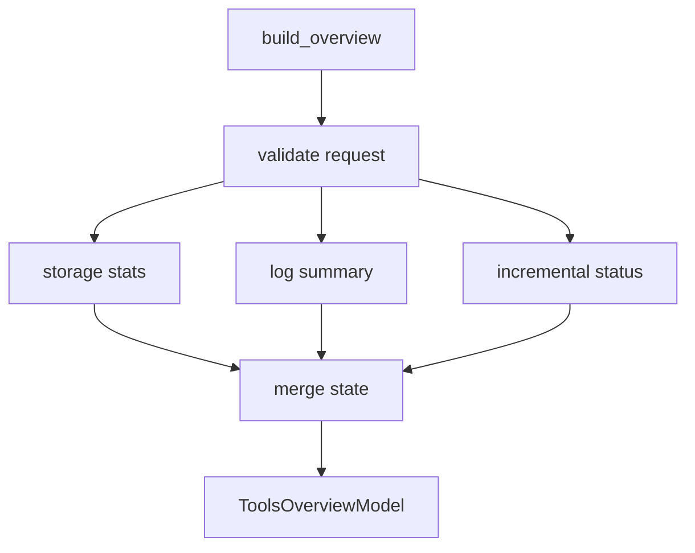

# tools/views

## 路径职责

`tools/views` 是人类可读状态模型层。它读取 storage stats、log summary 和 incremental status，构建 storage/log/incremental overview。`cipher2 status` 消费本模块的 `ToolsOverviewModel` 做 human/JSON 渲染，但 CLI 参数解析和输出格式不属于 views。views 不读取 Graph projection，不展示 inference section，也不承担 CLI 教程。

## Sections

| section | 说明 |
|---|---|
| `storage` | snapshot、FACT、FactRelative、field access、search 和错误统计。 |
| `log` | 事件摘要、最近事件、慢事件、错误码、type-driven toolchain capability 和脱敏统计。 |
| `incremental` | 临时 overlay、dirty、pending、failed task 状态。 |

允许的 `include_sections` 只有 `storage`、`log`、`incremental`。

## 数据结构

```mermaid
classDiagram
    direction LR
    class ToolsOverviewModel {
      state: str
      generated_at: str
      storage: StorageViewModel?
      log: LogViewModel?
      incremental: IncrementalViewModel?
      errors: list~ViewBuildError~
    }
    class StorageViewModel {
      state: str
      snapshot_id: str?
      snapshot_format: str?
      compression: str?
      bytes_on_disk: int
      uncompressed_bytes: int
      compression_ratio: float
      storage_overhead_ratio: float
      read_index_state: str
      read_index_bytes: int
      read_index_schema_version: int?
      read_index_codec: str?
      total_facts: int
      total_relatives: int
      total_sources: int
      fact_kinds: dict
      relation_kinds: dict
      field_read_count: int
      field_write_count: int
      search_count: int
      error_count: int
      latest_error_code: str?
    }
    class LogViewModel {
      state: str
      total_events: int
      events_by_channel: dict
      events_by_status: dict
      top_event_names: list
      recent_events: list
      slow_events: list
      error_codes: dict
      init_stage_timings: list~InitStageView~
      toolchain_status: str?
      toolchain_backend: str?
      clang_vendor: str?
      clang_version: str?
      libclang_version: str?
      libclang_library_scope: str?
      libclang_version_match: bool?
      type_driven_ast: bool?
      loc_file_supported: bool?
      call_reference_supported: bool?
      member_reference_supported: bool?
      qual_type_supported: bool?
      gcc_required: bool?
      gcc_checked: bool?
      latest_missing_evidence: str?
      extractor_worker_mode: str?
      extractor_worker_count: int
      extractor_worker_max_unmerged: int
      extractor_worker_source_count: int
      extractor_worker_successful_file_count: int
      extractor_worker_skipped_file_count: int
      extractor_worker_map_output_segment_count: int
      extractor_worker_map_output_bytes: int
      extractor_worker_stale_run_gc_count: int
      header_decl_cache_entry_count: int
      header_decl_cache_hit_count: int
      header_decl_cache_miss_count: int
      header_decl_skipped_subtree_count: int
      header_decl_seed_count: int
      source_fallback_count: int
      unresolved_call_count: int
      partial_ast_count: int
      record_owner_count: int
      anonymous_record_count: int
      synthetic_type_fact_count: int
      field_decl_count: int
      field_fact_count: int
      field_decl_without_fact_count: int
      wrapped_member_expr_count: int
      macro_wrapped_member_expr_count: int
      bitwise_member_expr_count: int
      compound_field_access_count: int
      field_access_scan_truncated_count: int
      field_access_resolved_count: int
      field_access_unresolved_count: int
      function_pointer_slot_count: int
      function_pointer_assignment_count: int
      function_pointer_dispatch_count: int
      macro_direct_call_count: int
      unresolved_dispatch_slot_count: int
      unresolved_dispatch_function_count: int
      relative_rollup_group_count: int
      relative_collapsed_instance_count: int
      relative_preview_source_file_count: int
      relative_diversity_bucket_count: int
      response_bytes: int
      response_bytes_limit: int
      response_truncated_count: int
      flat_relative_count: int
      flat_relative_dropped_count: int
      bucket_relative_dropped_count: int
      source_context_line_dropped_count: int
      payload_field_dropped_count: int
      compile_database_configured: bool
      compile_command_hit_count: int
      compile_command_miss_count: int
      compile_command_argument_count: int
      compile_command_stripped_argument_count: int
      compile_command_entry_count: int
      compile_command_indexed_source_count: int
      compile_command_duplicate_source_count: int
      compile_command_ignored_outside_repo_count: int
      latest_toolchain_error: str?
    }
    class InitStageView {
      stage: str
      status: str
      duration_ms: float
      counts: dict
    }
    class IncrementalViewModel {
      state: str
      base_snapshot_id: str?
      active_overlay_id: str?
      dirty_source_count: int
      pending_task_count: int
      stale_source_count: int
      failed_task_count: int
      overlay_fact_count: int
      overlay_relative_count: int
      last_publish_latency_ms: float?
      latest_error_code: str?
    }
    ToolsOverviewModel --> StorageViewModel
    ToolsOverviewModel --> LogViewModel
    LogViewModel --> InitStageView
    ToolsOverviewModel --> IncrementalViewModel
```

### `ToolsOverviewModel` 成员表

| 成员名称 | type | 作用 | 并发粒度 |
|---|---|---|---|
| `state` | `str` | empty/ready/warning/error | view 构建级 |
| `generated_at` | `str` | 生成时间 | view 构建级 |
| `storage` | `StorageViewModel or None` | storage section | view 构建级 |
| `log` | `LogViewModel or None` | log section | view 构建级 |
| `incremental` | `IncrementalViewModel or None` | incremental section | view 构建级 |
| `errors` | `list[ViewBuildError]` | section 错误 | view 构建级 |

### `StorageViewModel` 成员表

| 成员名称 | type | 作用 | 并发粒度 |
|---|---|---|---|
| `state` | `str` | storage 状态 | view 构建级 |
| `snapshot_id` | `str or None` | 当前 snapshot | view 构建级 |
| `snapshot_format` | `str or None` | 当前 snapshot 格式；v5 为 `compact-jsonl-gzip` | view 构建级 |
| `compression` | `str or None` | 当前压缩策略；v5 为 `gzip-1` | view 构建级 |
| `bytes_on_disk` | `int` | 当前 snapshot 总字节数，包含 read index 和 metadata | view 构建级 |
| `uncompressed_bytes` | `int` | 当前 snapshot 压缩前数据字节数 | view 构建级 |
| `compression_ratio` | `float` | `compressed_data_bytes / uncompressed_bytes`，storage 写入时保留两位小数，无数据时为 `1.0` | view 构建级 |
| `storage_overhead_ratio` | `float` | `bytes_on_disk / uncompressed_bytes`，包含 read index | view 构建级 |
| `read_index_state` | `str` | `ready` 或 `missing` | view 构建级 |
| `read_index_bytes` | `int` | `read_index.sqlite` 文件大小 | view 构建级 |
| `read_index_schema_version` | `int or None` | read index schema version | view 构建级 |
| `read_index_codec` | `str or None` | read index payload/condition codec | view 构建级 |
| `total_facts` | `int` | FACT 总数 | view 构建级 |
| `total_relatives` | `int` | FactRelative 总数 | view 构建级 |
| `total_sources` | `int` | source inventory 总数 | view 构建级 |
| `fact_kinds` | `dict[str,int]` | fact kind 分布 | view 构建级 |
| `relation_kinds` | `dict[str,int]` | relation kind 分布 | view 构建级 |
| `field_read_count` | `int` | `field_read` 关系数 | view 构建级 |
| `field_write_count` | `int` | `field_write` 关系数 | view 构建级 |
| `search_count` | `int` | search 事件数 | view 构建级 |
| `error_count` | `int` | storage 错误数 | view 构建级 |
| `latest_error_code` | `str or None` | 最近错误码 | view 构建级 |

### `LogViewModel` 成员表

| 成员名称 | type | 作用 | 并发粒度 |
|---|---|---|---|
| `state` | `str` | log 状态 | view 构建级 |
| `total_events` | `int` | 事件数 | view 构建级 |
| `events_by_channel` | `dict[str,int]` | channel 分布 | view 构建级 |
| `events_by_status` | `dict[str,int]` | status 分布 | view 构建级 |
| `top_event_names` | `list[tuple[str,int]]` | 高频事件 | view 构建级 |
| `recent_events` | `list[LogEventRow]` | 最近事件 | view 构建级 |
| `slow_events` | `list[LogEventRow]` | 慢事件 | view 构建级 |
| `error_codes` | `dict[str,int]` | 错误码分布 | view 构建级 |
| `init_stage_timings` | `list[InitStageView]` | 最近一次 init/rebuild 的阶段耗时表；无 `init.stage` 记录时为空列表 | view 构建级 |
| `toolchain_status` | `str or None` | 最近一次 `extractor.code.toolchain` 状态 | view 构建级 |
| `toolchain_backend` | `str or None` | 最近一次 code extractor backend，正式路径为 `libclang` | view 构建级 |
| `clang_vendor` | `str or None` | 最近一次 Clang vendor | view 构建级 |
| `clang_version` | `str or None` | 最近一次 Clang 版本摘要 | view 构建级 |
| `libclang_version` | `str or None` | 最近一次 libclang 版本摘要 | view 构建级 |
| `libclang_library_scope` | `str or None` | libclang 来源，`auto` 或 last-resort `configured` | view 构建级 |
| `libclang_version_match` | `bool or None` | 最近一次 Clang/libclang major 是否匹配 | view 构建级 |
| `type_driven_ast` | `bool or None` | 最近一次 extractor 是否启用类型驱动 AST mapper | view 构建级 |
| `loc_file_supported` | `bool or None` | 最近一次 capability 是否支持 `loc.file` | view 构建级 |
| `call_reference_supported` | `bool or None` | 最近一次 capability 是否支持 call reference | view 构建级 |
| `member_reference_supported` | `bool or None` | 最近一次 capability 是否支持 member reference | view 构建级 |
| `qual_type_supported` | `bool or None` | 最近一次 capability 是否支持 qualType | view 构建级 |
| `gcc_required` | `bool or None` | 最近一次 extractor 是否要求 GCC | view 构建级 |
| `gcc_checked` | `bool or None` | 最近一次 extractor 是否检查 GCC | view 构建级 |
| `latest_missing_evidence` | `str or None` | 最近一次 `clang_capability_failed` 的缺失 evidence 摘要 | view 构建级 |
| `extractor_worker_mode` | `str or None` | 最近一次 `extractor.code.worker_pool` 的 `serial` / `bounded_pool` 模式 | view 构建级 |
| `extractor_worker_count` | `int` | 最近一次全量抽取 worker 数 | view 构建级 |
| `extractor_worker_max_unmerged` | `int` | 最近一次 worker pool 未合并 outcome 上限 | view 构建级 |
| `extractor_worker_source_count` | `int` | 最近一次 worker pool source 总数 | view 构建级 |
| `extractor_worker_successful_file_count` | `int` | 最近一次 worker pool 成功文件数 | view 构建级 |
| `extractor_worker_skipped_file_count` | `int` | 最近一次 worker pool 跳过文件数 | view 构建级 |
| `extractor_worker_map_output_segment_count` | `int` | 最近一次 map phase worker 输出段数 | view 构建级 |
| `extractor_worker_map_output_bytes` | `int` | 最近一次 map phase worker 输出段字节数 | view 构建级 |
| `extractor_worker_stale_run_gc_count` | `int` | 最近一次 init/rebuild 清理的旧 `initializer-mapreduce` run 数 | view 构建级 |
| `extractor_worker_timeout_count` | `int` | 最近一次 worker pool 中被 timeout kill/restart 的文件数 | view 构建级 |
| `extractor_worker_restart_count` | `int` | 最近一次 worker pool replacement worker 启动次数 | view 构建级 |
| `extractor_worker_crash_count` | `int` | 最近一次 worker pool 中无 outcome 崩溃的文件数 | view 构建级 |
| `relative_map_input_count` | `int` | worker 写 relative segment 前看到的 encoded relative 行数 | view 构建级 |
| `relative_map_written_count` | `int` | worker dedup 后实际写入 relative segment 的行数 | view 构建级 |
| `relative_map_skipped_exact_count` | `int` | worker-local exact duplicate relative 跳过数 | view 构建级 |
| `relative_worker_duplicate_exact_count` | `int` | worker 阶段同 id exact duplicate 数，独立于 external merge residual duplicate | view 构建级 |
| `relative_worker_duplicate_conflict_count` | `int` | worker 阶段同 id 非 exact duplicate conflict 数 | view 构建级 |
| `relative_worker_dedup_tracked_entry_count` | `int` | 最近一次 worker dedup 表追踪的 id 总数汇总 | view 构建级 |
| `relative_worker_dedup_saturated_count` | `int` | worker dedup 表因内部内存上限进入 partial mode 的次数汇总 | view 构建级 |
| `fact_line_passthrough_count` | `int` | 最近一次 reducer accepted fact 行字节直通数量 | view 构建级 |
| `relative_line_passthrough_count` | `int` | 最近一次 reducer accepted relative 行字节直通数量 | view 构建级 |
| `fact_line_passthrough_bytes` | `int` | 最近一次 fact 直通行 bytes | view 构建级 |
| `relative_line_passthrough_bytes` | `int` | 最近一次 relative 直通行 bytes | view 构建级 |
| `fact_line_reencoded_count` | `int` | 因同 source_seq duplicate merge 重新编码的 fact 行数 | view 构建级 |
| `relative_line_reencoded_count` | `int` | 重新编码的 relative 行数；正常直通路径为 0 | view 构建级 |
| `fact_duplicate_exact_count` | `int` | exact bytes 重复 fact 丢弃数 | view 构建级 |
| `fact_duplicate_merge_parse_count` | `int` | 需要解析两条 fact 行做 merge/conflict 的重复数 | view 构建级 |
| `fact_duplicate_conflict_count` | `int` | 非幂等 duplicate fact 冲突数 | view 构建级 |
| `relative_duplicate_exact_count` | `int` | exact bytes 重复 relative 丢弃数 | view 构建级 |
| `relative_duplicate_conflict_count` | `int` | 非幂等 duplicate relative 冲突数 | view 构建级 |
| `relative_merge_input_count` | `int` | external relative merge 输入行数 | view 构建级 |
| `relative_merge_accepted_count` | `int` | external relative merge 最终接受行数 | view 构建级 |
| `relative_merge_duplicate_exact_count` | `int` | external relative merge exact duplicate 丢弃数 | view 构建级 |
| `relative_merge_conflict_count` | `int` | external relative merge conflict 数 | view 构建级 |
| `relative_merge_segment_count` | `int` | external relative merge 输入 segment 数 | view 构建级 |
| `relative_merge_input_bytes` | `int` | external relative merge raw relative line bytes | view 构建级 |
| `relative_merge_index_bytes` | `int` | external relative merge sidecar bytes | view 构建级 |
| `relative_merge_duration_ms` | `int` | external relative merge 耗时 | view 构建级 |
| `relative_merge_full_parse_count` | `int` | external relative merge full payload parse 次数；主路径应为 0 | view 构建级 |
| `relative_merge_max_heap_size` | `int` | external relative merge 最大 heap segment 窗口 | view 构建级 |
| `relative_merge_fan_in` | `int` | external relative merge 本次每趟 source segment fan-in 上界 | view 构建级 |
| `relative_merge_pass_count` | `int` | external relative merge 归并层数；segment 数超过 fan-in 时大于 1 | view 构建级 |
| `relative_merge_peak_open_segment_count` | `int` | external relative merge 任一批次同时打开 source segment 峰值 | view 构建级 |
| `passthrough_ratio_percent` | `int` | fact/relative accepted 行中直接复用 encoded bytes 的比例 | view 构建级 |
| `header_decl_cache_entry_count` | `int` | 仓内共享头声明 cache entry 数 | view 构建级 |
| `header_decl_cache_hit_count` | `int` | 头声明物化缓存命中数 | view 构建级 |
| `header_decl_cache_miss_count` | `int` | 头声明物化缓存 miss 数 | view 构建级 |
| `header_decl_skipped_subtree_count` | `int` | 命中后跳过的头声明子树数 | view 构建级 |
| `header_decl_seed_count` | `int` | 当前抽取使用的 header resolver seed fact 数 | view 构建级 |
| `source_fallback_count` | `int` | `extractor.code.file` 聚合的 source fallback 计数 | view 构建级 |
| `unresolved_call_count` | `int` | `extractor.code.file` 聚合的未解析 call evidence 计数 | view 构建级 |
| `partial_ast_count` | `int` | `extractor.code.file` 聚合的 partial AST 文件数 | view 构建级 |
| `direct_call_pending_count` | `int` | `extractor.code.direct_call_resolution` 聚合的 pending call 数 | view 构建级 |
| `direct_call_resolved_count` | `int` | 后处理补齐的 `direct_call` 数 | view 构建级 |
| `direct_call_external_unresolved_count` | `int` | 仓外或无仓内候选调用数 | view 构建级 |
| `direct_call_internal_unresolved_count` | `int` | 仓内 source 指向仍无法唯一解析的调用数 | view 构建级 |
| `direct_call_ambiguous_count` | `int` | 多候选未生成 relation 的调用数 | view 构建级 |
| `direct_call_linkage_filtered_count` | `int` | 因 internal linkage 跨 TU 被过滤的候选数 | view 构建级 |
| `direct_call_missing_caller_count` | `int` | caller fact 不存在而跳过的 pending call 数 | view 构建级 |
| `direct_call_duplicate_relation_count` | `int` | relative id 已存在而跳过的数量 | view 构建级 |
| `direct_call_resolver_worker_count` | `int` | 最近一次 direct call resolver worker 数 | view 构建级 |
| `direct_call_pending_shard_count` | `int` | 最近一次 direct call pending shard 数 | view 构建级 |
| `direct_call_function_index_entry_count` | `int` | 最近一次只读函数索引 entry 数 | view 构建级 |
| `direct_call_resolver_duration_ms` | `int` | 最近一次 direct call resolver 耗时毫秒 | view 构建级 |
| `record_owner_count` | `int` | `extractor.code.file` 聚合的 record owner 数 | view 构建级 |
| `anonymous_record_count` | `int` | `extractor.code.file` 聚合的匿名 record owner 数 | view 构建级 |
| `synthetic_type_fact_count` | `int` | 匿名或缺失 type materialize 的 synthetic type fact 数 | view 构建级 |
| `field_decl_count` | `int` | 非空字段名 field declaration 数 | view 构建级 |
| `field_fact_count` | `int` | 成功创建或复用的 field fact 数 | view 构建级 |
| `field_decl_without_fact_count` | `int` | 未 materialize 的 field declaration 数 | view 构建级 |
| `wrapped_member_expr_count` | `int` | 包装表达式中的字段访问数 | view 构建级 |
| `macro_wrapped_member_expr_count` | `int` | 宏展开位置中的包装字段访问数 | view 构建级 |
| `bitwise_member_expr_count` | `int` | 位运算或位运算赋值上下文中的字段访问数 | view 构建级 |
| `compound_field_access_count` | `int` | 复合赋值或自增自减字段访问数 | view 构建级 |
| `field_access_scan_truncated_count` | `int` | 字段访问递归扫描触发上限的子树数 | view 构建级 |
| `field_access_resolved_count` | `int` | 成功解析到 field fact 的 MemberExpr 数 | view 构建级 |
| `field_access_unresolved_count` | `int` | 有 member reference 但无唯一 field fact 的 MemberExpr 数 | view 构建级 |
| `function_pointer_slot_count` | `int` | `function_pointer_slot` fact 数 | view 构建级 |
| `function_pointer_assignment_count` | `int` | `assigned_to` 函数指针赋值数 | view 构建级 |
| `function_pointer_dispatch_count` | `int` | `dispatches_via` 间接调用数 | view 构建级 |
| `macro_direct_call_count` | `int` | 宏展开位置中的 direct call 数 | view 构建级 |
| `unresolved_dispatch_slot_count` | `int` | 函数指针 endpoint 未解析数 | view 构建级 |
| `unresolved_dispatch_function_count` | `int` | 函数指针赋值目标未解析数 | view 构建级 |
| `relative_rollup_group_count` | `int` | MCP detail relative preview rollup group 数 | view 构建级 |
| `relative_collapsed_instance_count` | `int` | MCP detail 被 rollup 折叠的真实 relation 实例数 | view 构建级 |
| `relative_preview_source_file_count` | `int` | MCP detail shown relative preview endpoint source file 数 | view 构建级 |
| `relative_diversity_bucket_count` | `int` | MCP detail source 多样化改变选择结果的桶数 | view 构建级 |
| `response_bytes` | `int` | MCP detail 序列化响应字节数聚合值 | view 构建级 |
| `response_bytes_limit` | `int` | MCP detail 响应字节预算上限聚合值 | view 构建级 |
| `response_truncated_count` | `int` | MCP detail 因响应字节预算触顶而裁剪的次数 | view 构建级 |
| `flat_relative_count` | `int` | MCP detail 顶层扁平兼容 relative 样本数 | view 构建级 |
| `flat_relative_dropped_count` | `int` | MCP detail 未放入顶层扁平兼容样本的 bucket relative 数 | view 构建级 |
| `bucket_relative_dropped_count` | `int` | MCP detail 响应触顶后从 buckets 裁剪的 relative 数 | view 构建级 |
| `source_context_line_dropped_count` | `int` | MCP detail 响应触顶后从 source context 裁剪的行数 | view 构建级 |
| `payload_field_dropped_count` | `int` | MCP detail 响应触顶后从 payload 裁剪的字段数 | view 构建级 |
| `compile_database_configured` | `bool` | 是否观测到已配置 compile database | view 构建级 |
| `compile_command_hit_count` | `int` | `extractor.code.file` 聚合的 compile command 命中数 | view 构建级 |
| `compile_command_miss_count` | `int` | `extractor.code.file` 聚合的 compile command miss 数 | view 构建级 |
| `compile_command_argument_count` | `int` | 传入 libclang parse 的 per-file flags 数 | view 构建级 |
| `compile_command_stripped_argument_count` | `int` | 被参数清洗丢弃的参数数 | view 构建级 |
| `compile_command_entry_count` | `int` | compile database 原始 entry 数 | view 构建级 |
| `compile_command_indexed_source_count` | `int` | 成功索引的 source 数 | view 构建级 |
| `compile_command_duplicate_source_count` | `int` | 重复 source entry 数 | view 构建级 |
| `compile_command_ignored_outside_repo_count` | `int` | 被忽略的仓库外 entry 数 | view 构建级 |
| `latest_toolchain_error` | `str or None` | 最近一次 toolchain 错误码 | view 构建级 |

### `InitStageView` 成员表

| 成员名称 | type | 作用 | 并发粒度 |
|---|---|---|---|
| `stage` | `str` | 固定阶段名：`collect`、`extract`、`reduce`、`resolve`、`relative_merge`、`snapshot_write`、`read_index` | view 构建级 |
| `status` | `str` | 对应 `init.stage` 事件状态 | view 构建级 |
| `duration_ms` | `float` | 对应阶段窗口耗时 | view 构建级 |
| `counts` | `dict[str,int]` | 对应 `init.stage` counts 的稳定拷贝 | view 构建级 |

### `IncrementalViewModel` 成员表

| 成员名称 | type | 作用 | 并发粒度 |
|---|---|---|---|
| `state` | `str` | incremental 状态 | view 构建级 |
| `base_snapshot_id` | `str or None` | base snapshot | view 构建级 |
| `active_overlay_id` | `str or None` | active overlay | view 构建级 |
| `dirty_source_count` | `int` | dirty source 数 | view 构建级 |
| `pending_task_count` | `int` | pending task 数 | view 构建级 |
| `stale_source_count` | `int` | stale source 数 | view 构建级 |
| `failed_task_count` | `int` | failed task 数 | view 构建级 |
| `overlay_fact_count` | `int` | 当前或最近发布 overlay fact upsert 数 | view 构建级 |
| `overlay_relative_count` | `int` | 当前或最近发布 overlay relative upsert 数 | view 构建级 |
| `last_publish_latency_ms` | `float or None` | 最近 overlay 发布耗时 | view 构建级 |
| `latest_error_code` | `str or None` | 最近 incremental 错误或 stale 原因 | view 构建级 |

## 流程

`cipher2 status` 调用 `build_overview(target)` 后只读渲染结果；views 不为 status 创建 snapshot，不执行 extractor，不写运行时状态。status 的 JSON 输出必须保留完整 `ToolsOverviewModel`，其中 `log.init_stage_timings` 是最近一次 init/rebuild 的阶段耗时表；human 输出中的缺失 section 使用 `-`，没有 init 阶段记录时阶段表渲染为 `-`，section error 仅展示稳定错误码。

## 可观测性

`views.build` 写入 include section 数、error_count 和 overview state。section 失败写 `views.section_error`，不得阻断其他 section。storage section 需要展示 snapshot id、`snapshot_format`、`compression`、压缩数据体积、总落盘体积、压缩率、storage overhead、read index 状态/大小/schema/codec、facts/relatives/sources 和 field access 统计；没有 snapshot 时显示 `empty`，不得把缺失 snapshot 当成错误。log section 需要从 `init.stage` 最近事件中呈现 `collect`、`extract`、`reduce`、`resolve`、`relative_merge`、`snapshot_write`、`read_index` 阶段耗时，阶段顺序固定，缺失阶段不合成占位；从 `extractor.code.toolchain` 最近事件中呈现 backend、type-driven capability、vendor/version、libclang version/library scope、版本匹配、GCC required/checked、`missing_evidence` 和错误码，从 `extractor.code.compile_database` 呈现 compile database entry、indexed、duplicate、ignored-outside-repo 和 stripped 统计，从 `extractor.code.worker_pool` 呈现 worker mode/count、max_unmerged、source、成功和跳过文件数、map output segment/bytes、worker-local relative input/written/skipped/tracked/saturated、worker timeout/restart/crash、最终 header cache entry，从 `extractor.code.file` 事件聚合 `source_fallback_count`、`unresolved_call_count`、`partial_ast_count`、field coverage、包装/宏/位运算字段访问、函数指针 dispatch、typed member/call、header cache hit/miss/skipped/seed、compile command hit/miss/argument、parse/traverse 耗时统计，从 `extractor.code.direct_call_resolution` 呈现 pending、resolved、resolver worker/shard、function index、internal unresolved、ambiguous、linkage filtered、missing caller 和 duplicate skipped 统计，从 `extractor.code.relative_merge` 呈现 residual external merge duplicate/conflict 统计，从 `mcp.detail` 呈现 response budget、响应裁剪、扁平兼容样本、bucket/source/payload 裁剪、relative preview rollup、折叠实例、shown source file 和 source 多样化统计，并从 warning 事件呈现 `clang_ast_failed` 跳过文件和 `clang_ast_partial` 部分文件统计；同时展示 CLI 层 `cli.status`、`cli.setup_discovery`、`cli.mcp_config` 和 initializer `initializer.build_readiness` 事件计数及最近动作。incremental section 优先读取 `.cipher/run/incremental/state.json` 中的 `state`、`pending_task_count`、`stale_source_count`、overlay 计数和最近错误；`incremental.dirty_planned(status="warning")`、`incremental.overlay_dropped(status="warning")` 等 log 事件只作为补充观测和历史 fallback。`mcp.search.payload.returned_ids` 只作为 raw JSONL 取用归因底料保留，views 本阶段不新增交互查看面板或 result id 列表渲染。若 `field_decl_without_fact_count > 0`、`field_access_unresolved_count > 0`、`field_access_scan_truncated_count > 0`、`unresolved_dispatch_slot_count > 0`、`unresolved_dispatch_function_count > 0`、`partial_ast_count > 0`、`cli.setup_discovery` 报 `compile_database_not_found`、`cli.mcp_config` 报 `mcp_config_malformed/mcp_config_write_failed`、已配置 compile database 且 `compile_command_miss_count > 0`，或 direct call resolution 存在 internal unresolved、ambiguous、linkage filtered，log section 必须进入 warning；header cache miss/hit/seed、worker-local exact relative dedup、worker restart、init 阶段耗时与 MCP response budget / relative preview quality 统计只用于质量和性能观测，不改变 section state。

## 测试门禁

- request validation、empty state、section 失败隔离。
- storage field_read/field_write 统计。
- storage snapshot 格式、压缩策略、压缩前后体积、压缩率、storage overhead、read index 状态、空仓库展示和 section error。
- log rows 展示 term search、field access、field coverage、包装/宏/位运算字段访问、函数指针 dispatch、MCP response budget / relative preview quality、type-driven toolchain capability、backend、libclang version/library scope、`missing_evidence`、worker pool、worker-local relative dedup、worker timeout/restart/crash、header cache entry/hit/miss/skipped/seed、source fallback、compile database hit/miss/duplicate/ignored/stripped、parse/traverse 耗时、unresolved call、partial AST、parallel direct call resolution 和文件级 AST warning 字段。
- log model 展示最近一次 `init.stage` 阶段耗时，即使阶段事件已不在 recent window 内；无阶段事件时为空列表并由 CLI status 渲染为 `-`。
- log rows 展示 `cli.status`、`cli.setup_discovery`、`cli.mcp_config` 和 `initializer.build_readiness` 事件，支持 status、init setup 与 readiness 可观测用例。
- incremental state、stale/pending counts 和 warning 事件 fallback。
- 删除 graph/inference section 后的 invalid section 用例。
- `scripts/views_performance_gate.py`。
